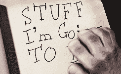

# 求救信号:你可能会遭受非命！(关于害怕错过和闪亮物体综合症)

> 原文：<https://dev.to/dvddpl/s-o-s-you-might-suffer-from-f-o-m-o-about-fear-of-missing-out-and-shiny-object-syndrome-23j4>

**我被周围无限的可能性所吸引**，所有我想学习和做的事情，无论是个人层面还是职业层面:

*   为 AWS 解决方案架构师做准备，构建 RasperryPI + React + Lambda 应用程序，撰写更多技术主题的博客等...
*   修理我的自行车，玩杂耍，编辑我旅行中的相册和视频

这听起来确实不错，这是一种非常好的态度:**我是一个开放、好奇、有动力的人！**

不完全是。

我被我周围无限的可能性分散了注意力。无论我在做什么，我总是担心我应该做些别的事情。

我正在写博客——我最好是在做一些自己喜欢的项目！我在电脑前工作，我应该读一本书！我正在室内抱石——我最好在阳光下的新鲜空气中放松一下！
我正在做上面的任何事情——我应该花更多的时间和我的孩子一起玩！

我是一个不安分、不满足的人。

我听说了很多所谓的 FOMO -害怕错过，我认为这正是我的问题。但是后来我开始阅读它——根据《泰晤士报》的这篇文章

> 一种不安的，有时是完全被消耗的感觉，那就是你错过了你的同龄人正在做的，知道的，或者拥有比你更多或更好的东西

这意味着

> 你不是作为一个真实的人参与到你自己的世界中。

抱歉。但那不是我的案子。我在自己的世界里做了很多事情，在工作中，在家里，我自己，还有我的妻子和孩子。我从不嫉妒别人，即使是在社交网络上——接触他们的数字生活加剧了我对错过生活中一些有趣事情的恐惧(我应该尝试的爱好，我应该去的地方等等)。但不是因为嫉妒他们，只是因为他们让我的待办事项清单越来越长。

然后我读到了 SOS -闪亮物体综合症:

> 这是一种注意力分散的疾病，你总是看到新的、比你正在做的事情更令人兴奋的事情。它通常特别影响企业家，因为他们的特质使他们与众不同——因为他们往往有很高的积极性，他们渴望新技术和新发展，他们不怕开始新项目和创造新事物。

好吧，我不是企业家，但这听起来相当准确！

 
**好了，该坐下来完成我在 Udemy 上买的 React 课程了...但首先，让我们先看看这篇关于 Vue on Medium 的帖子！**

然后定义继续下去:

> 这就像一个小孩或动物在远处看到闪亮的东西，被它吸引，但当他们接近它时，就失去了兴趣。光亮消失了，对物体的兴趣也消失了。企业家一个接一个地追逐项目，一个接一个的改变从来没有一个解决方案。

嗯，那不是我。嗯，有时我甚至不开始做某件事，因为我知道接下来可能会有更有趣的事情，但通常当我开始做某件事时，我总是会完成它。

我的问题是我想做太多事情，这导致:

*   睡眠不足——失眠:晚睡去完成某件事，早起去开始某件事——半夜醒来，因为我忘了做某件事或我有了新想法)
*   对我正在做的事情或我应该做的事情感到内疚(比如现在...我在这篇博客上花了太多时间！:-( )
*   关闭的困难:我不能只是坐下来放松，什么也不做。这是浪费时间！！

那又怎样？不管定义是什么...我真的很喜欢我充实的生活。我只需要更多地欣赏我所做的和拥有的，而不是去想下一步是什么？或者**还有什么？**

现在我的行动要点是:

### 花更少的时间在社交网络上

两年前我退出了 FB，从那以后我发现自己有了更多的空闲时间...

### 设定目标，分配时间

我用 [trello](https://trello.com/) 为我正在做和想要做的事情定义一种**看板**，如果我有新想法，我会把它们放在收件箱栏。等我将它们分类，并制定下一个任务的**冲刺计划**时，它们中的许多已经被遗忘/失去了兴趣，可以放弃了。不幸的是，**我自己并不是一个很好的项目经理**，也没有那么自律，但我正在努力。

### 留心——专注于此时此地。

### 练习感恩

我仍然试图强迫自己定期冥想(使用 Headspace 或 Insight Timer -并进入一种感恩日志-但我发现这非常非常难。对我的口味来说，这些做法看起来还是有点太“新时代”了，但我相信它们肯定会有所帮助。

最后，我试着对自己重复的咒语就是这个，这是最难学的东西:

> 接受你不能做所有事情的事实，如果你试图去做，你最终会做得更少。

你遇到过这样的问题吗？你的策略是什么？

header_pic:我和我的家人在马德拉岛的 Pico Ruivo 山顶一个闪亮的物体上倒立着