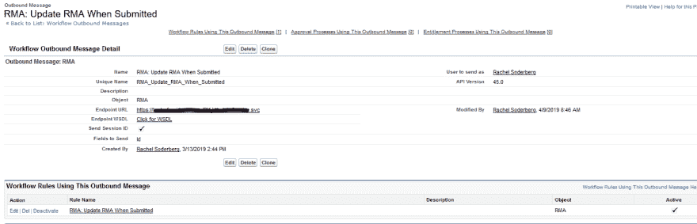

# 使用 Web 服务检索和更新 Salesforce 对象字段

> 原文：<https://dev.to/rachelsoderberg/salesforce-outbound-messages-part-4-retrieving-and-updating-salesforce-object-fields-with-your-web-service-52gj>

欢迎来到我的 Salesforce 出站消息系列的第 4 部分！如果您还没有准备好连接的 WCF Web 服务和 Salesforce 出站消息，您可以单击上面的圆圈，在此开始之前浏览我的系列文章的其余部分！只要您的服务和出站消息通过您的网络(或通过 SOAP 请求)相互通信，它们就不必与我的相同。

* * *

此时，您已经构建了出站消息和 web 服务，这意味着您已经使用对象 WSDL 生成并创建了您的服务。不幸的是，已经确定您需要比您的出站消息当前传递给您的服务更多的几个字段。有两种选择:1。将这些字段添加到您的出站消息中，并更新您的服务的 WSDL，或 2。以编程方式获取您 Salesforce 对象并更新查询语句。我将教你如何做第二个，因为从长远来看，它更容易、更快、更灵活。

## 查询 Salesforce 对象

首先，我们需要查询 Salesforce 以从我们的对象中获取字段。我们将使用提供的 SforceService 类来创建一个绑定，然后我们将使用我们已经从出站消息中获得的一些信息向它传递一个 SOQL 查询(在我的例子中，RMA Id 是我发送的唯一字段)。

[](https://res.cloudinary.com/practicaldev/image/fetch/s--ot4h9D6J--/c_limit%2Cf_auto%2Cfl_progressive%2Cq_auto%2Cw_880/https://thepracticaldev.s3.amazonaws.com/i/j0dwlmt6n8zlbnuiudkv.PNG)

如下所示，我使用通知从 Salesforce 获取 RMA__c 自定义对象，存储 RMA Id，以便我可以访问触发出站消息的 RMA 上的其他字段。该查询看起来很长，但那是因为我的服务使用了很多 RMA 字段——该查询应该包含您将在自己的服务中访问或更新的任何字段。

```
private SforceService binding;

RMA__cNotification[] incomingRMAs = notifications1.Notification;
foreach (var rma in incomingRMAs)
    {
        var id = rma.sObject.Id;
    }

RMA__c myRMAObject = (RMA__c)QueryGenericObject($"SELECT Id, Name, RMA_Number__c, Case_Number__c, " +
                        $"Status__c, Description__c, Owner.Name, " +
                        $"Shipping_Address__r.Name, Shipping_Address__r.BillingCity, " +
                        $"Shipping_Address__r.BillingState, " +
                        $"Shipping_Address__r.BillingPostalCode, Company_Name__r.Name, " +
                        $"Shipping_Method__c, Customer_Name__r.FirstName, " +
                        $"Customer_Name__r.LastName, Customer_Name__r.Phone, " +
                        $"Reason_Code__c FROM RMA__c WHERE Id = '{id}'"); 
```

创建查询后，我使用绑定查询 Salesforce 并返回 QueryResult 类型的结果。此结果通过 QueryGenericObject 方法转换为 s object(Salesforce 通用对象),并返回以最终转换为我的 RMA__c 自定义对象，在上面的示例代码中，我第一次向 sales force 发送我的查询。

```
private sObject QueryGenericObject(string query)
{
    sObject mysObject = RunSalesforceQuery(query).records.FirstOrDefault();

    return mysObject;
}

internal QueryResult RunSalesforceQuery(string query)
{
    QueryResult result = new QueryResult();
    result = binding.query(query);

    return result;
} 
```

您的对象变量现在应该填充了您在查询中指定的字段。至此，在 Salesforce 中更改您的对象字段变得异常简单！我可以访问 RMA 状态、描述、原因代码、所有者姓名、送货信息和客户信息，如果以后需要，我可以轻松地添加更多字段。*注意:如果你试图访问或修改一个不在查询中的字段，你将得到一个错误。*

## 更新 Salesforce 对象字段

一旦从 SOQL 查询中获得了转换后的对象，更新对象字段就变得非常容易。只需初始化对象类型的新对象，并添加要更新的字段。为了让系统知道哪个对象将接收更新，您必须包含对象 Id，并设置为其自身。不要将其设置为新的内容。

```
RMA__c updateRMA = new RMA__c
{
    Id = myRMAObject.Id,
    Sales_Order__c = salesOrderId,
    Status__c = "Created",
    Description__c = "This RMA Order has been processed successfully!"
    Submitted_By__c = myUserObject.Id
}; 
```

我在上面更新的字段包括两个文本字段:销售订单和描述、一个选项列表字段:状态和一个具有用户关系的查找字段:提交者。更新文本字段很容易，只需传递您希望它反映的字符串。选项列表是相似的，但是您必须确保您传递的字符串与选项列表选择*完全匹配*。更新一个查找字段稍微复杂一些，因为您需要传递您希望它反映的对象的 Id——在这个例子中，关系是与用户对象相关的，所以我需要传递我希望用来更新字段的用户的 Id。

更新后，您需要在初始化后调用 binding.update 来保存更新:

```
SaveResult[] saveResult = binding.update(new sObject[] { updateRMA }); 
```

如果您在 Salesforce 中刷新您的对象，您应该在 binding.update()调用后立即看到您的更改。