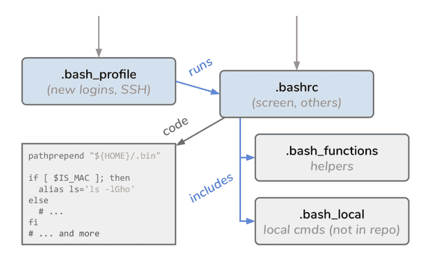
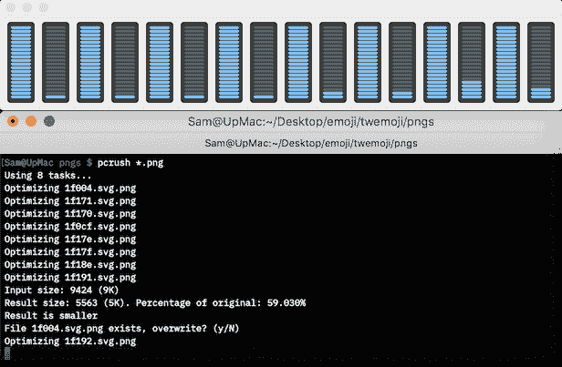
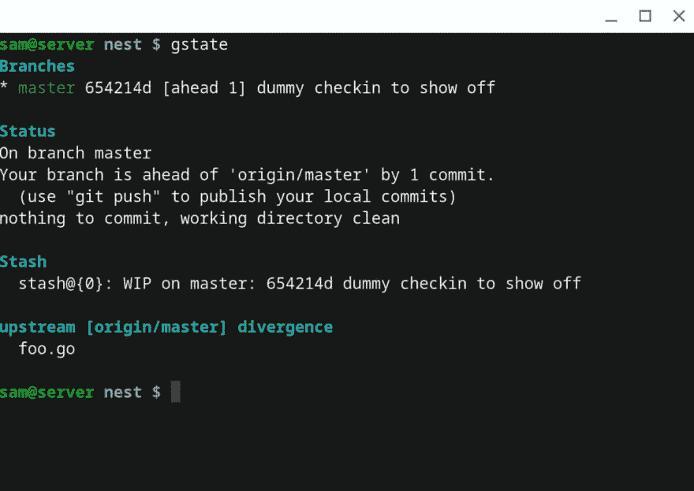

# Sam 的点文件亮点

> 原文：<https://dev.to/samthor/sam-s-dotfiles-highlights-46f8>

大多数开发人员最终会创建某种类型的[点文件 repo](https://www.google.com/search?q=dotfiles+repo) 来包含他们的*nix 类机器(macOS、Linux 等)的配置文件。您可以创建一个 repo 来为您的终端在任何地方保持相同的环境，而不只是以一种特别的方式设置您访问的每台机器。

有很多可以克隆的起点。如果你知道`git`，我的建议是跟随[如何用`git`](https://www.anand-iyer.com/blog/2018/a-simpler-way-to-manage-your-dotfiles.html) 管理它们——这个指南让你使用一个特殊的`dotfiles`命令。

我的网络文件很无聊，但我认为有几个部分让我的很特别。让我们通过它们来讨论。我用的是`bash`，大部分地方默认。

1.  布局— *什么调用什么以及事情如何运行*
2.  平台帮助— *区分 macOS 和 Linux*
3.  助手— *看看我的脚本内部*

## 布局

我的布局非常简单。`.bash_profile`文件立即运行`.bashrc`，所以您登录的方式没有区别(两个文件不同是新手的一大困惑——所以合并它们吧！🤣).

[](https://res.cloudinary.com/practicaldev/image/fetch/s--cjQRLG2S--/c_limit%2Cf_auto%2Cfl_progressive%2Cq_auto%2Cw_880/https://thepracticaldev.s3.amazonaws.com/i/iccp5s95rycnm48jvhew.png)

我使用多年的一个文件是 [`.bash_functions`](https://gist.github.com/samthor/23d5f0a6e3a94c2f05310a197299a78d) (最初由一个朋友在 2009 年写的)。它提供了一些助手，使处理路径变得“安全”。这里有一个简单的例子——在使用之前，`pathprepend`和`ssource`都会检查路径或文件是否存在:

```
#!/bin/bash

source "${HOME}/.bash_functions"  # first line of .bash_profile

# adds to $PATH if the directory exists
pathprepend "/opt/local/sbin"
pathprepend "/opt/local/bin"
pathprepend "${HOME}/.local/bin"

# runs contents of .bash_local if it exists (not checked in, for
# custom changes on each machine)
ssource "${HOME}/.bash_local" 
```

Enter fullscreen mode Exit fullscreen mode

### 关于 SSH 的一个笔记

🚨虽然我会将我的`id_rsa.pub`文件签入每台机器——这是*公共*，你身份的可共享部分——但我不会将`id_rsa`包括在我的点文件回购中。我只把它*保存在我能接触到的机器上，比如我的笔记本电脑或者我家里的服务器。*

这很重要。你的`id_rsa`(还是`id_dsa`？)是私有的，即使它有密码，如果你不小心把它上传到公开的地方，也会被破解。

## 平台帮助

在我的`.bashrc`的顶部，我设置了一个方便的变量:

```
IS_MAC=""
UNAME=$(uname)
if [ "${UNAME}" == "Darwin" ]; then IS_MAC="yes"
fi 
```

Enter fullscreen mode Exit fullscreen mode

我在 macOS(实际上是 BSD，有旧版本的东西)和 Linux 之间切换，所以这有助于在事情不同时做出选择，就像对参数`ls` :
所做的那样

```
if [ $IS_MAC ]; then alias ls='ls -lGho'  # macOS doesn't support `--color=auto`, needs `-G`
else alias ls='ls -lh --color=auto'  # on Linux, `-G` means "no groups"?!
fi 
```

Enter fullscreen mode Exit fullscreen mode

## 帮手

我的`~/.local/bin`文件夹里有一些脚本。其中一些我几乎每天都在用。📜❗#️⃣

### 图像压缩

我有两个脚本——[crush 和 PC rush](https://gist.github.com/samthor/f19290225a763c2df13bd48f1915dee8)——它们压缩单个 PNG 图像，或者并行压缩多个图像。我从来不记得运行工具`pngcrush`或`zopflipng`(更好)的理由，但是在你上传之前缩小你的图像总是值得的(要快！).

我构建了`pcrush`,这样我也可以利用多个 CPU——结果上面的两个工具都只在一个 CPU 上运行，但是如果我有 100 多个图像，我想快速粉碎它们。我可以让我的 CPU 这样做:

[](https://res.cloudinary.com/practicaldev/image/fetch/s--nv_Wf2XU--/c_limit%2Cf_auto%2Cfl_progressive%2Cq_auto%2Cw_880/https://thepracticaldev.s3.amazonaws.com/i/m66xzvouykuefty1vsxp.png)

### Git Status

我有一个名为`gstate`的脚本，它基于当前的 Git 库输出许多东西。它包括分支、正常状态、任何隐藏的更改以及来自上游的已知差异(即，您从中镜像的远程回购)。

它很方便，并且已经永远地烙进了我的肌肉记忆。💪

> 山姆·索洛古德🥑💧[@ samthor](https://dev.to/samthor)[@ busbub](https://twitter.com/busbub)gstate 是我的闺蜜(而且确实是一堆玩意儿)2019 年 4 月 24 日上午 10:01[](https://twitter.com/intent/tweet?in_reply_to=1120991208782778368)[](https://twitter.com/intent/retweet?tweet_id=1120991208782778368)[](https://twitter.com/intent/like?tweet_id=1120991208782778368)

如果你很好奇，[在这里查看一下](https://gist.github.com/samthor/c333e87f70631ecee50cd46f00e175cd)。

## 就这样！

我希望今天对我的环境的简短观察是有趣的！你有自己的生活中不可或缺的脚本吗？让我知道！🗣️💬

(这篇一天一篇的博文发给了我的搭档:在我写作的时候抱着一个尖叫的婴儿。)

six