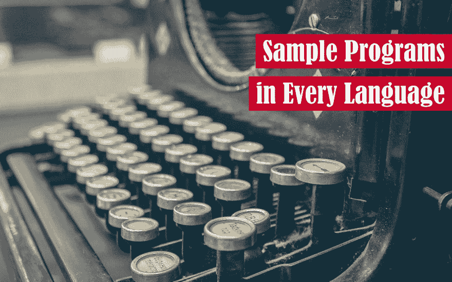

# 样本程序在 2019 年寻求帮助

> 原文：<https://dev.to/renegadecoder94/sample-programs-is-looking-for-help-in-2019-gd8>

如果你正在阅读这篇文章，你可能对一个新的开源项目感兴趣。幸运的是，我们有一个面向所有经验水平的项目。向各种语言的示例程序问好！

## 项目描述

在高层次上，示例程序是尽可能多的编程语言的代码片段的集合。截至今天，我们已经用 **106** 种不同的编程语言编写了 **250** 段代码。

## /[样本程序](https://github.com/TheRenegadeCoder/sample-programs)

### 每种编程语言的示例程序

<article class="markdown-body entry-content container-lg" itemprop="text">

# 每种语言的示例程序

 

欢迎来到各种语言的示例程序库！最初是一个简单的 [100 天代码](http://www.100daysofcode.com/)挑战，现在已经扩展成了一个有趣的项目。在这个库中，你会发现越来越多的示例程序，几乎包含了迄今为止所有的编程语言。

## 了解更多信息

要快速上手，请查看[贡献文档](https://github.com/jrg94/sample-programs/blob/master/.github/CONTRIBUTING.md)。否则，这里有一些有用的链接:

*   Wiki:一组动态表，跟踪 repo 中的每种语言和代码片段
*   [项目](https://sample-programs.therenegadecoder.com/projects/):当前接受代码片段的项目列表
*   [Discord](https://discord.gg/Jhmtj7Z) :邀请加入我们的社区 Discord
*   [行为准则](https://github.com/jrg94/sample-programs/blob/master/.github/CODE_OF_CONDUCT.md):出资人公约复印件
*   许可证:麻省理工学院许可证文件的副本

## 支持

每种语言的示例程序是我自己 Jeremy Grifski 的一个项目，作为我的网站的一部分，[叛离的编码者](https://therenegadecoder.com/)。如果你想…

</article>

[View on GitHub](https://github.com/TheRenegadeCoder/sample-programs)

当然，还有很多项目和这个一样，那么我们的项目有什么不同呢？事实证明，我们也写文章解释我们集合中的每个代码片段。理想情况下，用户应该能够在一个地方查看代码片段并了解它是如何工作的。这就是我们对这个库的目标:所有代码片段都有自己的文档。

## 请求

目前，我们的工作量可以分为两组:

1.  代码片段
2.  文章

如果你正在寻找一个项目，在那里你可以贡献一些你最喜欢的语言的知识，这个项目很适合你。我们有很多机会让你分享代码片段。或者，如果你喜欢写文档，我们也可以利用你的帮助。

此时，我们团队中大约有 22 人定期在样本程序项目上工作。自启动以来，该项目已经发展到 **107** 星和 **80** 叉，但它仍然很小，足以让你做出一些有意义的改变。所以，考虑帮帮忙吧！

## 里程碑

上个月，我们达到了 100 种语言和 250 个 T2 代码片段的里程碑。

此时，我们希望完成以下里程碑:

1.  200 种语言-2019 年 12 月 31 日
2.  500 个代码片段-2019 年 12 月 31 日
3.  100 篇文章-2019 年 6 月 30 日

正如你所看到的，我们的许多里程碑都有整整一年的时间，但我们很乐意通过更多的支持来提升它们。

## 侧面项目

除了代码片段和文章，我们还有一些附带项目，如示例程序 Wiki:

## /[样本-程序-维基-生成器](https://github.com/TheRenegadeCoder/sample-programs-wiki-generator)

### 示例程序的 wiki 生成解决方案

<article class="markdown-body entry-content container-lg" itemprop="text">

# 示例程序 Wiki 生成器

目前，样例程序 wiki 生成器 repo 包含了我们在样例程序存储库中用来生成 Wiki 文档的`generate-wiki.py`脚本。该脚本由示例程序 repo 中的 Travis CI 构建自动执行。

如果您想提出变更建议，请随时利用“问题”选项卡或提出拉动请求。

## 它是如何工作的

`generate_wiki.py`脚本的工作原理是分析示例程序存储库中的信息，并将这些信息存储在对象中。然后这些对象被用来在 Markdown 中生成各种 wiki 页面。

## 什么是自动化

目前，该脚本生成 27 个页面:1 个字母目录和 26 个字母页面。

字母表目录包含一个表格，其中包含每个字母表页面的链接以及元数据，如每个字母的脚本和语言数量。此外，字母表目录包含脚本总数…

</article>

[View on GitHub](https://github.com/TheRenegadeCoder/sample-programs-wiki-generator)

目前，我们自动化了我们自己的 [wiki](https://github.com/TheRenegadeCoder/sample-programs/wiki/Alphabetical-Language-Catalog) ，它包含了关于我们代码片段集合的元数据表。如果你对改进我们当前的维基感兴趣，可以看看这个附带项目。

此外，我希望开始自动化我们的发布。最近，我们写了 100 种语言版本和 250 个代码片段版本。这两个过程都非常耗时，我确信这个过程可以像维基一样自动化。如果有人有兴趣在这方面帮忙，请告诉我！

## 感谢

如果没有别的，感谢您花时间了解示例程序项目。如果你有时间，考虑主演回购，以帮助我们的收藏增长。否则，保重，新年快乐！