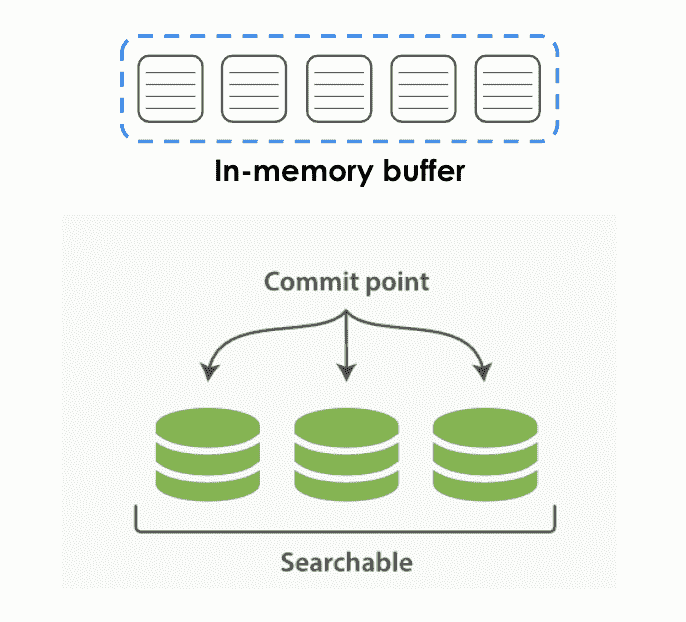
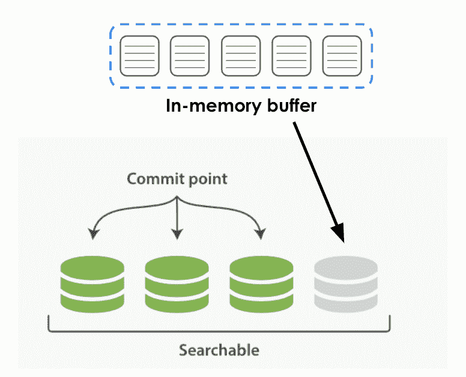
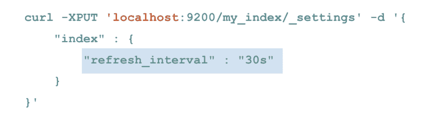
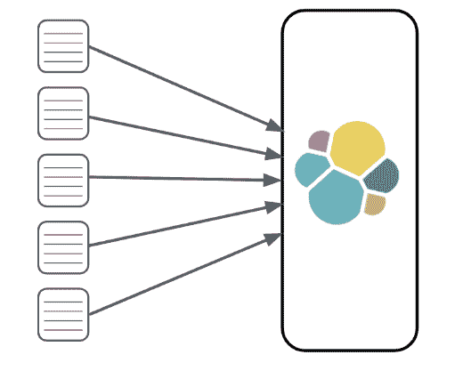
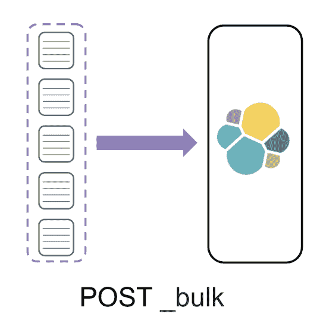
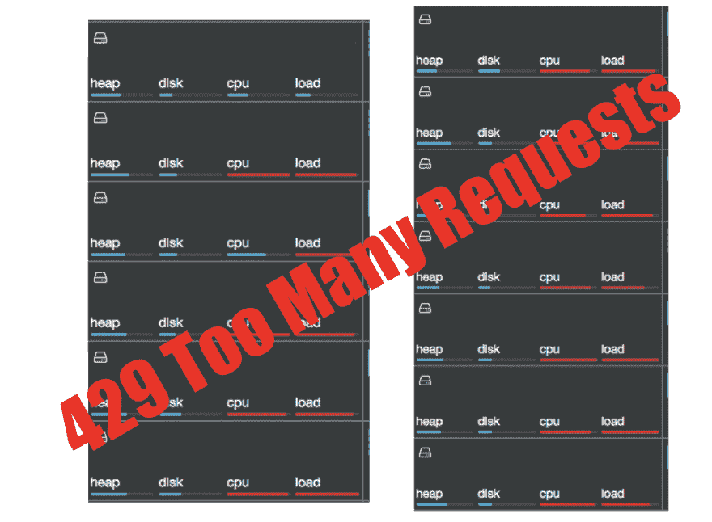
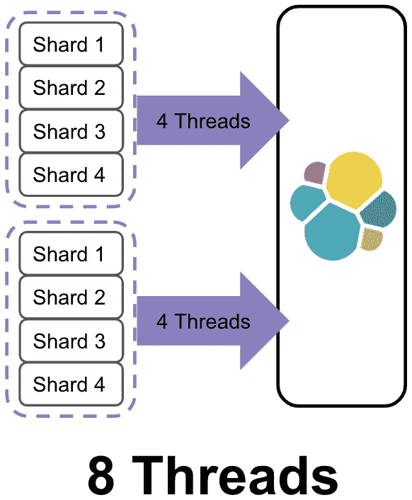
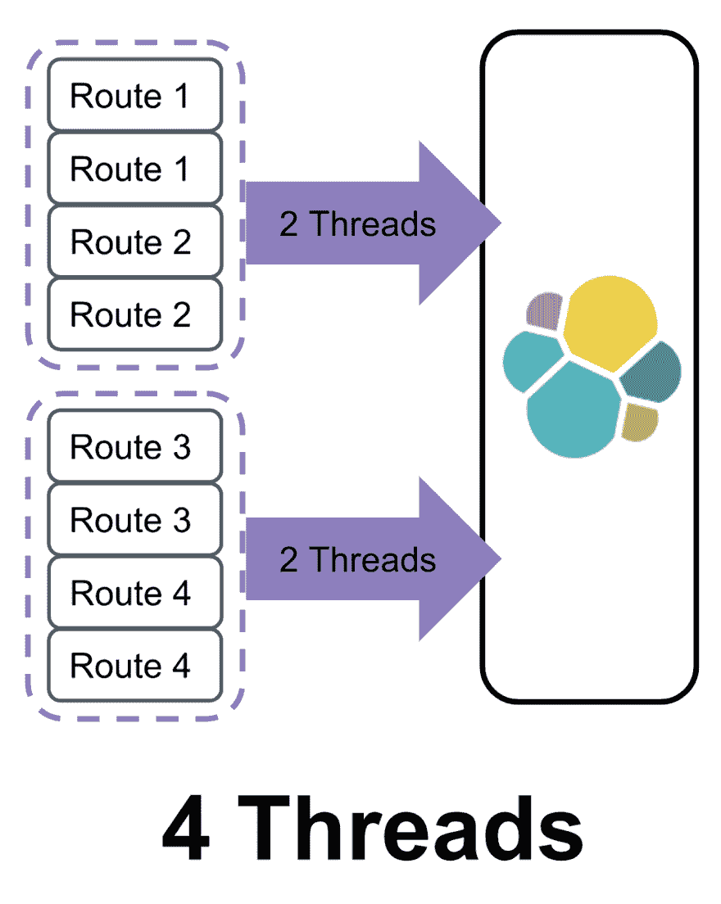
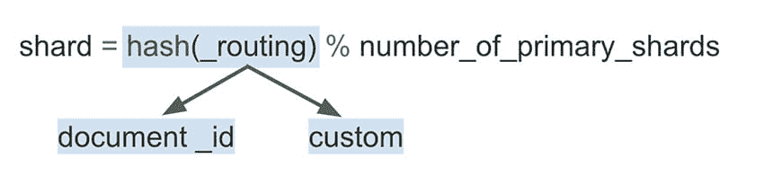
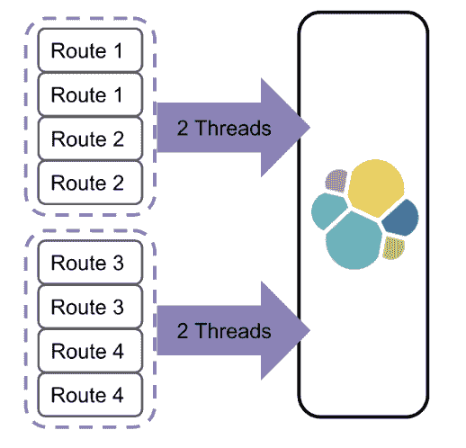

# 伸缩弹性搜索第 1 部分:如何加速索引

> 原文：<https://dev.to/molly/scaling-elasticsearch-part-1-how-to-speed-up-indexing-2pel>

每个人都希望他们的 Elasticsearch 集群能够更快地进行索引和搜索，但大规模优化这两者可能会很棘手。2015 年，Kenna 的集群拥有 5 亿份文档，我们每天处理其中的 100 万份。当时，Elasticsearch 是我们基础设施中最不稳定的部分，几乎跟不上我们数据量的增长。如今，我们的集群拥有超过 40 亿份文档，每天轻松处理超过 3.5 亿份文档。

构建一个集群来满足我们所有的索引和搜索需求并不容易。但是只要有足够的毅力和一些“哦，废话！”一瞬间，我们完成了任务，同时也学到了很多东西。在这个分为两部分的博客中，我将分享我们在肯纳使用的技术，让我们走到今天。然而，在我开始所有的弹性搜索乐趣之前，我首先想告诉你一些关于 Kenna 的事情。

# 什么是[肯纳安全](https://www.kennasecurity.com/)？

Kenna 帮助财富 500 强企业管理其网络安全风险。一般公司有 6 万资产。资产基本上是任何有 IP 地址的东西。一般的公司也有 2400 万个漏洞。漏洞是你如何侵入资产的。有了这些数据，公司很难知道他们需要首先关注和解决什么问题。这就是肯纳的用武之地。在肯纳，我们获取所有的数据，并通过我们专有的算法进行运算。这些算法然后告诉我们的客户哪些漏洞对他们的基础设施构成最大的风险，以便他们知道他们需要首先修复什么。

我们最初将所有这些数据存储在 MySQL 中，这是我们的真实来源。从那里，我们将资产和漏洞数据编入 Elasticsearch:

Elasticsearch 可以让我们的客户按照他们需要的方式对数据进行切片和切块，因此搜索速度是重中之重。同时，数据是不断变化的，所以索引也是极其重要的。

让我们从我们如何扩展索引容量开始。尽管我们的开始很混乱，但我们从一开始就做对了一件事，那就是设置我们的刷新间隔。

# 刷新间隔

首先，什么是弹性搜索更新？Elasticsearch 刷新是指 Elasticsearch 刷新其内存缓冲区，并将您最近索引的数据提交到一个段。提交数据段时，基本上就是将它写入磁盘。最初索引数据时，数据保存在如下所示的缓冲区中:

然后，当发生刷新时，该数据被提交到一个段，并变得可搜索。这个过程如下图所示。

Elasticsearch 刷新间隔规定了 Elasticsearch 执行刷新的频率。默认情况下，Elasticsearch 使用[一秒的刷新间隔](https://www.elastic.co/guide/en/elasticsearch/reference/current/tune-for-indexing-speed.html#_increase_the_refresh_interval)。这意味着它每秒都在刷新这些缓冲区。刷新索引会占用相当多的资源，这会占用您可以用于索引的资源。**提高索引速度最简单的方法之一就是增加刷新间隔。**通过增加它，您将减少执行的刷新次数，从而释放资源用于索引。我们的设定是 30 秒。

我们的客户端数据更新是由后台作业处理的，因此多等 30 秒让数据可搜索并不是什么大问题。如果 30 秒对于你的用例来说太长了，试试 10 秒或 20 秒。任何大于 1 的数字都会给你带来指数收益。

一旦我们设置了更新间隔，事情就一帆风顺了，直到我们有了第一个大客户。该客户拥有 200，000 项资产和超过 1 亿个漏洞。将他们的数据输入 MySQL 后，我们开始将其编入 Elasticsearch，但进展缓慢。经过几天的索引后，我们不得不告诉这个客户，将需要两周的时间来索引他们所有的数据。两周！😬显然，这不会长期有效。解决方案是批量处理。

# 批量处理

 而不是单独索引文档

我们将它们分组到一个批处理中，并使用批量请求一次将它们全部编入索引。

我们发现在每个批量请求中索引 1000 个文档给了我们最大的性能提升。您希望批处理的大小将取决于您的文档大小。关于找到最佳批量的建议，请查看 [Elastic 对批量加工的建议](https://www.elastic.co/guide/en/elasticsearch/reference/current/tune-for-indexing-speed.html#_use_bulk_requests)。

光是批量加工就让我们度过了坚实的一年。然后，在过去的一年里，MySQL 进行了一次大修，突然 Elasticsearch 跟不上了。在索引高峰期，节点 CPU 会达到最大，我们开始收到一堆 429 (TOO_MANY_REQUESTS)错误。

是的，这确实是我们的一次索引攻击中节点的屏幕截图！我们的集群无法处理我们试图塞进去的数据量，并开始拒绝请求。在大量阅读文档和谷歌搜索之后，我们突然意识到线程和它们在索引中的作用。这就引出了我的最后一条建议，路由你的文件！

# 发送您的文档

当您索引一组文档时，完成请求所需的线程数量取决于这些文档所属的碎片数量。让我们来看两批文件:

将需要四个线程来索引每一批，因为每个线程需要与四个碎片对话。减少每个请求所需线程数量的一个简单方法是通过 shard 对文档进行分组。回到我们的例子，如果按照 shard 对文档进行分组，就可以将执行请求所需的线程数量减少一半。

看起来很简单，对吧？除此之外，您如何知道文档属于哪个碎片呢？答案是[路由](https://www.elastic.co/guide/en/elasticsearch/reference/current/mapping-routing-field.html)。当 Elasticsearch 决定将文档放在哪个碎片上时，使用以下公式:

传送值将默认为文档`_id`，或者您可以自己设置。如果您自己设置它，那么您可以在索引文档时使用它。让我们再来看看这个例子。因为我们的 route 值对应于文档所属的 shard，所以我们可以使用它来对文档进行分组，并减少执行每个请求所需的线程数量。

在 Kenna，我们在资产和漏洞之间有一种[父/子关系](https://www.elastic.co/guide/en/elasticsearch/reference/5.4/mapping-parent-field.html)。这意味着父项或 asset_id 用于路由。当我们索引漏洞时，我们通过 asset_id 将它们分组，以减少满足每个请求所需的线程数量。

按照路径对文档进行分组使我们能够大大提高索引的速度，同时保持集群的良好状态。

# 总结:加速规模化索引

1.  切换刷新间隔
2.  批量处理文档
3.  发送您的文档

# 提前规划

这些技术让 Kenna 达到了每天可以处理超过 3 . 5 亿份文档的水平，而且我们还有增长的空间。当集群很小，并且没有处理大量数据时，这些小的调整很容易被忽略。然而，当您扩展时，我保证这些技术将是无价的。提前计划，现在就开始实施这些索引策略，这样可以避免将来速度变慢。

现在，索引速度只有图片的一半。在肯纳，搜索也是我们客户的重中之重。在这篇博文的第二部分，我将深入探讨 Kenna 在扩展其集群时加快搜索速度的所有方法。

*这篇博客最初发表于[elastic.co](https://www.elastic.co/blog/how-kenna-security-speeds-up-elasticsearch-indexing-at-scale-part-1)T3】*