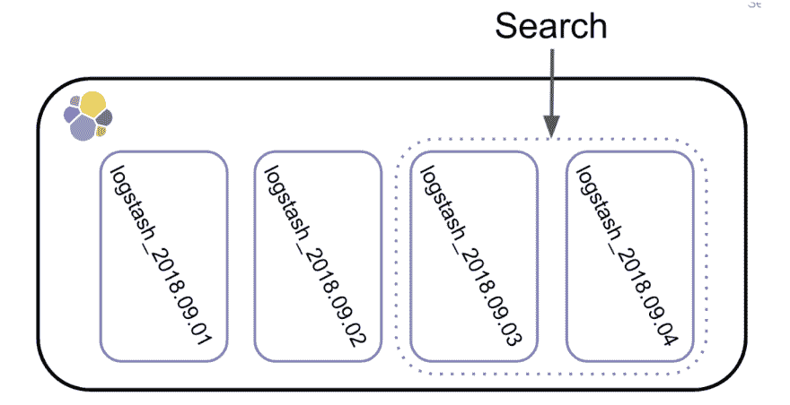
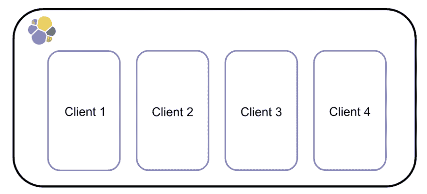
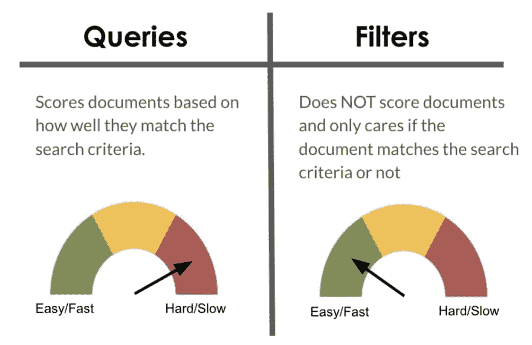
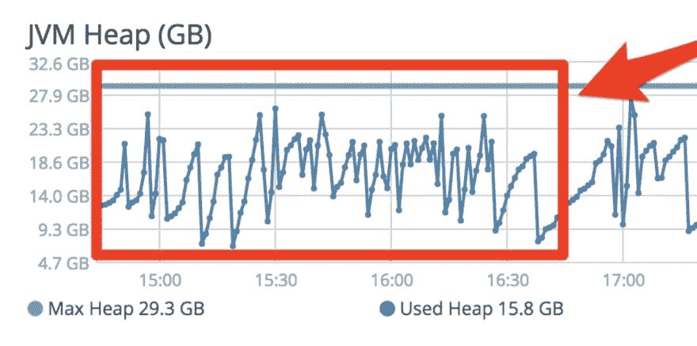
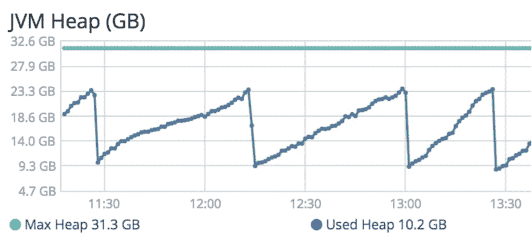
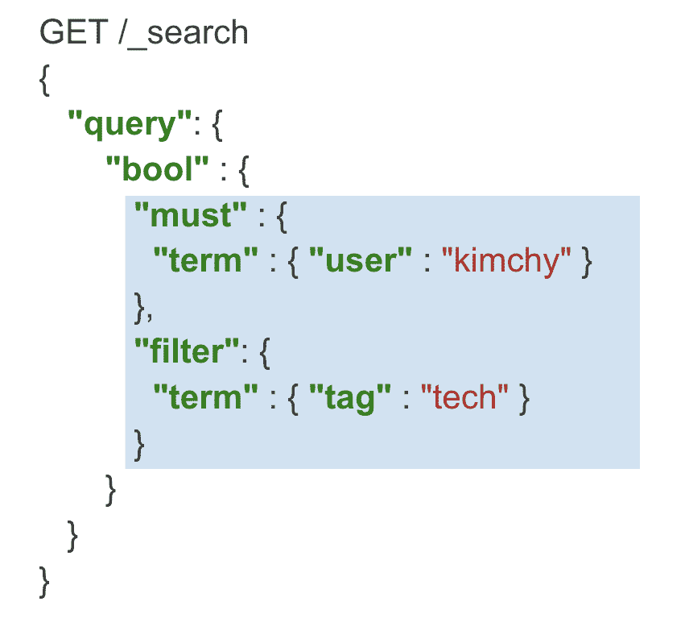
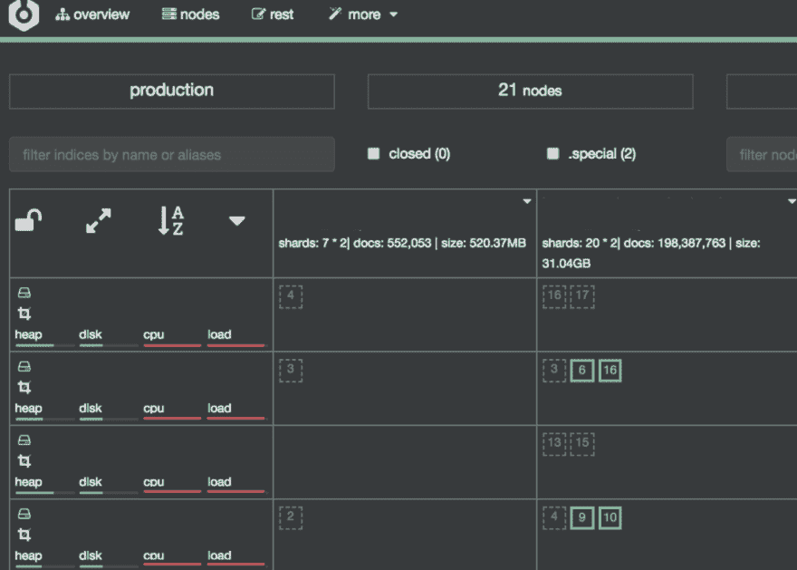
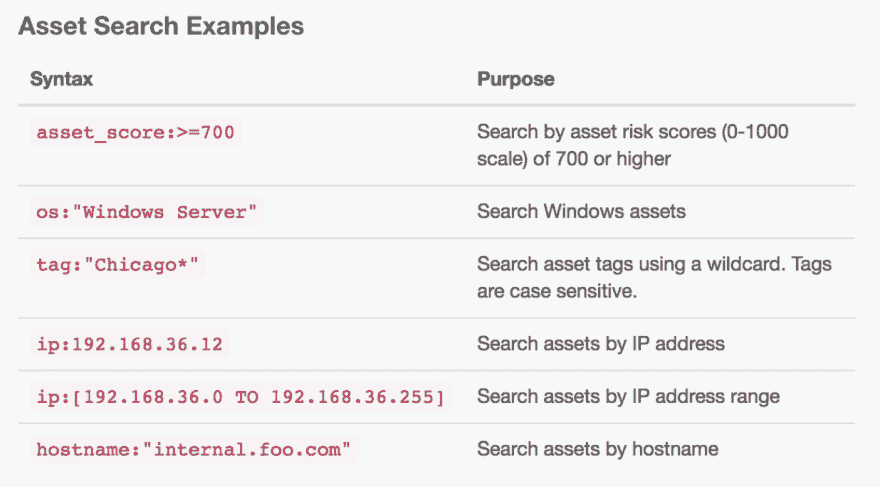

# 伸缩弹性搜索第 2 部分:如何加快搜索速度

> 原文：<https://dev.to/molly/scaling-elasticsearch-part-2-how-to-speed-up-search-53of>

在这篇博客的第 1 部分，我展示了我的公司 Kenna Security 在扩展集群时用来加速索引的所有技术。

## 文章不再可用

在第 2 部分中，我想分享一些我们用来加速搜索的技术，同时将我们的文档数量增加到超过 40 亿个。

# 分组你的数据

首先，我想谈谈数据组织。许多人使用 Elasticsearch 来存储日志。大多数日志集群都是基于日期建立索引的。这样设置日志记录集群的最大原因之一是，当您进行搜索时，这自然是一种过滤数据的简单方法。如果想搜索 2 天的数据，Elasticsearch 只需查询两个索引。

这意味着需要搜索的碎片更少，搜索速度更快。这种将数据分组以帮助加快搜索速度的概念也可以应用于非日志集群。

当 Kenna 第一次开始使用 Elasticsearch 时，我们所有的数据都在一个单一的小索引中。随着数据量的增加，我们必须增加索引中的碎片数量。随着碎片数量的增加，我们的搜索速度变慢了。为了加快速度，我们决定按客户划分我们的数据。每个客户现在都生活在自己的索引中。

这对我们来说最有意义，因为当我们查找数据时，99%的时间是通过客户端。现在，当我们搜索一个客户时，我们只需查看一小部分碎片，而不是全部。这使我们能够在向集群添加越来越多数据的同时保持快速的搜索速度。

# 滤镜是朋友

除了数据组织，您还可以通过优化结构来加快搜索速度。Elasticsearch 有两种类型的搜索模式，查询和过滤器。

对于 Elasticsearch 来说，必须对文档进行评分的查询工作要多得多。过滤器不对文档进行评分，工作量更少，因此速度更快。在肯纳，我们只使用过滤器，因为我们知道它们的好处。然而，直到 2016 年 3 月，我们才充分意识到这些优势。

2016 年 3 月，我们升级到了 Elasticsearch 5。在升级过程中，我们遇到了一个 [Elasticsearch bug](https://github.com/elastic/elasticsearch/pull/23797) ，导致我们的一些过滤器被评分。这对我们的集群来说又增加了多少工作量呢？我们的堆图开始看起来像这样...

作为参考，堆图应该是这样...

我们的远不健康。对几个频繁使用的过滤器打分导致了如此多的额外工作，以至于我们的生产集群整整一周都无法使用，直到这个错误被修补。让我告诉你，那是漫长的一周😬这个经历告诉我们过滤器是多么的重要，你应该尽可能的使用它们。

如果您的搜索中有任何部分不需要评分，请将其移动到过滤块。如果您确实需要对部分搜索进行评分，可以考虑使用`bool`查询。这允许你组合得分块，如`must`和非得分块，如`filter`。

随着我们的数据得到组织，以及我们对过滤器的新发现的赞赏，到 2017 年底，我们的 Elasticsearch 集群处于一个相当好的位置。这是我们最终开始做一些我们最初积压的优化的时候。其中一个优化是将 id 存储为关键字。

# 存储 id 为关键字

这个建议是我在 [Elasticsearch 培训](https://www.elastic.co/learn)中反复听到的。(如果你没上过 Elasticsearch 培训，我强烈推荐！到目前为止，我已经参加了三次培训，每次我都带来了可操作的项目，我们可以用这些项目来改进我们的团队。)基本上，每当您存储永远不会用于范围搜索的 id 时，您都希望将它们存储为关键字。这是因为关键字是为术语搜索而优化的。整数或数字映射类型针对范围搜索进行了优化。得知这一点后，我认为这不会对我们在肯纳有太大的影响，所以我买了一张票，把它忘了。

过了一年多，我们终于把那张票从积压的工作中抽出来，并且真的做了。我们得到的结果超出了我们的预料。当我们最终从整数转换到关键字时，我们看到搜索速度全面提高了 30%。

我们立刻希望我们能早点做出改变，但是迟做总比不做好！

我想分享的最后一个优化是我在 Elasticsearch 培训中听到的另一个优化。然而，它也积压了，因为我们认为它不是那么重要。然而，我们又一次错了，我们不得不艰难地吸取教训。

# 不要让你的用户拖累你

有一天我们在监控 Elasticsearch，突然所有节点的 CPU 和负载都达到了极限。

我的团队开始努力找出是什么导致了负载。我们开始筛选 slowlogs，试图找出正在运行的查询，并发现了这块宝石。

大量的 OR 语句和大量的前导通配符都在一个来自地狱的查询字符串中。这让我想到了我的最后一条建议，也可能是最重要的一条，不要让你的用户拖了你的后腿！

在你的网站上设置一个搜索框，然后把里面的内容发送给 Elasticsearch，这是非常容易的。**不要这样做！**限制用户能搜索什么，不能搜索什么。我们在 Kenna 通过为用户定义他们可以用来搜索的关键词解决了这个问题。我们还花时间编写了更多的文档来教育用户可以搜索的字段。

有了这些变化，用户的搜索现在更有针对性，更准确，也更容易被 Elasticsearch 处理。到最后，大家都赢了！

# 回顾:加速大规模搜索

1.  将您的数据分组
2.  尽可能使用过滤器
3.  将 id 存储为关键字
4.  不要让你的用户拖你的后腿

# 提前规划

当我们开始使用 Elasticsearch 来处理我们客户的所有搜索需求时，我们似乎没有做错什么。然而，一旦我们的数据量开始增长，我们很快意识到我们必须更明智地使用 Elasticsearch。当您的集群很小时，尝试应用这些搜索技术，这将使扩展变得更加容易。由于所有这些索引和搜索优化，Kenna 的 Elasticsearch 集群现在是其基础设施中最稳定的部分之一，我们计划长期保持这种状态。

*敲木头*😉

*这篇博客最初发表于[elastic.co](https://www.elastic.co/blog/how-kenna-security-speeds-up-search-at-scale-using-elasticsearch-part-2)T3】*