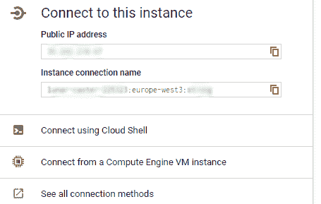

# 在 Google Cloud 中使用 Kubernetes 引擎和云 SQL 适当扩展像 Wordpress 这样的有状态应用程序

> 原文：<https://dev.to/mfahlandt/scaling-properly-a-stateful-app-like-wordpress-with-kubernetes-engine-and-cloud-sql-in-google-cloud-27jh>

网上有很多例子告诉你如何在 Kubernetes 中运行 Wordpress。这个例子的主要问题是:只有一个 Pod 运行 wordpress，你不能真正地扩展它。

所以我面临的问题是，我需要一个高度可扩展的 wordpress 设置，这是我想到的。

## 为什么扩展有状态应用如此困难？

这些应用程序直接写入光盘，大多数时候你无法阻止它。在使用某种插件系统的基于 PHP 的应用程序中，经常会出现这种情况。因此，文件不能存储在某种桶中，而必须存储在应用程序的文件系统中。

现在你可能会说，但是有一个像 https://de.wordpress.org/plugins/wp-stateless/这样的无状态插件可以写入云桶。是的，这是真的，但它不存储插件或文件，有些插件可能会直接写在那里的文件夹(可悲的是，这种情况发生，但事实如此)

## 做什么？

我们需要几样东西，我们需要一个可扩展的数据库，我们需要为我们的应用程序和应用程序本身提供某种共享的文件库。

为了简化起见，我们将只使用一个预定义的 Wordpress Docker 图像，尽管你应该总是尝试创建附加到这些 Docker 文件中，以满足你自己的需要。以它们为基础，但根据你的需要扩展它们。

所以我们需要一个共享光盘，这里我们遇到了第一个问题。我们在 Kubernetes 集群中需要一个 ReadWriteMany 卷，问题就出现了。云提供商没有这个。如果你查看 Kubernetes 文档
，你会发现 GCEPersistantDsik、AzureDisk 和 AWSElasticBlockStore 都不支持我们所需要的。
Goolge Cloud 或 AzureFile 中有类似 CloudFileStore 的选项，但它们对我们来说太贵太大了(我们不需要 1TB 来存储我们的 Wordpress，谢谢)

## NFS 前来救援

但是当我们看这份名单时，我们看到了救世主:NFS 来了。让我们创建唯一的选项，将一次性读写存储连接到 NFS。因此，我们需要一个在不同地区之间共享的存储类:

```
kind: StorageClass
apiVersion: storage.k8s.io/v1
metadata:
 name: regionalpd-storageclass
provisioner: kubernetes.io/gce-pd
parameters:
 type: pd-standard
 replication-type: regional-pd
 zones: europe-west3-b, europe-west3-c 
```

Enter fullscreen mode Exit fullscreen mode

我们需要创建体积索赔

```
apiVersion: v1
kind: PersistentVolumeClaim
metadata:
    name: nfs
spec:
  accessModes:
  - ReadWriteOnce
  resources:
    requests:
      storage: 20Gi
  storageClassName: ""
  volumeName: nfs 
```

Enter fullscreen mode Exit fullscreen mode

现在让我们创建我们的 NFS

```
apiVersion: v1
kind: Service
metadata:
 name: nfs-server
spec:
 clusterIP: 10.3.240.20
 ports:
   - name: nfs
     port: 2049
   - name: mountd
     port: 20048
   - name: rpcbind
     port: 111
 selector:
   role: nfs-server 
```

Enter fullscreen mode Exit fullscreen mode

现在我们加上 NFS 本身。这里的好处是，我们可以使用预定义的服务

```
apiVersion: extensions/v1beta1
kind: Deployment
metadata:
 name: nfs-server
spec:
 replicas: 1
 selector:
   matchLabels:
     role: nfs-server
 template:
   metadata:
     labels:
       role: nfs-server
   spec:
     containers:
       - name: nfs-server
         image: gcr.io/google_containers/volume-nfs:0.8
         ports:
           - name: nfs
             containerPort: 2049
           - name: mountd
             containerPort: 20048
           - name: rpcbind
             containerPort: 111
         securityContext:
           privileged: true
         volumeMounts:
           - mountPath: /exports
             name: nfs
     volumes:
       - name: nfs
         gcePersistentDisk:
           pdName: nfs
           fsType: ext4 
```

Enter fullscreen mode Exit fullscreen mode

## CloudSQL 如此安全如此美丽

好了，我们有一个静态数据的运行 NFS。因此，下一个重要步骤是连接云 SQL。假设您已经设置了一个云 SQL Mysql。你怎么把你的豆荚和它连接起来？

我们对它使用 SQL 代理，它作为容器的一个附属部分。这样做的好处是，我们的 MySQL 没有暴露，我们可以使用 localhost。令人惊奇不是吗？

首先，您必须激活[云 SQL 管理 API](https://console.cloud.google.com/flows/enableapi?apiid=sqladmin)

您需要创建一个能够实际访问云 SQL 的[服务帐户](https://console.cloud.google.com/iam-admin/serviceaccounts/)。

在这里，我们创建了一个新角色，它拥有云 SQL >云 SQL-Client 的权限

下载创建的私钥，这是我们访问 SQL 实例所需要的。

现在创建一个数据库用户，如果您还没有这样做的话

```
gcloud sql users create [DBUSER] --host=% --instance=[INSTANCE_NAME] --password=[PASSWORD] 
```

Enter fullscreen mode Exit fullscreen mode

而且我们需要实例的名字，简单:

```
gcloud sql instances describe [INSTANCE_NAME] 
```

Enter fullscreen mode Exit fullscreen mode

或者在 webinterface 这里找到:
[](https://res.cloudinary.com/practicaldev/image/fetch/s--RvVqHBCK--/c_limit%2Cf_auto%2Cfl_progressive%2Cq_auto%2Cw_880/https://thepracticaldev.s3.amazonaws.com/i/asxhc94ljkr8biweuqrf.png) 
现在我们将凭证保存到我们的 Kubernetes 实例:

```
kubectl create secret generic cloudsql-instance-credentials \
    --from-file=credentials.json=[PROXY_KEY_FILE_PATH]
kubectl create secret generic cloudsql-db-credentials \
    --from-literal=username=[DBUSER] --from-literal=password=[PASSWORD] 
```

Enter fullscreen mode Exit fullscreen mode

### 那么我们已经准备好设置我们的 Wordpress 了，不是吗？

让我们首先创建服务:

```
apiVersion: v1
kind: Service
metadata:
 name: wlp-service
 labels:
   app: wlp-service
spec:
 type: LoadBalancer
 sessionAffinity: ClientIP
 ports:
   - port: 443
     targetPort: 443
     name: https
   - port: 80
     targetPort: 80
     name: http
 selector:
   app: wordpress 
```

Enter fullscreen mode Exit fullscreen mode

好了，现在我们已经启动并运行了服务，唯一缺少的是 pod 本身。
让我们分开一点，这样我可以解释一下

```
apiVersion: apps/v1
kind: Deployment
metadata:
 name: wordpress
 labels:
   app: wordpress
spec:
 replicas: 2
 strategy:
   type: RollingUpdate
 selector:
   matchLabels:
     app: wordpress
 template:
   metadata:
     labels:
       app: wordpress
   spec:
     containers:
       - name: wordpress
         image: wordpress:7.3-apache
         imagePullPolicy: Always
         env:
           - name: DB_USER
             valueFrom:
               secretKeyRef:
                 name: "cloudsql-db-credentials"
                 key: username
           - name: DB_PASSWORD
             valueFrom:
               secretKeyRef:
                 name: "cloudsql-db-credentials"
                 key: password
         ports:
           - containerPort: 80
             name: wordpress
           - containerPort: 443
             name: ssl 
```

Enter fullscreen mode Exit fullscreen mode

这足以运行 wordpress，但是没有数据库或持久 nfs。让我们一个接一个地添加云 sql 代理:

```
 - name: cloudsql-proxy
         image: gcr.io/cloudsql-docker/gce-proxy:1.11
         command: ["/cloud_sql_proxy",
                   "-instances=[YOUR INSTANCESTRING THAT WE LOOKED UP]=tcp:3306",
                   "-credential_file=/secrets/cloudsql/credentials.json"]
         securityContext:
           runAsUser: 2  # non-root user
           allowPrivilegeEscalation: false
         volumeMounts:
           - name: cloudsql-instance-credentials
             mountPath: /secrets/cloudsql
             readOnly: true
     volumes:
       - name: cloudsql-instance-credentials
         secret:
           secretName: cloudsql-instance-credentials 
```

Enter fullscreen mode Exit fullscreen mode

现在我们可以用 localhost 访问我们的云 SQL 了:)它基本上是在你的 pod 中添加了第二个容器，它将所有即将成为 3306 的内容代理到我们的云 SQL 实例，而不会将流量暴露给公共网络。

现在我们想把我们的 wp-content 目录挂载到 NFS 上

```
volumeMounts:
           - name: my-pvc-nfs
             mountPath: "/var/www/html/wp-content"
volumes:
        - name:  my-pvc-nfs
        nfs:
            server: 10.3.240.20
            path: "/" 
```

Enter fullscreen mode Exit fullscreen mode

现在你可能会说，但是马里奥，你为什么要为 NFS 安装一个固定的 IP 地址呢？是有原因的。这是我所知道的唯一一个内部 dns 不能正常工作的情况。

就这样，现在我们可以通过创建和 hpa 来扩展我们的 pods】

```
apiVersion: autoscaling/v2beta1
kind: HorizontalPodAutoscaler
metadata:
 name: wordpress
 namespace: default
spec:
 maxReplicas: 10
 metrics:
   - resource:
       name: cpu
       targetAverageUtilization: 50
     type: Resource
 minReplicas: 3
 scaleTargetRef:
   apiVersion: extensions/v1beta1
   kind: Deployment
   name: wordpress 
```

Enter fullscreen mode Exit fullscreen mode

我们所有的 wp-content 文件都进入 nfs，并在实例之间共享。是的，你是对的，NFS 现在是我们的单点故障，但是 NFS 比只有一台机器运行要稳定得多。如果使用 redis 这样的缓存或者增加 fpm 缓存，可以进一步减少加载时间。

很酷不是吗？

您对基本的 Kubernetes /云漫游感兴趣吗？只是让我知道