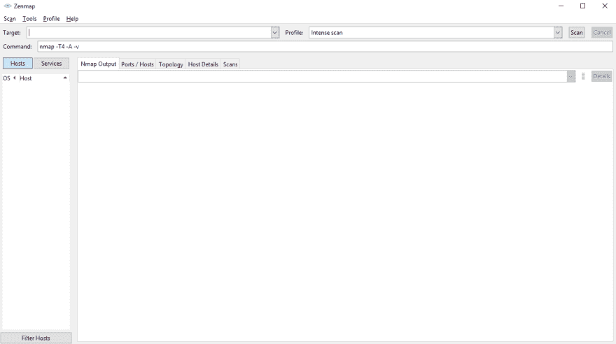
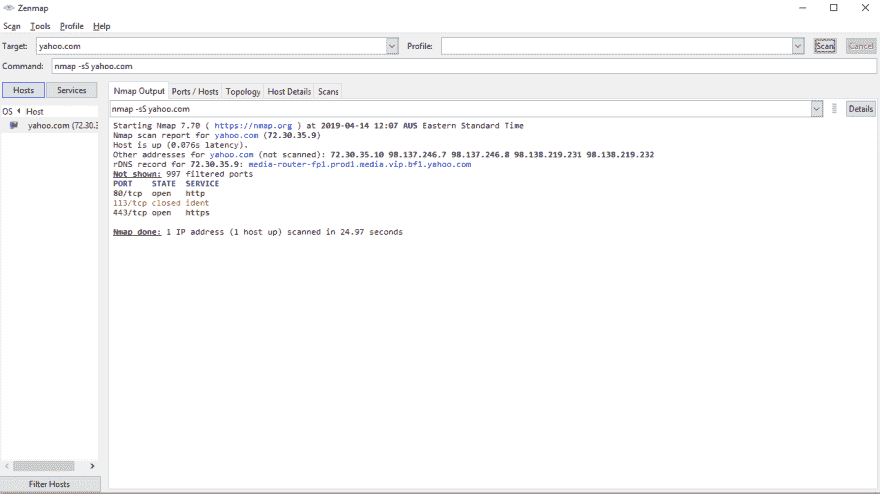
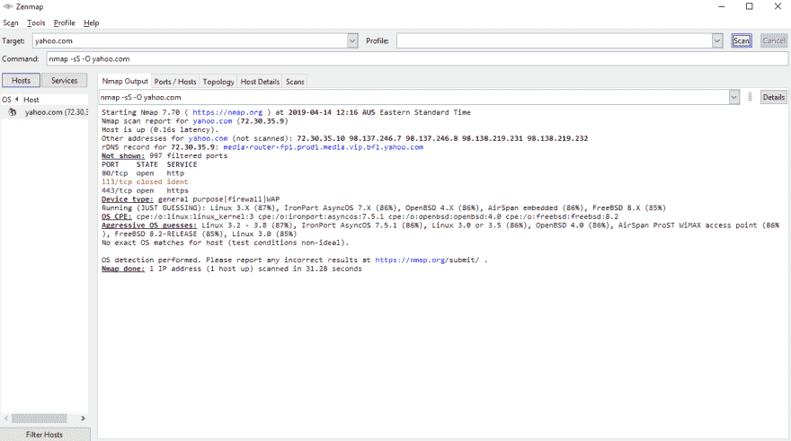

# 使用 Nmap 扫描您的网络漏洞

> 原文：<https://dev.to/ctrlshifti/scan-networks-for-vulnerabilities-with-nmap-2pc>

Nmap 是一个免费的开源工具，用于扫描网络和发现潜在的漏洞。如果你是一个圣灵降临者，Nmap 是你了解你所工作的环境的侦察的一个重要部分。作为一名开发人员或系统管理员，您绝对应该学习如何使用 Nmap 来扫描您的网络！它为您提供了一个“黑匣子”视图，让您可以像黑客一样查看网络中发生的事情。因此，如果您能发现任何问题，很可能有人已经发现了！

*注意:如果你是一个在第三方服务上托管你的网站的网络开发者，你可能没有权限进行网络扫描。 [AWS 允许客户进行渗透测试](https://aws.amazon.com/security/penetration-testing/)，但其他主机商可能不会。一定要先检查！*

*目标受众:*

*   *开发者*
*   *系统管理员*
*   *渗透测试仪*

### 正在安装 Nmap

Nmap 很容易在 Windows 和 MacOS 上安装——查看官方下载页面。我推荐使用 Zenmap，它是 Windows 和 MacOS 下载中附带的 GUI。Zenmap 看起来是这样的:

[](https://res.cloudinary.com/practicaldev/image/fetch/s--1JEp80um--/c_limit%2Cf_auto%2Cfl_progressive%2Cq_auto%2Cw_880/https://www.explainhownow.com/asseimg/zenmap_1.png)

如果你在 Ubuntu 或类似的系统上，你可以运行如下代码:

`sudo apt-get install nmap`

### 使用 Nmap 扫描端口

Nmap 是一个功能强大的工具，有许多选项。如此之多，以至于 Nmap 背后的人设法写了一本 468 页的书。

我将首先介绍 Nmap 的基本用法，然后我们可以讨论一些更好的选项。我将使用 Yahoo.com 在我的目标主机，因为他们有一个积极的错误赏金计划，不会逮捕我。

下面是基本扫描:

`nmap -sS yahoo.com`

[](https://res.cloudinary.com/practicaldev/image/fetch/s--caTBwRgN--/c_limit%2Cf_auto%2Cfl_progressive%2Cq_auto%2Cw_880/https://www.explainhownow.com/asseimg/zenmap_2.png)

sS 标志执行 SYN 扫描，在没有完成 TCP 连接的情况下扫描许多端口。如果你不想[太吵](https://www.google.com/search?client=firefox-b-d&q=give+the+sysadmin+a+heart+attack)，这是一个很好的选择。这向我们展示了两个开放的端口，80 和 443(用于 HTTP 和 HTTPS)。几乎和我们预期的一样！
T3】

让我们在此基础上添加另一面旗帜，-O.

`nmap -sS -O yahoo.com`

[](https://res.cloudinary.com/practicaldev/image/fetch/s--LaWWZtrH--/c_limit%2Cf_auto%2Cfl_progressive%2Cq_auto%2Cw_880/https://www.explainhownow.com/asseimg/zenmap_3.png)

这一次，我们看到了端口，还猜测了服务器可能运行的操作系统。了解服务器上运行的是什么操作系统是侦察的一个重要部分，因为有些漏洞是特定于操作系统的。举例来说，OpenSSH 5.3 是古老的版本，有公开的漏洞，如果你在服务器上看到它，它很可能是易受攻击的。最明显的例外是服务器运行 Redhat 操作系统，因为 Redhat 已经修补了 OpenSSH 5.3 的问题。

旁注:O 标志很慢，所以如果你不需要的话就把它从扫描中去掉。

让我们看看另一个标志，-sV。

`nmap -sS -O -sV yahoo.com`

结果:

```
PORT    STATE  SERVICE        VERSION
80/tcp  open   http-proxy     Apache Traffic Server
113/tcp closed ident
443/tcp open   ssl/http-proxy Apache Traffic Server 
```

这一次，我们看到了端口上运行的软件版本！这对于发现漏洞至关重要，因为旧软件往往有更多的漏洞。还可以尝试使用-v 标志，这将为您提供关于输出的更详细的信息。

接下来，让我们尝试指定要检查的端口，而不只是进行一般扫描。

`nmap -sS -sV -v -p 22 yahoo.com`

结果:

```
PORT   STATE    SERVICE VERSION
22/tcp filtered ssh 
```

我们可以看到端口 22 在雅虎上被过滤，这意味着我们可能很难攻击它。您可以通过用类似于 *-p 1-165535* 的东西替换 *-p 22* 来指定一个端口范围。我通常使用的标志是 *- top-ports 1000* ，顾名思义，扫描最常见的 1000 个端口。

综上所述，我通常会运行以下命令来全面了解主机:

`nmap -sS -sV -O -v --top-ports 1000 yahoo.com`

这里，我们正在进行偷偷扫描(sS)、版本检测(sV)、操作系统检测(O)、详细输出(v)，并扫描前 1000 个端口。

现在您已经知道了使用 Nmap 进行端口扫描的基础知识！

### 更进一步

#### 扫描 IP 范围

如果您在自己的服务器上测试，扫描 IP 范围而不是单个主机是很有用的。我不建议在你不拥有的服务器上这样做，因为你可能会错过和扫描不是你的目标的人。

Nmap 使用 CIDR 符号，所以您可以像这样运行:

`nmap -sV --top-ports 1000 192.168.1.0/24`

#### 时机

Nmap 有五个计时选项，官方命名为:偏执、鬼鬼祟祟、礼貌、正常、好斗、疯狂。您可以使用 T 标志来指定这一点，例如-T0 表示偏执，而-T5 表示疯狂。默认情况下，Nmap 在“正常”模式下运行，因此-T3 不做任何事情。我通常会在 T4 上扫描，如果我知道这不会让客户不高兴的话。

#### 文件输出

如果您想将 Nmap 的结果保存到一个文件中以备后用，请在文件名上添加*-标志。 *-oX filename* 以 XML 格式输出结果，如果您有处理 Nmap 输出的脚本，这将非常有用。* 

#### 剧本

Nmap 附带了一些您可以启用的脚本！我通常不使用它们，因为我更喜欢其他工具，但是这里有一个很好的指南来解释它们。
T3】

### 有趣的部分:剥削

[](https://res.cloudinary.com/practicaldev/image/fetch/s--VvpZEetk--/c_limit%2Cf_auto%2Cfl_progressive%2Cq_auto%2Cw_880/https://www.explainhownow.com/asseimg/security_updates.png)

现在我们知道了主机上运行的是什么，我们想利用它。

攻击网络本身就是一个完整的主题，但是我将在这里介绍一些基础知识！

#### 端口 22: SSH

如果网络打开了端口 22 并运行 ssh，这是一个很好的起点。如果您能够成功地通过 SSH 登录，那么...这对服务器来说是个不好的信号。

首先，检查正在运行的 SSH 版本(回想一下，您可以使用-sV 标志来完成这项工作)。谷歌一下那个版本，输入关键词“漏洞”。如果是旧版本的 SSH，您很有可能找到公开可用的漏洞，您可以复制并运行它。

如果那不起作用，你仍然有机会得到一个登录。回到你的终端，像这样运行:

`ssh remote_username@remote_host`

“remote_username”可以是任何数量的名称，但我检查的常见名称是 admin 和 root。尝试[一些常用密码](https://www.esquire.com/lifestyle/a25570880/top-passwords-2018/)，也尝试一些公司特有的东西(网管有狗吗？孩子？试试他们的名字)。你也可以尝试运行一个[暴力](https://www.offensive-security.com/metasploit-unleashed/scanner-ssh-auxiliary-modules/)扫描，但这超出了本文的范围。

#### 其他一切

SSH 是一个特例，因为如果您登录，可能会受到严重的危害，但是其他服务也同样容易受到攻击。

在启用版本检测的情况下运行 Nmap 扫描后，查看是否显示了除端口 80 和 443 之外的任何内容。谷歌一下你找到的任何服务的名称，弄清楚它们做什么，以及是否有任何利用是公开的。你知道开发人员如何开玩笑说把他们所有的工作从 StackOverflow 中剥离出来吗？Pentesters 几乎做了同样的事情，但是用的是 CVE(常见漏洞和暴露)数据库。

一旦你用完了谷歌公共利用的服务，你可以返回查看是否有任何服务有登录入口。例如，如果服务是 webmail，您可以尝试使用 netcat 登录，尝试使用该服务的默认用户名和密码。

### 如何修复易受攻击的服务器？

那不是我的部门。

看看这些帖子:

*   [如何保护你的服务器免受黑客攻击，作者
    维塔利·科勒索夫](https://dev.to/vkolesov/how-to-protect-your-server-from-hackers-4j6l)
*   [保护您服务器的 7 项安全措施](https://www.digitalocean.com/community/tutorials/7-security-measures-to-protect-your-servers)
*   [保护亚马逊 EC2 实例](https://aws.amazon.com/answers/security/aws-securing-ec2-instances/)

### 保持联系！

喜欢我的帖子吗？查看我的推特！我会开些糟糕的玩笑，把重要的社会问题简化成幼稚的讽刺，偶尔还会大声抱怨科技。

想要技术吗？订阅我的电子邮件列表，以便在发布新帖子时获得通知！

*本帖最初发表于[explainhownow.com](https://www.explainhownow.com/)T3】*