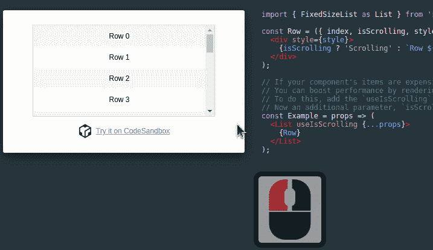
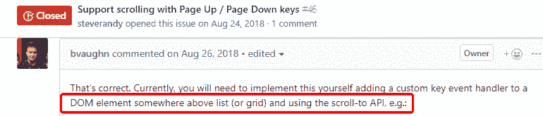

# 在反应窗口中使用上/下翻页键滚动

> 原文：<https://dev.to/dance2die/scrolling-with-page-up-down-keys-in-react-window-31ei>

*照片由[露丝](https://unsplash.com/photos/a6mfMjCFkII?utmsource=unsplash&utmmedium=referral&utmcontent=creditCopyText)在[Unsplash](https://unsplash.com/search/photos/paper-roll?utm_source=unsplash&utm_medium=referral&utm_content=creditCopyText)T5 拍摄*

React-Window 是 Brian Vaughn 开发的 React 库，用于高效地呈现列表(或网格)中的大量项目，但我将使用“列表”来保持句子简单，因为两者的原理是相同的。

*通过仅渲染可见项目*

但问题是，当你点击列表中的一个项目时，你不能使用键来上下滚动。

例如向上/向下翻页、向上/向下箭头、Home 或 End 键。

让我们看看如何在 react-window 中支持上下翻页的滚动。

## 复制发行

转到(任何示例)[反应窗口示例](https://react-window.now.sh/#/examples/list/scrolling-indicators)，用键盘上下滚动，不选择列表中的项目。

你应该可以用任何键滚动。

然后点击列表中的任何项目，并尝试用键盘滚动。

你会看到它只会移动一次，然后停止响应。

## 发生了什么？

根据这个 GitHub 问题，行为没有实现，[支持使用 Page Up / Page Down 键](https://github.com/bvaughn/react-window/issues/46)滚动(这不是我创造的，而是由 [Steve Randy Tantra](https://github.com/steverandy) )。

你有责任为自己增加一份支持。

幸运的是，Brian 提供了一种在同一线程中实现它的方法。

让我们用 Page Up/Down、Home 和 End 键使示例列表可滚动。

## 实现

您可以在这里看到工作的实现并跟随。

*不幸的是，键盘会上下滚动当前页面，因此你必须在* [*新窗口*](https://codesandbox.io/s/5zrw4xz04x) *中打开编辑器……*

## 用容器元素包装列表

首先，您需要将列表包装在一个容器元素中，比如`div/section/main`等。

然后[添加 tab 索引来捕获 onKeyDown 事件](https://stackoverflow.com/a/44434971/4035)。