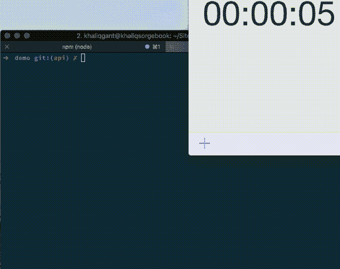

# 三分钟后去 SCSS

> 原文：<https://dev.to/devdiaries/scss-in-three-minutes-5hmg>

## 我们最喜欢的资源

*   [正式文件](https://sass-lang.com/documentation/file.SASS_REFERENCE.html)
*   [SCSS/萨斯完全指南](https://medium.freecodecamp.org/the-complete-guide-to-scss-sass-30053c266b23)

## 等等，等等，什么事？

在我们开始比赛之前，最好先谈谈什么是萨斯/SCSS。Scss 是一个预处理器，这意味着它需要被处理成另一种格式(CSS)，并且是 CSS 的超集。这仅仅意味着我们可以使用 css 标准之外的特性，并且在编写 CSS 时速度会更快。由于 SCSS 是 CSS 的超集，这也意味着常规的旧 CSS 是有效的 SCSS，这使得从 CSS 转换到 SCSS 更加容易，只需要你重命名一些文件。我们一直在讨论 SCSS，然后链接到萨斯，所以你可能想知道这两者之间的区别是什么...这个答案很好地总结了这一点，但基本上 SCSS 是更新的版本，两者只是两种不同的语法。我们建议您使用 SCSS。想更多地了解 SCSS 到底是什么吗？查看这篇[文章](https://www.dailysmarty.com/posts/what-is-scss)

## 我们开始吧

我们热衷于尽可能保持轻量级，所以我们将选择一个 npm 脚本来协调 scss 编译过程。这个
可以很容易地被改变成与[网络包](https://webpack.js.org/)、[大口](https://gulpjs.com/)、[咕噜](https://gruntjs.com/)、[花椰菜](https://github.com/broccolijs/broccoli)、[早午餐](https://brunch.io/)或者你正在使用的任何东西相结合。

因此，让我们安装 [node-sass](https://github.com/sass/node-sass) ，它将处理构建我们的 scss 文件。在我们的项目根目录中，让我们通过 npm 安装它。

```
npm install --save node-sass 
```

现在我们需要添加一个脚本来监视我们何时编辑 scss 文件并将它们编译成有效的 css 文件。因此，我们将添加一个 npm 脚本来处理这个问题:

```
"scripts": {
    "scss": "npx node-sass -w scss/app.scss -o assets/css/"
  } 
```

好奇 npx 是什么？[在这里了解一下。](https://blog.npmjs.org/post/162869356040/introducing-npx-an-npm-package-runner)基本上它允许我们快速调用一个节点包，在这种情况下调用一个本地包。正如评论中提到的，我们甚至不需要在开头写 npx，因为我们通过 npm 脚本调用它，所以也可以只写`node-sass -w scss/app.scss -o assets/css/`。然后，我们告诉 node-sass 查看我们的 scss 文件 app.scss，并将结果输出到 css 目录中的 assets 目录。让我们制作一些 scss 文件

```
cd scss & touch app.scss 
```

让我们向 app.scss 文件添加一些 scss:

```
$black: #000000;
.container {
    margin: 0 auto;
        &:hover {
            border: 1px solid $black;
        }
} 
```

现在，如果我们检查 css 目录中的内容，我们会看到:

```
.container {
  margin: 0 auto; }
  .container:hover {
    border: 1px solid black; } 
```

酷！它获取我们的 scss 并输出我们可以使用的有效 css。让我们在 3 分钟内看一段视频吧！

[](https://res.cloudinary.com/practicaldev/image/fetch/s--NWSl5nHG--/c_limit%2Cf_auto%2Cfl_progressive%2Cq_66%2Cw_880/https://www.dev-diaries.com/asseimg/scss-in-three.gif)

[开发人员日记上的原始帖子](https://www.dev-diaries.com/blog/scss-in-three-minutes/)