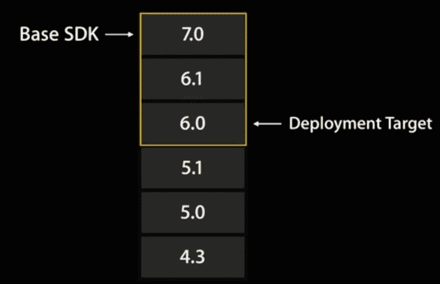

# iOS 中的 SDK 和部署目标

> 原文：<https://dev.to/onmyway133/sdk-and-deployment-target-in-ios-27m2>

我看到我对问题[xcode](http://stackoverflow.com/questions/18568572/whats-the-meaning-of-base-sdk-ios-deployment-target-target-and-project-in-xc/22536773#22536773)中的基本 SDK、iOS 部署目标、目标和项目的含义是什么的回答得到了很多评论，所以我认为我需要对此进行更多的阐述

goodreader

*   [iOS 7 tech talk——构建现代应用，第二部分](https://developer.apple.com/tech-talks/videos/)
*   [为基于 SDK 的开发配置项目](https://developer.apple.com/library/ios/documentation/DeveloperTools/Conceptual/cross_development/Configuring/configuring.html)

[](https://res.cloudinary.com/practicaldev/image/fetch/s--U5Dnj-mL--/c_limit%2Cf_auto%2Cfl_progressive%2Cq_auto%2Cw_880/http://i.stack.imgur.com/CJF6Y.png)

## 基础 SDK

*   我们不能再这样配置了，因为 Xcode 将使用最新的 SDK。对于 Xcode 7，SDK 是 iOS 9
*   如果我们升级 Xcode，它将使用更新版本的 SDK。和 Xcode 7.2 一样，SDK 也是 iOS 9.1
*   为您的项目选取最新的 SDK 可让您使用与该 SDK 相对应的操作系统更新中引入的新 API。当新功能作为系统更新的一部分被添加时，系统更新本身通常不包含反映该变化的更新的头文件。然而，SDK 包含更新的头文件。

## 部署目标

*   我们可以在 Xcode ->目标->部署信息->部署目标中设置
*   声明我们支持这个 iOS 版本

## 什么意思

> 因此，一个现代的应用程序可能使用 iOS 9 作为目标 SDK，iOS 7 作为部署目标。这意味着你可以在 iOS 7，iOS 8 和 iOS 9 上运行，并且当你实际运行在 iOS 9 上时，你可以使用任何 iOS 9 调用。

。

> 每个。sdk 目录类似于它所代表的操作系统版本的目录层次结构:在它的顶层有 usr、system 和 Developer 目录。OS X .sdk 目录还包含一个库目录。这些目录中的每一个又包含子目录，这些子目录具有安装了 Xcode 的操作系统的相应版本中存在的头文件和库。

。

> iOS 或 OS X SDK 中的库只是用于链接的存根；它们不包含可执行代码，只包含导出的符号。SDK 支持仅适用于本机构建目标。

所以 SDK 就像只是存根和头。这意味着我们可以使用某些 API，但是在没有这些 API 的真正符号的操作系统上，它会崩溃

## 可用

Swift 2 引入了`available`构造，防止在尝试使用更新的 API 时出现故障。

注意`available`是运行时，不是编译时。所有的代码都在你的可执行文件中

```
if #available(iOS 9, OSX 10.10, *) {
    // Code to execute on iOS 9, OS X 10.10
} else {

} 
```

## 弃用的 API

*   [查找不推荐使用的 API 的实例](https://developer.apple.com/library/ios/documentation/DeveloperTools/Conceptual/cross_development/Using/using.html#//apple_ref/doc/uid/20002000-SW6)

> 始终检查您是否使用了不推荐使用的 APIs 虽然仍然可用，但不推荐使用的 API 不保证将来也可用

## 编译时 vs 运行时

*   [针对不同 SDK 的有条件编译](https://developer.apple.com/library/ios/documentation/DeveloperTools/Conceptual/cross_development/Using/using.html#//apple_ref/doc/uid/20002000-SW5)

```
#if (arch(i386) || arch(x86_64)) && os(iOS)
    // code inside gets inserted into executable when builds for simulator
#else
    // code inside gets inserted into executable when builds for device
#endif 
```

```
#if os(OSX)
    import Cocoa
#elseif os(iOS)
    import UIKit
#endif 
```

```
// All the code gets inserted into executable, but is run depending on the version of the OS
if #available(iOS 9, *) {
    // use UIStackView
} else {
    // show your manual Auto Layout skill
} 
```

## 弱关联 vs 强关联

*   [弱链接和苹果框架](https://developer.apple.com/library/ios/documentation/DeveloperTools/Conceptual/cross_development/Configuring/configuring.html#//apple_ref/doc/uid/10000163i-CH1-SW2)
*   “弱链接”框架意味着什么？
*   [框架和弱链接](https://developer.apple.com/library/mac/documentation/MacOSX/Conceptual/BPFrameworks/Concepts/WeakLinking.html)

> 例如，假设在 Xcode 中，您将部署目标(最低要求版本)设置为“OS X v10.5”，将基本 SDK(最高允许版本)设置为“OS X v10.6”。在编译期间，编译器会弱链接 OS X v10.6 中引入的接口，而强链接操作系统早期版本中定义的接口。这将允许您的应用程序在 OS X v10.5 中运行，并利用可用的新特性。

。

> 没有一个(平台)框架真正“包含在捆绑包中”。相反，一旦您将应用程序添加到“链接二进制文件和库”构建阶段，您的应用程序就会有一个到框架的引用(“链接”)。框架被预先安装在设备上。当您运行应用程序时，所有应用程序的框架引用都由动态链接器(在设备上)解析，这意味着框架代码已加载，因此您的应用程序可以使用它。

## 引用

*   [使用 Swift 检查 API 可用性](http://useyourloaf.com/blog/checking-api-availability-with-swift.html)

* * *

支持我的应用程序

*   [推送 Hero -测试推送通知的纯 Swift 原生 macOS 应用](https://onmyway133.com/pushhero)
*   [PastePal -粘贴板、便笺和快捷方式管理器](https://onmyway133.com/pastepal)
*   [快速检查-智能待办事项管理器](https://onmyway133.com/quickcheck)
*   [Alias - App 和文件快捷方式管理器](https://onmyway133.com/alias)
*   [我的其他应用](https://onmyway133.com/apps/)

❤️❤️😇😍🤘❤️❤️