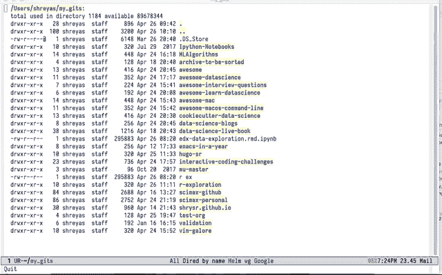
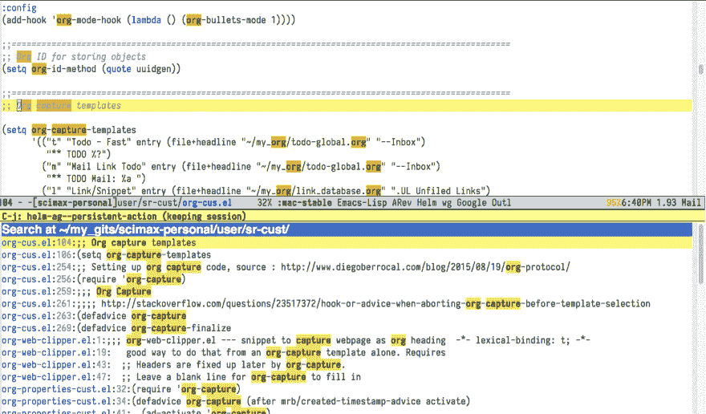

# 在 Github 上搜索牛逼列表

> 原文：<https://dev.to/shrysr/searching-the-awesome-lists-on-github-4go2>

今天在 Github 上发现了令人敬畏的列表。通过在 github 上的[简单搜索就可以找到它们，它们包含了大量主题的各种资源的精选列表。](https://github.com/search?utf8=%E2%9C%93&q=awesome+list&type=)

正如人们所料，这些列表之间有很多共同点，包括主题和链接。

一个人如何在所有这些知识库中搜索一个关键词呢？我总是希望在我的 Emacs 配置文件中，或者在特定位置的其他文件中搜索特定的关键字或代码片段。这尤其是为了验证在另一个位置是否已经有一点代码或注释可用。看起来像这样的东西；):

<figure>[](https://shreyas.ragavan.co/img/emacs-helm-ag-anim.gif) 

<figcaption>
用 emacs-helm-ag 通过一堆 awesome-list 和其他本地存储库搜索“数据科学”。
</figcaption>

</figure>

关于为什么要学习 Emacs，答案已经在 [Howard 的博客文章](http://www.howardism.org/Technical/Emacs/why-emacs.html)中给出了。)，其中他提到了`ack`和`ag` ( [找银者](https://github.com/ggreer/the%5Fsilver%5Fsearcher))。<sup id="fnref:fn-1">T7】1T9】。甚至可以根据每次搜索进行编辑。</sup>

silver searcher github 页面提供了明显比 ack(和类似工具)快得多的例子。进一步的探索引导我找到了 emacs-helm-ag 包，这是一个与 T2 银搜索者 T3 的界面。实现 emacs-helm-ag 非常简单，只需将它添加到我的包列表中，并在我的 helm 配置中添加一个基本设置即可。<sup id="fnref1">T5 1T7】</sup>

到目前为止，我使用这段显然是从网上借来的代码向 Scimax 添加包，这种情况下——恐怕我没有注明出处。

```
;; Setting up use packages
;; list the packages you want
(setq package-list '(diminish org-journal google-this ztree org-gcal w3m org-trello org-web-tools ox-hugo auto-indent-mode ob-sql-mode dash org-super-agenda ox-hugo workgroups2 switch-window ess ess-R-data-view interleave deft org-bookmark-heading writeroom-mode evil evil-leader polymode helm-ag))

;;fetch the list of packages available
(unless package-archive-contents
  (package-refresh-contents))

;; install the missing packages
(dolist (package package-list)
  (unless (package-installed-p package)
    (package-install package)))

;; Remember to start helm-ag. As per the Silver searcher github site, the helm-follow-mode-persistent has to be set before calling helm-ag.

(custom-set-variables
 '(helm-follow-mode-persistent t))

(require 'helm-ag) 
```

这是它在行动中的样子>>甜！！

<figure>[](https://shreyas.ragavan.co/img/helm-ag-emacs.png) 

<figcaption>
注意搜索跨多个文件。因此，我可能比必要的次数打了更多的电话。
</figcaption>

</figure>

* * *

1.  这是我在博客里的第一张动画 gif！很棘手！我在 Mac 商店上使用了免费的 [GIPHY capture app](https://itunes.apple.com/us/app/giphy-capture-the-gif-maker/id668208984?mt=12) 。 [<sup>^</sup>](#fnref:fn-1)

* * *