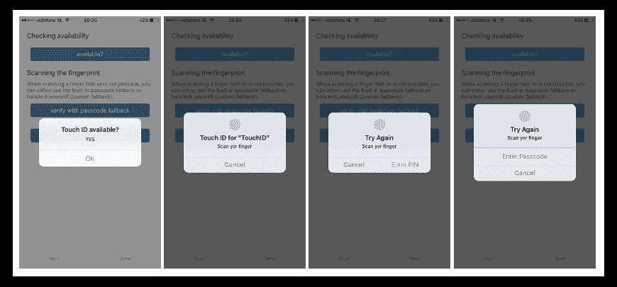
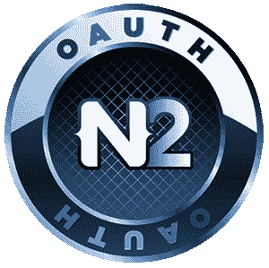
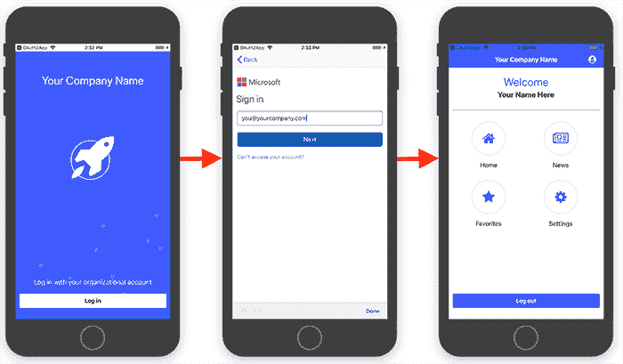

# 保护您的移动应用-第四集(保护用户身份验证)

> 原文：<https://dev.to/progress/secure-your-mobile-app---episode-four-secure-user-auth-5ep1>

无论您是开发传统的本机应用程序，还是使用 Appcelerator 或 Xamarin 等交叉编译的应用程序，使用 Ionic 的混合应用程序，或者使用 NativeScript 或 React Native 的 JavaScript-本机应用程序，贯穿其中的一个共同主题是应用程序安全性。

[在上一篇文章](https://dev.to/progress/secure-your-mobile-app---episode-three-securing-data-in-transit-491f)中，我们确保传输中的数据从端到端、从设备到云都是 100%安全的。我们了解到，通过利用 [Progress Kinvey](https://www.progress.com/kinvey) ，我们拥有了一个确保数据完整性、合规性和强大性能的交钥匙解决方案。

> 观看网络研讨会[保护您的移动应用的最佳实践](https://www.progress.com/campaigns/kinvey/best-practices-for-securing-your-mobile-apps),获取一些关于 NativeScript 安全性的提示和技巧！

在我们结束本系列时，我们希望以一个至关重要的主题来结束:安全地认证和授权您的应用程序用户。

*   **第一部分:** [保护你的源代码](https://dev.to/progress/secure-your-mobile-app---episode-one-protecting-the-code-58e)
*   **第二部分:** [保护静态数据](https://dev.to/progress/secure-your-mobile-app---episode-two-securing-data-at-rest-4ami)
*   **第三部分:** [确保设备和服务器之间的数据完整性](https://dev.to/progress/secure-your-mobile-app---episode-three-securing-data-in-transit-491f)
*   **第四部分:**企业用户认证和授权(嘿就是今天！)

> 查看来自[NativeScripting.com](https://nativescripting.com/course/securing-nativescript-applications)的关于移动应用安全的新课程，并通过代码:NSSECURE 获得 30%的折扣。

## 生物认证

密码和通行码成为安全认证应用程序用户的标准的时代已经过去很久了。随着大多数 iOS 和 Android 设备内置生物识别安全功能(例如指纹和面部识别)，我们的应用程序应该专注于利用这些更加安全的技术。

对于指纹识别，[触控 ID](https://support.apple.com/en-us/HT201371) 是一项 iOS 功能，允许用户用指尖解锁他们的设备。Android 有一个相当于“指纹扫描”的功能。当然，这两种技术都是基于在设备解锁前通过指纹扫描来验证用户身份。

面部识别方面， [Face ID](https://www.apple.com/iphone-xs/face-id/) 是苹果为 iPhone X 系列设计开发的系统。Face ID 很可能最终会取代触控 ID，成为 iOS 设备上事实上的生物认证技术。

为了在你的应用中使用这些生物认证选项，有一个由 [Eddy Verbruggen](https://twitter.com/eddyverbruggen) 构建的奇妙插件，名为[nativescript-fingerprint-auth](https://market.nativescript.org/plugins/nativescript-fingerprint-auth)。

[](https://res.cloudinary.com/practicaldev/image/fetch/s--9EmCl7yS--/c_limit%2Cf_auto%2Cfl_progressive%2Cq_auto%2Cw_880/https://raw.githubusercontent.com/rdlauer/articles/master/nativescript/securing-app/4-biometric.png)

> **提示:**尽管它被称为“指纹”插件，它也[在 iPhone X 系列设备上支持 Face ID](https://market.nativescript.org/plugins/nativescript-fingerprint-auth#face-id-ios) ！

该插件的基本用途包括检查生物识别支持是否可用等功能:

```
import { FingerprintAuth, BiometricIDAvailableResult } from "nativescript-fingerprint-auth";

class MyClass {
  private fingerprintAuth: FingerprintAuth;

  constructor() {
    this.fingerprintAuth = new FingerprintAuth();
  }

  this.fingerprintAuth.available().then((result: BiometricIDAvailableResult) => {
    console.log(`Biometric ID available? ${result.any}`);
    console.log(`Touch? ${result.touch}`);
    console.log(`Face? ${result.face}`);
  });
} 
```

Enter fullscreen mode Exit fullscreen mode

以及验证指纹(或 iPhone X 上的人脸):

```
fingerprintAuth.verifyFingerprint(
    {
      title: 'Android title', // optional title (used only on Android)
      message: 'Scan yer finger', // optional (used on both platforms) - for FaceID on iOS see the notes about NSFaceIDUsageDescription
      authenticationValidityDuration: 10, // optional (used on Android, default 5)
      useCustomAndroidUI: false // set to true to use a different authentication screen (see below)
    })
    .then((enteredPassword?: string) => {
      if (enteredPassword === undefined) {
        console.log("Biometric ID OK")
      } else {
        // compare enteredPassword to the one the user previously configured for your app (which is not the users system password!)
      }
    })
    .catch(err => console.log(`Biometric ID NOT OK: ${JSON.stringify(err)}`)
); 
```

Enter fullscreen mode Exit fullscreen mode

> 查看[本教程](https://www.progress.com/blogs/how-to-integrate-biometric-authentication-in-ios-and-android),了解如何在 NativeScript 和 Progress Kinvey 后端使用该插件。

nativescript-fingerprint-auth 是一种很好的方式，可以轻松地将生物特征安全性添加到我们的应用程序中。但是，如何使用现有的安全协议和服务将经过验证的个人与我们后端系统中的授权角色联系起来呢？

## OAuth 2.0

您可能以前听说过 OAuth，因为 OAuth 2.0 是一种常用的用户授权行业标准协议。感谢我们广泛的插件开发者社区，事实上 NativeScript 中有一个用于与 OAuth 2.0 交互的插件， [nativescript-oauth2](https://market.nativescript.org/plugins/nativescript-oauth2) 插件。

[](https://res.cloudinary.com/practicaldev/image/fetch/s--jNZw4Bue--/c_limit%2Cf_auto%2Cfl_progressive%2Cq_auto%2Cw_880/https://raw.githubusercontent.com/rdlauer/articles/master/nativescript/securing-app/4-oauth-plugin.png)

OAuth 2.0 插件有助于简化对支持 OAuth 2.0 协议的 OAuth 提供商(如微软、脸书和谷歌)的访问，但您也可以使用自己的插件(甚至使用您组织自己的提供商)。

> 请务必[查阅插件文档](https://market.nativescript.org/plugins/nativescript-oauth2)以获得入门帮助。

如果您对该插件的技术实现如何与 NativeScript 应用程序一起工作感到好奇，请查看提供的适用于所有 NativeScript 支持的框架的演示应用程序:

*   [角度](https://github.com/alexziskind1/nativescript-oauth2/tree/master/demo-angular)
*   vista . js
*   [核心(普通打字稿)](https://github.com/alexziskind1/nativescript-oauth2/tree/master/demo)

## 轻松企业认证

还和我在一起吗？好吧，我承认:用户认证是一个巨大的痛苦。😥

如果您使用我们自己的身份认证提供商，您必须繁琐地设置登录表单、密码恢复系统和支持后端基础设施。或者，您可能正在尝试与使用 SAML、OAuth(见上文)或 Open ID 等缩写的现有企业身份验证提供者集成。😵

对于更简单的企业认证，只需看看 [NativeScript Sidekick](https://www.nativescript.org/nativescript-sidekick) 中的[企业认证模板](https://docs.nativescript.org/sidekick/user-guide/enterprise-auth/intro)即可。

[](https://res.cloudinary.com/practicaldev/image/fetch/s--A7pWQ6Sn--/c_limit%2Cf_auto%2Cfl_progressive%2Cq_auto%2Cw_880/https://raw.githubusercontent.com/rdlauer/articles/master/nativescript/securing-app/4-sidekick.png)

NativeScript Sidekick 提供了一个[企业认证模板](https://docs.nativescript.org/sidekick/user-guide/enterprise-auth/intro)，以及一些旨在帮助您尽快连接到认证提供商的新功能。由 [Progress Kinvey](https://www.progress.com/kinvey) 提供支持的企业认证模板引导您完成连接到您选择的提供商的过程，并使定制您的登录屏幕的外观和感觉变得容易。

你可以在 NativeScript 博客上阅读关于使用企业认证应用模板[的更多信息，甚至可以在 NativeScripting.com](https://www.nativescript.org/blog/enterprise-authentication-made-easier-with-nativescript)上注册一门免费的[在线课程，指导你如何使用。](https://courses.nativescripting.com/p/nativescript-enterprise-auth/?product_id=308158&coupon_code=AUTH101) 

> **提示:**如果你正在开发自己的身份验证系统，你会希望设计一个尽可能直观和友好的用户界面。我们已经整理了一篇[博客文章和一个示例应用程序](https://www.nativescript.org/blog/building-an-awesome-login-screen-with-nativescript)，展示了用 NativeScript 构建你自己的*牛逼*登录屏幕的一些最佳实践。

## 得出的结论📱🔐系列

在过去的四篇文章中，我们已经介绍了很多内容！我们开始学习如何轻松地[保护我们的源代码](https://dev.to/progress/secure-your-mobile-app---episode-one-protecting-the-code-58e)，然后确保存储在本地的[数据是安全和加密的](https://dev.to/progress/secure-your-mobile-app---episode-two-securing-data-at-rest-4ami)，讨论了一些通过网络保护数据的[最佳实践，最后总结了一些简单的方法来确保我们安全地认证和授权我们的最终用户。](https://dev.to/progress/secure-your-mobile-app---episode-three-securing-data-in-transit-491f)