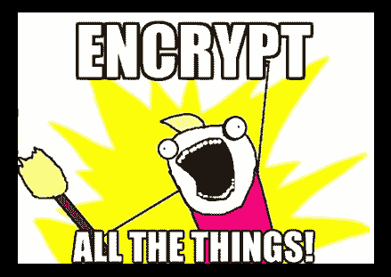
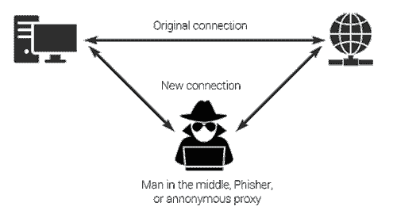

# 保护您的移动应用-第三集(保护传输中的数据)

> 原文：<https://dev.to/progress/secure-your-mobile-app---episode-three-securing-data-in-transit-491f>

无论您是开发传统的本机应用程序，还是使用 Appcelerator 或 Xamarin 等交叉编译的应用程序，使用 Ionic 的混合应用程序，或者使用 NativeScript 或 React Native 的 JavaScript-本机应用程序，贯穿其中的一个共同主题是应用程序安全性。

上一次，我们看到了[保护我们存储在设备](https://dev.to/progress/secure-your-mobile-app---episode-two-securing-data-at-rest-4ami)上的数据——无论是通过加密的密钥/值存储、SQLite + SQLCipher，还是像 [Progress Kinvey](https://www.progress.com/kinvey) 这样强大且兼容的后端，用于加密和在线/离线数据同步。

> 观看网络研讨会[保护您的移动应用的最佳实践](https://www.progress.com/campaigns/kinvey/best-practices-for-securing-your-mobile-apps),获取一些关于 NativeScript 安全性的提示和技巧！

当你的应用数据在后端来回移动时，保持数据的完整性是这个难题的另一个关键部分，所以今天我们的重点是如何在传输过程中保护数据。

*   **第一部分:** [保护你的源代码](https://dev.to/progress/secure-your-mobile-app---episode-one-protecting-the-code-58e)
*   **第二部分:** [保护静态数据](https://dev.to/progress/secure-your-mobile-app---episode-two-securing-data-at-rest-4ami)
*   **第三部分:**确保设备和服务器之间的数据完整性(就是今天！)
*   **第四部分:** [企业用户认证和授权](https://dev.to/progress/secure-your-mobile-app---episode-four-secure-user-auth-5ep1)

> 查看来自[NativeScripting.com](https://nativescripting.com/course/securing-nativescript-applications)的关于移动应用安全的新课程，并通过代码:NSSECURE 获得 30%的折扣。

## SSL/TLS 无处不在

[](https://res.cloudinary.com/practicaldev/image/fetch/s--wIgbzcm2--/c_limit%2Cf_auto%2Cfl_progressive%2Cq_auto%2Cw_880/https://raw.githubusercontent.com/rdlauer/articles/master/nativescript/securing-app/3-encrypt-all.png)

### iOS

iOS 9 中引入的应用传输安全(ATS)是一项默认功能，可增强 iOS 应用的安全性。当您的 iOS 应用程序进行外部连接时，该连接*必须*满足以下要求:

*   服务器必须至少支持传输层安全(TLS)协议版本 1.2；
*   连接密码仅限于提供前向保密的连接密码；
*   必须使用 SHA256(或更高版本)签名哈希算法对证书进行签名；
*   无效证书会导致硬故障和无连接。

这对开发人员来说很好，因为我们被迫在默认情况下通过安全通道与我们的 iOS 应用程序通信。然而，仍然有一种方法可以解决这个问题，我在这里指出这是你应该**而不是**添加到你的`info.plist`中的东西。

**反模式警报！**

```
<key>NSAppTransportSecurity</key>
<dict>
    <key>NSAllowsArbitraryLoads</key>
    <true/>
    <key>NSExceptionDomains</key>
    <dict>
        <key>example.com</key>
        <dict>
            <key>NSExceptionAllowsInsecureHTTPLoads</key>
            <true/>
            <key>NSIncludesSubdomains</key>
            <true/>
        </dict>
    </dict>
</dict> 
```

Enter fullscreen mode Exit fullscreen mode

将`NSAllowsArbitraryLoads`设置为 true 允许加载*任何*远程资源，而不管传输协议的安全性如何。还是那句话，请不要这样。😀

### 安卓

Android 的最新版本( [9.0 a.k.a. Pie](https://www.android.com/versions/pie-9-0/) )有点落后于苹果，但确实默认阻止应用程序中的 HTTP 流量。

这一要求将适用于所有以 Android 9 为目标的应用程序，但与 iOS 一样，如果需要通过[网络安全配置](https://developer.android.com/training/articles/security-config)选项进行任何不安全的 HTTP 连接，将需要在应用程序的`network_security_config.xml`文件中进行特定声明。和 iOS 一样，请不要这样做😀：

```
<base-config cleartextTrafficPermitted="true">
    <trust-anchors>
        <certificates src="system" />
    </trust-anchors>
</base-config> 
```

Enter fullscreen mode Exit fullscreen mode

所以今天的第一条规则，也是所有规则中最简单的一条，就是确保您进行的每一个远程调用(不管是对图像还是远程端点)都是通过 TLS 执行的。

## 防止中间人攻击

在传输数据时，利用 SSL/TLS 至关重要，但是仅仅达到一个`https`端点并不一定保证安全。这就是可怕的“中间人”攻击发挥作用的地方。

中间人攻击是这样一种情况，某人秘密地、透明地中继并可能改变两方之间的通信，这两方认为他们正在彼此直接通信。

[](https://res.cloudinary.com/practicaldev/image/fetch/s--qF8Lra6q--/c_limit%2Cf_auto%2Cfl_progressive%2Cq_auto%2Cw_880/https://raw.githubusercontent.com/rdlauer/articles/master/nativescript/securing-app/3-man-in-the-middle-attack.png)

显然，当我们谈论确保传输中的数据的完整性时，这是一个主要问题——解决方案是使用一个称为 SSL pinning 的概念。

> SSL 固定是根据证书的已知副本来验证服务器证书的行为。通过将服务器的 SSL 证书捆绑到您的应用程序中，并确保任何请求都验证服务器的证书与应用程序中存储的证书相匹配。

幸运的是，有一个 NativeScript 插件可以解决这个问题！ [nativescript-https](https://market.nativescript.org/plugins/nativescript-https) 插件是 [http 模块](https://docs.nativescript.org/ns-framework-modules/http)的替代插件。

要使用该插件启用 SSL 锁定，您需要[安装 SSL 证书](https://market.nativescript.org/plugins/nativescript-https#installing-your-ssl-certificate)并在代码中启用锁定:

```
import { knownFolders } from 'file-system'

import * as Https from 'nativescript-https'

let dir = knownFolders.currentApp().getFolder('certs')

let certificate = dir.getFile('wegossipapp.com.cer').path

Https.enableSSLPinning({ host: 'wegossipapp.com', certificate }) 
```

Enter fullscreen mode Exit fullscreen mode

## 
  
端到端加密

显然，从设备到后端保护数据的最佳解决方案是完全集成的解决方案。这也是进步金维发挥作用的地方。

[](https://res.cloudinary.com/practicaldev/image/fetch/s--1vQTBMzv--/c_limit%2Cf_auto%2Cfl_progressive%2Cq_auto%2Cw_880/https://raw.githubusercontent.com/rdlauer/articles/master/nativescript/securing-app/3-kinvey-logo.png)

正如在[上一篇文章](https://dev.to/progress/secure-your-mobile-app---episode-two-securing-data-at-rest-4ami)中提到的，通过一个功能完整的 [NativeScript SDK](https://devcenter.kinvey.com/nativescript) ，Kinvey 可以加密设备上的静态数据，保护传输中的数据的完整性，并保护云中的数据！

## 最后，同样重要的是，第四集:安全的身份管理

本系列的最后一篇文章关注一个非常常见的应用场景:使用现有的 OAuth 提供者和生物特征安全选项安全地认证和授权您的用户！