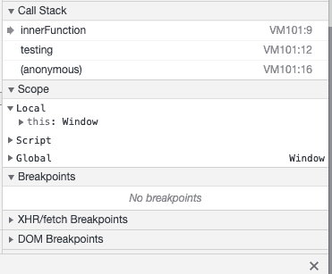
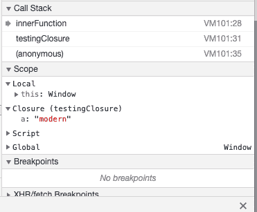

# 寻求一些结束

> 原文：<https://dev.to/moremooredesign/seeking-some-closure-392m>

### 简介

为了更好地理解函数在 Javascript 中的工作方式，我回顾了闭包的概念，以及它在组织代码时的强大功能。我不会在这里讨论 closure，但是你可以从 Mozilla [这里](https://developer.mozilla.org/en-US/docs/Web/JavaScript/Closures)阅读更多内容。我处理的具体问题涉及访问内部函数中的闭包变量。

### 看不到血淋淋的 A、B、C 或 D

在 Chrome 中使用范围调试面板之前，我从未遇到过这种情况。在嵌套函数中，我试图确定函数调用赋予变量的值。该场景的简化版本如下:

```
function testing() {

    var a = "modern";
    var b = "major";
    var c = "general";

    function innerFunction() {
        console.log(`Not using parent function var`);
    }

    innerFunction();

}; 
```

如果您要运行函数`testing()`，您将会看到，如果在`innerFunction()`中放置一个断点，那么变量`a,b or c`没有任何符号。

[](https://res.cloudinary.com/practicaldev/image/fetch/s--S7gyLb1K--/c_limit%2Cf_auto%2Cfl_progressive%2Cq_auto%2Cw_880/https://thepracticaldev.s3.amazonaws.com/i/667dr8tvk5r1rqp5wcd8.png)

### 我看不见你

我发现，外部函数中引用的值在内部函数中是不可见的，除非它们被实际使用。对上面的示例进行一行更改会导致以下结果:

```
function testingClosure() {

    var a = "modern";
    var b = "major";
    var c = "general";

    function innerFunction() {
        console.log(`Using parent function var, value: ${a}`)
    }

    innerFunction();

}; 
```

外部的`testingClosure()`函数变量现在可以在`innerFunction()`内部用于调试。

[](https://res.cloudinary.com/practicaldev/image/fetch/s--3AXQg7R---/c_limit%2Cf_auto%2Cfl_progressive%2Cq_auto%2Cw_880/https://thepracticaldev.s3.amazonaws.com/i/0l8h58smbjq42gzprjzd.png)

我原本想在不写任何代码的情况下检查内部函数中`a`的值，但是由于浏览器调试的工作方式，没有其他办法。

### 码笔

您可以在这里试验闭包:

[https://codepen.io/moremooredesign/embed/vMdVzm?height=600&default-tab=js&embed-version=2](https://codepen.io/moremooredesign/embed/vMdVzm?height=600&default-tab=js&embed-version=2)

尝试在内部函数中放置一个`debugger`语句，看看`scope`的区别。