# 用于跨浏览器测试的 Selenium 网格设置教程

> 原文：<https://dev.to/lambdatest/selenium-grid-setup-tutorial-for-cross-browser-testing-2929>

当手动执行跨浏览器测试时，您在验证阶段可能遇到的一个障碍是跨不同操作系统/设备/浏览器测试您的 web 应用程序/web 产品的功能，这就是相对于时间的测试覆盖率。随着市场上数千种浏览器的出现，验证跨浏览器兼容性的自动化测试已经成为一种必然。

提到自动化，考虑到我们对开源软件的热爱，难免会对一个最著名的测试自动化框架“Selenium”视而不见。我们在之前的博客中已经介绍了使用 [Selenium WebDriver 进行跨浏览器测试的自动化测试，我们讨论了 Selenium 的不同变体，如 IDE、RC、WebDriver 等，并运行了我们的第一个自动化脚本。](https://goo.gl/v9SjYS)

在那篇文章中，我们强调了使用本地 Selenium WebDriver 的局限性。使用“本地 Selenium WebDriver”，您可以“仅”在机器上安装的浏览器上执行[浏览器兼容性测试](https://goo.gl/yZDxii)(在此执行测试)，即您的测试工作仅限于(设备+操作系统+浏览器)的特定组合。

用 Selenium WebDriver 的“本地”版本验证您的 web 应用程序/web 产品不是一种可扩展的方法。您在这种设置中遇到的一些问题是:

*   如何验证机器上未安装的平台/操作系统的功能？也就是说，即使它是双引导机器，你仍然会有问题。
*   如何在不同版本的浏览器上进行[自动化跨浏览器测试](https://goo.gl/aZ33bv)？例如，您的机器可以安装 Firefox 64.0 版，但您希望在 Firefox 36.0 版上执行测试。
*   如何在多个浏览器上对一个网站进行跨浏览器测试？例如，您的机器可能没有安装 Opera，但出于测试目的，您需要安装这些浏览器(不必要的磁盘空间消耗)。
*   在本地机器上执行测试时，如何获得最佳性能，即并行化？

虽然本地 Selenium WebDriver 是小规模测试的理想选择，但是在设置了一个' **Selenium Grid** '之后，可以获得必要的“可伸缩性”和“性能”。

本文是 Selenium Grid 教程，在这里您将认识到 web 开发人员和软件测试人员如何利用 Selenium Grid 设置来执行自动化的跨浏览器测试。我将用一个示例场景向您演示。

我们将利用以下语言、框架和工具(IDE)来[编写更好的自动化代码](https://goo.gl/WGe1SK)。

*   **编程语言**–Python([下载链接](https://www.python.org/downloads/)
*   **测试框架**–pytest
*   **Web 应用框架**–Selenium
*   **集成开发环境**–Eclipse 4.90 版本([下载链接](https://www.eclipse.org/downloads/))、py charm–社区版([下载链接](https://www.jetbrains.com/pycharm/download/)

## 硒格是什么？

Selenium Grid 是一个测试工具(它是 Selenium 套件的一部分),基于“客户机-服务器”架构。在 Selenium 网格术语中，客户机被称为“中心”,服务器被称为“节点”。

Selenium Grid setup 允许您在各种不同的机器上跨不同的浏览器(以及不同版本的浏览器)和不同的操作系统执行跨浏览器测试。因此，它为您的测试执行环境带来了所需数量的“并行性”和“分布”。

Selenium 网格设置只能有一个 Hub 和“n”个节点。“中枢机器”的主要工作是分发提供给“节点机器”的测试用例，该测试用例与执行测试用例所需的能力/要求相匹配，以便[执行跨浏览器测试](https://goo.gl/sqWDTv)。我们将在后面的章节中讨论更多关于 Hub &节点(这是设置 Selenium 网格基础设施的核心组件)的内容。

Selenium Grid 有两个版本，即 Selenium Grid 2.0 和 Selenium Grid 1.0。Selenium Grid 2.0 在自动化测试人员中最受欢迎，因为它支持 Selenium RC(远程控制)和 Selenium WebDriver 脚本。

## 为什么 Selenium Grid 设置是一个明智的选择？

Selenium 网格设置有许多好处。这里，我们来看看 Selenium Grid 设置的一些主要优势，它是执行跨浏览器测试的测试执行策略的一部分。

*   **减少执行时间**–Selenium Grid 设置可用于在不同的浏览器(和浏览器版本)和操作系统上执行多个测试用例。您还可以运行 Selenium RC 的多个实例以及测试配置组合。由于测试是“并行”执行的(分散在不同的机器上)，跨浏览器测试所消耗的总时间显著减少。
*   **可扩展的&可维护的**–正如我们所知，Selenium Grid 设置大大减少了“并行测试”所需的时间，整个解决方案具有高度的可扩展性。如果您想在一个“新节点”(可能是操作系统/浏览器)上执行测试，只需要对代码进行一些小的调整，就可以添加功能了，您的新节点解决方案已经准备好了。
*   **执行多组合测试**——使用 Selenium Grid setup 的 Hub &节点特性，您可以对您的源代码执行多操作系统、多浏览器和多设备验证。

默认情况下，Selenium Grid 设置后的执行本质上不是并行的。为了利用并行性的优势，selenium 测试的编写方式应该考虑到跨浏览器测试的“并行执行”。

***嘿，你在为[网络加密检查浏览器兼容性吗](https://www.lambdatest.com/web-technologies/cryptography?utm_source=devto&utm_medium=organic&utm_campaign=jun29_rn&utm_term=rn&utm_content=web_technologies)，加密模块是一个简单的 JavaScript 库，用于执行基本的加密操作。***

## Selenium 网格设置的主要组件&简要看一下 RemoteWebDriver 工作流

在我们之前关于[Selenium web driver for cross browser testing](https://goo.gl/WRTi4o)教程的文章中，核心焦点是“Selenium for local testing”，您会注意到为了执行测试，必须使用本地 web driver API/接口。如果您想使用 Selenium WebDriver 在单独的机器上执行测试，您必须使用远程 WebDriver 接口。由于测试(在正常情况下)必须在不同的机器上执行， **RemoteWebDriver** 基于传统的“客户机-服务器”模型。RemoteWebDriver 由两个主要部分组成——**Hub(服务器)**和 **Node(客户端)**。让我们在这一节中详细地看一下同样的情况。

**集线器/服务器**–集线器是“Selenium 网格架构”的核心组件。它加载必须执行的测试。在 Selenium 网格基础设施的设置中，只能有一个“Hub”充当“Master”。一旦中枢接收到需要执行的输入/测试用例，它就搜索与**期望的能力**相匹配的节点(客户端),并将“测试执行请求”转移到匹配的节点。

例如，如果您设置了一个带有(hub +两个节点)的 Selenium 网格，其中节点配置如下:

*   节点 1–Windows 10，Chrome 73.0
*   节点 2–Windows 10，火狐 64.0

如果有一个测试用例具有“期望的功能需求”(Windows 10 + Chrome)，hub 首先接收对该需求的请求。通过查看需求，它将执行请求转移到节点 1。
[T3】](https://goo.gl/8nZZMM)

**节点**–节点是执行测试的机器。节点可以具有与集线器不同的配置。可以连接到集线器的节点数量没有限制。因为测试代码将在节点上执行；建议您选择具有最佳配置的机器，这样您就可以从 Selenium 网格设置中获得最佳性能。

硒网格设置的简单表示 [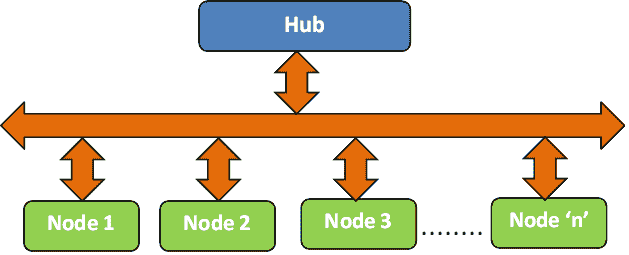](https://res.cloudinary.com/practicaldev/image/fetch/s--PpPA6Dfl--/c_limit%2Cf_auto%2Cfl_progressive%2Cq_auto%2Cw_880/https://www.lambdatest.com/blog/wp-content/uploads/2019/02/Selenium-Grid-Representation.png)

## 安装&配置设置一个硒网格

【**注意**——我们的开发环境安装在 Windows 10 机器上。为了演示，Hub &节点被安装在同一台机器上。]

**步骤 1**–为了设置 Selenium 网格基础设施，您需要首先从 Selenium 的官方网站下载 Selenium Server jar。它以前被称为“Selenium RC 服务器”。这里的下载链接是。

一旦下载了 selenium 服务器 jar 文件，您应该使用以下命令配置 hub(Java-jar selenium-server-standalone-x . x . x . jar-role hub)

```
java -jar selenium-server-standalone-3.9.1.jar -role hub 
```

Enter fullscreen mode Exit fullscreen mode

**步骤 2**–默认情况下，集线器将使用端口 4444。可以使用配置选项–port 来更改端口。下面是执行上述命令后观察到的日志截图。
T3[T5](https://res.cloudinary.com/practicaldev/image/fetch/s--3S_fRKfy--/c_limit%2Cf_auto%2Cfl_progressive%2Cq_auto%2Cw_880/https://www.lambdatest.com/blog/wp-content/uploads/2019/02/1_Selenium-Grid-Hub-Screenshot.png)

为了验证集线器的配置是否正确，请打开浏览器窗口，并在地址栏中键入以下内容:

[http://107.108.86.20:4444/wd/hub](http://107.108.86.20:4444/wd/hub)

以下是在 Firefox 浏览器中打开上述 URL 时的输出快照:

[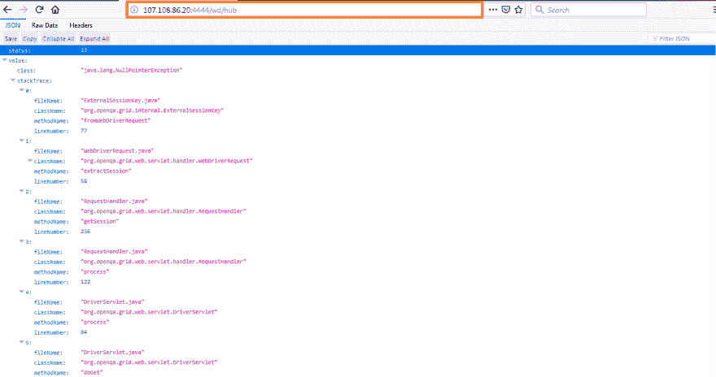](https://res.cloudinary.com/practicaldev/image/fetch/s--ci5RCCMj--/c_limit%2Cf_auto%2Cfl_progressive%2Cq_auto%2Cw_880/https://www.lambdatest.com/blog/wp-content/uploads/2019/02/1.1-Selenium-Server-Output-1.png)

**步骤 3**–既然“中枢”已经启动&运行，现在您必须配置节点以进行跨浏览器测试。在终端上执行以下命令:

```
java -jar selenium-server-standalone-3.9.1.jar -role node -hub http://\<IP-Address\>/grid/register/ -browser "browserName=firefox,maxinstance=1,platform=WINDOWS" –port \<port-number\> 
```

Enter fullscreen mode Exit fullscreen mode

在我们的例子中，集线器配置在端口号 4444 上，节点配置在端口号 5555 和 5556 上。一个节点配置为 Windows 平台和 Firefox 浏览器。第二个节点配置为 Windows 平台和 Chrome 浏览器。

```
java -jar selenium-server-standalone-3.9.1.jar -role node -hub http://107.108.86.20:4444/grid/register/ -browser "browserName=firefox,maxinstance=1,platform=WINDOWS" -port 5555 
```

Enter fullscreen mode Exit fullscreen mode

该命令的输出如下所示。

[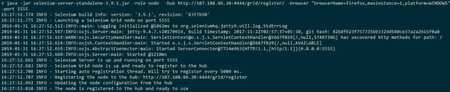](https://res.cloudinary.com/practicaldev/image/fetch/s--3UWvIuY7--/c_limit%2Cf_auto%2Cfl_progressive%2Cq_auto%2Cw_880/https://www.lambdatest.com/blog/wp-content/uploads/2019/02/1-Selenium-Node-Output_1.png)

要验证节点配置是否正确，请在地址栏中输入以下内容。

`http://localhost:4444/grid/console?config=true&configDebug=true#`

[](https://res.cloudinary.com/practicaldev/image/fetch/s--NyapRaTz--/c_limit%2Cf_auto%2Cfl_progressive%2Cq_auto%2Cw_880/https://www.lambdatest.com/blog/wp-content/uploads/2019/02/2_Selenium-Grid-Hub-Output-Screenshot.png)

要配置端口号为 5556 的节点(操作系统为 Windows，浏览器为 Chrome)，请在终端上执行以下命令:

```
java -jar selenium-server-standalone-3.9.1.jar -role node -hub http://107.108.86.20:4444/grid/register/ -port 5556 -browser "browserName=chrome,maxinstance=1,platform=WINDOWS" 
```

Enter fullscreen mode Exit fullscreen mode

现在，当你访问[http://localhost:4444/grid/console？在地址栏上，您还会看到关于端口 5556 的详细信息。
T3](http://localhost:4444/grid/console?config=true&configDebug=true#)[T5](https://res.cloudinary.com/practicaldev/image/fetch/s--k6Xl3f9h--/c_limit%2Cf_auto%2Cfl_progressive%2Cq_auto%2Cw_880/https://www.lambdatest.com/blog/wp-content/uploads/2019/02/1-Selenium-Node-Browser-Output_2.png)

如果您计划使用 Internet Explorer 浏览器，您只需要将正确的浏览器名称作为输入参数传递给 jar 文件。以下是您可以用来使用 Internet Explorer 浏览器的命令:

```
java -jar selenium-server-standalone-3.9.1.jar -role node -hub http://107.108.86.20:4444/grid/register/ -port 5556 -browser "browserName=internet explorer,maxinstance=1,platform=WINDOWS" 
```

Enter fullscreen mode Exit fullscreen mode

如果需要，除了 browserName 之外，您可能还需要其他参数:

| 配置选项 | 说明 |
| --- | --- |
| 港口 | 配置节点将连接到的端口号。使用–port 选项配置。 |
| mapinstance | 用于限制代码中浏览器初始化的最大数量。如果您希望在节点 5555 上最多有 3 个 Firefox 实例，您可以使用选项-浏览器“browserName=firefox，maxinstance=3，platform = WINDOWS”-端口 5555 进行配置 |
| maxSession | 配置可以在节点上并行运行的浏览器实例的数量。一旦达到 maxSession 限制，请求就会自动排队。为了限制端口 5555 上的 Firefox 会话数量，您可以使用以下选项 |
| -浏览器" browserName=firefox，maxinstance=1，platform = WINDOWS "-max session 3-端口 5555 |  |

## 在 Selenium 网格设置中使用 Pytest

现在您已经了解了 Selenium Grid，让我们来看一个例子，在这个例子中，我们将 pytest 用于 Selenium Grid 设置(或者远程 WebDriver 接口)。我们有一篇关于使用 pytest 和 Selenium WebDriver 接口的[测试自动化的详细文章，其中我们解释了 pytest、Selenium with pytest、Pytest 中的 fixtures 等的安装。](https://goo.gl/nMFoZy)

出于演示的目的，集线器(服务器)和节点(客户机)配置在同一台机器上。在配置远程 web 驱动程序时，我们将使用机器 IP 地址。让我们使用各自的命令来配置 Hub & Nodes，以便进行自动化的跨浏览器测试。

***嘿，你在检查浏览器对[的兼容性吗？createImageBitmap](https://www.lambdatest.com/web-technologies/createimagebitmap?utm_source=devto&utm_medium=organic&utm_campaign=jun29_rn&utm_term=rn&utm_content=web_technologies) ，createImageBitmap 是一个小的、轻量级的位图图像创建器，支持调整大小和调整图像质量。***

### 为您的 Selenium 网格设置中心

请使用“cd”命令转到 Selenium 服务器 jar 文件所在的目录(在我们的例子中，我们使用的是版本 3.9.1，jar 文件名是 Selenium-Server-standalone-3 . 9 . 1 . jar)。通过在终端上执行以下命令来启动集线器:

`java -jar selenium-server-standalone-3.9.1.jar -role hub`

如前所述，默认情况下，集线器将从端口 4444 开始。“节点”可以使用链接 **http://:/wd/hub** 连接到“集线器”。在我们的例子中，集线器/服务器配置在一台 IP 地址为“107.108.86.20”的机器上，其配置端口为 4444。因此，节点需要使用链路**[【http://107.108.86.20:4444/wd/hub】](http://107.108.86.20:4444/wd/hub)**，以便将它们的请求转移到配置好的集线器。

### 为 Selenium 网格设置节点

既然 Hub 已经配置好了，设置 Selenium Grid 的下一步就是节点。我们将配置具有以下要求的两个节点。

*   **节点 1**–端口 5555，Firefox，maxinstance = 1，平台= Windows
*   **节点 2**–端口 5556，Chrome，maxinstance = 1，platform = Windows

在终端上，执行以下命令来配置两个节点:

**节点 1** 的配置

```
java -jar selenium-server-standalone-3.9.1.jar -role node -hub http://107.108.86.20:4444/grid/register/ -browser "browserName=firefox,maxinstance=1,platform=WINDOWS" -port 5555 
```

Enter fullscreen mode Exit fullscreen mode

**节点 2** 的配置

```
java -jar selenium-server-standalone-3.9.1.jar -role node -hub http://107.108.86.20:4444/grid/register/ -browser "browserName=chrome,maxinstance=1,platform=WINDOWS" -port 5556 
```

Enter fullscreen mode Exit fullscreen mode

您可以访问以验证节点配置是否正确。下面是显示节点状态的屏幕截图。

[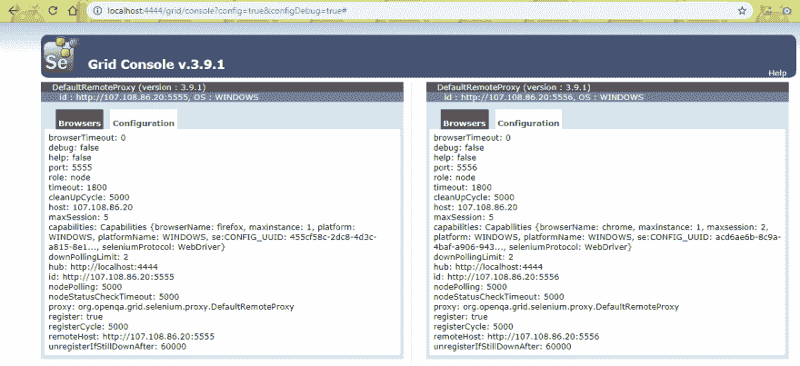](https://res.cloudinary.com/practicaldev/image/fetch/s--4WFm_WWB--/c_limit%2Cf_auto%2Cfl_progressive%2Cq_auto%2Cw_880/https://www.lambdatest.com/blog/wp-content/uploads/2019/02/Selenium-Hub-Node-Setup-Example.png)

我们计划实现的最终目标是将请求从节点转移到中心，调用“所需的浏览器实例”，打开输入到浏览器的网页并终止浏览器会话，即清理分配的资源。

由于我们使用 pytest 进行开发，我们建议您从[这里](https://www.jetbrains.com/pycharm/download/)下载 PyCharm(社区版)。

**command _ executor**–关于集线器的信息，即配置集线器的地址。如果集线器配置不正确，即使用了错误的 IP 地址/错误的端口，您可能会在进行节点注册时收到错误“无法注册节点”。

[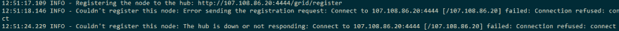](https://res.cloudinary.com/practicaldev/image/fetch/s--ZxO4SZ6r--/c_limit%2Cf_auto%2Cfl_progressive%2Cq_auto%2Cw_880/https://www.lambdatest.com/blog/wp-content/uploads/2019/02/Pytest-Selenium-Grid-Error-Hub-Node.png)

**desired _ capabilities**–所需的功能/需求通过远程 WebDriver 传递。基于作为 desired_capabilities 的一部分输入的细节，选择“最佳匹配”节点来执行。

[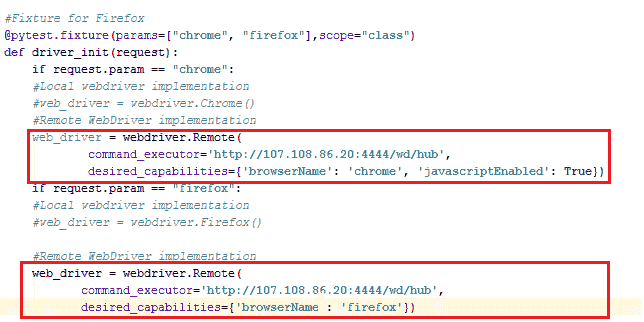](https://res.cloudinary.com/practicaldev/image/fetch/s--QvL6i80e--/c_limit%2Cf_auto%2Cfl_progressive%2Cq_auto%2Cw_880/https://www.lambdatest.com/blog/wp-content/uploads/2019/02/Selenium-Browser-Invocation-Example.png)

第一个测试用例必须在具有“Chrome 浏览器”的节点上执行，第二个测试用例需要在具有“Firefox 浏览器”的节点上执行。您可以看看我们如何通过配置 WebDriver 在远程机器(即匹配节点)上执行请求，将“本地 WebDriver”实现修改为“远程 WebDriver”实现。完整的实现如下:

```
#FileName - test_selenium_grid_firefox_chrome.py

# Import the 'modules' that are required for execution

import pytest
#import pytest_html
from selenium import webdriver
from selenium.webdriver.chrome.options import Options
from selenium.webdriver.common.keys import Keys
from time import sleep

#Fixture for Firefox
@pytest.fixture(params=["chrome", "firefox"],scope="class")
def driver_init(request):
    if request.param == "chrome":
    #Local webdriver implementation
    #web_driver = webdriver.Chrome()
    #Remote WebDriver implementation
    web_driver = webdriver.Remote(
            command_executor='http://107.108.86.20:4444/wd/hub',
            desired_capabilities={'browserName': 'chrome', 'javascriptEnabled': True})
    if request.param == "firefox":
 #Local webdriver implementation
    #web_driver = webdriver.Firefox()

    #Remote WebDriver implementation
    web_driver = webdriver.Remote(
           command_executor='http://107.108.86.20:4444/wd/hub',
           desired_capabilities={'browserName': 'firefox'})
    request.cls.driver = web_driver
    yield
    web_driver.close()

@pytest.mark.usefixtures("driver_init")
class BasicTest:
    pass
class Test_URL(BasicTest):
        def test_open_url(self):
            self.driver.get("https://www.lambdatest.com/")
            print(self.driver.title)

            sleep(5) 
```

Enter fullscreen mode Exit fullscreen mode

剩余的实现保持不变，因为唯一改变的是使用远程 WebDriver 接口。有关上述实现的更多信息(包括 fixtures、classes 等)。在 pytest)中，请参考我们之前的文章[这里](https://www.lambdatest.com/blog/test-automation-using-pytest-and-selenium-webdriver/)。

要执行代码，请在本地终端(或 PyCharm 上的终端)上使用命令。

```
py.test --verbose --capture=no test\_selenium\_grid\_firefox\_chrome.py 
```

Enter fullscreen mode Exit fullscreen mode

一旦中心接收到执行“测试用例 1”的请求，该请求将被转移到节点 2(配置了 Chrome 浏览器)和执行“测试用例 2”的请求，该请求将被转移到节点 1(配置了 Firefox 浏览器)。输出如下所示。

[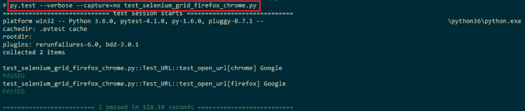](https://res.cloudinary.com/practicaldev/image/fetch/s--Kw1utbs6--/c_limit%2Cf_auto%2Cfl_progressive%2Cq_auto%2Cw_880/https://www.lambdatest.com/blog/wp-content/uploads/2019/02/Pytest-Selenium-Grid-Output.png)

## LambdaTest——跨浏览器测试云

当您必须在不同机器上执行大量测试用例时，Selenium Grid 设置非常有用。为了获得最好的 Selenium Grid 设置和自动化测试，您可能需要在不同操作系统的机器上安装不同类型(和版本)的浏览器。建立这样一个基础设施将涉及大量的成本和大量的精力来维护它。

在这种情况下，团队可以利用 [LambdaTest](https://goo.gl/qP5cHB) ，这是一个可扩展的基于云的跨浏览器测试平台，可以对安装在不同机器&设备(手机、平板电脑等)上的 2000 多个浏览器(不同版本)进行测试。).使用 LambdaTest 提供的 Selenium grid 设置的好处是，您可以大大减少构建&的执行时间。

## 在 Lambdatest 上移植 Selenium 网格设置的现有 RemoteWebDriver 接口

首先，您需要在 Lambdatest 上创建一个帐户。登录您的帐户后，请访问[https://automation.lambdatest.com/](https://goo.gl/pktodp)进入“自动化”选项卡

[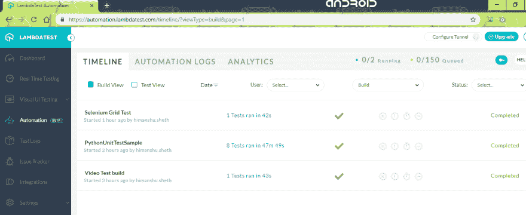](https://res.cloudinary.com/practicaldev/image/fetch/s--Ri9lbmgM--/c_limit%2Cf_auto%2Cfl_progressive%2Cq_auto%2Cw_880/https://www.lambdatest.com/blog/wp-content/uploads/2019/02/LT-Automation-Tab.png)

在您开始自动化测试之前，您可能需要设置执行所需的能力。在我们之前使用的例子中，测试必须在浏览器为 Firefox & Chrome 的 Windows 10 机器上执行。我们使用 Lambdatest 上的“功能生成器”生成所需的功能。下面显示的是使用生成器创建的功能，其中 platform = Windows 10，BrowserName = Firefox。

[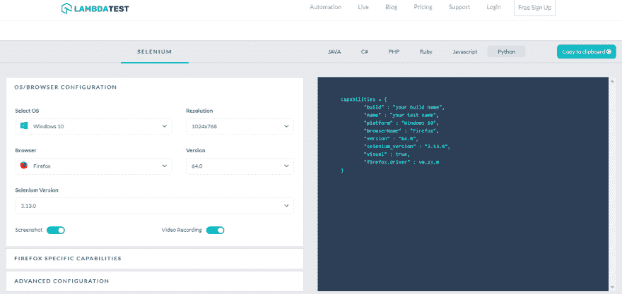](https://res.cloudinary.com/practicaldev/image/fetch/s--F8t-spEI--/c_limit%2Cf_auto%2Cfl_progressive%2Cq_auto%2Cw_880/https://www.lambdatest.com/blog/wp-content/uploads/2019/02/LT-Capabilities-Generator-Firefox.png)

**使用能力生成器生成的能力**

```
capabilities = {
        "build" : "your build name",
        "name" : "your test name",
        "platform" : "Windows 10",
        "browserName" : "Firefox",
        "version" : "64.0",
        "selenium_version" : "3.13.0",
           "firefox.driver" : v0.23.0
    } 
```

Enter fullscreen mode Exit fullscreen mode

让我们仔细看看为设置所需功能而提供的各种参数:

| 参数 | 描述 | 例子 |
| --- | --- | --- |
| 建设 | 可以用来识别组建的组建名称 | sel-grid-windows 上的 firefox |
| 名字 | 测试名称，用于识别正在执行的测试 | 硒-网格-测试-使用-火狐 |
| 平台 | 您打算在其上执行测试的平台/操作系统 | Windows 10，Windows 8.1，MacOS 等。 |
| BrowserName | 将在其上执行自动化测试的浏览器 | 火狐、Chrome、微软 Edge 等。 |
| 版本 | 将执行测试的特定浏览器版本 | 火狐 64.0 版，Chrome 版等。 |
| 硒 _ 版本 | 将用于测试的硒的版本 | 3.13.0 |
| 火狐驱动程序 | Firefox 的远程 web 驱动程序版本 | Two point four two |

值得注意的是，上面提到的一些功能参数是可选的，例如，如果您仅指定**平台**为 Windows 10，而**浏览器名称**为 Firefox，那么测试将在一个具有“ **Firefox on Windows 10** ”的节点上执行(不管该机器上的 Firefox 版本如何)。

在我们的例子中，我们声明从 LambdaTest 能力生成器获得的能力，如下所示:

```
#Set capabilities for testing on Chrome
ch_caps = {
    "build" : "Sel-Grid-Chrome",
    "name" : "Testing on Chrome using Selenium Grid",
    "platform" : "Windows 10",
    "browserName" : "Chrome",
    "version" : "71.0",
    "selenium_version" : "3.13.0",
    "chrome.driver" : 2.42
}

#Set capabilities for testing on Firefox
ff_caps = {
    "build" : "Sel-Grid-Firefox",
    "name" : "Testing on Firefox using Selenium Grid",
    "platform" : "Windows 10",
    "browserName" : "Firefox",
    "version" : "64.0",
} 
```

Enter fullscreen mode Exit fullscreen mode

为了执行测试，您必须输入您的凭证——“用户名”和“应用程序密钥”，它们被提供给远程 WebDriver。凭证(必须保密)可以通过访问您的 [LambdaTest 个人资料部分](https://accounts.lambdatest.com/profile)获得。这里，“用户名”是您登录 LambdaTest 的电子邮件地址，“应用密钥”是从外部系统验证您的 LambdaTest 帐户的访问令牌。

如果凭证正确，测试将在远程 URL
上执行

```
/* user_name – userid for login on Lambdatest */
/* app_key – Access token obtained from Lambdatest */

remote_url = "https://" + user_name + ":" + app_key + "@hub.lambdatest.com/wd/hub" 
```

Enter fullscreen mode Exit fullscreen mode

“远程 URL”还包含@hub.lambdatest.com/wd/hub，这是您帐户的 lambdatest 网格 URL。远程 WebDriver API 现在将输入作为“remote_url”和功能(ch_caps/ff_caps ),这些功能是使用 LambdaTest 功能生成器生成的。除了这些变化之外，整个实现保持不变(类似于使用“远程 WebDriver 接口而不使用 LambdaTest”的实现)。

[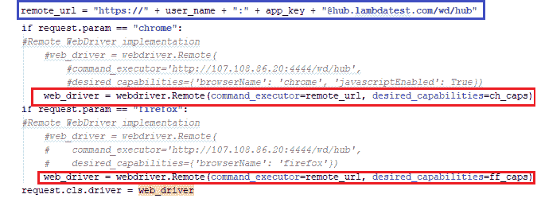](https://res.cloudinary.com/practicaldev/image/fetch/s--B9v30KIG--/c_limit%2Cf_auto%2Cfl_progressive%2Cq_auto%2Cw_880/https://www.lambdatest.com/blog/wp-content/uploads/2019/02/LT-RemoteWebDriver-SeleniumGrid.png)

完整的实现如下(注意——全局变量存储在另一个 Python 文件中，该文件在实现开始时导入)。

```
# Obtain the credentials by visiting https://accounts.lambdatest.com/profile
UserName = "user-name"
AppKey = "access-token" 
```

Enter fullscreen mode Exit fullscreen mode

```
# Import the 'modules' that are required for execution

import pytest
#import pytest_html
from selenium import webdriver
from selenium.webdriver.chrome.options import Options
from selenium.webdriver.common.keys import Keys
from time import sleep
import urllib3
import warnings

#FileName – test_lam_selenium_grid_firefox_chrome.py

#Global variables are declared in a seperate file
import test_lam_var

#Set capabilities for testing on Chrome
ch_caps = {
    "build" : "Sel-Grid-Chrome",
    "name" : "Testing on Chrome using Selenium Grid",
    "platform" : "Windows 10",
    "browserName" : "Chrome",
    "version" : "71.0",
    "selenium_version" : "3.13.0",
    "chrome.driver" : 2.42
}

#Set capabilities for testing on Firefox
ff_caps = {
    "build" : "Sel-Grid-Firefox",
    "name" : "Testing on Firefox using Selenium Grid",
    "platform" : "Windows 10",
    "browserName" : "Firefox",
    "version" : "64.0",
}

user_name = test_lam_var.UserName
app_key = test_lam_var.AppKey

#Fixture for Firefox
@pytest.fixture(params=["chrome", "firefox"],scope="class")
def driver_init(request):
    urllib3.disable_warnings(urllib3.exceptions.InsecureRequestWarning)
    remote_url = "https://" + user_name + ":" + app_key + "@hub.lambdatest.com/wd/hub"
    if request.param == "chrome":
    #Remote WebDriver implementation
        #web_driver = webdriver.Remote(
            #command_executor='http://107.108.86.20:4444/wd/hub',
            #desired_capabilities={'browserName': 'chrome', 'javascriptEnabled': True})
        web_driver = webdriver.Remote(command_executor=remote_url, desired_capabilities=ch_caps)
    if request.param == "firefox":
    #Remote WebDriver implementation
        #web_driver = webdriver.Remote(
        #    command_executor='http://107.108.86.20:4444/wd/hub',
        #    desired_capabilities={'browserName': 'firefox'})
        web_driver = webdriver.Remote(command_executor=remote_url, desired_capabilities=ff_caps)
    request.cls.driver = web_driver
    yield

    web_driver.close()

@pytest.mark.usefixtures("driver_init")
class BasicTest:
    pass
class Test_URL(BasicTest):
        def test_open_url(self):
            self.driver.get("https://www.lambdatest.com/")
            print(self.driver.title)

            sleep(5) 
```

Enter fullscreen mode Exit fullscreen mode

以下是使用 py.test 命令执行 python 代码时的输出:

[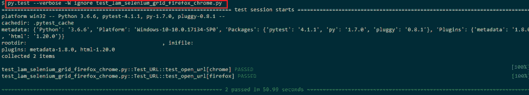](https://res.cloudinary.com/practicaldev/image/fetch/s--J-kzZ2Ij--/c_limit%2Cf_auto%2Cfl_progressive%2Cq_auto%2Cw_880/https://www.lambdatest.com/blog/wp-content/uploads/2019/02/LT-Selenium-Grid_Output-on-console.png)

尽管该命令是在您的机器上触发的，但执行发生在“Lambdatest cloud infrastructure 上的节点”上，该节点与提供给远程 WebDriver API 的功能相匹配。为了检查服务器上的执行状态，您必须导航到 Automation 选项卡，在这里您可以识别使用“build”和“test-name”执行的测试，这是在创建功能时输入的。下面是示例代码在 Lambdatest 服务器上执行时的快照。

[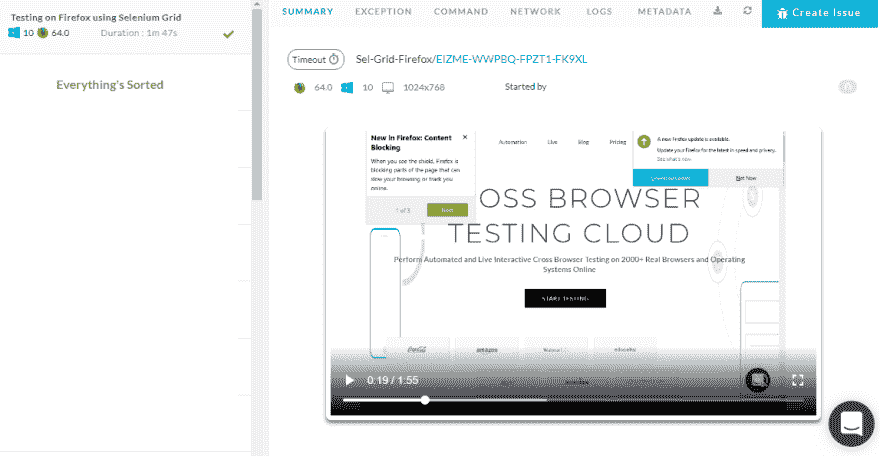](https://res.cloudinary.com/practicaldev/image/fetch/s--B8T3Ob2b--/c_limit%2Cf_auto%2Cfl_progressive%2Cq_auto%2Cw_880/https://www.lambdatest.com/blog/wp-content/uploads/2019/02/LT-Selenium-Grid_Output-on-server.png)

出于分析和调试的目的，您可以查看不同的选项卡，即异常、命令、网络、日志、元数据等。在提到自动化测试细节的地方。

[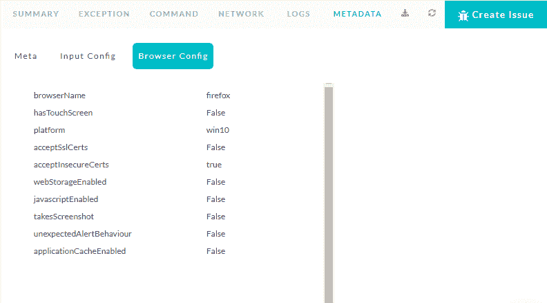](https://res.cloudinary.com/practicaldev/image/fetch/s--h6wO_stH--/c_limit%2Cf_auto%2Cfl_progressive%2Cq_auto%2Cw_880/https://www.lambdatest.com/blog/wp-content/uploads/2019/02/LT-Sample-Output.png)

***嘿，你是不是在为 [Cookie Store API](https://www.lambdatest.com/web-technologies/cookie-store-api?utm_source=devto&utm_medium=organic&utm_campaign=jun29_rn&utm_term=rn&utm_content=web_technologies) 检查浏览器兼容性，这是用 JavaScript 读写 Cookie 的现代替代方式。该 API 可供服务人员使用，允许您在客户机上轻松设置一个 cookie，在服务人员中读回它，然后更新它。***

## 结论

使用 Selenium Grid setup 进行测试有助于加速整个测试执行过程，因为您可以在执行测试时利用并行性。尽管 Selenium 网格设置(没有云基础设施)可以是一种“可伸缩的方法”，但是如果设置了内部基础设施，它的可伸缩性就会受到限制。除了初始设置，维护基础设施也会有“重复支出”。

通过 Lambdatest 利用 Selenium 网格基础设施的设置，您可以加快整个测试过程，因为所有测试都是在 LambdaTest 云上执行的。你可以利用与各种编程语言相关的测试自动化框架，例如 **Python、C#、Ruby、Java、PHP、Javascript** 等。这使得它对开发人员更加友好。就实现而言，将现有代码(使用内部 Selenium 网格设置)移植到 LambdaTest 提供的 Selenium 网格设置非常容易，而且节省大量时间。测试愉快！

[](https://goo.gl/8nZZMM) 

原文出处:[lambdatest.com](https://goo.gl/fMwRrA)

**相关文章**

1.  [使用 JUnit 和 Selenium 对浏览器兼容性进行自动化测试](https://goo.gl/W1BDDj)
2.  [使用 TestNG 加速 Selenium 中的自动化并行测试](https://goo.gl/yTLfZw)
3.  [使用 Selenide、IntelliJ 和 Maven 运行 Selenium 自动化测试](https://goo.gl/4kyUxY)