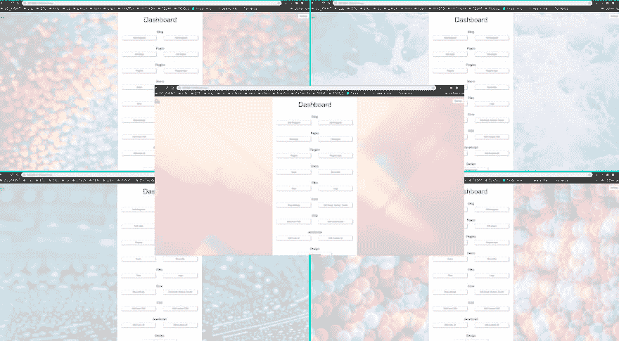
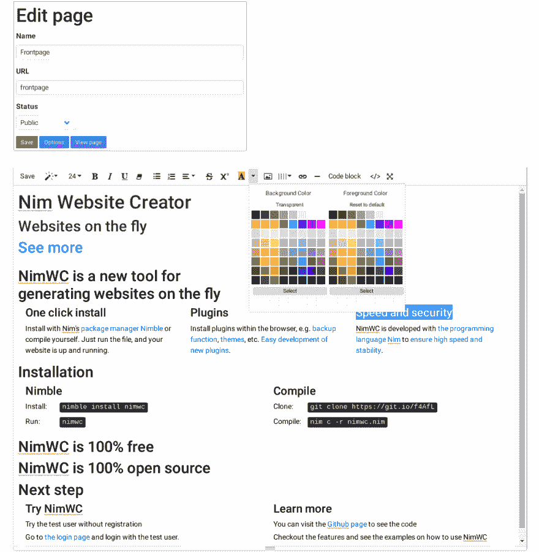
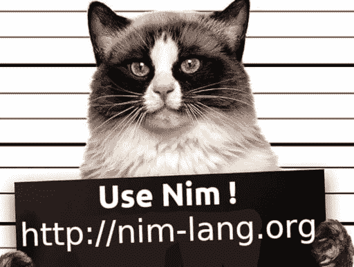
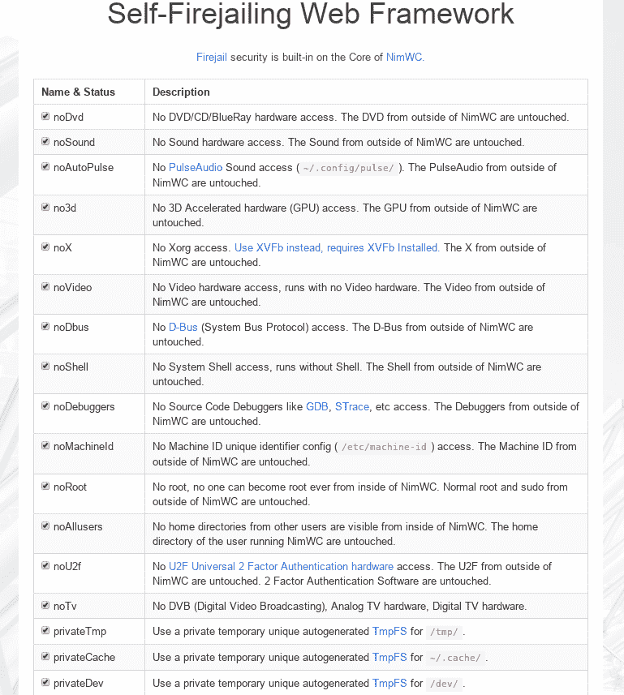
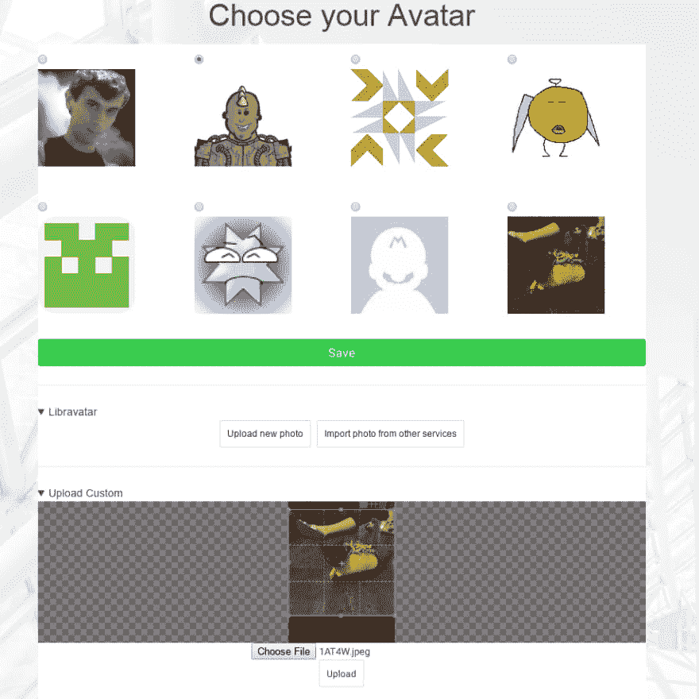
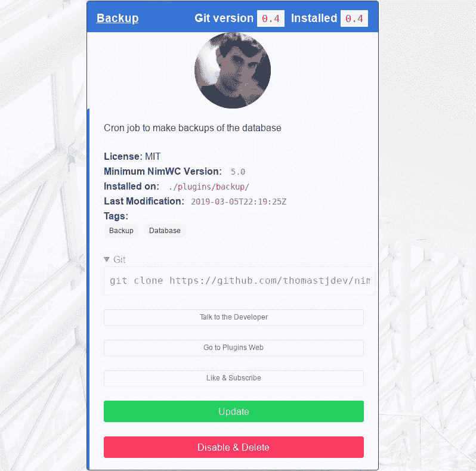

# 自我防火墙 Web 框架

> 原文：<https://dev.to/juancarlospaco/self-firejailing-web-framework-h5l>

[](https://res.cloudinary.com/practicaldev/image/fetch/s--AGbwtaxW--/c_limit%2Cf_auto%2Cfl_progressive%2Cq_auto%2Cw_880/https://raw.githubusercontent.com/ThomasTJdev/nim_websitecreator/master/docs/nimwc_design.jpg)

[](https://res.cloudinary.com/practicaldev/image/fetch/s--iTFsCzb3--/c_limit%2Cf_auto%2Cfl_progressive%2Cq_auto%2Cw_880/https://raw.githubusercontent.com/ThomasTJdev/nim_websitecreator/master/docs/nimwc-editor-summer.png)

# 非正统

从前，一个无聊的开发人员正在寻找新的很酷的 Web 框架，于是冒险开始了...

离起点不远的地方出现了一些非常流行的框架，
他们的主页有非常先进的 CSS 和许多赞助公司，
然后为了评估这些特性，我求助于它的官方文档，
非常惊讶地发现它们中的大多数(如果不是全部的话)倾向于使用基本的纯文本 Auth，
说你必须使用它或者实现你自己的，由你决定。
类似的故事与任何安全手段太，没有一个功能太深刻，
增加新的部分有点胶水代码了，
因为时髦的框架动作太快，他们没有时间。

...我在想，所以他们把所有赞助商的钱都浪费在 CSS 和营销上了？

有时候你只需要停下来，喝点马黛茶或咖啡，
保持一定距离，从远处看风景，然后思考。

我们在 2019 年，我认为应该有可能做得不同，
即使不是那么时髦和潮流，而且我们没有赞助商。

我不太在乎你说你的语言发展有多快，如果它是由不同魔术师的小片段组成的万花筒。

有人说单线程是未来，有人说全局锁是未来，
我们认为你应该能够挤压所有你花钱买的硬件，
现在甚至有 32 个 CPU 核心，树莓派将有 8 个核心，
如果是租来的*云*你实际上也在为 CPU 和 RAM 的使用付费。

# 小丑与野兽

[](https://res.cloudinary.com/practicaldev/image/fetch/s--qgUWwjcE--/c_limit%2Cf_auto%2Cfl_progressive%2Cq_auto%2Cw_880/https://raw.githubusercontent.com/ThomasTJdev/nim_websitecreator/master/docs/nim-bad-cat.png)

回到 GitHub，我们有最好的工具，Nim 编程语言。

1 种用于整个堆栈的语言，后端和前端，
包括[高性能模块](https://github.com/sashkavalent/benchmark_languages_fib/blob/master/README.md)、[脚本、开发操作系统、部署](https://nim-lang.org/docs/nims.html)。
从腹板装配到[装配](https://github.com/juancarlospaco/nim-presentation-slides/blob/master/ejemplos/avanzado/assembly/asm_example.nim)。 [Python 模块](https://github.com/yglukhov/nimpy#nimpy-)和 [JavaScript](https://nim-lang.org/docs/backends.html#backends-the-javascript-target) 。

从一个不起眼的空白文本文件中，新的网络框架诞生了，
Nim 网站创建者它的名字，[灵感来自于以前的经验](https://tonsky.me/blog/disenchantment/)，但没有复制。

在 [Jester](https://github.com/dom96/jester) 和 [Beast](https://github.com/dom96/httpbeast) 、
的基础上，一砖一瓦地构建新框架，我们使用双因素认证(TOTP)，可从 [Nimble](http://nimble.directory) 、
获得，2FA 默认启用，因此您可以立即使用，因为我们是在 2019 年。

ReCaptcha 内置(可选)，BCrypt+Salt 密码，Postgres 或 SQLite，
JavaScript 框架不可知，自动旋转文件记录器，服务器状态页面。
直接从管理员浏览器编辑主配置文件(INI 格式)。

我们在回购上做了一个“DevOps”文件夹，里面有有用的资源。

# 尼姆与火的舞蹈

[](https://res.cloudinary.com/practicaldev/image/fetch/s--cx9_L3x0--/c_limit%2Cf_auto%2Cfl_progressive%2Cq_auto%2Cw_880/https://raw.githubusercontent.com/ThomasTJdev/nim_websitecreator/master/docs/nimwc-firejail0.png)

为了提高安全性，我们在 Linux 内核的土地上跋涉，
我们找到了一个名为 [Firejail](https://firejail.wordpress.com) (纯 C，无依赖性)，
的非常好的工具，然后将它包装在一个库中，上传到 Nimble，将其集成到核心，
最后**框架 Firejail 自己**。

这允许站点管理员控制安全性，
将软件隔离到它应该“看到”服务器运行的最低限度，
它可以在无根、无外壳、无可见文件系统的情况下运行，
并且它还带有硬件级隔离和控制，
管理员可以控制框架可以使用多少 CPU & RAM &内核，
其他较小的功能，如自动重启、高可用性、网络隔离等。

Firejail 是 100%可选的，你可以在没有 Firejail 集成的情况下编译 NimWC。

# 自拍

[](https://res.cloudinary.com/practicaldev/image/fetch/s--wf2LkkWu--/c_limit%2Cf_auto%2Cfl_progressive%2Cq_auto%2Cw_880/https://user-images.githubusercontent.com/1189414/53709326-72ef5180-3e16-11e9-944e-8120d6ab2959.png)

Libra vata 是 [Gravatar](https://gravatar.com) 的开源替代品，也支持 Gravatar，
支持是内置的，插件开发者可以使用它来显示头像。

也可以使用本地自定义上传的图像文件。
使用内置计数器上传和下载私人和公共文件和图像。

[WebP](https://caniuse.com/#feat=webp) 自动图像和照片优化。

WebP 是可选的，没有 WebP 特性也可以编译。

# 丝绸之路

[](https://res.cloudinary.com/practicaldev/image/fetch/s--TJEOcl7o--/c_limit%2Cf_auto%2Cfl_progressive%2Cq_auto%2Cw_880/https://raw.githubusercontent.com/ThomasTJdev/nimwc_plugins/master/nimwc-plugin-store.jpg)

该框架带有一个集成的图形插件库，
因此您可以直接从友好的 UI 从浏览器添加您自己的定制特性和功能，
。一个功能，一次点击。

每个插件都有名称、降价/RST 描述、版本、作者、许可证、标签、
按钮，用于安装/卸载、更新、与开发者对话，甚至作者照片。
您可以安装插件，但也可以禁用插件。

该商店由 Git 支持，所以你可以使用你的 GitHub 或 GitLab，免费或专业。

我们希望开源能够自我维持(你会帮助我们吗？)，
所以有一个字段，你可以把你的比特币或 Patreon 或 LiberaPay 地址，
它将作为一个按钮呈现在插件商店上，
所以如果用户喜欢你的插件，他们可以订阅你！。

[立即将您的插件上传到商店！](https://github.com/ThomasTJdev/nimwc_plugins#plugins-for-nim-website-creator-nimwc)。

# 骷髅大军

NimWC 有一个内置的框架创建器，
插件框架创建器为你创建一个新的插件(空的)，
一些基本的插件信息被写入一个 JSON 文件
(为你的插件在商店上生成一个漂亮的 UI)，
一些文件和文件夹被创建(HTML，CSS，JS，Nim 等)，
文件会有有用的注释和帮助，文档和链接，
它就像一个项目模板或其他语言的 cookiecutter。

做一个插件就是用布尔玛或者 [Bootstrap](https://getbootstrap.com) 或者手工编写香草 HTML、
CSS、
JS 用 [Nim](https://nim-lang.org/docs/backends.html#backends-the-javascript-target) 或者其他语言、
用 Nims 标准库[模板引擎](https://nim-lang.org/docs/filters.html)、
你可以用 [Karax](https://github.com/pragmagic/karax) 或者 React 或者其他语言、
你甚至可以用 Nim 的 [Web Assembly](https://github.com/2vg/nim-wasm-example) 。

您可以查看插件的文档并查看现有的[插件代码](https://github.com/ThomasTJdev/nimwc_plugins#available-plugins)。

创建您的框架，并将您的想法编码到功能中。

# 你好世界

*   因此...如何制作一个 web *Hello World* ？。

```
routes:
  get "/":
    resp "Hello World" 
```

*是的，那是实际有效的尼姆朗码*:)

Nim 编译成微小的单文件无依赖性优化的本机二进制可执行文件。

[更完整的例子。](https://github.com/juancarlospaco/nim-presentation-slides/blob/master/ejemplos/basico/jester/hello_web_3.nim#L38)

# 视频还是没发生

[https://www.youtube.com/embed/3R1l4Ha0tDI](https://www.youtube.com/embed/3R1l4Ha0tDI)

# 现场演示

有一个官方的[公共免费访问实例运行](https://nimwc.org/login)来展示这个框架。

我们增加了一个有限的演示模式，通过编译时标志可选。

# 演示

[Nim 网站创建者演示幻灯片](http://htmlpreview.github.io/?https://raw.githubusercontent.com/ThomasTJdev/nim_websitecreator/master/docs/nimwc-presentation-presentation.html)

# 未来学

大多数问题是功能规划或相关。这只是对 NimWC 的一个窥视。

一些进来的东西是材料设计，更好的用户界面/UX，更多的文档和插件！。

# 社区

[](https://res.cloudinary.com/practicaldev/image/fetch/s--aw1Z2p4v--/c_limit%2Cf_auto%2Cfl_progressive%2Cq_auto%2Cw_880/https://raw.githubusercontent.com/ThomasTJdev/nim_websitecreator/master/docs/gatas.jpg)

有桥段 [Gitter](https://gitter.im/nim-lang/Nim) ， [Matrix](https://matrix.to/#/#freenode_#nim:matrix.org) ，[电报](https://t.me/nim_lang)， [IRC](irc://freenode.net/nim) ，[不和](https://discord.gg/ezDFDw2)给 Nim，过来说*嗨*。

今天学尼姆。
[NimWC 上捷足先登。](https://nimble.directory/pkg/nimwc)
[GitHub 上的 NimWC。](https://github.com/ThomasTJdev/nim_websitecreator#features)
[PyPI 上的 Python 模块](https://pypi.org/project/faster_than_csv/)[100%写在 Nim 上。](https://pypi.org/project/faster_than_walk/)
[尼姆贴纸包。](https://t.me/addstickers/nimlang)
[西班牙语电报集团。](https://t.me/NimArgentina)

我们没有螃蟹，我们没有斜眼鼠，我们有一个友好的社区，
我们有类似 Python 语法的 C 的性能，来 Nim 这边吧...
👑