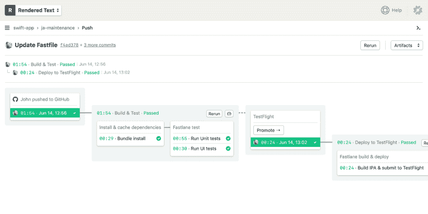

# 信号量宣布 iOS 的 CI/CD

> 原文：<https://dev.to/markoa/semaphore-announces-ci-cd-for-ios-2amj>

信号量刚刚公布了 iOS 的 [CI/CD。多年来，Semaphore 只支持基于 Linux 的构建，移动开发者不得不使用另一种服务来完成他们的项目。现在，云/web 和移动团队都可以统一在一个平台上。](https://semaphoreci.com/product/ios)

您可以定义与您的工作流程相匹配的定制 [CI/CD 管道](https://dev.to/markoa/ci-cd-pipeline-a-gentle-introduction-2n8k)，例如:

最棒的是，构建速度很快，可以自动扩展到每一个`git push`(然后回到零)，而且没有排队时间。

欲了解更多详情，或动手操作 [Xcode 教程](https://docs.semaphoreci.com/article/124-ios-continuous-integration-xcode)。

您目前使用什么来测试和部署 iOS 应用程序？我期待听到您对苹果生态系统 CI/CD 现状的看法，以及可以改进的地方。