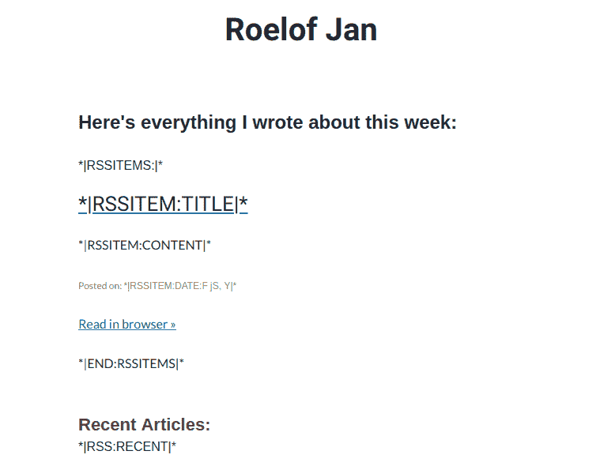
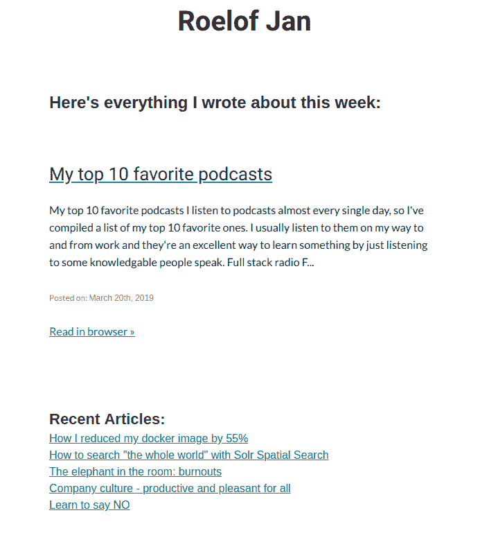

# 面向开发者的 SEO 和个人营销

> 原文：<https://dev.to/roelofjanelsinga/seo-and-personal-marketing-for-developers-5fma>

[](https://res.cloudinary.com/practicaldev/image/fetch/s--wBJx8PXU--/c_limit%2Cf_auto%2Cfl_progressive%2Cq_auto%2Cw_880/https://thepracticaldev.s3.amazonaws.com/i/s9wzexw8rgany6si1q59.png)

# 面向开发者的 SEO 和个人营销

2019 年 1 月，我不再在 Medium 上发布博文，开始在自己的网站上发布。这主要是因为我喜欢拥有自己的内容，并控制它的每个方面。离开媒体意味着我失去了媒体平台的广大受众，所以如果我想让我的帖子被阅读，我必须自己抓住这种注意力。以下是我为此所做的工作。

1.  为谷歌和社交媒体平台设置基本的元标签
2.  为你所有的博客文章创建一个网站地图
3.  注册谷歌搜索控制台和谷歌分析
4.  创建一个 RSS 或 Atom feed，让你的读者订阅你的文章更新
5.  建立一个邮件列表来分享你的博客文章
6.  在社交媒体上分享你的博客文章

## 设置 Google 和社交媒体平台的基本元标签

如果你想让你的内容以最好的方式出现，你必须正确设置你的 meta 标签。这意味着包括谷歌、脸书、推特和其他你可能正在使用或营销的平台的元标签。你可以通过查看页面源代码来找到我使用的标签，但是对于那些使用手机的人来说，这里是我上一篇文章的片段:

```
<meta name="keywords" content="How,I,reduced,my,docker,image,by,55%">
<meta name="description" content="This is where your description goes">
<meta name="author" content="Roelof Jan Elsinga">

<link rel="author" href="https://plus.google.com/u/0/+RoelofJanElsinga"/>

<meta property="og:title" content="How I reduced my docker image by 55% - Roelof Jan Elsinga"/>
<meta property="og:type" content="website"/>
<meta property="og:image" content="https://roelofjanelsinga.cimg/articles/steel_tower.jpeg"/>
<meta property="og:url" content="https://roelofjanelsinga.com/articles/how-i-reduced-my-docker-image-by-55-percent"/>
<meta property="og:description" content="This is where your description goes"/>

<meta name="twitter:card" content="summary_large_image">
<meta name="twitter:url" content="https://roelofjanelsinga.com/articles/how-i-reduced-my-docker-image-by-55-percent">
<meta name="twitter:title" content="How I reduced my docker image by 55% - Roelof Jan Elsinga">
<meta name="twitter:description" content="This is where your description goes">
<meta name="twitter:image" content="https://roelofjanelsinga.cimg/articles/steel_tower.jpeg">

How I reduced my docker image by 55% - Roelof Jan Elsinga 
```

Enter fullscreen mode Exit fullscreen mode

如您所见，您需要的信息类型并不多，只需要找到正确的标记名。

## 为你所有的博客文章创建一个网站地图

你想让谷歌尽可能容易地找到你的博客文章。一个很好的方法是制作一个网站地图并提交给 Google 搜索控制台。在下一节中，我将解释如何做到这一点。你可以在我的网站上找到一个帖子的站点地图的例子，看看我的[站点地图](https://roelofjanelsinga.com/sitemap.xml)，你会发现我所有的博客帖子，包括这篇，都被输入了。

## 注册谷歌搜索控制台和谷歌分析

您在上一节中创建的站点地图需要提交给 Google，所以让我们开始吧。首先，注册 [Google Analytics](https://analytics.google.com) ，将他们提供给你的验证 HTML 文件添加到你的网站上。这个过程的步骤解释的很好，这里就不赘述了。

当你注册了谷歌分析，你应该注册
[谷歌搜索控制台](https://search.google.com/search-console/about)。
Google Analytics 用于跟踪您的页面浏览量和不同的用户行为，而 Google Search Console 允许您向 Google index 提交新页面，它会让您了解人们如何找到您的网站，以及许多其他有助于推广您网站的有用信息。如果你在这个过程中遇到了麻烦，Yoast 的这篇文章可以帮助你[“如何将你的网站添加到谷歌搜索控制台”](https://yoast.com/wordpress/plugins/seo/add-website-google-search-console/)。

## 创建一个 RSS 或 Atom 订阅源，让你的读者订阅你的文章更新

你的读者很可能不会每天都查看你的网站，查看是否有新的博客文章。我关注的许多其他科技博客实际上是通过 RSS 提要让你知道什么时候有新帖子。设置一个可以让你的读者在你发布新帖子时得到通知，这对你来说是免费的营销。如果你想看看这是什么样子的例子(因为我做了，找不到一个好的)，看看我为我的博客设置的[feed。你会看到很多 XML 出现，这是提要。人们可以通过某种 RSS 阅读器订阅这个提要。当你发表一篇新的博客文章时，你应该更新这个订阅源，这样人们就会得到通知。你可以根据自己的需要添加或多或少的信息。](https://roelofjanelsinga.com/feed)

## 建立一个邮件列表来分享你的博客文章

正如我在前面提到的，你的读者不会每天查看你的网站，看看有没有新的帖子。即使你有一个 RSS 提要，人们也可能不想订阅它，或者因为某些原因而无法订阅。通知人们你发布了新内容的另一种方式是给他们发电子邮件。

我通过 MailChimp 做到了这一点。如果你注册了我的邮件列表，你会收到通知(每周最多一次)关于我在过去一周发布的帖子。这些都是自动完成的，因为 MailChimp 可以阅读我的 RSS 提要，并为我生成一份时事通讯。你也可以这样做，你可以这样做:

跟随这篇文章，看看你需要做些什么来在 Mailchimp 中建立一个自动链:[“与 Mailchimp 分享你的博客文章”](https://mailchimp.com/help/share-your-blog-posts-with-mailchimp/)。当您到达需要创建模板的阶段时，您可能会对如何在电子邮件中自动获取文章感到困惑。让我向您展示我自己的电子邮件模板:

[](https://res.cloudinary.com/practicaldev/image/fetch/s--naYryITL--/c_limit%2Cf_auto%2Cfl_progressive%2Cq_auto%2Cw_880/https://thepracticaldev.s3.amazonaws.com/i/wzywv5lmleu6y66itsoa.png)

这看起来有点奇怪，但这些被称为 RSS 合并标签。如果你稍微搜索一下，你可以找到更多。我把这个贴在这里，因为当我设置这个的时候，我不知道该做什么。没有一个很好的例子。

有了这些合并标签后，让 Mailchimp 生成我们将发送给订户的电子邮件的预览:

[](https://res.cloudinary.com/practicaldev/image/fetch/s--odEcuhe2--/c_limit%2Cf_auto%2Cfl_progressive%2Cq_auto%2Cw_880/https://thepracticaldev.s3.amazonaws.com/i/et7bah2fk7kmdoyhbkse.png)

这是 Mailchimp 自动为我们生成的电子邮件。这是我最新的博客文章(在写作的时候),也是那一周唯一的博客文章。如果在过去一周有更多发布的帖子，它将在这封电子邮件中显示所有这些帖子。如您所见， ***|RSS:RECENT|*** 标签已经被替换为指向我最近博客文章的链接。因此，现在我可以通知任何订阅我邮件列表的人任何新的博客帖子，而不必为此做任何事情。

## 在社交媒体上分享您的博客文章

在所有这些自动解决方案之后，仍然有一些手工工作要做。发布帖子后，你应该在社交媒体渠道上分享。如果你真的不喜欢手工工作，总有一些方法可以自动完成，但我更喜欢手工完成。当然，你需要选择你的平台和受众。如果你在脸书有很多朋友，但他们中没有一个人认为阅读你的博客文章有什么好处，也许脸书不是分享你博客文章的合适地方。为此，我只在 Twitter 和 LinkedIn 上分享我的帖子。这是我找到目标受众的地方(我的同行、开发人员、业务人员等。).

但是如果你完全不知道人们是否在不同的社交媒体渠道上阅读你的帖子，那就在那里分享，看看会发生什么。你的网站启用了谷歌分析，所以你可以看到你的访问者来自哪里。也许你会发现一个新的平台，它真的喜欢以这种方式阅读你的帖子！

你觉得我还需要在这篇文章中加入什么步骤吗？在 [Twitter](https://twitter.com/RJElsinga) 上告诉我！关于这个过程，我每天都在学习新的东西，所以任何新的见解都很受欢迎。如果你想在我发布新帖子时得到通知，请订阅我的邮件列表或我的 RSS 订阅源！