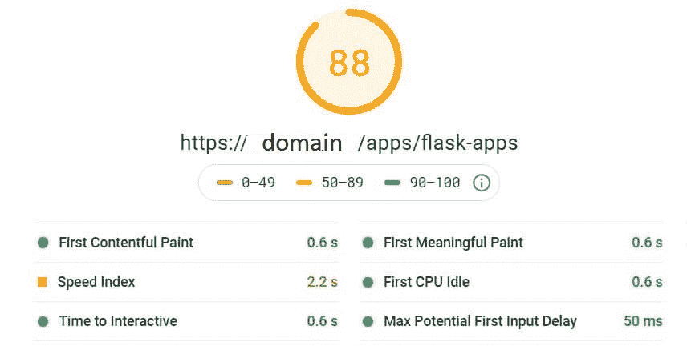
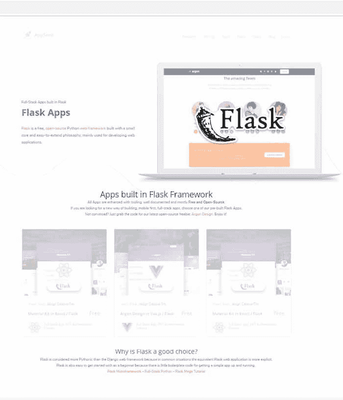
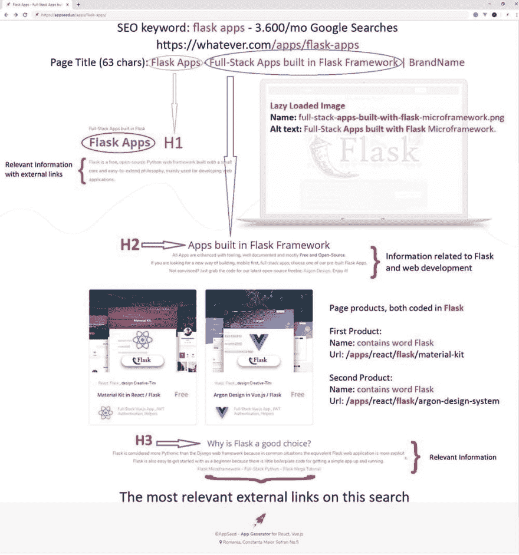

# 来自新手的 Seo 技巧

> 原文：<https://dev.to/sm0ke/seo-tips-from-a-newbie-33d4>

各位编码员好，

我写这篇文章是基于我在我的一个产品的 SEO 优化过程中的经验。正如标题所示，在这个复杂的领域，我是一个完全的新手，我不建议任何人实施这里列出的任何技巧。对我来说，一些提示只是工作，但很难说这是纯粹的运气，还是上帝喜欢搜索引擎优化。应用所有优化后，该页面在 Lighthouse 上的得分为 88，并且在统计数据中没有红色项目符号。**感谢您的阅读！**

### 使命

关键词“烧瓶应用”排名更好，提高页面速度。
第一步:用带有[滑稽名字](http://keywordshitter.com)的免费关键词工具选择关键词。关键词组合和相关分数:

*   烧瓶应用-720/月
*   烧瓶应用-每月 3600->**获胜者**
*   烧瓶样板-590/月
*   全堆叠烧瓶-0/月

### 我的 SEO 实现:

*   在页面 URL:somedomain.com/apps/**flask-apps**中添加了“ **flask apps** ”句子
*   页面标题(63 个字符): **Flask 应用** -内置于 Flask 框架的全栈应用| BrandName
*   页面描述(116 个字符):用 **Flask** 微框架构建的全栈**应用**，微框架是用于开发 web 应用的流行 Python 框架。
*   H1: **烧瓶应用程序**
*   页面 H2: **应用**内置在**烧瓶**框架中
*   佩奇·H3:为什么说**烧瓶**是个好选择？
*   主图名:全栈-**apps**-内置- **烧瓶** -microframework.png
*   主图 alt text:**brand name 提供的用 Flask 微框架构建的全栈 app。**

### 页面链接

我已经包含了谷歌为这次搜索返回的最相关信息的链接:

*   [烧瓶微结构](http://flask.pocoo.org/)
*   [全栈 Python](https://www.fullstackpython.com/flask.html)
*   [烧瓶特大教程](https://blog.miguelgrinberg.com/post/the-flask-mega-tutorial-part-i-hello-world)

### 页面内容:

*   段落与相关信息以及 H1，H2，H3 标签。
*   标题和链接中带有 *Flask* 关键字的相关产品

### 其他 SEO 小技巧，和页面速度有关的，我们都知道 Google 不喜欢慢页面。

*   将关键的 CSS 嵌入到页面中，推迟非关键的 CSS
*   推迟非关键 Javascript 库
*   字体优化——使用字体表面进行初始页面绘制，并预取真正的字体。
*   可访问性-所有图像的描述性替代文本。
*   所有图像的延迟加载——最初的低质量图像由 [pngquant](https://pngquant.org/) 通过命令行提供

### (清理)页面

### 装饰页面

### 资源&灵感:

*   针对 [flask apps](https://appseed.us/apps/flask-apps) 关键字的优化页面
*   非常感谢 Reddit SEO 社区
*   读了很多关于 Moz.com 的书
*   我的[推特](https://twitter.com/Sm0keDev)..< ('_') >..

**谢谢！**