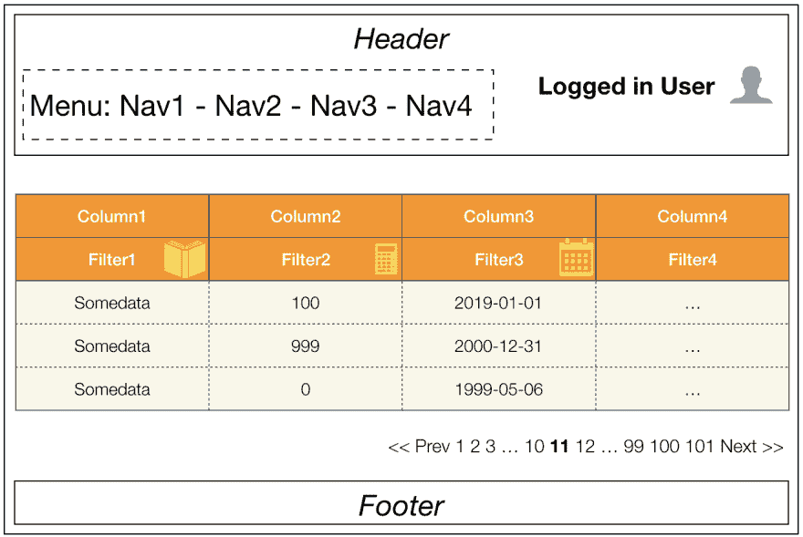
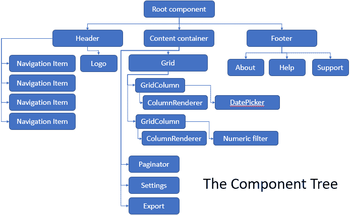
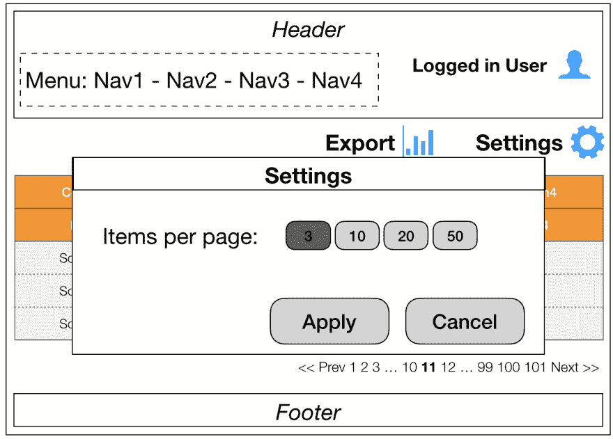
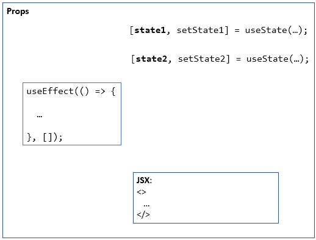
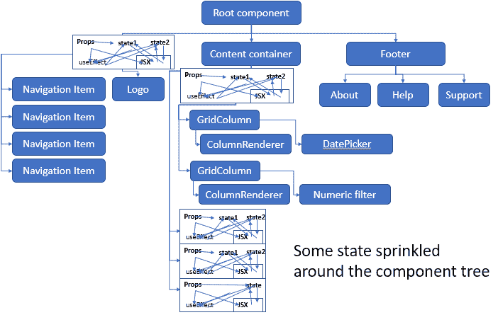
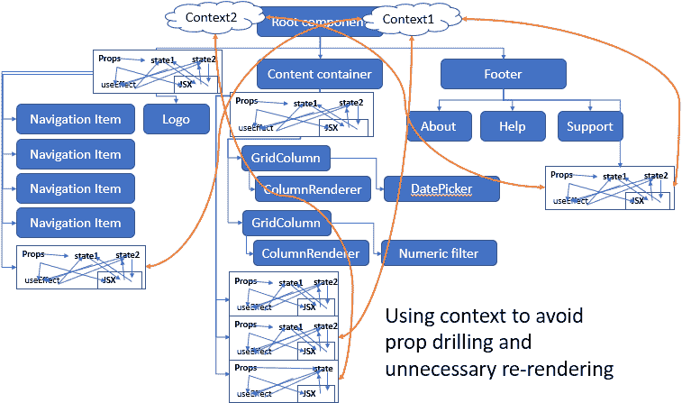
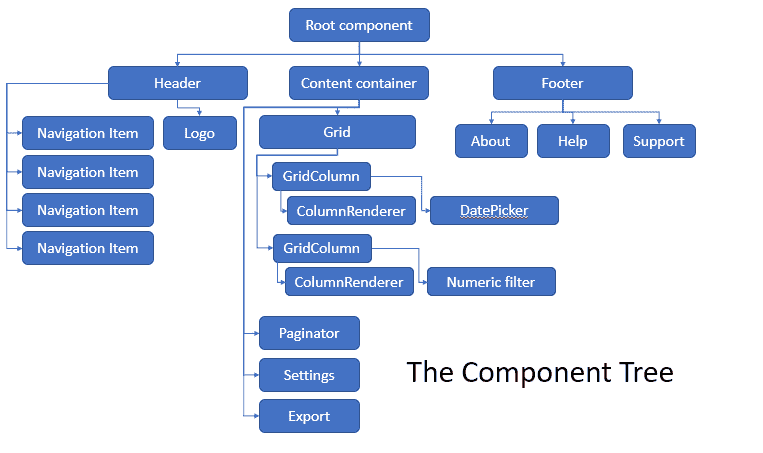

# 说真的，React 钩子会取代状态容器吗？

> 原文：<https://dev.to/yakimych/seriously-do-react-hooks-replace-state-containers-3cpl>

React 社区最近越来越频繁地出现关于 React 挂钩替换状态容器的问题。

> 丹阿布拉莫夫[@丹 _ 阿布拉莫夫](https://dev.to/dan_abramov)[@ NgozikaDanny](https://twitter.com/NgozikaDanny)钩子本身就是编写和重用组件间逻辑的一种替代方式。所以它们并不比类更能“替代”Redux。它们只是编写代码的一种方式。
> 
> 是否需要 Redux 的问题，在我看来与 Hooks 无关。2019 年 4 月 16 日上午 11:1609

然而，这个问题并不是完全不恰当的。 [useReducer](https://reactjs.org/docs/hooks-reference.html#usereducer) 和 [useState](https://reactjs.org/docs/hooks-reference.html#usestate) 处理状态管理部分，而 [useContext](https://reactjs.org/docs/hooks-reference.html#usecontext) 可以帮助其“全局性质”。

此外，流传的许多建议听起来如下:

*   从在组件中放置状态开始。
*   每当有一个状态需要共享时，[提升状态](https://reactjs.org/docs/lifting-state-up.html)。
*   如果道具钻井成为一个问题，把它扔到上下文中，以便于“全局”访问。

有了这个建议，并渴望在实践中测试它，让我们继续构建一个 React 应用程序吧！

来自客户端的初始规范看起来非常简单:一个页面，带有一个页眉(包含一个菜单和一些用户信息)、一个页脚和一个位于主要内容区域的可排序/可分页/可过滤的网格。

看起来真的很简单——按照上面的建议，让我们把网格内容和分页的状态放在网格本身附近。我们还有一些状态来描述网格是按哪一列排序的，以及为每一列选择了哪些过滤值。到目前为止一切顺利！开发速度非常快，我们可以快速迭代我们的解决方案。组件树看起来既漂亮又干净:

在某些时候，我们添加了一个带有设置按钮的工具栏，这将打开一个“设置”对话框，并允许设置每页的项目数。因为这个状态当前在“分页器”组件中，我们不能从“设置”对话框中访问它。没问题，我们**将分页状态提升一级**，并将其传递给“分页器”、网格和设置对话框。

向客户的第一次演示是成功的！我们得到了一些反馈，他们希望**做出一些改进**——他们希望能够将网格内容导出为 PDF，因此我们在工具栏中添加了一个新按钮——它将打开一个确认对话框，其中包含一些关于要导出的总行数的信息，因此让**也从网格中取出这个状态**，并将其传递给两者——网格本身，以及“报告生成”对话框。目前尚可处理，但越来越混乱。是时候记录结构了。带有几个`useState`钩子和一个`useEffect`钩子的有状态组件看起来像这样:

来自`state`和`setState`的箭头往返于`JSX`，因为我们可能会在那里使用和设置状态。同样适用于道具。`useEffect`关闭道具也可以进入状态，所以让我们也添加那些箭头。我们最终得到了许多箭头，但是所有的东西都很好地封装在组件中，所以让我们更新一下我们的组件树形图:

我们的 **UX 团队**发出了一个懈怠的消息——他们已经召集会议，决定将设置图标放在页脚。我们已经做了一些重构，并将状态的“页面大小”部分提升了一次，但现在它将直接出现在根组件中，因为它是需要它的组件的唯一**共同祖先**。道具演练突然变得真实起来，所以看起来是时候**把它扔到`context`** 上，直接从关心它的组件访问它了。这将为我们的组件树结构图增加几个箭头，但是我们实现了它并继续前进。

几个冲刺之后，一封来自客户的**电子邮件在我们的收件箱里发出嘎嘎声——他们已经尝试了我们页面的当前版本，想要一些改变:**

*   应该可以选择将哪些列导出到 PDF 报告中。
*   报告应该考虑视图中选择的过滤器。
*   导出报告的用户的名字应该显示在对话框中(还记得这个信息现在在标题中是本地状态吗？)

在这一点上，我们开始有点讨厌我们的生活——事情变得越来越难以追踪！我们将不得不移动更多的状态块，即从网格中**提升列状态和过滤状态**，从标题到根组件中**提升用户状态**。
我们在项目开始时感到的一些兴奋现在已经消退，进展速度也大大放慢了。但是事情还没有完全失控，不是吗？让我们系好安全带开始工作吧！

我们通过**提升状态**或**将东西放入上下文**来勤奋地遵循配方——这为我们的组件树形图添加了越来越多的箭头。我们发现视图变得缓慢和滞后，所以我们启动了我们的剖析器，并发现我们的组件树的大部分过于频繁地被不必要地重新呈现，所以我们后退一步，分析这种情况，确定视图的哪些部分可以被记忆，并把它们包装在`React.memo`中。在某些情况下，我们得到了直接的改进，但是其他的，然而，似乎没有受到变化的影响，因为一些 lambda 函数被作为道具传递。我们改为借助`useCallback`来解决。这感觉有点像连锁反应:对我们以前问题的解决方案会引起新的问题，对那些问题的解决方案需要更多的解决方案，等等...无论如何，我们发现只要我们深入了解 React 的工作原理，这些问题都是可以解决的，所以抱怨是没有意义的。我们现在已经完成了大部分功能，让我们开始发货吧！

然而，在此之前，我们又收到了一个来自客户的请求，该客户刚刚完成了最新版本的测试，并且发现在页脚处很难找到“设置”图标。因为他们经常使用它，所以他们更喜欢把它放在网格旁边，就像最初的版本一样。嗯（表示踌躇等）...让我们试着回忆一下，我们把这个州放在哪里了...是的，它结束于上下文，因为不久前我们在 UX 团队的一些反馈后把组件拆开了。现在它将靠近网格...那么，我们是否应该将它从上下文中移除，并将其放回靠近组件的本地状态？不，就让它保持原样吧，你永远不知道我们什么时候不得不再次移动它😬

* * *

几个月后，一个新的开发人员开始参与这个项目，并被分配了向 PDF 报告对话框添加关于当前页面和页面大小的信息的任务。

——新开发(在一些侦探工作之后):*有一件事我不能完全理解...为什么页面大小要放在上下文中？*
—新开发:*真的？每次一个 UI 元素移到不同的地方，我们都要做这么多的重构，这不是很可笑吗？*
—老 dev: *至少我们设法避免了拉入状态容器！*🤷‍♀️

不知何故，这让我想起了“巧合编码”这个术语。事情以这样的方式结束，因为“事情就是这样发生的”。这种方法与软件架构的本质形成了鲜明的对比——灵活地适应不断变化的需求。
话虽如此，但并不是每个项目都需要灵活的架构。如果应用程序真的很小，或者如果它很少需要改变，构建和架构它就不是一个合理的时间投资。

希望这个小故事(完全是杜撰的)有助于阐明这个问题**钩子是否会取代状态容器**。(有点难以捉摸的)答案是——*“通过 React 提供的钩子、类或其他机制，确实有可能**实现状态容器提供的大部分功能***，但通常情况下，应用程序结构看起来会比下图中的更混乱。

让我们用慢动作再看一遍:

