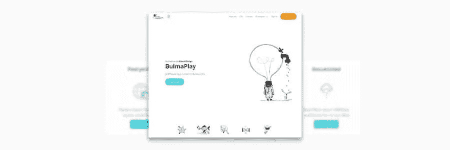
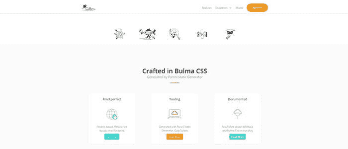
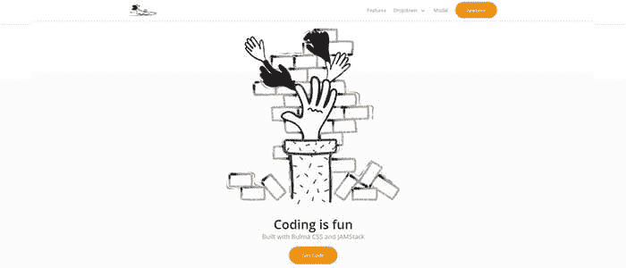
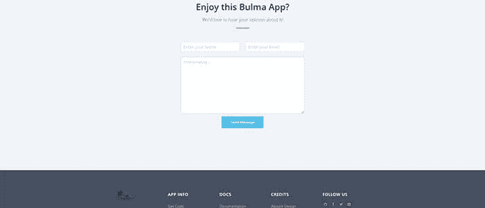

# 查找 CSS -查找

> 原文：<https://dev.to/sm0ke/server-less-is-more-jamstack-app-on-top-of-bulma-css-525k>

各位编码员好，

我正在把我的网络开发转移到布尔玛的，我没有找到很多可用的免费布尔玛模板。森林上有几个，(不到 5 个)，免费的有..无法用于实际项目。

* * *

> 谢谢大家！**内容由 [AppSeed - App 生成器](https://appseed.us)T3】提供。**

* * *

因此，我决定构建一些东西，并将其作为免费资产发布，同时将一些不错的工具放在一边。结果就是 **[布尔玛 CSS - BulmaPlay](https://appseed.us/apps/bulma-css/bulmaplay)** web app:

*   [布尔玛 CSS BulmaPlay](https://appseed.us/apps/bulma-css/bulmaplay) -官方产品页面
*   [查找 CSS 查找演示](https://bulma-css-bulmaplay.appseed.us/)
*   工具:**大口**，热重装，**帕尼尼静态发生器**， **SaaS** 文件定制，FTP 部署脚本

*   演职员表:来自**荒谬的插图。设计**

**相关资源**

*   [布尔玛](https://bulma.io/) -官方网站
*   布尔玛 CSS 应用程序和使用它们的 T2 文档的简短列表
*   [布尔玛 CSS BulmaLanding](https://appseed.us/apps/bulma-css/bulmalanding) 只是另一个用**布尔玛 CSS** 构建的应用

编码快乐！