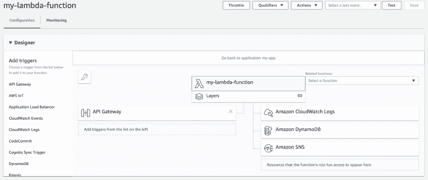

# 无服务器和最小特权原则

> 原文：<https://dev.to/orangejellyfish/serverless-and-the-principle-of-least-privilege-2on9>

> 系统的每个程序和每个特权用户都应该使用完成作业所需的最少特权进行操作。
> 
> — Jerome Saltzer，<cite>ACM 的通信</cite>

这句话出自美国计算机科学家杰罗姆·索尔特泽之口，支持了后来被称为“最小特权原则”的概念。这个想法是通过确保系统的每个部分都有能力访问完成工作所需的数据，除此之外别无其他。它几乎适用于任何软件系统，无论是网络应用还是运行在嵌入式芯片上的程序。

本文的其余部分将关注最小特权原则，因为它适用于[无服务器框架](https://serverless.com/)，特别是部署到 [AWS](https://aws.amazon.com/) 的无服务器应用程序。在我们深入探讨无服务器之前，如果你对 AWS 的身份和访问管理(T4 IAM T5)有所了解会有所帮助。

## IAM

AWS IAM 是一个全面的身份和访问管理工具。它提供了管理用户和控制他们访问其他 AWS 服务和资源的功能。它提供了角色的概念，其他实体可以担当这些角色来授予对资源的访问权。它甚至为 web 或移动应用程序提供了直接访问 AWS 资源的能力。

IAM 提供了“身份”的概念，创建身份是为了“为您的 AWS 帐户中的人员和进程提供身份验证”。身份可以是“用户”，例如您可能用来登录 AWS 控制台的个人帐户，或者是“角色”。目前，我们主要对 IAM 角色感兴趣。

想象一下，一个 AWS Lambda 函数在被调用时需要从 DynamoDB 表中读取数据，处理一些数据，将修改后的文档写回到表中，然后向 SNS 主题发布一条消息，通知其他相关方它已经完成了工作。默认情况下，Lambda 没有权限访问任何这些资源。为了确保函数能够访问它所依赖的资源，它可以在执行时*承担*IAM 角色。Lambda 文档将此称为“执行角色”，每个 Lambda 函数都有一个在创建时指定的角色。同样，其他 AWS 资源，比如 API Gateway，可能需要一个允许它们调用 Lambda 函数的角色。Lambda web 控制台有一个有用的图表，显示了这两个方面:

[](https://res.cloudinary.com/practicaldev/image/fetch/s--T-MB_rno--/c_limit%2Cf_auto%2Cfl_progressive%2Cq_auto%2Cw_880/https://thepracticaldev.s3.amazonaws.com/i/x5fn4o49z5z4mglpfbsd.png)

我们可以看到 API 网关有权限调用 Lambda，Lambda 执行角色赋予其访问 CloudWatch、DynamoDB 和 SNS 的权限。

## 无服务器

在为 AWS 开发无服务器应用程序时，您可以配置一个 IAM 角色，由服务中的所有 Lambda 函数承担(默认方法)，或者为每个函数定义一个不同的角色。

如果您坚持使用默认设置，那么您的`serverless.yml`文件中就会出现类似这样的内容。该示例将允许服务中的所有 Lambda 函数对特定 SNS 主题执行“发布”操作:

```
provider:
  name: aws
  iamRoleStatements:
    - Effect: Allow
      Action:
        - sns:publish
      Resource:
        - Ref: MySNSTopic 
```

这里有几件事需要考虑。我们在确保我们的功能“使用完成工作所需的最少特权来运行”方面已经走了很长的路。他们只能对特定资源执行单一类型的操作。如果您的功能代码试图将消息发布到不同的 SNS 主题，它将无法做到这一点。然而，我们可以做得更好。当我们向我们的服务添加功能时，它们可能有不同的访问需求。按照默认的配置，你很快就会得到一个广泛的 IAM 角色，让你所有的 Lambda 函数都可以访问任何一个可能需要的东西。为了更好地遵守最小特权原则，我们需要为每个 Lambda 函数定义一个 IAM 角色。

不幸的是，用无服务器框架实现这一点相当复杂。当不使用提供者级别的角色配置时，您不会受益于通常从 Serverless 免费获得的任何权限，这意味着您需要手动配置对 CloudWatch 之类的东西的访问以进行日志记录。如果这是你想采用的方法，你可以在官方文档中找到更多的信息。但是多亏了出色的开源社区，有了一条更容易的途径。

[server less-iam-roles-per-function 插件](https://github.com/functionalone/serverless-iam-roles-per-function)负责你通常从盒子里取出的所有其他东西，并让你只关注特定于你的单个 Lambda 函数的资源。激活`serverless.yml` :
中的插件

```
plugins:
  - serverless-iam-roles-per-function 
```

然后你可以在函数级定义`iamRoleStatements`:

```
myLambdaFunction:
  handler: src/functions/hello/index.default
  events:
    - http:
        path: hello
        method: get

  iamRoleStatements:
    - Effect: Allow
      Action:
        - sns:publish
      Resource:
        - Ref: MySNSTopic 
```

有了这个配置，我们服务中的任何额外的 Lambda 函数都将不能在`MySNSTopic`资源上使用`sns:publish`动作。并且这个函数本身将不能使用任何其他 SNS 动作，即使是在那个资源上，实现了我们最初的目标，即给予每个 Lambda 函数完成任务所需的最少特权。

orangejellyfish [无服务器初学者工具包](https://github.com/orangejellyfish/serverless-starter)默认包含上述插件，并包含一个示例 Lambda 函数以及一系列其他最佳实践配置默认值和助手。