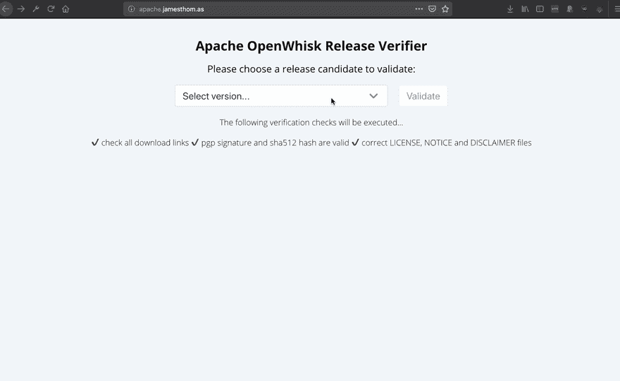
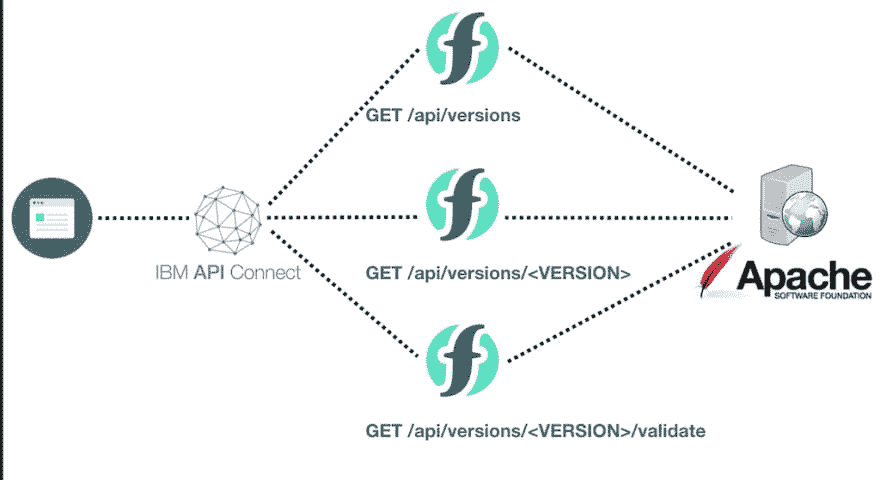
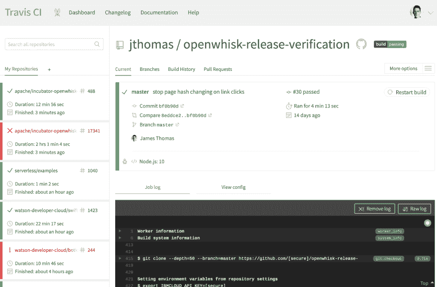

# 具有 Travis CI、无服务器框架和 IBM Cloud 功能的无服务器 CI/CD

> 原文：<https://dev.to/ibmdeveloper/serverless-ci-cd-with-travis-ci-serverless-framework-and-ibm-cloud-functions-4laj>

如何为无服务器应用程序建立一个 [CI/CD 管道](https://dzone.com/articles/what-is-cicd)？

这篇博文将解释如何使用 [Travis CI](https://travis-ci.org/) 、[无服务器框架](https://github.com/serverless/serverless)和 [AVA 测试框架](https://github.com/avajs/ava)为无服务器应用建立一个全自动的构建、部署和测试管道。它将使用一个生产[无服务器应用](https://github.com/jthomas/openwhisk-release-verification)的真实例子，使用[Apache open whish](http://openwhisk.incubator.apache.org/)构建并运行在 [IBM Cloud Functions](https://console.bluemix.net/openwhisk/) 上。CI/CD 管道将执行以下任务...

*   运行项目单元测试。
*   将应用程序部署到测试环境。
*   根据测试环境运行验收测试。
*   **将应用程序部署到生产环境。**
*   **在生产环境中运行冒烟测试。**

在深入研究 CI/CD 管道设置的细节之前，让我们先展示一下这个项目使用的示例无服务器应用程序...

## 无服务器项目-【http://apache.jamesthom.as/ T2】

“[Apache open whisk Release Verification](https://github.com/jthomas/openwhisk-release-verification)”项目是一个无服务器的 web 应用程序，帮助提交者验证开源项目的发布候选。它使用无服务器功能自动运行 [ASF 发布清单](https://cwiki.apache.org/confluence/display/OPENWHISK/How+to+verify+the+release+checklist+and+vote+on+OpenWhisk+modules+under+Apache)中的验证步骤。自动化发布候选验证使得提交者更容易参与发布投票。

[](https://res.cloudinary.com/practicaldev/image/fetch/s--N1V705yX--/c_limit%2Cf_auto%2Cfl_progressive%2Cq_66%2Cw_880/https://raw.githubusercontent.com/jthomas/openwhisk-release-verification/master/release-verification-tool.gif)

该项目由静态 web 资产(HTML、JS、CSS 文件)和 HTTP APIs 组成。静态 web 资产由来自[项目存储库](https://github.com/jthomas/openwhisk-release-verification)的 Github 页面托管。HTTP APIs 被实现为 Apache open whish[动作](https://github.com/apache/incubator-openwhisk/blob/master/docs/actions.md)，并使用 [API 网关](https://github.com/apache/incubator-openwhisk/blob/master/docs/apigateway.md)服务公开。 [IBM Cloud Functions](https://console.bluemix.net/openwhisk/) 用于托管 Apache OpenWhisk 应用程序。

后端不需要其他云服务，比如数据库。通过解析来自 ASF 网站的 [HTML 页面](https://dist.apache.org/repos/dist/dev/incubator/openwhisk/)来实时检索发布候选信息。

[](https://res.cloudinary.com/practicaldev/image/fetch/s--OoEH3o0V--/c_limit%2Cf_auto%2Cfl_progressive%2Cq_auto%2Cw_880/http://jamesthom.img/ow_release_verifier/architecture.png)

### 配置

[无服务器框架](https://github.com/serverless/serverless)(带有[Apache open whish provider 插件](https://github.com/serverless/serverless-openwhisk))用于定义应用中使用的无服务器功能。HTTP 端点也在 YAML 配置文件中定义。

```
service: release-verfication

provider:
  name: openwhisk
  runtime: nodejs:10

functions:
  versions:
    handler: index.versions
    events:
      - http: GET /api/versions
  version_files:
    handler: index.version_files
    events:
      - http:
          method: GET
          path: /api/versions/{version}
          resp: http
...

plugins:
  - serverless-openwhisk 
```

该框架处理应用程序的所有部署和配置任务。在新环境中设置应用程序就像运行`serverless deploy` [命令](https://github.com/serverless/serverless)一样简单。

### 环境

Apache OpenWhisk 使用[名称空间](https://github.com/apache/incubator-openwhisk/blob/master/docs/reference.md#fully-qualified-names)来分组单独的包、动作、触发器和规则。不同的命名空间可用于为应用程序提供隔离的环境。

IBM Cloud Functions 在平台实例中自动创建基于用户的名称空间。这些自动生成的名称空间反映了用于访问实例的 IBM Cloud 组织和空间。在一个组织内创建[新空间](https://cloud.ibm.com/docs/account?topic=account-orgsspacesusers#cf-org-concepts)将提供额外的名称空间。

我为这个应用程序使用了一个定制的组织，有三个不同的空间:**开发**、**测试**和**生产**。

**dev** 作为开发时部署功能的测试环境。**测试**被 CI/CD 管道用来在验收测试期间部署应用程序的临时实例。 **prod** 是托管外部应用程序操作的生产环境。

### 凭证

[IBM Cloud CLI](https://cloud.ibm.com/docs/cli?topic=cloud-cli-install-ibmcloud-cli) 用于处理 IBM Cloud Functions 凭证。[平台 API 密钥](https://cloud.ibm.com/docs/iam?topic=iam-manapikey)将用于从 CI/CD 系统登录 CLI。

当发布云功能 CLI 命令时(在以新的区域、组织或空间为目标后)，该云功能实例的 API 密钥会自动检索并存储在本地。无服务器框架知道如何在与平台交互时使用这些本地凭证。

### 高可用性？

Apache OpenWhisk Release Verifier 并不是一个需要“五个九”可用性的关键云应用程序。应用程序大部分时间都是空闲的。它不需要[高可用性](https://en.wikipedia.org/wiki/High_availability)无服务器架构。这意味着构建管道不必...

*   [在多个云区域部署应用实例。](https://cloud.ibm.com/docs/tutorials?topic=solution-tutorials-multi-region-serverless#multi-region-serverless)
*   [在区域实例之间设置全局负载平衡器。](https://www.ibm.com/blogs/bluemix/2019/04/load-balancing-api-calls-across-regions-with-ibm-cloud-internet-services-and-cloud-api-gateway/)
*   支持"[零停机部署](https://www.martinfowler.com/bliki/BlueGreenDeployment.html)"以最大限度地减少部署期间的停机时间。
*   在生产问题上自动回滚到以前的版本。

新部署将简单地覆盖单个区域中生产命名空间中的资源。如果生产站点在部署后被破坏，冒烟测试应该会发现这一点，并给我发电子邮件来修复它！

## 测试

鉴于这个工具将用于检查开源项目的发布候选，我想确保它正常工作！不正确的验证结果可能会导致发布无效的源档案。

我选择严重依赖单元测试来检查核心业务逻辑。这些测试确保所有验证任务正常工作，包括 PGP 签名验证、加密哈希匹配、许可证文件内容和项目发布的其他 ASF 要求。

此外，我已经使用端到端验收测试来验证 HTTP APIs 的工作是否符合预期。HTTP 请求被发送到 API GW 端点，响应与预期值进行比较。所有可用的发布候选都经过验证过程，以检查没有返回错误。

### 单元测试

[单元测试](https://en.wikipedia.org/wiki/Unit_testing)用 [AVA 测试框架](https://github.com/avajs/ava)实现。单元测试保存在`unit/test/` [文件夹](https://github.com/jthomas/openwhisk-release-verification/tree/master/test/unit)中。

`npm test`命令别名运行`ava test/unit/`命令来执行所有单元测试。该命令可以在开发过程中在本地执行，也可以从 CI/CD 管道执行。

```
$ npm test

> release-verification@1.0.0 test ~/code/release-verification
> ava test/unit/

 27 tests passed 
```

### 验收测试

[验收测试](https://en.wikipedia.org/wiki/Acceptance_testing)检查 API 端点返回有效(和无效)请求的预期响应。验收测试是针对应用程序实例的 API 网关端点执行的。

使用环境变量(`HOST`)来控制用于 HTTP 请求的主机名。因为相同的测试套件测试用于验收和冒烟测试，所以设置这个环境变量是针对不同环境运行测试所需的唯一配置。

测试和生产环境中的 API 端点使用不同的定制子域(`apache-api.jamesthom.as`和`apache-api-test.jamesthom.as`)公开。NPM [脚本用于](https://github.com/jthomas/openwhisk-release-verification/blob/master/package.json#L8-L9)提供命令(`acceptance-test` & `acceptance-prod`)，这些命令在运行测试套件之前设置环境主机名。

```
"scripts": {
    "acceptance-test": "HOST=apache-api-test.jamesthom.as ava -v --fail-fast test/acceptance/",
    "acceptance-prod": "HOST=apache-api.jamesthom.as ava -v --fail-fast test/acceptance/"
  }, 
```

```
$ npm run acceptance-prod

> release-verification@1.0.0 acceptance-prod ~/code/release-verification
> HOST=apache-api.jamesthom.as ava -v --fail-fast  test/acceptance/

  ✔ should return list of release candidates (3.7s)
    ℹ running api testing against https://apache-api.jamesthom.as/api/versions
  ✔ should return 404 for file list when release candidate is invalid (2.1s)
    ℹ running api testing against https://apache-api.jamesthom.as/api/versions/unknown
  ...

  6 tests passed 
```

验收测试也是用 AVA 测试框架实现的。所有的验收测试都在一个单独的[测试文件](https://github.com/jthomas/openwhisk-release-verification/blob/master/test/acceptance/api.js) ( `unit/acceptance/api.js`)中。

## CI/CD 管道

当新的提交被推送到项目存储库的`master`分支时，构建管道需要启动以下步骤…

*   运行项目单元测试。
*   将应用程序部署到测试环境。
*   根据测试环境运行验收测试。
*   *将应用程序部署到生产环境。*
*   *在生产环境中运行冒烟测试。*

如果任何步骤失败，构建管道应该停止，并向我发送通知电子邮件。

### 特拉维斯

[Travis CI](https://travis-ci.org/) 用于实施 CI/CD 构建管道。Travis CI 使用项目存储库中的[定制文件](https://github.com/jthomas/openwhisk-release-verification/blob/master/.travis.yml) ( `.travis.yml`)来配置构建管道。这个 YAML 文件定义了在构建管道的每个阶段要执行的命令。如果任何命令失败，构建将停止在该阶段而不继续。

*下面是这个项目完成的`.travis.yml`文件:[https://github . com/jthomas/open whish-release-verification/blob/master/. Travis . yml](https://github.com/jthomas/openwhisk-release-verification/blob/master/.travis.yml)*

我使用以下 Travis CI [构建阶段](https://docs.travis-ci.com/user/job-lifecycle#the-job-lifecycle)来实现管道:**安装**、**之前 _ 脚本**、**脚本**、**之前 _ 部署**和**部署**。命令将在 Node.js 10 构建环境中运行，该环境预安装了语言运行时和包管理器。

```
language: node_js
node_js:
  - "10" 
```

#### 安装

在`install` [阶段](https://github.com/jthomas/openwhisk-release-verification/blob/master/.travis.yml#L5-L9)，我需要设置构建环境来部署应用程序和运行测试。

这意味着安装 IBM Cloud CLI、 [Cloud Functions CLI 插件](https://cloud.ibm.com/openwhisk/learn/cli)、无服务器框架(带有 Apache OpenWhisk 插件)、应用测试框架(AvaJS)和其他项目依赖项。

IBM Cloud CLI 是使用 shell 脚本安装的。运行 CLI 子命令安装[云函数插件](https://cloud.ibm.com/openwhisk/learn/cli)。

无服务器框架作为全局 NPM 包安装(使用`npm -g install`)。Apache OpenWhisk provider 插件与测试框架一起被作为普通项目依赖来处理。这两个依赖项都是使用 NPM 安装的。

```
install:
  - curl -fsSL https://clis.cloud.ibm.com/install/linux | sh
  - ibmcloud plugin install cloud-functions
  - npm install serverless -g
  - npm install 
```

#### 前 _ 脚本

这个[阶段](https://github.com/jthomas/openwhisk-release-verification/blob/master/.travis.yml#L11-L16)用于运行单元测试，在为验收测试环境设置凭证(在`script`阶段使用)之前捕获核心业务逻辑中的错误。单元测试失败将立即停止构建，跳过测试和生产部署。

自定义变量提供用于测试环境的 API 密钥、平台端点、组织和空间标识符。在运行`ibmcloud fn api list`命令之前，使用这些值对 CLI 进行身份验证。这确保了云功能凭证在本地可用，如无服务器框架所使用的。

```
before_script:
  - npm test
  - ibmcloud login --apikey $IBMCLOUD_API_KEY -a $IBMCLOUD_API_ENDPOINT
  - ibmcloud target -o $IBMCLOUD_ORG -s $IBMCLOUD_TEST_SPACE
  - ibmcloud fn api list > /dev/null
  - ibmcloud target 
```

#### 脚本

配置好构建系统后，可以将应用程序部署到测试环境中，然后运行验收测试。如果部署或验收测试失败，构建将停止，跳过生产部署。

验收测试使用一个环境变量来配置主机名，测试用例就是针对主机名执行的。在运行测试套件之前，`npm run acceptance-test` alias 命令将这个值设置为测试环境主机名(`apache-api-test.jamesthom.as`)。

```
script:
  - sls deploy
  - npm run acceptance-test 
```

#### 之前 _ 部署

在部署到生产环境之前，需要更新云功能凭证。IBM Cloud CLI 用于在运行云功能 CLI 命令之前定位生产环境。这将使用生产环境凭据更新本地凭据。

```
before_deploy:
  - ibmcloud target -s $IBMCLOUD_PROD_SPACE
  - ibmcloud fn api list > /dev/null
  - ibmcloud target 
```

#### 部署

如果前面的所有阶段都已成功完成，应用程序就可以部署到生产环境中了。在最终部署之后，冒烟测试用于检查生产 API 是否仍能按预期工作。

冒烟测试与针对生产环境执行的验收测试是一样的。在运行测试套件之前，`npm run acceptance-prod` alias 命令将主机名配置值设置为生产环境(`apache-api.jamesthom.as`)。

```
deploy:
  provider: script
  script: sls deploy && npm run acceptance-prod
  skip_cleanup: true 
```

*使用`skip_cleanup`参数会将先前阶段安装的工件留在构建环境中。这意味着我们不必重新安装运行生产部署和冒烟测试所需的 IBM Cloud CLI、无服务器框架或 NPM 依赖项。*

### 成功？

如果所有的[构建阶段](https://travis-ci.org/jthomas/openwhisk-release-verification)都成功了，那么最新的项目代码应该已经部署到生产环境中了。💯💯💯

[](https://res.cloudinary.com/practicaldev/image/fetch/s--9A9ifHpN--/c_limit%2Cf_auto%2Cfl_progressive%2Cq_auto%2Cw_880/http://jamesthom.img/build-screenshot.png)

如果构建由于单元测试失败而失败，可以在本地运行测试套件来修复任何错误。可以使用 Travis CI 的控制台输出日志来调查部署失败。针对测试或生产环境的验收测试问题，可以通过本地登录到这些环境并从我的开发机器上运行测试套件来调试。

## 结论

将 Travis CI 与无服务器框架和 JavaScript 测试框架结合使用，我能够为 Apache OpenWhisk 发布候选验证工具建立一个全自动的 CI/CD 部署管道。

使用 CI/CD 管道而不是手动方法进行部署具有以下优势...

*   不再依靠人工进行容易出错的手动部署👨‍💻 :)
*   自动单元和验收测试执行在部署前捕捉错误。
*   生产环境只能由 CI/CD 系统访问，减少了意外损坏。
*   所有云资源都必须用代码配置。不允许“[雪花](https://martinfowler.com/bliki/SnowflakeServer.html)”环境。

完成了新项目特性或错误修复的代码后，我所要做的就是将更改推送到 GitHub 存储库中。这会触发 Travis CI 构建管道，该管道会自动将更新后的应用程序部署到生产环境中。如果有任何问题，由于失败的测试或部署，我会收到电子邮件通知。

这使我能够回去向工具添加新功能(并修复错误)，而不是纠结于部署、管理多个环境的凭证，然后试图记住对正确的实例运行测试！