# 无服务器—从一开始，使用 Azure 功能(Azure portal)，第二部分

> 原文：<https://dev.to/azure/serverless-from-the-beginning-part-ii-getting-to-know-your-portal-ide-101k>

在 [Twitter](https://twitter.com/chris_noring) 上关注我，很乐意接受您对主题或改进的建议/Chris

这是本系列的第二部分:

*   [无服务器—从一开始，使用 Azure 功能(Azure 门户)](https://dev.to/azure/serverless-from-the-beginning-using-azure-functions-azure-portal-part-i-28o1)，第一部分，这部分重点介绍无服务器的概念，并展示如何使用门户构建您的第一个 Azure 功能
*   无服务器—从一开始，使用 Azure 功能(Azure portal)，第二部分，**我们在这里**
*   无服务器—从头开始，使用 Azure 函数(VS 代码)，第三部分，进行中
*   无服务器—从头开始，使用 Azure 函数(Azure CLI)，第四部分，进行中

在本文中，我们将涵盖以下内容:

*   **全面了解 IDE**，门户可能不是编写 Azure 函数的理想 IDE，但它确实包含了许多创作函数的强大功能
*   **分解成模块**，因为这是 Node.js，我们肯定可以使用 CommonJS 模块系统
*   **使用库，**你肯定可以使用 NPM 来安装库
*   **使用 HTTP 和 async/await** ，您肯定可以从我们的函数中调用其他端点并呈现结果
*   **日志记录**，我们可以用不同的方式进行日志记录，让我们看看如何记录语句，然后再记录

## 资源

关于函数还有很多东西需要学习，比如如何使用不同类型的触发器，如何创建 API，如何记录这些 API 等等。我们仅仅触及了表面

*   [https://azure.microsoft.com/en-gb/services/functions/](https://azure.microsoft.com/en-gb/services/functions/?wt.mc_id=medium-blog-chnoring)，Azure 功能的通用登陆页面
*   [https://docs.microsoft.com/en-gb/azure/](https://docs.microsoft.com/en-gb/azure/?wt.mc_id=medium-blog-chnoring)，Azure 的主文档页面
*   [https://docs.microsoft.com/en-gb/azure/azure-functions/](https://docs.microsoft.com/en-gb/azure/azure-functions/?wt.mc_id=medium-blog-chnoring)，Azure 功能文档的登陆页面
*   https://docs . Microsoft . com/en-GB/azure/azure-functions/functions-create-first-azure-function，如何创建第一个函数的教程
*   [https://docs . Microsoft . com/en-GB/azure/azure-functions/functions-create-server less-api](https://docs.microsoft.com/en-gb/azure/azure-functions/functions-create-serverless-api?wt.mc_id=medium-blog-chnoring)，如何创建无服务器 API
*   [链接](https://docs.microsoft.com/en-us/learn/browse/?roles=developer&resource_type=module&term=Azure%20functions&wt.mc_id=medium-blog-chnoring)到 Azure 函数上的所有学习模块，

## 回顾和下一步

好了，希望您已经阅读了本系列的第一部分，因此您知道如何创建一个`Function app`和第一个`Azure function`，以及如何在您的门户 IDE 和浏览器中运行它们。如果没有，看看这里的

在这一点上，我们仅仅触及了门户 IDE 所能做的事情的表面。因此，让我们从本系列的第一篇文章开始尝试重构我们的代码，并在此过程中发现一些门户 ide。

## 了解您的门户 IDE

一旦生成了函数，就该了解门户 IDE 了。看起来是这样的:

[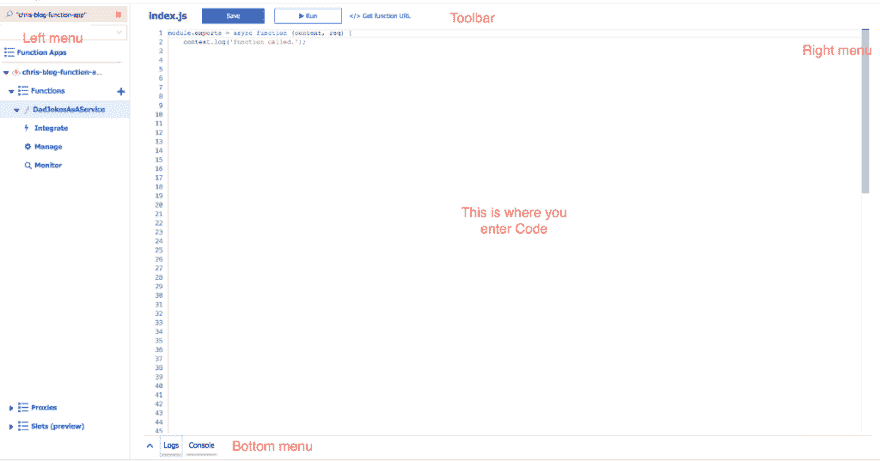](https://res.cloudinary.com/practicaldev/image/fetch/s--wU4TYeC6--/c_limit%2Cf_auto%2Cfl_progressive%2Cq_auto%2Cw_880/https://cdn-images-1.medium.com/max/1024/1%2Agbl5ptIHPPmXm6ike56NSg.png)

它包括以下内容:

**左侧菜单**，这是放置在您功能下的左侧右侧

*   **集成**，这让你可以控制诸如允许的 HTTP 方法、授权级别，可能还有最重要的输入和输出，在这里你可以配置什么类型的事件可以触发我们的函数，也可以通过从函数返回一些东西来依次触发什么类型的事件
*   **管理**，这里是我们管理*功能键*和*主机键*的地方。根据授权级别，您需要在您的请求中使用一个或多个密钥，以便能够调用您的功能应用程序中的特定功能
*   **Monitor** ，这显示了一个函数的所有执行，如果它运行得很好，以及用了多长时间

**工具栏**，它位于顶部，可以让你保存、运行和获取你的功能的 URL

**右边的菜单**，这是你左边的列表菜单，允许你做两件事:

*   **添加/删除文件**到你的项目中，是的，你可以有一个由许多文件组成的项目。它是 Node.js 和 CommonJS，所以我们可以期待 require 和 module.exports 这样的东西能够工作
*   **Test** ，我们得到帮助来构造对我们服务的请求，包括 HTTP 方法和有效负载的选择

**底部菜单**，这包含两个不同的东西:

*   **Logs** ，这将显示您函数的日志输出
*   **控制台**，这是一个终端窗口，允许你浏览你的功能应用项目所在的目录，并允许你做大多数终端允许的事情

## 重构

好了，我们更好地理解了我们的门户 IDE 由哪些部分组成，现在让我们看看我们在本系列的第一部分中创建的代码。首先，我们有一个静态的可疑笑话列表:

```
// index.js

module.exports = async function (context, req) {

let jokes = [

  "Did you hear about the restaurant on the moon? Great food, no atmosphere.",

  "What do you call a fake noodle? An Impasta.",

  "How many apples grow on a tree? All of them.",

  "Want to hear a joke about paper? Nevermind it's tearable.",

  "I just watched a program about beavers. It was the best dam program I've ever seen.",

  "Why did the coffee file a police report? It got mugged.",

  "How does a penguin build it's house? Igloos it together.",

];

// the rest of the code omitted for brevity 
```

我们通常在 Node.js 项目中做的是将它们移动到一个单独的文件中，我们称之为笑话. js。我们需要采取以下步骤:

1.  展开右侧菜单
2.  点击`+ Add`添加新文件
3.  输入文件名笑话. js
4.  将我们的列表移至笑话. js
5.  从我们的主文件`index.js`导入笑话. js 作为模块

### 展开菜单

这非常简单，只需点击菜单本身，就像这样:

[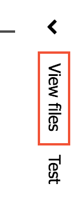](https://res.cloudinary.com/practicaldev/image/fetch/s--iNvdD5Dk--/c_limit%2Cf_auto%2Cfl_progressive%2Cq_auto%2Cw_880/https://cdn-images-1.medium.com/max/124/1%2AxRy4G_2danLGJG8HXcMgHg.png)

最后看起来是这样的:

[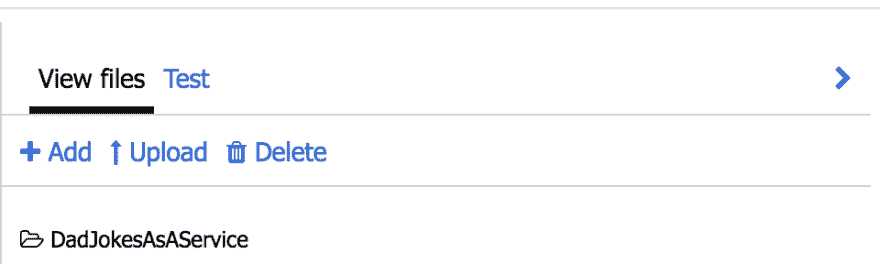](https://res.cloudinary.com/practicaldev/image/fetch/s--7_m_7aJc--/c_limit%2Cf_auto%2Cfl_progressive%2Cq_auto%2Cw_880/https://cdn-images-1.medium.com/max/960/1%2AEAWgnLpeAiKaRHwbOxlJmA.png)

### 添加一个新文件并将列表移动到那里

好的，我们点击`+ Add`并以此结束:

[](https://res.cloudinary.com/practicaldev/image/fetch/s--xy9A9Y2u--/c_limit%2Cf_auto%2Cfl_progressive%2Cq_auto%2Cw_880/https://cdn-images-1.medium.com/max/406/1%2AKxf0XHtlHKceOO57yOkUQA.png)

我们填写我们的文件名`jokes.js`并移动来自`index.js`的内容，我们现在应该有:

[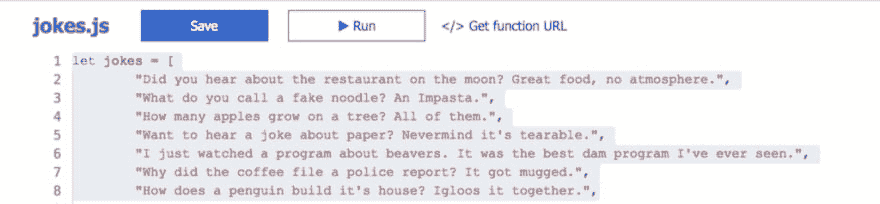](https://res.cloudinary.com/practicaldev/image/fetch/s--g-qTCdEX--/c_limit%2Cf_auto%2Cfl_progressive%2Cq_auto%2Cw_880/https://cdn-images-1.medium.com/max/1024/1%2AQcpH-pA1OIWkrq0llzOvTw.png)

> 不要忘记在`jokes.js`的末尾添加 module.exports = jokes，以确保我们可以正确导入我们的笑话列表。

### 导入我们的笑话. js 文件作为节点模块

在我们的`index.js`文件的顶部，我们现在可以写:

```
// index.js

const jokes = require('./jokes'); 
```

这就足够了。

### 将剩余的静态内容移动到单独的文件

我们也有一个在互联网上找到的笑狗图片的网址列表。让我们创建一个文件`dogUrls.js`并将所有的 URL 放在那里。它应该是这样的:

```
// dogUrls.js

let dogUrls = [

// your URLs

];

module.exports = dogUrls; 
```

就像使用笑话. js 一样，我们现在也可以将`dogUrls.js`作为节点模块导入。所以我们的`index.js`的顶部现在应该是这样的:

```
// index.js

const jokes = require('./jokes');

const dogUrls = require('./dogUrls'); 
```

## 使用 REST 端点新建项目

在这一点上，我们将远离我们的爸爸笑话服务，它可能是有史以来最好的，这并没有说太多；)是时候接受互联网的另一个最爱了，猫图！！。

我想我从这里一直听到你绝望的尖叫。不要担心，这只是出于教育目的，所以我们学习如何使用 HTTP 调用和下载依赖项:)。

因为我们正在构建一个新函数，所以我们需要先创建一个新函数，并给它一个合适的名称，所以首先单击添加一个新函数:

[](https://res.cloudinary.com/practicaldev/image/fetch/s--LuFHkjKh--/c_limit%2Cf_auto%2Cfl_progressive%2Cq_auto%2Cw_880/https://cdn-images-1.medium.com/max/478/1%2AewlMtEciveoyutMezOXymg.png)

然后当您看到触发器时，选择 HTTP 触发器:

[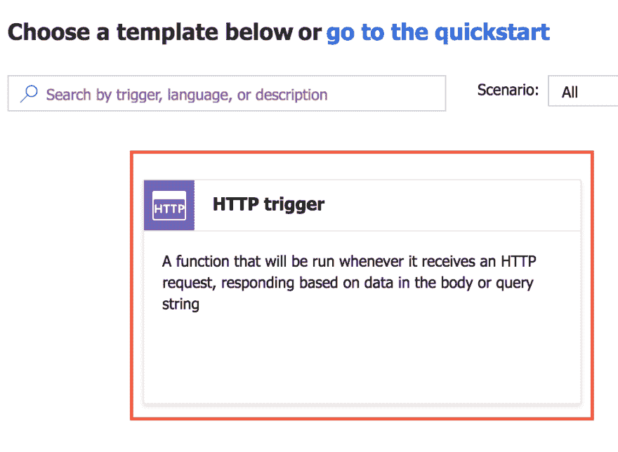](https://res.cloudinary.com/practicaldev/image/fetch/s--8fMFfUjQ--/c_limit%2Cf_auto%2Cfl_progressive%2Cq_auto%2Cw_880/https://cdn-images-1.medium.com/max/986/1%2ARPkwTErISVx0AS1zpiiZhQ.png)

此后，将授权级别设置为 Anonymous，并将其命名为 CatsAsAService，如下所示:

[](https://res.cloudinary.com/practicaldev/image/fetch/s--3TMGwuPX--/c_limit%2Cf_auto%2Cfl_progressive%2Cq_auto%2Cw_880/https://cdn-images-1.medium.com/max/912/1%2ALii0rdxH-J5kTkuqRxjIZg.png)

### 添加一个库

在这一点上，我们有了一个新的函数，但是我们需要添加执行 HTTP 调用的功能。为了实现这一点，我们需要使用一个库来完成。我们可以使用内置的 http 库，但是我们选择安装`node-fetch`库，就像您在浏览器中使用的获取一样。此时我们需要做两件事:

1.  初始化一个合适的 Node.js 项目，我们通过在终端中运行命令`npm init -y`来完成
2.  安装节点获取库，我们通过运行命令`npm install node-fetch`来完成

要完成以上操作，我们需要进入底部菜单并点击`Console`，就像这样:

[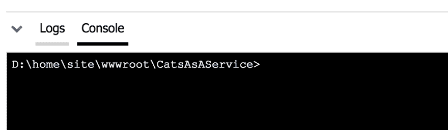](https://res.cloudinary.com/practicaldev/image/fetch/s--58xJVSBs--/c_limit%2Cf_auto%2Cfl_progressive%2Cq_auto%2Cw_880/https://cdn-images-1.medium.com/max/1012/1%2AoC3V5-8srl1lxPJIbwC84w.png)

好了，让我们先点击命令`dir`，列出我们的文件，我们在 Windows 系统里面:)

[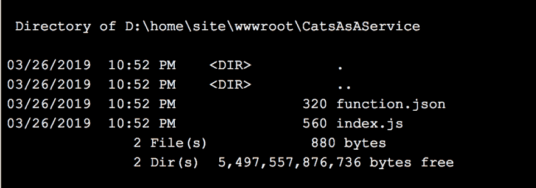](https://res.cloudinary.com/practicaldev/image/fetch/s--BCtemH30--/c_limit%2Cf_auto%2Cfl_progressive%2Cq_auto%2Cw_880/https://cdn-images-1.medium.com/max/990/1%2ATEpOPKcnOkU6SdVpT3flCg.png)

好的，上面我们可以看到我们有 function.json 和`index.js`文件。现在让我们运行我们的命令`npm init -y`，后面跟着`npm install node-fetch`。这些命令创建了一个`package.json`文件和一个`package-lock.json`，作为我们初始化节点项目和下载`node-fetch`的结果。

[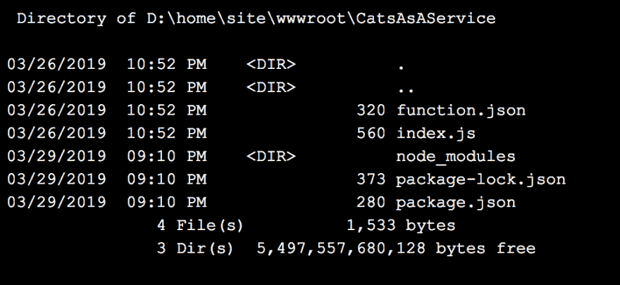](https://res.cloudinary.com/practicaldev/image/fetch/s--dMc0zVfL--/c_limit%2Cf_auto%2Cfl_progressive%2Cq_auto%2Cw_880/https://cdn-images-1.medium.com/max/968/1%2AHcESWOk3U2Z1H9tC4UyGpw.png)

通过检查`package.json`我们还可以看到`node-fetch`已经安装:

[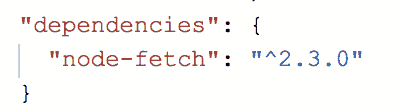](https://res.cloudinary.com/practicaldev/image/fetch/s--P5vaqOI3--/c_limit%2Cf_auto%2Cfl_progressive%2Cq_auto%2Cw_880/https://cdn-images-1.medium.com/max/404/1%2ASK2JsKzIse7GjxC5yg2_Lg.png)

很好，所以 node-fetch 就在那里，我们可以用它来进行 HTTP 调用。

### 处理日志

有了 Azure 函数，我们有了一个很好的日志记录方式，即在我们的 Azure 函数中使用第一个参数`context`。`context`有一个`log()`方法，使用时可以登录到底部菜单的`Logs`窗口。

让我们执行以下操作:

1.  导入节点-获取并对 API 进行获取调用
2.  使用 context.log()记录生成的 JSON

让我们首先声明一个执行 HTTP 调用的函数，就像这样:

```
const fetch = require('node-fetch');

async function getHttp(context) {
 context.log('calling HTTP service')

 return fetch('https://swapi.co/api/people/')

.then(res => res.json());
} 
```

上面我们声明了方法`getHttp()`，然后我们使用我们的`fetch()`方法并给它一个 URL。在`then()`回调中，我们确保将结果转换成 JSON，到目前为止一切顺利。

下一步，我们进入 Azure 函数并调用`getHttp()`。因为它使用了 *async* 关键字，我们可以使用 await 等待结果返回，然后注销，就像这样:

```
// excerpt from index.js
module.exports = async function (context, req) {
 const json = **await** getHttp(context);

 context.log(json);

// rest of the function down here
} 
```

此时运行该函数会在日志中给出以下输出:

[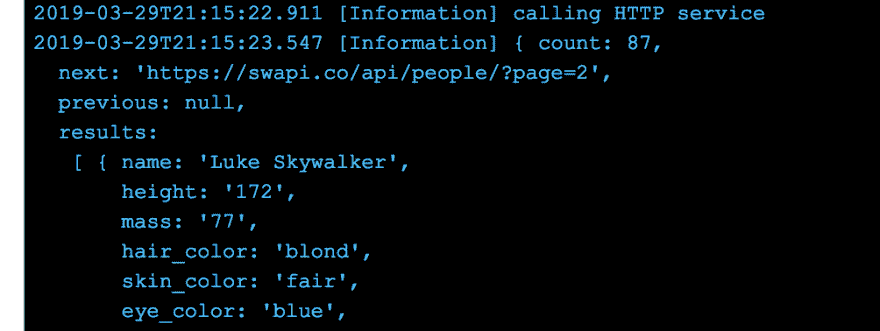](https://res.cloudinary.com/practicaldev/image/fetch/s--E3DRJ6e9--/c_limit%2Cf_auto%2Cfl_progressive%2Cq_auto%2Cw_880/https://cdn-images-1.medium.com/max/1004/1%2A1Or2qENQE8GNUEc3G1--jQ.png)

正如你在上面看到的，我们得到了一个很好的响应，但是，它返回了 87 条记录，所以我在它返回的列表的第一项之后删除了它。我们使用的 URL 是开放的星球大战 API，它包含了我们可能想知道的关于这个系列的一切。然而，让我们继续我们的任务，回到猫的话题上来..

[](https://res.cloudinary.com/practicaldev/image/fetch/s---Bk2rarq--/c_limit%2Cf_auto%2Cfl_progressive%2Cq_66%2Cw_880/https://cdn-images-1.medium.com/max/355/1%2ApnfHD-Z1MSfizhmITuE1Lg.gif)

抱歉卢克:)

一点也不奇怪，尝试谷歌一个猫 API 你会得到大量的回应，因为我们都知道互联网是为支持猫迷因而设计的，对吧；)我已经决定使用一个特定的 API，因为它不需要我注册一个 API 密钥。我特别选择了`thecatapi`和以下网址:

> [https://api.thecatapi.com/img/search](https://api.thecatapi.com/img/search)

你当然可以注册并获得一个 API 密匙，获得更丰富的体验，但我们将只使用免费版本，我们最终会得到类似这样的回应:

```
[  {  "breeds":  [  ],  "id":  "26k",  "url":  "[https://cdn2.thecatapi.cimg/26k.jpg](https://cdn2.thecatapi.cimg/26k.jpg)",  "width":  3817,  "height":  2553  }  ] 
```

我们当然可以用上面的方法，试着用一个 HTML 图像来展示它，就像我们对爸爸的笑话所做的那样，所以接下来让我们开始吧:

```
const [cat] = json;

context.res = {
 status: 200,
 headers: {
 "Content-Type": "text/html"
 },
 body: '<h3>Cat</h3>' + '<br>'
}; 
```

上面的代码从响应中挖掘出 URL，我们填充一个响应对象，给它一个响应类型 HTML，我们让主体包含一个 IMG 标签，它的 src 设置为我们的 JSON URL。结果看起来像这样:

[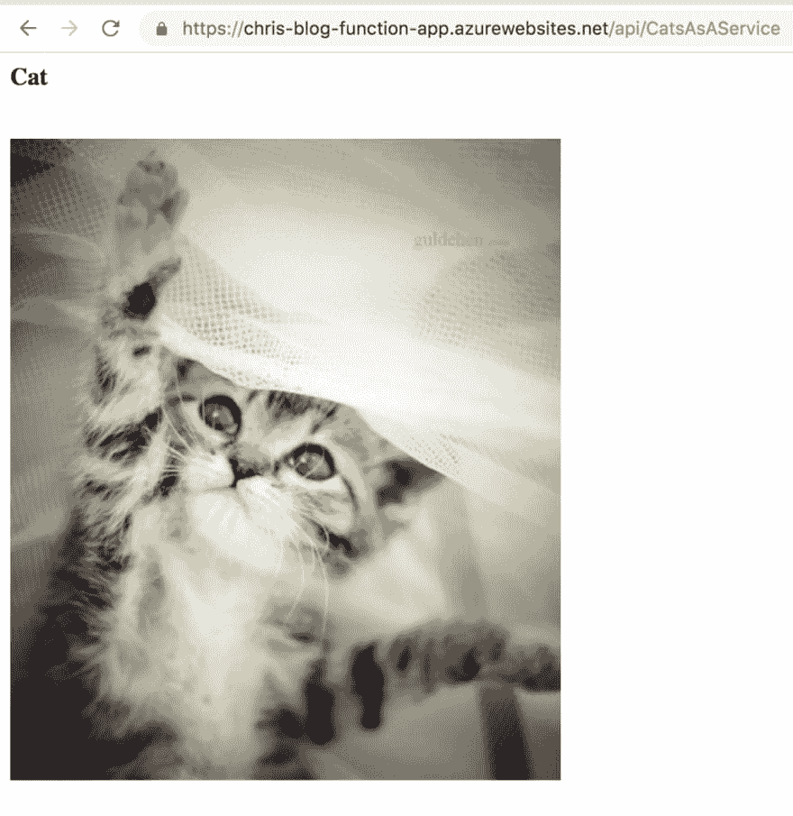](https://res.cloudinary.com/practicaldev/image/fetch/s--mlieQK7K--/c_limit%2Cf_auto%2Cfl_progressive%2Cq_auto%2Cw_880/https://cdn-images-1.medium.com/max/1024/1%2AG5P-Rhzj74nVJuy93gMUbQ.png)

那不是很了不起吗:)

这部分到此结束。在我们的下一部分中，我们将向您展示如何在 VS 代码中使用函数，因为让我们面对它，即使门户似乎有一些不错的函数，但它并不是我们真正梦想的 IDE。VS 代码里见。

## 总结

我们的目标是在门户中更好地描述 IDE，我们设法描述和解释了它由哪些部分组成以及它们的用途。接下来，我们采用了旧的 DadJokesAsAService 函数并对其进行了重构，从而介绍了如何使用节点模块。此后，我们创建了一个新的 Azure 函数，并学习了如何安装像`node-fetch`这样的库。然后，我们使用`node-fetch`调用一个用 JSON 响应的 Cat API，最终我们得到了另一个带有 Cat 的页面。因此，我们为互联网的最初目的做出了贡献；)

这是我们门户系列的最后一部分，但在下一部分，我们将看看如何从 VS 代码创作 Azure 函数，所以我希望你对此感到兴奋。