# 无服务器—从一开始，使用 Azure 函数(VS 代码)，第三部分

> 原文：<https://dev.to/azure/serverless-from-the-beginning-using-azure-functions-vs-code-part-iii-50j7>

在 [Twitter](https://twitter.com/chris_noring) 上关注我，很乐意接受您对主题或改进的建议/Chris

> 使用 VS 代码来创作你的 Azure 函数确实是最好的体验。您可以在本地和远程进行调试，当然，您也可以使用 VS 代码的全部功能

本文是系列文章的一部分:

*   [无服务器—从一开始，使用 Azure functions ( Azure portal )](https://dev.to/azure/serverless-from-the-beginning-using-azure-functions-azure-portal-part-i-28o1) ，这一部分重点介绍无服务器的概念，并展示如何使用门户构建您的第一个 Azure 功能。
*   [无服务器—从一开始，使用 Azure 功能(Azure portal)，第二部分](https://dev.to/azure/serverless-from-the-beginning-part-ii-getting-to-know-your-portal-ide-101k)这是本部分的第二部分，我们将深入了解作为 IDe 的 Azure portal，以及我们如何安装依赖项和处理多个文件等。
*   无服务器—从一开始，使用 Azure 函数(VS 代码)，第三部分，**我们在这里**
*   无服务器—从一开始，使用 Azure 功能(Azure CLI)，第四部分，*进行中*

在本文中，我们将涵盖:

*   **为什么** **VS 代码为创作环境**。这里有不止一种选择。Azure 门户，VS 代码，Azure-cli，任何 IDE 都可以。VS 代码是最好的插件之一

*   **依赖关系** **和设置**，我们需要做的并不多，根据我们的操作系统，我们安装了 brew 或 NPM 的一些核心库，当然还有强烈推荐的 Azure 功能扩展。

*   **Hello world** 并运行您的功能。这是关于让一个应用程序运行起来，相信我，这是闪电般的速度

*   在本地调试,没有比这更容易的了，然而，当涉及到项目生成时，有些事情你应该知道，这可能会破坏你的调试能力，但是不要担心，我有两个解决方案支持你。症状和解决方案描述得很好。

## **为什么把 VS 代码作为创作环境？**

有许多方法可以创作无服务器应用程序。VS 代码是比较好的一个，主要原因是它的扩展使得搭建项目/函数和调试变得非常有趣。

## **资源**

*   [Azure 功能概述页面](https://azure.microsoft.com/en-us/services/functions/?wt.mc_id=azureapril_devto-blog-chnoring)
*   [教程如何创作和部署 Azure 功能](https://code.visualstudio.com/tutorials/functions-extension/getting-started?wt.mc_id=azureapril_devto-blog-chnoring)
*   【Azure 功能扩展文档页面
*   [MS Learn 模块](https://docs.microsoft.com/en-gb/learn/modules/replace-faces-with-emojis-matching-emotion?wt.mc_id=azureapril_devto-blog-chnoring)，用 VS 代码创建更高级的 Azure 功能

## **依赖和建立**

根据您使用的是 Windows 还是 Mac OS，有两种方法可以安装我们需要的依赖项。

对于 Mac，运行以下命令:

```
brew tap azure/functions

brew install azure-functions-core-tools 
```

对于 Windows:

```
npm install -g azure-functions-core-tools@2 
```

### **安装 VS 代码扩展**

为了让创作体验变得更好，你需要一个 VS 代码的扩展:

在 VS 代码的扩展搜索字段中搜索 Azure 函数，扩展应该是这样的:

[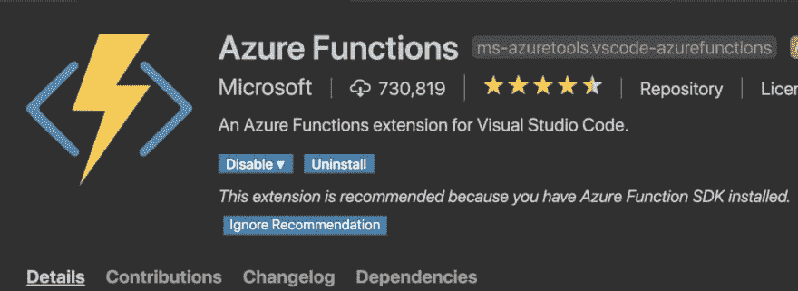](https://res.cloudinary.com/practicaldev/image/fetch/s--wwOuFjRi--/c_limit%2Cf_auto%2Cfl_progressive%2Cq_auto%2Cw_880/https://cdn-images-1.medium.com/max/1024/1%2ASurf3zWpTzaFVY4Jpx96MA.png)

## **你在 VS 代码中的第一个 Azure 函数**

要创建和运行 Azure 函数，我们需要做以下事情:

1.  创建新的 Azure functions 项目

2.  在我们的新项目中创建一个新的 Azure 函数

3.  运行我们的功能

## **创建 Azure 功能项目**

我们可以通过使用安装扩展时安装的命令来创建 Azure functions 项目。该命令名为

Azure 函数:创建新项目

我们可以通过进入菜单视图并选择命令面板来访问该命令。如果你在 Mac 上，你只需输入 Command + Shift + P，然后选择上面的命令:

[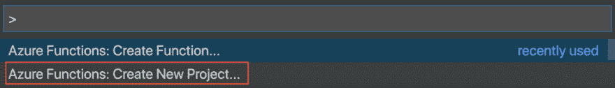](https://res.cloudinary.com/practicaldev/image/fetch/s--16_FdPfk--/c_limit%2Cf_auto%2Cfl_progressive%2Cq_auto%2Cw_880/https://cdn-images-1.medium.com/max/1024/1%2AF6wCxvaREwngLoEtbP3arQ.png)

在那里，我们将被询问在哪里放置我们的项目:

[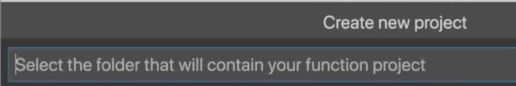](https://res.cloudinary.com/practicaldev/image/fetch/s--DjGiZbSC--/c_limit%2Cf_auto%2Cfl_progressive%2Cq_auto%2Cw_880/https://cdn-images-1.medium.com/max/1024/1%2AyCAYfl2xSaU1XMs4nox__g.png)

您选择希望项目结束的文件夹。

此后，系统会要求您选择编码语言:

[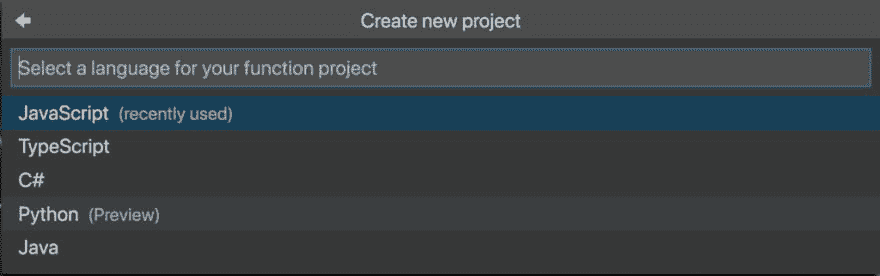](https://res.cloudinary.com/practicaldev/image/fetch/s--TWjv2UMt--/c_limit%2Cf_auto%2Cfl_progressive%2Cq_auto%2Cw_880/https://cdn-images-1.medium.com/max/1024/1%2Ao0DqKyhGpjPYG6Owd_hAQQ.png)

选择 JavaScript，但是请记住这里还可以有其他选择

随后，它查询该函数将具有什么类型的触发器，即什么类型的触发器将调用该函数:

[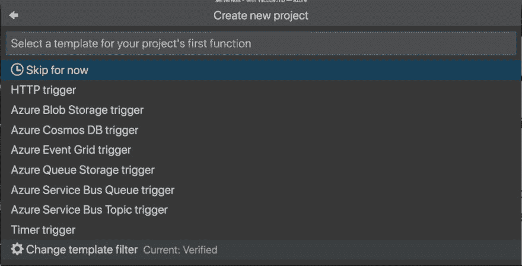](https://res.cloudinary.com/practicaldev/image/fetch/s--QhBV1xl8--/c_limit%2Cf_auto%2Cfl_progressive%2Cq_auto%2Cw_880/https://cdn-images-1.medium.com/max/1024/1%2AtOj9evR2VzUHN3769auafg.png)

现在选择 HTTP 触发器，但是就像语言一样，记住我们可以用多种方式来触发我们的函数。

下一件事是，当我们创建项目时，被要求调用创建的函数。是的，当我们创建一个项目时，它确实为我们创建了第一个功能，所以它是二合一的。

[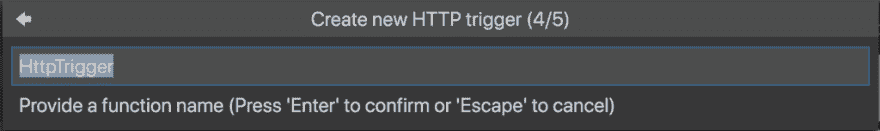](https://res.cloudinary.com/practicaldev/image/fetch/s--DnZD6Y6J--/c_limit%2Cf_auto%2Cfl_progressive%2Cq_auto%2Cw_880/https://cdn-images-1.medium.com/max/1024/1%2AByRKpClyIg18VocVthLlIw.png)

我们暂且称之为你好:

最后，我们将被询问授权级别，也就是说，我们需要什么样的凭证才能允许该功能。

[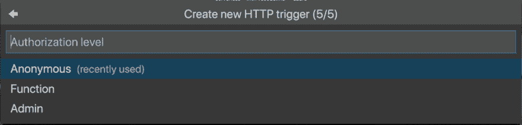](https://res.cloudinary.com/practicaldev/image/fetch/s--2OTL__rn--/c_limit%2Cf_auto%2Cfl_progressive%2Cq_auto%2Cw_880/https://cdn-images-1.medium.com/max/1024/1%2AwE6QFcXxhHWn928Tf90gPQ.png)

现在，让我们从匿名开始，我们将在这个无服务器系列的后面部分讨论授权。

### **项目解剖**

此时，您应该已经创建了以下文件:

[](https://res.cloudinary.com/practicaldev/image/fetch/s--mXtWfugB--/c_limit%2Cf_auto%2Cfl_progressive%2Cq_auto%2Cw_880/project-anatomy.png)

让我们讨论一下与本文相关的文件:

*   **/hello** ，这是一个包含我们 Azure 功能的目录

在 hello 目录中还有:

*   function.json ，它包含了很多关于你的函数的设置，比如 authLevel，它是什么类型，它允许什么方法。它包含 in 和 out 的声明。In 表示什么触发了函数，out 表示它生成什么类型的响应。在我们的例子中，它有一个 httpTrigger 作为 In，HTTP response 作为 out。

*   index.js ，它包含了我们的 Azure 函数，它给了我们一个基本的实现，我们可以修改它来满足我们的需求

## **运行调试**

好了，我们已经成功创建了一个 Azure 项目和一个 Azure 函数，现在做什么呢？当然，现在是检验它的时候了。有两种方法可以做到这一点:

1.  用调试器启动项目

2.  从终端启动项目

### **运行调试器**

这是关于在 VS 代码中使用内置的调试功能。我们将在这里讨论两件事。

1.  调试的快乐之路，如果你的项目是正确生成的，这就像按一个按钮一样简单

2.  如果你在错误的地方生成一个项目，你可能会有一些最初的挣扎，但是，我将展示如何解决这个问题

**调试**

要调试，请在菜单中选择调试/开始调试。这将 VS 代码设置为调试模式，您应该会在左侧看到此菜单:

[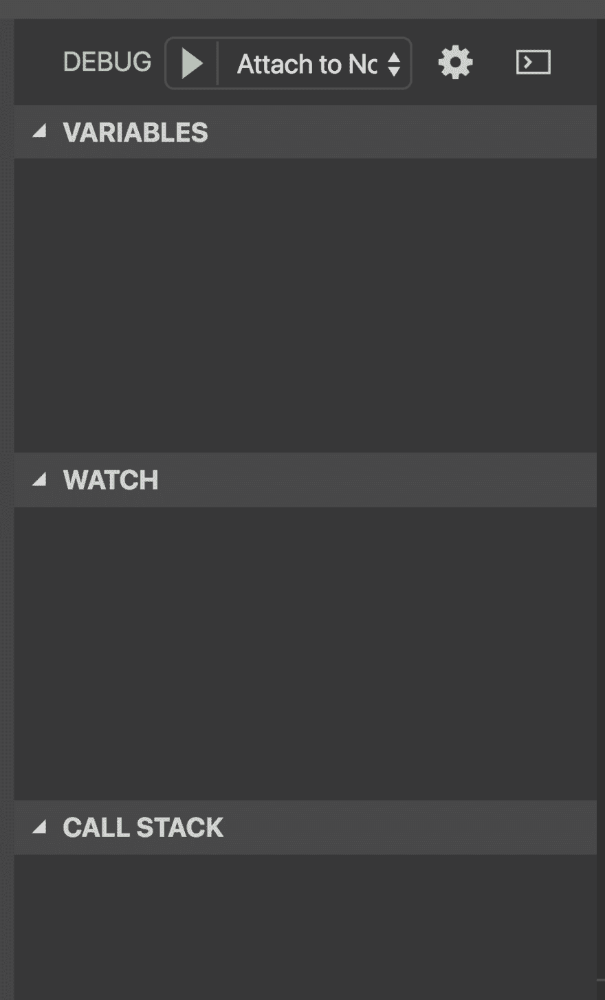](https://res.cloudinary.com/practicaldev/image/fetch/s--zCUv8s0A--/c_limit%2Cf_auto%2Cfl_progressive%2Cq_auto%2Cw_880/https://cdn-images-1.medium.com/max/1024/1%2AoiDWblzQ69OQ8wMdSGdkgw.png)

在主区域的终端中，您应该会在底部看到以下消息:

[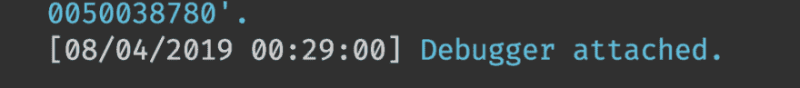](https://res.cloudinary.com/practicaldev/image/fetch/s--CTDvV6Yt--/c_limit%2Cf_auto%2Cfl_progressive%2Cq_auto%2Cw_880/https://cdn-images-1.medium.com/max/1024/1%2Aw4AEzETbjWVWRo1tjlJd7Q.png)

现在在函数的第一行设置一个断点。现在转到浏览器并导航到[http://localhost:7071/API/hello](http://localhost:7071/api/hello)，您应该会在 VS 代码中看到:

[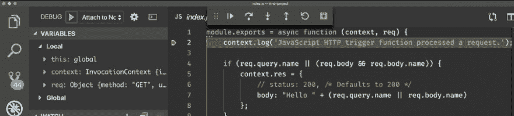](https://res.cloudinary.com/practicaldev/image/fetch/s--CbdVrWXS--/c_limit%2Cf_auto%2Cfl_progressive%2Cq_auto%2Cw_880/https://cdn-images-1.medium.com/max/1024/1%2ADhZh4MccFhJ02UdSw0BtGQ.png)

正如你在上面看到的，我们的断点被命中，左边的菜单给了我们关于堆栈跟踪和其他东西的有价值的信息。

**在正确的地方生成你的项目**

我第一次使用 VS 代码生成 Azure Functions 项目时学到了一些东西。我学到的是，我在哪里生成项目很重要。为什么这对调试很重要？嗯，它会为您所在的工作区生成一个. vscode 目录，而不是 Azure Functions 项目的目标目录。

什么会出错？如果你打开目录 tmp 中的 VS 代码，然后选择目录 tmp/project 作为生成项目的目标目录，那么你的。vscode 目录在 tmp 中生成。

如果您选择从 tmp 进行调试，它将工作，但是，如果您忘记了您在目录 tmp 中，并且下次您打开项目并且您在 tmp/project 中这样做，它将不会工作。因为 tmp/project 缺少。vscode 目录，包含调试工作所需的文件 launch.json 和 tasks.json。

如果您遇到这种情况，有两种方法可以解决:

1.  **在你打算用于 Azure 功能项目 targetDir 的目录中打开** VS 代码。例如，在生成项目时，在 tmp 中打开它并选择 tmp 作为 targetDir

2.  **移动**生成的。将 vscode 目录添加到项目文件中，打开 tasks.json，并确保属性 cwd 看起来像这样:“CWD”:$ { workspace folder }”

### **从终点**开始

要启动项目，请确保您在项目根目录下，并且您已经打开了一个终端，查看/打开视图/终端

在终端中键入以下内容:

```
func host start 
```

这应该告诉我们两件事，我们可以访问我们的函数的 URL 和支持的 HTTP 动词。

它应该给出如下所示的输出:

[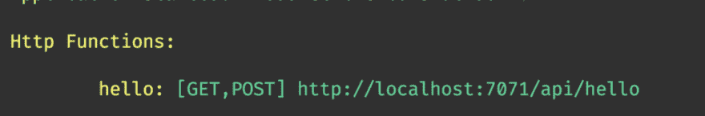](https://res.cloudinary.com/practicaldev/image/fetch/s--aC-p3jpV--/c_limit%2Cf_auto%2Cfl_progressive%2Cq_auto%2Cw_880/https://cdn-images-1.medium.com/max/1024/1%2AmY-ENYZaq75aovFgt9vk7w.png)

让我们转到浏览器中建议的 URL[http://localhost:7071/API/hello](http://localhost:7071/api/hello)

浏览器应显示以下内容:

[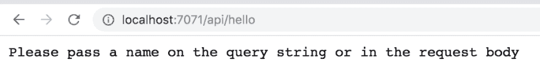](https://res.cloudinary.com/practicaldev/image/fetch/s--NFZELb3O--/c_limit%2Cf_auto%2Cfl_progressive%2Cq_auto%2Cw_880/https://cdn-images-1.medium.com/max/1024/1%2AE9wbAmYlK4Rj4KIdOjJAsQ.png)

这实际上是在运行 hello/index.js 中生成的代码。如果我们将代码放大一点:

```
// excerpt from index.js

if (req.query.name || (req.body && req.body.name)) {
 context.res = {
 // status: 200, /\* Defaults to 200 \*/
 body: "Hello " + (req.query.name || req.body.name)
 };

}

else {
 context.res = {
 status: 400,
 body: "Please pass a name on the query string or in the request body"
 };
} 
```

我们可以从上面看到，如果`req.query.name`或`req.body.name`为空，它应该构造一个状态为 400 的消息。

我们可以通过调用添加了？name=chris，像这样:

[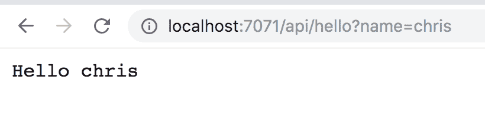](https://res.cloudinary.com/practicaldev/image/fetch/s---ZWBaVaF--/c_limit%2Cf_auto%2Cfl_progressive%2Cq_auto%2Cw_880/https://cdn-images-1.medium.com/max/820/1%2AfsraIn3llDedONVFi1FEEQ.png)

## **总结**

关于 VS 代码和 Azure 函数的第一部分到此结束。我们已经学会了如何生成 Azure functions 项目和函数，还学会了如何在项目结构中导航，尤其是学会了如何以两种不同的方式进行调试。

在下一部分中，我们将学习更多关于处理参数和授权的知识，我们还将构建一个 GraphQL 服务器，当然还有如何将一切部署到云中。听起来很有趣，对吧？:)