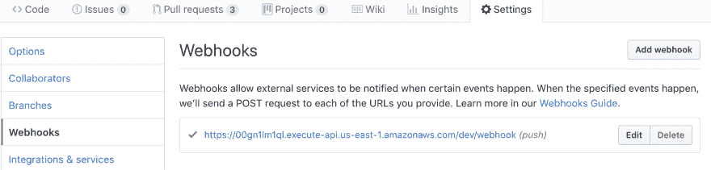
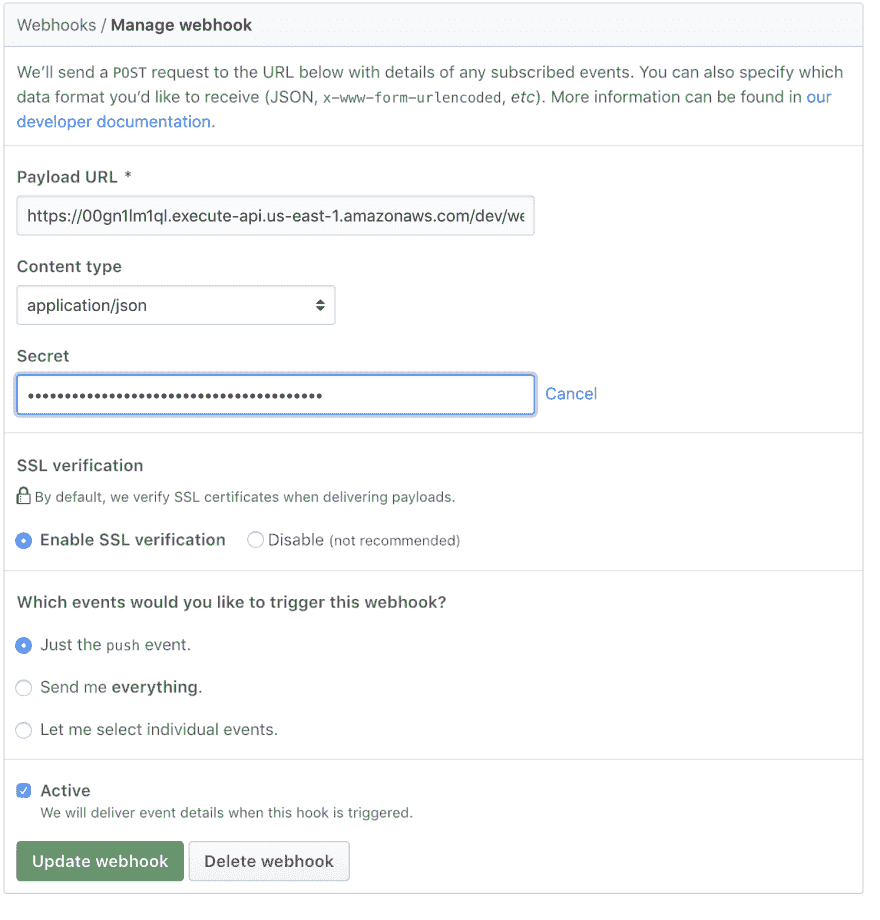

# 无服务器 git 回购历史分析

> 原文：<https://dev.to/piczmar_0/serverless-git-repo-history-analysis-4kjp>

我刚刚发布了我的示例项目，演示了如何使用 Github API 轻松地执行自动代码审查。

它是根据我前段时间写的另一篇文章改编的。

在这个特殊的例子中，我正在分析项目历史，寻找“热点”。

你可以在 [README](https://github.com/piczmar/sls-aws-java-github-webhook-gitstats/blob/master/README.md) 中找到介绍，但简单总结一下:

热点是在项目历史中被最频繁编辑的文件。

修改这样的文件可能会引入潜在的错误。这也表明该文件可能违反了良好的设计实践，如单一责任原则，尤其是当它是一个大文件时。

分析一个项目的变更历史可能会比静态源代码分析带来更多有趣的发现。
这个主题叫做“代码取证”，关于它的更多信息可以在亚当·托恩希尔的伟大著作[你的代码作为犯罪现场](https://pragprog.com/book/atcrime/your-code-as-a-crime-scene)中找到。

在这篇文章中，我想更多地关注代码解释和配置。

## [T1】Github web hook](#github-webhook)

首先是什么是 Github webhook，如何配置。
简而言之，它是一个 HTTP 请求，Gihub 在某些操作上调用该请求到一个预先确定的 URL，例如创建或编辑拉请求。

您可以在项目设置中为每个项目单独配置它。

[](https://res.cloudinary.com/practicaldev/image/fetch/s--p5lW4fYL--/c_limit%2Cf_auto%2Cfl_progressive%2Cq_auto%2Cw_880/https://thepracticaldev.s3.amazonaws.com/i/ol0ies0oj8cccvqyqk0e.png)

配置需要的是一个端点，我们将使用无服务器框架和 AWS API Gateway + Lambda 开发，以及一个名为“Secret”的随机令牌

[](https://res.cloudinary.com/practicaldev/image/fetch/s--kFuGskzN--/c_limit%2Cf_auto%2Cfl_progressive%2Cq_auto%2Cw_880/https://thepracticaldev.s3.amazonaws.com/i/npsg378mhltslbgtii9d.png)

我们可以生成秘密，例如在 shell 中使用 ruby:

```
ruby -rsecurerandom -e 'puts SecureRandom.hex(20)' 
```

一旦我们开发的服务，我们将更新网址。

## Webhook endpoint.

我们可以使用
生成一个具有无服务器框架的 java 应用程序

```
sls create --path webhook-service --name webhook-service --template aws-java-gradle 
```

它将在文件夹`webhook-service`中生成源文件。
默认情况下，该服务将被称为“hello ”,我们可能希望用不同的方式来称呼它。我们可以在两个地方更新它:

*   在 build.gradle

```
 // set the base name of the zip file
    baseName = "hello" 
```

*   在 serverless.yaml 中

```
package:
  artifact: build/distributions/hello.zip 
```

如果我们用不同的`baseName`更新`build.gradle`，这个包将不再被称为`hello.zip`。

接下来我们要做的是在`serverless.yaml`中配置两个 Lambda 函数，并给予 Lambda 调用另一个函数的权限。

该文件将如下所示:

```
service: webhook-service

provider:
  name: aws
  runtime: java8
  region: us-east-1
  // configuring permissions to invoke one lambda from another
  iamRoleStatements:
  - Effect: Allow
    Action:
    - lambda:InvokeFunction
    Resource: "*"

package:
  artifact: build/distributions/webhook-service.zip

functions:
  webhook:
    handler: com.serverless.ApiGatewayHandler
    timeout: 30 # max API Gateway timeout
    events:
    - http:
        path: webhook
        method: post
        cors: true
  job:
    handler: com.serverless.Job
    timeout: 900 # 15 min. 
```

我给了函数最大可能的超时时间。

然后我们可以转向 Java 实现。第一次测试逻辑时，我们可以忘记第二个函数，将所有逻辑放在第一个函数中。这将加速开发，因为我们不必扫描两个函数的日志，也不必等待异步执行完成。我们只需要确保我们用一个小的 git repo 进行分析，这样它就可以在最大限度内完成。第一个函数超时，为 30 秒。

然后，我们将把实现转移到第二个功能(称为“job”)，在第一个功能(称为“webhook”)中，我们将只使用 AWS JDK 异步调用第二个功能。

以下是 webhook 处理的逻辑:

出于安全原因，检查所有必需的请求头是否都存在:

```
Map<String, Object> headers = (Map<String, Object>) input.get("headers");
String sig = (String) headers.get("X-Hub-Signature");
String githubEvent = (String) headers.get("X-GitHub-Event");
String id = (String) headers.get("X-GitHub-Delivery");

validate(notEmpty(sig), "No X-Hub-Signature found on request");
validate(notEmpty(githubEvent), "No X-Github-Event found on request");
validate(notEmpty(id), "No X-Github-Delivery found on request"); 
```

然后取签名并与我们计算的值进行比较:

```
 String calculatedSig = "sha1=" + calculateRFC2104HMAC(body, WEB_HOOK_TOKEN);
 validate(sig.equals(calculatedSig), "X-Hub-Signature incorrect. Github webhook webHookToken doesn't match"); 
```

如果不匹配，我们将抛出异常。

计算签名的算法很简单，我们只使用标准的 java 类:

```
 import java.security.InvalidKeyException;
import java.security.NoSuchAlgorithmException;

import javax.crypto.Mac;
import javax.crypto.spec.SecretKeySpec;

...
private static final String HMAC_SHA1_ALGORITHM = "HmacSHA1";
private static final char[] hexCode = "0123456789abcdef".toCharArray();

    public static String calculateRFC2104HMAC(String data, String key)
        throws NoSuchAlgorithmException, InvalidKeyException {

        SecretKeySpec signingKey = new SecretKeySpec(key.getBytes(), HMAC_SHA1_ALGORITHM);
        Mac mac = Mac.getInstance(HMAC_SHA1_ALGORITHM);
        mac.init(signingKey);
        return printHexBinary(mac.doFinal(data.getBytes()));
    }

    private static String printHexBinary(byte[] data) {
        StringBuilder r = new StringBuilder(data.length * 2);
        for (byte b : data) {
            r.append(hexCode[(b >> 4) & 0xF]);
            r.append(hexCode[(b & 0xF)]);
        }
        return r.toString();
    } 
```

接下来，我们可以从 webhook 请求中提取主体。

```
String body = (String) input.get("body");
PushEvent pushEvent = OBJECT_MAPPER.readValue(body, PushEvent.class); 
```

为此，我使用 Jackson 库将 JSON 字符串反序列化到我的 Java bean `PushEvent`中。

我们只需要请求中的以下数据:

*   ref -分行名称，例如:

```
"refs/heads/test-1" 
```

*   repository.name -存储库名称
*   repository.url -存储库 url，例如:

```
"https://github.com/john/reponame" 
```

*   repository . owner . name-github 用户名
*   比较-不同的 url，例如:

```
"https://github.com/john/reponame/compare/bd31aff3fd8c^...53b54347ec75" 
```

首先，我们需要将存储库克隆到 Lambda 临时文件夹中。为此我们需要`ref`和`repository.name`。

接下来，我们从头开始搜索 git 历史记录，找到修改最频繁的前 10 个文件的列表，以及它们的修改次数。

然后，我们在`compare` url 中获取在提交之间编辑的文件列表，因此我们必须从中提取散列。我们将得到像`bd31aff3fd8c^`和`53b54347ec75`这样的值，我们可以用它们来进行比较。

如果这些文件中的任何一个属于编辑最频繁的文件，我们将在每个 pull 请求中使用 Git API 为被分析的分支创建一个注释。

问题是 webhook 不包含分支的所有 pull 请求的信息，所以我们需要调用另一个 Git API 来获取这些信息。

最后，对于每个拉取请求，我们将添加一个注释。

提到的 Git APIs 的 curl 命令如下所示:

*   获取拉取请求

```
curl -X GET -H 'Authorization: token {personalApiToken}' \
'https://api.github.com/repos/{githubUser}/{githubRepo}/pulls?state=open&head={head}' 
```

*   要添加审阅注释:

```
curl - X POST - H 'Authorization: token {personalApiToken}' \
https://api.github.com/repos/{githubUser}/{githubRepo}/pulls/{pullRequestNumber}/reviews \ -d '{"event" :"COMMENT", "body" : "{reviewContent}"}' 
```

我使用一个轻量级 REST 客户端( [Unirest](http://unirest.io/java.html) )来进行这些调用。

这个例子让我想到，JGit API 真的很强大，使用它不需要安装 Git 可执行文件。我们可以做任何事情，甚至比使用 git 命令做的更多。例如，比较文件的已更改片段，分析它们是否违反了编码规则，并在每一行旁边添加特定的注释，就像人们进行代码评审一样，这将会很有趣。

市场上已经有这样的服务。他们中的一些人也在利用人工智能对项目代码进化做一些预测。

知道如何自己玩 git 打开了新的可能性。你永远不知道什么时候你会想到一个还没有人做过的分析方法。