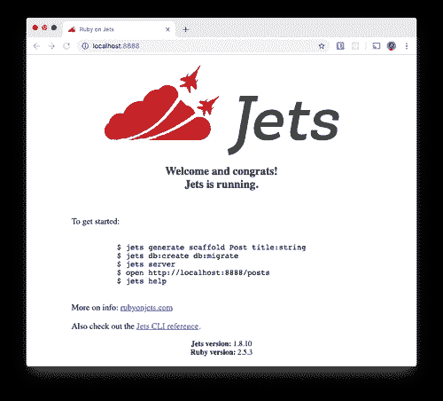
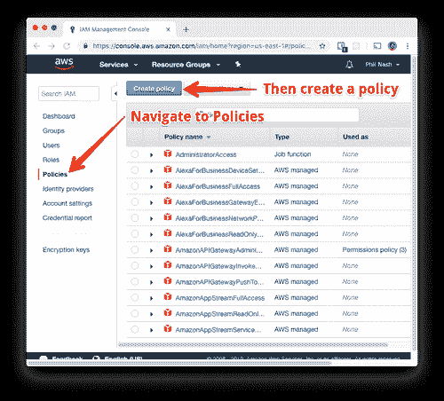
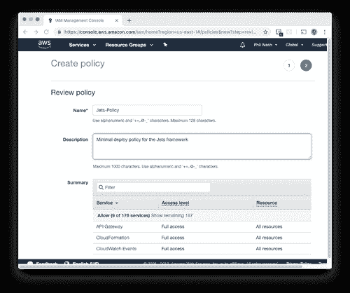
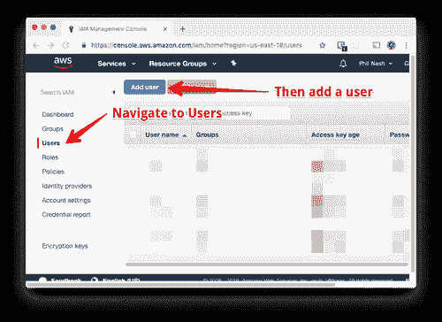
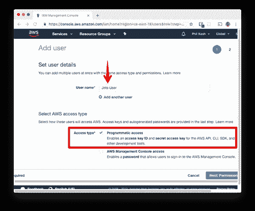
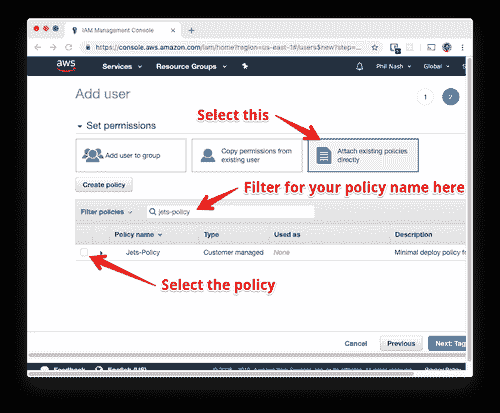
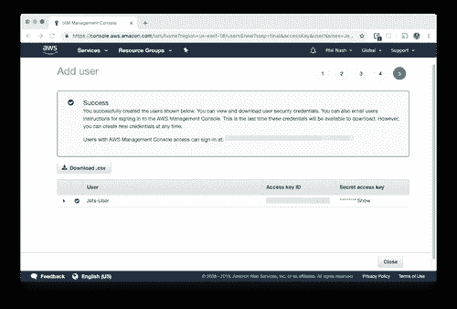
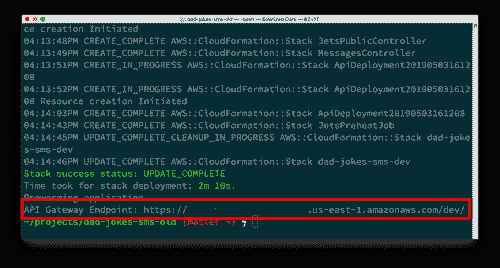
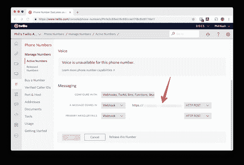

# 使用 Jets 框架的 AWS Lambda 上的无服务器 Ruby

> 原文：<https://dev.to/twilio/serverless-ruby-on-aws-lambda-with-the-jets-framework-2g24>

当 AWS 在 2014 年推出λ时，没有人喜欢 Ruby。Python、Node.js 和 Java 等平台开启了在云中托管和运行功能的[无服务器](https://www.twilio.com/docs/glossary/what-is-serverless-architecture)革命。2018 年底，终于推出了对 Ruby 的支持。

你可以使用原始函数和[无服务器应用模型(SAM)模板](https://docs.aws.amazon.com/serverless-application-model/latest/developerguide/what-is-sam.html)来构建 Ruby on Lambda，如[的《Ruby on Lambda 入门指南](https://aws.amazon.com/blogs/compute/announcing-ruby-support-for-aws-lambda/)中所述，但是 Ruby 完全是为了开发者的快乐，当配置文件比你的程序长时，这个过程可以被描述为痛苦的。进入 [Jets 框架](http://rubyonjets.com/)，这是一个“利用 Ruby 的力量让每个人都享受无服务器服务”的框架

[](https://res.cloudinary.com/practicaldev/image/fetch/s--8xBWUV7r--/c_limit%2Cf_auto%2Cfl_progressive%2Cq_auto%2Cw_880/https://s3.amazonaws.com/com.twilio.prod.twilio-doimg/MbSU26tM8FMRwHQ6hwnjPgtiseMlWDonId63c_uWs-eNUd.width-500.png)

## 从铁轨到喷气机

Jets 将构建 [Rails 应用](https://rubyonrails.org/)的经验与部署到 AWS Lambda 和相关服务的能力相结合，包括 [API 网关](https://aws.amazon.com/api-gateway/)、 [S3](https://aws.amazon.com/s3/) 和 [DynamoDB](https://aws.amazon.com/dynamodb/) 。在这篇文章中，我们将看到如何开始使用 Jets 并部署一个用 Ruby 编写的 Lambda 驱动的 Twilio 应用程序。

## 我们在建造什么

为了保持简单，我们将建立一个基于 SMS 的应用程序，并使它更有趣，我们将包括一个小幽默。当你向应用程序发送文本时，它会用一个糟糕的笑话来回应。抱歉，我拼错了，我指的是一个*爸爸*的笑话，由 [icanhazdadjoke](https://icanhazdadjoke.com/) API 提供。

这个应用程序将向我们展示如何开始使用 Jets，创建控制器，动作和路线。我们将构建一个单一端点，当一个号码收到一条输入的 SMS 消息时，它会响应来自 Twilio 的 HTTP 请求。每次端点都会返回一个随机的爸爸笑话，接着就是欢声笑语。

## 你需要什么

要跟进这个项目，您需要:

*   Twilio 账户([在此注册免费账户](https://www.twilio.com/try-twilio)
*   [AWS 账户](https://aws.amazon.com/)
*   [安装了 Ruby 2.5](https://www.ruby-lang.org/en/downloads/)(Lambda 支持的版本)和 [Bundler](https://bundler.io/) 。如果你没有安装 Ruby 2.5，你可以使用这里列出的[工具来安装和管理你的 Ruby 版本](https://www.ruby-lang.org/en/documentation/installation/#installers)。

明白了吗？那我们开始吧。

## 入门

我们将从在全球安装`jets` gem 开始。在命令行上键入:

```
gem install jets 
```

Enter fullscreen mode Exit fullscreen mode

Jets 可执行文件可以像 Rails 一样作为一个生成器来启动一个新项目，然后在项目中运行命令。我们现在将创建一个新项目，但是考虑到我们在这篇文章中的范围，我们将对它进行一点限制。首先，我们将在 API 模式下创建项目，因为在这个应用程序中不需要 HTML 视图。这也避免了使用 [webpacker](https://github.com/rails/webpacker) 进行资产编译，这将节省我们的构建时间。我们也不需要数据库。运行以下命令创建一个新项目:

```
jets new dad-jokes-sms --mode api --no-database 
```

Enter fullscreen mode Exit fullscreen mode

一旦生成器完成运行，切换到`dad-jokes-sms`目录，使用下面的命令在本地运行您的应用程序:

```
jets serve 
```

Enter fullscreen mode Exit fullscreen mode

打开 [http://localhost:8888](http://localhost:8888) ，您将看到一个类似如下的页面:

[](https://res.cloudinary.com/practicaldev/image/fetch/s--G5eC1U0N--/c_limit%2Cf_auto%2Cfl_progressive%2Cq_auto%2Cw_880/https://s3.amazonaws.com/com.twilio.prod.twilio-doimg/5Ux-cijdn83L7eiOHmlJvLy2XYQ-j7cFTijkQTuKrFzTRE.width-500.png)

如果您看到此页面，那么您的新 Jets 项目正在成功运行。

## 我们的第一架战机控制器

现在我们有了一个 Jets 应用程序，我们可以使用 gem 来生成应用程序的各个部分，从模型和控制器到完整的脚手架。对于我们的应用程序，我们需要一个具有一个动作的控制器。用以下代码生成:

```
jets generate controller Messages create 
```

Enter fullscreen mode Exit fullscreen mode

生成器将为我们创建和编辑一些文件。我们需要检查新开辟的路线。

Jets 生成了一条`GET`路线，但 Twilio webhooks 默认会发出`POST`请求，我更喜欢保持这种方式。将应用程序设置为在`/messages`端点上接收`POST`请求 webhooks，如下所示:

```
Jets.application.routes.draw do
  post 'messages', to: 'messages#create'
  root "jets/public#show"

  # The jets/public#show controller can serve static utf8 content out of the public folder.
  # Note, as part of the deploy process Jets uploads files in the public folder to s3
  # and serves them out of s3 directly. S3 is well suited to serve static assets.
  # More info here: http://rubyonjets.com/docs/assets-serving/
  any "*catchall", to: "jets/public#show"
end 
```

Enter fullscreen mode Exit fullscreen mode

现在，让我们去写控制器动作。打开`app/controllers/messages_controller.rb`，你会看到`create`动作的一个方法。这个动作将接收我们的 Twilio webhook，并用 TwiML 作出响应，发回一个爸爸笑话。

### 逗爸爸笑话

要发送回一个爸爸笑话，我们需要调用[icanhazdaddjoke API](https://icanhazdadjoke.com/api)。让我们写一个快速的私有方法来实现这一点。

我们将使用`open-uri`，因为它有助于进行简单的 web 请求(包括[下载文件和图像](https://dev.to/twilio/how-to-download-image-files-in-ruby-4f2a))。如果我们要求的话，API 会用纯文本来响应，这样我们就不用做任何解析了。将以下内容添加到`MessagesController` :

```
require 'open-uri'

class MessagesController < ApplicationController
  def create
  end

  private

  def random_joke
    open('https://icanhazdadjoke.com/', { 'Accept' => 'text/plain' }).read
  end
end 
```

Enter fullscreen mode Exit fullscreen mode

现在我们准备以 TwiML 的身份把我们的笑话还给 Twilio。

### 返回 TwiML

我们将使用 twilio-ruby 助手库中的助手构建一个响应。打开`Gemfile`并添加`twilio-ruby` :

```
source "https://rubygems.org"

gem "jets"
gem "twilio-ruby" 
```

Enter fullscreen mode Exit fullscreen mode

在命令行上，运行`bundle install`来安装 gem。现在在`create`动作中实例化一个新的 TwiML 响应对象，使用 [`<Message>` TwiML 元素](https://www.twilio.com/docs/sms/twiml/message)回复传入的消息，并呈现 XML 响应，如下:

```
require 'open-uri'

class MessagesController < ApplicationController
  def create
    twiml = Twilio::TwiML::MessagingResponse.new
    twiml.message body: random_joke
    render xml: twiml.to_xml
  end

  private

  def random_joke
    open('https://icanhazdadjoke.com/', { 'Accept' => 'text/plain' }).read
  end
end 
```

Enter fullscreen mode Exit fullscreen mode

你可以在文档中阅读更多关于如何使用`twilio-ruby`助手库来生成 TwiML 的信息。

我们可以在本地运行这个来测试我们是否得到了预期的响应。如果您停止了应用程序，用`jets serve`再次启动它。使用`curl`向 localhost:8888/messages 发出一个`POST`请求，你会在 TwiML 响应:
中看到由[icanhazdadjocke](https://icanhazdadjoke.com/)提供的笑话

```
curl --data "" http://localhost:8888/messages
<?xml version="1.0" encoding="UTF-8"?>
<Response>
<Message>What’s the advantage of living in Switzerland? Well, the flag is a big plus.</Message>
</Response> 
```

Enter fullscreen mode Exit fullscreen mode

太好了，我们的 Jets 应用程序正在工作！现在将它部署到 AWS Lambda。

## 准备好部署了吗？我是！

要将我们的 Jets 应用程序部署到 AWS，我们首先需要用凭证设置我们的项目，以允许它访问 AWS 服务。这里的一个好的实践是创建一个用户，该用户具有完成所有需要的事情所需的最少数量的权限。Jets 文档描述了我们的用户需要的最小权限。在我们的 AWS 帐户中，我们将创建一个包含这些权限的策略，并为一个新用户分配该策略。然后，我们可以使用该用户的凭证来部署我们的应用程序。

在你的 [AWS 控制台](https://console.aws.amazon.com/console/home)中找到 *IAM* 服务(或者直接前往 *IAM* [部分](https://console.aws.amazon.com/iam/home))。

[](https://res.cloudinary.com/practicaldev/image/fetch/s--v58NM7ZX--/c_limit%2Cf_auto%2Cfl_progressive%2Cq_auto%2Cw_880/https://s3.amazonaws.com/com.twilio.prod.twilio-doimg/8v8dtoFQGT1xLEbege9lrVmCpy6wsbH8zOeEeYt0bC2lFH.width-500.png)

转到*策略*部分并创建一个新策略。

[](https://res.cloudinary.com/practicaldev/image/fetch/s--oFaai_zp--/c_limit%2Cf_auto%2Cfl_progressive%2Cq_auto%2Cw_880/https://s3.amazonaws.com/com.twilio.prod.twilio-doimg/h_Hjb1Mr3f4b9wdpQ29dIvqiWx2sMhtClfqCs841tHQtLU.width-500.png)

选择 JSON 选项卡，并从 Jets 文档中输入以下 JSON[:](http://rubyonjets.com/docs/extras/minimal-deploy-iam/#commands-summary) 

```
{  "Version":  "2012-10-17",  "Statement":  [  {  "Effect":  "Allow",  "Action":  [  "apigateway:*",  "cloudformation:*",  "dynamodb:*",  "events:*",  "iam:*",  "lambda:*",  "logs:*",  "route53:*",  "s3:*"  ],  "Resource":  [  "*"  ]  }  ]  } 
```

Enter fullscreen mode Exit fullscreen mode

单击查看策略，并为其命名。

[](https://res.cloudinary.com/practicaldev/image/fetch/s--6v8IGsud--/c_limit%2Cf_auto%2Cfl_progressive%2Cq_auto%2Cw_880/https://s3.amazonaws.com/com.twilio.prod.twilio-doimg/4jwzDK_cmz_1Et8KGGeiaBNxVVHs9QJwzP9xumd4tTgfHW.width-500.png)

保存策略。现在我们需要创建一个新用户，并将策略附加到它上面，授予它创建 Jets 需要部署的资源的权限。打开 *IAM* 控制台中的*用户*部分，创建一个新用户。

[](https://res.cloudinary.com/practicaldev/image/fetch/s--RVTRnHeS--/c_limit%2Cf_auto%2Cfl_progressive%2Cq_auto%2Cw_880/https://s3.amazonaws.com/com.twilio.prod.twilio-doimg/3dt4UQR8aYoKlckCHlw113K3jxhHCGMRJ2rhPDGI1peBow.width-500.png)

给用户一个名字，选择*访问类型*的*程序化访问*。

[](https://res.cloudinary.com/practicaldev/image/fetch/s--wwFMlFNO--/c_limit%2Cf_auto%2Cfl_progressive%2Cq_auto%2Cw_880/https://s3.amazonaws.com/com.twilio.prod.twilio-doimg/usEXv2bqNxbt3FPo0nJAkKEvm0YUTs62el40415Uu7e2ys.width-500.png)

点击*下一步*为您的新用户选择权限。选择*直接附加现有策略*并过滤您刚刚创建的策略的名称。选择该策略并点击*下一步*。

[](https://res.cloudinary.com/practicaldev/image/fetch/s--d-QDONTL--/c_limit%2Cf_auto%2Cfl_progressive%2Cq_auto%2Cw_880/https://s3.amazonaws.com/com.twilio.prod.twilio-doimg/JORcX2AMUcp2pITsVXjLbxXpPNsO_obGu2lhRYjEzC83X8.width-500.png)

点击*下一步*，直到到达成功页面。

[](https://res.cloudinary.com/practicaldev/image/fetch/s--j0UAcVU2--/c_limit%2Cf_auto%2Cfl_progressive%2Cq_auto%2Cw_880/https://s3.amazonaws.com/com.twilio.prod.twilio-doimg/XNdTXkfWx0BCu-UDHI1HZZBI_TOLxJ0u4qh9rYQTmMyTGr.width-500.png)

保存最后一个屏幕的*访问密钥 ID* 和*秘密访问密钥*。我们需要他们一起部署。现在我们准备部署。

## 部署到 Lambda

在命令行输入:

```
AWS_ACCESS_KEY_ID=YOUR_USER_KEY AWS_SECRET_ACCESS_KEY=YOUR_USER_SECRET_KEY jets deploy 
```

Enter fullscreen mode Exit fullscreen mode

Jets 将使用凭证作为环境变量来设置您的 AWS 帐户中的所有资源以运行应用程序。这需要一点时间，但当它完成时，您将有一个运行您的应用程序的 URL。

[](https://res.cloudinary.com/practicaldev/image/fetch/s--473dkMDb--/c_limit%2Cf_auto%2Cfl_progressive%2Cq_auto%2Cw_880/https://s3.amazonaws.com/com.twilio.prod.twilio-doimg/D1fQn-0PRn7qXbHYvuIQT-vyo0jiar9lzG4BnVQ9ZY7wwx.width-500.png)

您会注意到它被部署到一个“开发”环境中。你可以在文档中阅读更多关于 Jets 如何处理环境的信息。

我们现在可以使用`curl`测试这个 URL。记住我们使用路由`/messages`,所以将它添加到 API 网关端点的末尾，并发出一个`POST`请求。

```
$ curl --data "" https://YOUR_API_GATEWAY_ENDPOINT/messages
<?xml version="1.0" encoding="UTF-8"?>
<Response>
<Message>I knew a guy who collected candy canes, they were all in mint condition</Message>
</Response> 
```

Enter fullscreen mode Exit fullscreen mode

现在，为了让爸爸随时随地都能讲笑话，让我们把这个和一个 Twilio 数字联系起来。

## 老爸短信笑话

进入你的 [Twilio 控制台](https://www.twilio.com/console)查看你的[活动电话号码](https://www.twilio.com/console/phone-numbers/incoming)。如果您已经有一个想要使用的号码，请对其进行编辑，否则请购买一个可以接收短信的新号码。在*字段中，会出现一条消息*，输入您的应用程序 URL。

[](https://res.cloudinary.com/practicaldev/image/fetch/s--IBVW1xFW--/c_limit%2Cf_auto%2Cfl_progressive%2Cq_auto%2Cw_880/https://s3.amazonaws.com/com.twilio.prod.twilio-doimg/4cnCTI_Ww8IL6cgeyp-zlAIVlx6V_hvvdrT1ocjHfFgsTL.width-500.png)

保存您的号码并向其发送消息。你应该得到一个爸爸的笑话作为回应。现在，为了庆祝，去告诉附近的人这个笑话，让我知道他们是笑还是呻吟。

## 无服务器喜剧

在这篇文章中，我们已经看到了如何开始使用 Jets 编写可以部署到 AWS Lambda 的 Ruby 应用程序。你可以在 GitHub 上看到完整的[项目。](https://github.com/philnash/dad-jokes-jets)

Jets 可以帮助你完成的事情还有很多，包括响应[事件](http://rubyonjets.com/docs/events/)、[在数据库中存储数据](http://rubyonjets.com/docs/database-support/)，甚至[运行你现有的 Rails 应用](http://rubyonjets.com/docs/rails-support/)。查看 Jets 文档中的这些文章，了解更多关于 Jets 的内容。

你对在无服务器环境中运行 Ruby 感到兴奋吗？你对喷气机有什么看法？请在评论中告诉我，或者在 Twitter 上给我留言，地址: [@philnash](https://twitter.com/philnash) 。也可以和我分享你最喜欢的爸爸笑话！