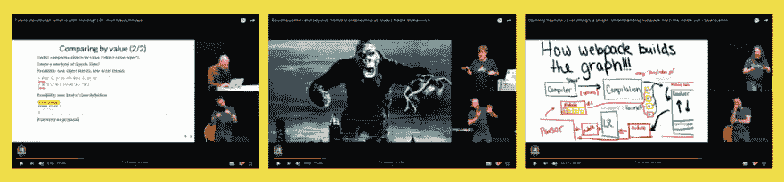

# 2019 年 3 月的会议记录

> 原文：<https://dev.to/jskongress/session-recordings-from-march-2019-4e0e>

<figure>

<figcaption>jsk 19 的第一批视频已经在我们的 YouTube 频道上:Axel Rauschmayer 的“未来 JavaScript”，Nadia Makarevich 的“大规模前端工程”，Sean Larkin 的“由内而外理解 web pack”</figcaption>

</figure>

【5 月 10 日最后更新】所有#jskongress 2019 的视频都将免费提供，全程免费。第一次会议已经开始，更多的录音将在周五每周一次添加。

时事通讯订阅者可以每隔一周的周四(从 2005 年 4 月开始)获得**独家视频预览。敬请关注— [在这里注册订阅我们的时事通讯。](https://js-kongress.us13.list-manage.com/subscribe/post?u=9c3420f6b5269855b07422fb5&id=f490a69da5)**

来自 JS Kongress 2019 的所有视频也可供聋人和听力受损者使用:**手语翻译**克里斯蒂安(DGS)在整个持续时间内可见，并且**字幕**可用。[在这篇博文中认识克里斯蒂安。](https://medium.com/@jskongress/jskongress-for-the-deaf-community-dc8dc69b373c)

这些视频现在可用(状态 2019-04-16)-在我们的 [YouTube 播放列表“JS Kongress 2019”](https://www.youtube.com/playlist?list=PL8ajgHZ7PoCviKPAFTeYRkp7cDAm6ZC50)中找到所有视频

<figure> 

<figcaption>[肖恩·拉金](https://medium.com/u/393110b0b9e4)</figcaption>

</figure>

[开幕主题演讲|一切都是插件:从内到外理解 web pack | Sean Larkin](https://youtu.be/H3g0BdyVVxA)

<figure> 

<figcaption>[马卡列维奇](https://medium.com/u/bcdf0570e41c)</figcaption>

</figure>

[分解与超越:大规模前端工程| Nadia Makarevich](https://youtu.be/UsEaqeUbNQo)

<figure> 

<figcaption>[阿克塞尔·劳施迈尔](https://medium.com/u/7fab51e62203)</figcaption>

</figure>

未来的 JavaScript:还缺少什么？阿克塞尔·劳施迈尔博士

<figure> 

<figcaption>[埃里克【温德尔】](https://medium.com/u/a0d7369532ea)</figcaption>

</figure>

[使用 Kubernetes 和 Docker | Erick 温德尔扩展 Node.js 应用程序](https://youtu.be/ZgMAYQmSJO4)

<figure> 

<figcaption>[内塔邦迪](https://medium.com/u/741877312965)</figcaption>

</figure>

[剖析一款完全功能反应式的 JavaScript 应用| Netta Bondy](https://youtu.be/tchjAe0udO0)

<figure> 

<figcaption>抢理</figcaption>

</figure>

[流式 HTTP 和 GraphQL | Rob Richard](https://youtu.be/MzRwwmKnrNQ)

<figure> 

<figcaption>[【玛丽亚】](https://medium.com/u/d2c23995f29)</figcaption>

</figure>

[开幕主题演讲:灯后馅饼的大块| Maria Shoaib](https://youtu.be/tdqoj7DZK9c)

2019 年 3 月的后[会议记录首先出现在](https://js-kongress.com/2019/04/10/session-recordings-from-march-2019/) [JS KONGRESS 2020:扩展 JS-推动极限:大规模平台，数据驱动的架构和现代 API。](https://js-kongress.com)。