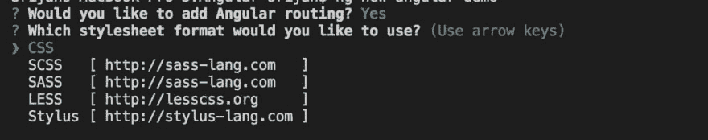
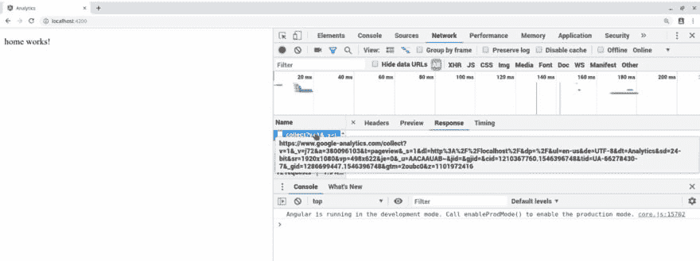

# 为角度应用设置 Google Analytics

> 原文：<https://dev.to/yashints/setting-google-analytics-for-angular-applications-45k6>

很多时候，我们希望在我们的应用程序中添加一些分析，对我来说，最明显的选择是谷歌分析。

谷歌正在逐步淘汰 Google Analytics 附带的传统产品`ga.js`和`analytics.js`，以及 Google Tag Manager 附带的更加灵活的新全球网站标签**`gtag.js`。**

 **因此，让我们看看如何设置它，我向您保证，它会非常快。

## 从 Google Analytics 获取跟踪 id

如果您已经在 [Google Analytics](https://analytics.google.com) 中拥有了一个属性，只需从管理仪表板的属性列表中获取即可。如果没有，按照[这些步骤](https://support.google.com/analytics/answer/1042508?hl=en)创建一个。

跟踪 id 通常采用以下形式:

> UA-XXXXXXXXX-X

在同一个地方，你可以点击跟踪代码页，你会看到一个代码片段，你可以复制并放入你的`index.html`文件:

```
<!-- Global site tag (gtag.js) - Google Analytics -->
<script async src="https://www.googletagmanager.com/gtag/js?id=UA-XXXXXXXXX-X"></script> <script>
  window.dataLayer = window.dataLayer || [];
  function gtag(){dataLayer.push(arguments);}
  gtag('js', new Date());

  gtag('config', 'UA-XXXXXXXXX-X');
</script> 
```

Enter fullscreen mode Exit fullscreen mode

我们不需要最后一行，因为将从我们的应用程序配置它。所以去掉:

```
<!-- Global site tag (gtag.js) - Google Analytics -->
<script async src="https://www.googletagmanager.com/gtag/js?id=UA-XXXXXXXXX-X"></script> <script>
  window.dataLayer = window.dataLayer || [];
  function gtag(){dataLayer.push(arguments);}
  gtag('js', new Date());
</script> 
```

Enter fullscreen mode Exit fullscreen mode

## 配置我们的项目

如果您有一个现有的应用程序，只需忽略安装过程。我将创建一个新的应用:

```
ng new analytics 
```

Enter fullscreen mode Exit fullscreen mode

从这里选择“是”进行路由:

[](https://res.cloudinary.com/practicaldev/image/fetch/s--BujHox4O--/c_limit%2Cf_auto%2Cfl_progressive%2Cq_auto%2Cw_880/https://thepracticaldev.s3.amazonaws.com/i/o0qqwmy1urnxndjsjzci.jpg)

在捕捉水疗应用的变化时，倾听路线和事件的变化非常重要。理想情况下，我们会听取这些信息并将其发送给分析部门，但我们希望在整个应用程序中只做一次。

最好的地方是在根组件中。所以，打开你的`AppComponent`，添加下面的代码:

```
import { filter } from 'rxjs/operators';

declare var gtag;

export class AppComponent {
  constructor(router: Router) {
    const navEndEvents = router.events.pipe(
      filter(
        event => event instanceof NavigationEnd
      )
    );

    navEndEvents.subscribe(
      (event: NavigationEnd) => {
        gtag('config', 'UA-XXXXXXXXX-X', {
          page_path: event.urlAfterRedirects,
        });
      }
    );
  }
} 
```

Enter fullscreen mode Exit fullscreen mode

我们在这里没有做任何特别的事情，首先，我们在构造函数中得到一个对 router 的引用。然后我们过滤它的事件，只得到导航结束事件。

之后，我们订阅这些，使用来自 Google Analytics 代码片段的一个 liner，并为其添加一个参数，这就是它的`URL`。

现在让我们通过定义一些路线来测试它:

```
const routes: Routes = [
  { path: '', component: HomeComponent },
  { path: 'about', component: AboutComponent },
];

@NgModole({
  imports: [RouterModule.forRoot(routes)],
  exports: [RouterModule],
})
export class AppRoutingModile {} 
```

Enter fullscreen mode Exit fullscreen mode

仅此而已。如果您从命令行使用`ng serve`启动应用程序，您应该开始在您的分析仪表板中接收事件。

[](https://res.cloudinary.com/practicaldev/image/fetch/s--tTA4xpAQ--/c_limit%2Cf_auto%2Cfl_progressive%2Cq_auto%2Cw_880/https://thepracticaldev.s3.amazonaws.com/i/m8etgwdwwjdpu1qsrz43.jpg)**