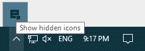
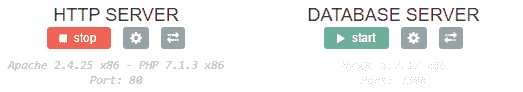

# 用 DEVSERVER 在 WINDOWS 上建立完整的 PHP 开发环境

> 原文：<https://dev.to/laurentabbal/setting-up-a-complete-php-development-environment-on-windows-with-devserver-42ln>

# A .入门

## 1。下载 Devserver

首先，您需要下载并安装 [Devserver](https://www.easyphp.org/easyphp-devserver.php)

## 2。安装

*   双击下载的可执行文件
*   选择一个安装文件夹，并按照说明进行操作

## 3。安装后

*   在您的桌面上创建了`Devserver`的快捷方式
*   使用此快捷方式启动`Devserver`(或者转到安装文件夹并点击`run-devserver.exe`)
*   当`Devserver`启动时，一个图标出现在[通知区](https://en.wikipedia.org/wiki/Notification_area)(时钟旁边)——如果你没有看到图标，点击`Show hidden icons`并将图标移动到时钟旁边。
*   右键/左键点击可进入各种菜单或

## 4。启动 HTTP 服务器

两种方式:

*   右键/左键点击通知区域的图标，点击`Open Dashboard`，在 **HTTP 服务器**下点击`start`
    [](https://res.cloudinary.com/practicaldev/image/fetch/s--hAG3KPzP--/c_limit%2Cf_auto%2Cfl_progressive%2Cq_auto%2Cw_880/https://www.easyphp.org/documentation/devserver/img/getting-started_05.png)

*   如果不需要打开仪表板，点击`Servers` > `Start / Restart HTTP Server`或`Start / Restart All Servers`(使用此选项，数据库服务器也将启动)。

[](https://res.cloudinary.com/practicaldev/image/fetch/s--1uur34IS--/c_limit%2Cf_auto%2Cfl_progressive%2Cq_auto%2Cw_880/https://www.easyphp.org/documentation/devserver/img/getting-started_04.png)

## 5。启动数据库服务器

两种方式:

*   右键/左键点击通知区域的图标，点击`Open Dashboard`，在**数据库服务器**下点击`start`
*   如果不需要打开仪表板，点击`Servers` > `Start / Restart Database Server`或`Start / Restart All Servers`(使用此选项，http 服务器也将启动)。

# B .设置环境

您的文件必须存储在服务器知道的文件夹中。两种选择:直接放在服务器文档根(“`Portable Directory`”)或者使用“【T1”)。

## 1。选项 1:“`Portable Directory`”

如果您计划将`Devserver`用作便携式服务器，请使用此选项。这意味着`Devserver`安装在一个便携式设备上(u 盘，记忆棒...)并且您在几台计算机上使用它(用于开发、演示、演示...).

将您的文件保存在此文件夹:*<server-install-folder>\ eds-www*中，并通过`Dashboard` ( `Portable Directory`部分)或直接在以下地址打开它们: *http://127.0.0.1/* (如果您选择了 80 以外的端口，请使用 *http://127.0.0.1:8080/* 如果 8080 是您的端口，请相应地更改值)。

## 2。选项 2:“`Working Directories`”

*   创建要存储文件的文件夹。该文件夹可以在计算机上的任何位置(驱动器 C:，D:...).
*   用你的浏览器打开`Dashboard`(*http://127 . 0 . 0 . 1:1111*，点击`+ add directory`
*   填写字段，点击`save`并等待几秒钟(如果服务器正在运行，则需要重启)。

现在，您可以通过`Dashboard` ( `Working Directories`部分)用浏览器打开您的文件。

## 3。你的第一页

有许多合适的代码编辑器(专门针对带有语法突出显示的代码的文本编辑器)。可以用记事本++([https://notepad-plus-plus.org/](https://notepad-plus-plus.org/))、崇高文字([https://www.sublimetext.com/](https://www.sublimetext.com/))、原子([https://atom.io/](https://atom.io/))...
步骤:

*   打开代码编辑器
*   创建新文件
*   键入 HTML 页面的结构:

```
<!doctype html>
<html lang="en">
    <head>
    <meta charset="utf-8">
    Your page
    </head>
    <body>
        ...
    </body>
</html> 
```

*   添加您的 PHP 代码(例如显示日期):

```
<?php
echo "The current date is ";
echo date("l F d, Y");
?> 
```

最终代码:

```
<!doctype html>
<html lang="en">
    <head>
    <meta charset="utf-8">
    Your page
    </head>
    <body>
    <?php
    echo "The current date is ";
    echo date("l F d, Y");
    ?>
    </body>
</html> 
```

*   将您的页面保存在“`Portable Directory`”或“`Working Directories`”中声明的文件夹中。不要忘记给它适当的扩展:`.php`。您可以将文件命名为`date.php`。警告:确保你的系统显示文件扩展名(阅读[这个](https://support.microsoft.com/en-us/help/865219/how-to-show-or-hide-file-name-extensions-in-windows-explorer))。
*   通过`Dashboard`用浏览器打开文件。您的浏览器应该显示如下内容:

```
The current date is Sunday April 2, 2017 
```

## 4。催单

Devserver 不是设计用来作为生产服务器的，而是作为开发服务器的，在将页面移动到托管服务器之前对其进行离线测试。事实上，Apache for Windows 是一个测试版本，不能保证最佳操作(可靠性、负载上升，...)与基于 Unix/Linux 的平台相反。