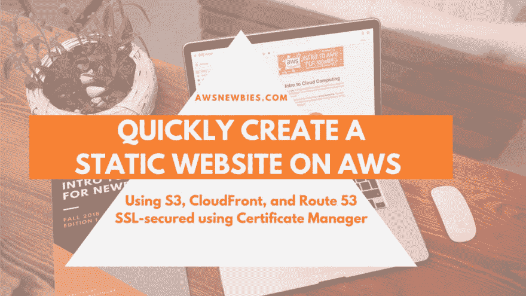
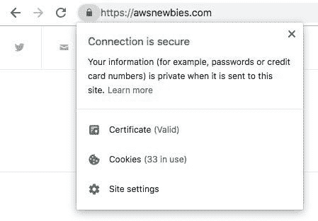
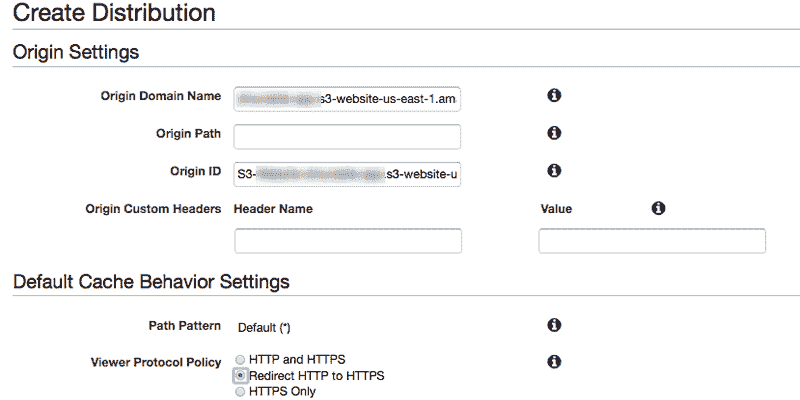
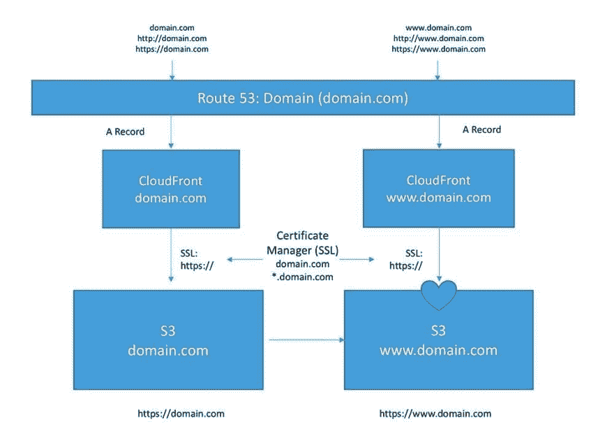

# 在 S3 自动气象站为新手建立一个静态网站

> 原文：<https://dev.to/hiro/setting-up-a-static-website-on-aws-s3-for-newbies-1kmc>

[](https://res.cloudinary.com/practicaldev/image/fetch/s--wumeUvWt--/c_limit%2Cf_auto%2Cfl_progressive%2Cq_auto%2Cw_880/https://thepracticaldev.s3.amazonaws.com/i/ek2v4re17ini1nfk7ydj.png)

**最初发表于 [AWS 新手](https://awsnewbies.com/s3-website-route-53-cloudfront/)T3。**

* * *

在这里，我们将建立一个静态网站(想象一下 *HTML* 和 *CSS* 并且没有移动部件)，托管在**亚马逊网络服务(AWS)** **S3** 上，可以通过自己的域在*domain.com*访问，受 SSL 保护(想象一下 *https://* 而不是 *http://* )。

任何在浏览器上输入*domain.com*的人都会被转发到*[https://www.domain.com](https://www.domain.com)*，这样你就可以拥有那把花哨的“你的连接是安全的”锁了！

[](https://res.cloudinary.com/practicaldev/image/fetch/s--eivT7Ikd--/c_limit%2Cf_auto%2Cfl_progressive%2Cq_auto%2Cw_880/https://thepracticaldev.s3.amazonaws.com/i/2n67ywwb9r39hhl5ryiz.jpg)

如果你对 AWS 完全陌生，我建议你在开始之前先看一下[AWS 新手入门电子书](https://awsnewbies.com/intro-to-aws-ebook/)。如果你只是想知道如何创建静态网站，请继续阅读！

我们将通过 AWS 的域名注册商 **Route 53** 来设置注册域名的网站。

* * *

# 在 53 路注册域名建立网站

## 使用路线 53 购买域名

*   前往 **Route 53** 并按照提示花费 12 美元购买一个新域名

## 向 AWS 证书管理器(ACM)请求 SSL 证书

*   前往 **AWS 证书管理器(ACM)** 为【www.domain.com】[和申请证书](http://www.domain.com)
*   将*domain.com*作为另一个域名，使用相同的认证进行保护
*   选择 DNS 验证，并通过“在路线 53 中创建记录”进行验证
*   大约 30 分钟后确认验证完成

## 在 S3 创建网站

我在 **S3** 这里复习了如何上传一个静态网站:[如何和 S3](https://awsnewbies.com/static-website-s3/) 一起主持一个静态网站

*   进入 S3，创建两个桶:*domain.com*和*T3】www.domain.comT5*
*   设置*domain.com*S3 斗重定向到*T3】www.domain.comT5*
*   协议应设置为 *https*
*   该网站将在**【S3】举办**斗
*   在*[【www.domain.com】](http://www.domain.com)*斗中，设置**斗策略**到[本](https://docs.aws.amazon.com/AmazonS3/latest/dev/WebsiteAccessPermissionsReqd.html):

```
{
    "Version":"2012-10-17",
    "Statement":[
        {
            "Sid":"PublicReadGetObject",
            "Effect":"Allow",
            "Principal": "*",
            "Action":["s3:GetObject"],
            "Resource":["arn:aws:s3:::www.domain.com/*"]
        }
    ]
} 
```

以下是 AWS 关于如何工作的文档:[使用自定义域](https://docs.aws.amazon.com/AmazonS3/latest/dev/website-hosting-custom-domain-walkthrough.html)建立一个静态网站。

## 创建新的 CloudFront 发行版

[](https://res.cloudinary.com/practicaldev/image/fetch/s--IudQxRhS--/c_limit%2Cf_auto%2Cfl_progressive%2Cq_auto%2Cw_880/https://thepracticaldev.s3.amazonaws.com/i/hjnr85k8mo1748e4dn5r.png)

### 为 domain.com*创建云锋分布*

*   转到 CloudFront 并创建一个新的发行版
*   选择*“Web”*作为交付方式
*   从下拉菜单中获取*domain.com*S3 桶的端点 URL 以设置为**源域名**而不是桶
*   前往… **S3 - >斗名- >属性- >静态网站托管**
    *   看起来大概是:*[http://xyzwxyz-12 rdklfj 3 e-us-east-1 . S3-website-us-east-1 . Amazon AWS . com](http://xyzwxyz-12rdklfj3e-us-east-1.s3-website-us-east-1.amazonaws.com)*
*   将 SSL 证书设置为刚刚用 **ACM** 验证的证书
*   使所有的 *HTTP* 重定向到 *HTTPS*
*   输入*domain.com*为 **CNAME**
*   将所有其他内容保留为默认值
*   这也需要一段时间来完成

### 用相同的设置为创建另一个 CloudFront 分布

*   输入*[www.domain.com](http://www.domain.com)T3】为 CNAME*

这里是 AWS 关于如何创建这个发行版的文档:[用 Amazon CloudFront](https://docs.aws.amazon.com/AmazonS3/latest/dev/website-hosting-cloudfront-walkthrough.html) 加速你的网站。

# 在 53 号路线上创建一条记录

返回到 **Route 53** 并创建 **A 记录**指向新的 **CloudFront** 分布。

*   为 domain.com*的*创建**记录**，并将其指向 domain.com*的**云锋**分布*
*   为创建**条记录**，并将其指向 **CloudFront** 分配给
*   两者都可以在*“别名”*下的下拉列表中找到

下面是 AWS 关于这是如何工作的文档:[对 DNS 使用 Route 53](https://docs.aws.amazon.com/Route53/latest/DeveloperGuide/migrate-dns-domain-in-use.html)。

# 架构是什么样子的？

我在 [Twitch](https://www.twitch.tv/hirokotech) 上流式传输这个设置，我意识到有一个我们正在构建的架构的图表会很好！

我们已经设置了两套 **CloudFront** 分发和 **S3** 桶来路由所有不同类型的流量，最终在【https://www.domain.com】T5T7】结束。

在下面，你可以看到重定向是如何为那些试图使用不同的 www 组合访问你的网站的人工作的。、 *http://* 和 *https://* 。

[](https://res.cloudinary.com/practicaldev/image/fetch/s--VDjQPBzt--/c_limit%2Cf_auto%2Cfl_progressive%2Cq_auto%2Cw_880/https://thepracticaldev.s3.amazonaws.com/i/lv44s0u5r8tmmw3phl90.jpg)

# 就是这样！

就是这样！整个过程应该需要 30 分钟到 1 小时(主要是因为这些东西加载需要时间。这是最初发表在我的**AWS**网站、 [**AWS 新手**](https://awsnewbies.com) 上的。这里可以阅读原文[。](https://awsnewbies.com/s3-website-route-53-cloudfront/)

如果您对其他介绍云计算和 AWS 的文档和资源感兴趣，这里是我的一些其他项目:

*   [面向非工程师的 AWS 介绍:1 云概念](https://www.lynda.com/courtwise-tutorials/Introduction-AWS-Non-Engineers-1-Cloud-Concepts/808676-2.html)| Lynda.com[的视频课程](https://www.lynda.com/courtwise-tutorials/Introduction-AWS-Non-Engineers-1-Cloud-Concepts/808676-2.html)
*   [AWS 新手入门](https://awsnewbies.com/intro-to-aws-ebook/)| awsnewbies.com[电子书](https://awsnewbies.com)
*   [AWS 新手入门](https://awsnewbies.com/intro-to-aws/) | *免费*awsnewbies.com[时事通讯课程](https://awsnewbies.com)