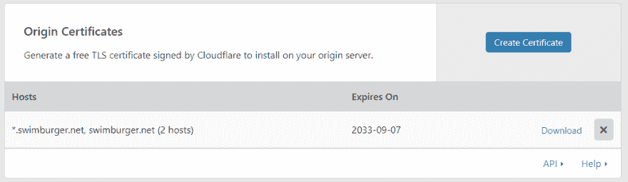
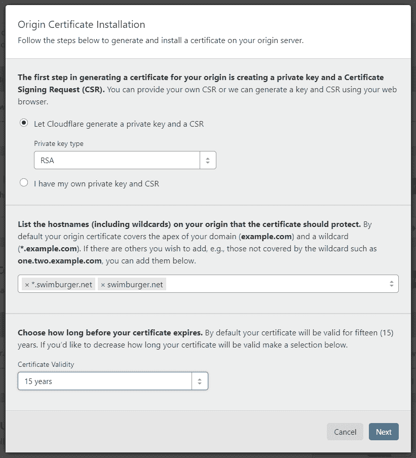
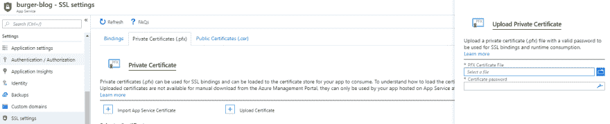
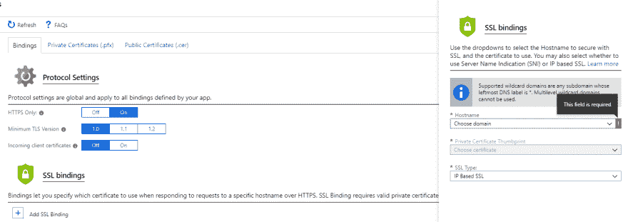
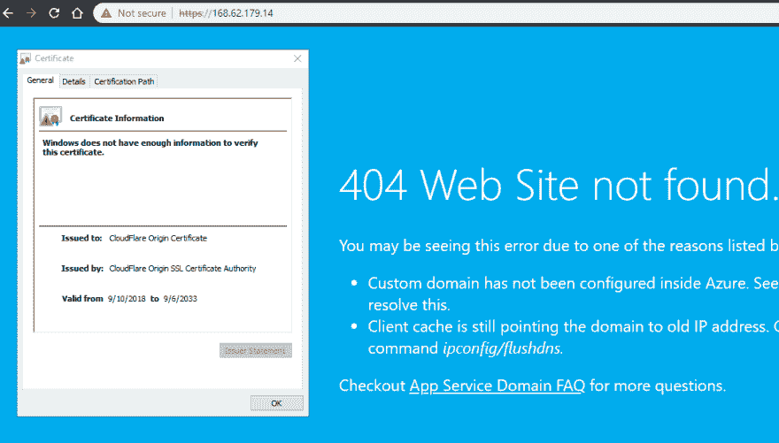

# 使用 Azure 应用服务设置 Cloudflare 全通用 SSL/TLS/HTTPS

> 原文：<https://dev.to/swimburger/setting-up-cloudflare-full-universal-ssl-tls-https-with-an-azure-app-services-2jk8>

Cloudflare 有许多服务可以帮助加快您的 web 属性、进行全球扩展、保护您的站点等等。其中一项服务为你的网站提供免费证书，为你的访问者提供安全的连接。这个 Cloudflare 服务被称为**通用 SSL。确保你的网站覆盖 HTTPS 是绝对必要的。如果你不相信，看看这个网站:【doesmysiteneedhttps.com[。](https://doesmysiteneedhttps.com/)**

在这篇文章中，我们将为 Windows Azure Web 应用程序设置 Cloudflare Full (strict) SSL。

## Cloudflare Universal SSL

在启用通用 SSL 之前，您的站点必须配置为使用 Cloudflare 的 DNS。当您的域名解析为 Cloudflare 的 DNS 服务器时，Cloudflare 将位于您的 web 服务器和您的访问者之间。这样，Cloudflare 可以修改请求和响应，基本上充当“中间人”或代理。Cloudflare 不会让恶意的“中间人”将您的隐私置于风险之中，而是通过他们的服务来丰富您的站点，而无需在您端进行任何代码更改。

设置通用 SSL 后，Cloudflare 将提供必要的证书来提供安全连接。您可以在 3 种不同模式下配置通用 SSL(不包括默认关闭模式):

1.  灵活的
2.  全部
3.  完全(严格)

使用**灵活的**选项时，数据将在客户端和 Cloudflare 服务器之间安全传输。尽管当 Cloudflare 将请求传递到您的服务器时，这仍然会通过不安全的 HTTP 连接发生。这种配置当然会让谷歌考虑你的网站使用“HTTPS ”,并对你进行相应的排名，但它不能为你提供完整的端到端加密流量。虽然这可以防止有人嗅探和改变不安全的咖啡店 WIFI 上的流量，但流量仍然可以在 Cloudflare 和您的服务器之间被嗅探。

如果您希望在 Cloudflare 和您的服务器之间加密流量，您需要使用**完全**或**完全(严格)**选项。“灵活”几乎不需要配置，而“完整”则需要更多的设置工作。为了加密 Cloudflare 和您的服务器之间的流量，您需要在您的服务器上安装 TLS 证书。使用“完整”选项时，证书将用于设置安全连接，但证书不会被 Cloudflare 验证。这意味着自签名或与您的域不匹配的证书也能正常工作。对于“完全(严格)”选项，您需要安装一个 TLS 证书，该证书与您的域匹配，并且受到证书颁发机构(CA)的信任。

一种替代方案是安装由 Cloudflare 提供的“原产地证书”,他们也会信任该证书。我们将使用 Cloudflare 的“原始证书”方法来设置**完全(严格)**。

## 使用 Azure 应用服务设置完全(严格)通用 SSL

### 先决条件

*   你的 Azure 应用服务使用 Cloudflare DNS
*   你的 Azure 应用服务定价层需要支持 IP SSL 绑定(支持 IP SSL 的最低定价层是 **S1**
*   安装在客户端机器上的 OpenSSL

注意:以下这些步骤是使用 Windows 操作系统执行的，Azure 应用服务也使用 Windows。

### 请求 Cloudflare 原产地证书

在这一点上，我假设您已经有了一个 Cloudflare 帐户，并通过他们的网络链接了您的站点以代理您的站点。前往“加密”标签，找到“原产地证书”部分。单击“创建证书”按钮。

[](https://res.cloudinary.com/practicaldev/image/fetch/s--dgHjEju1--/c_limit%2Cf_auto%2Cfl_progressive%2Cq_auto%2Cw_880/https://www.swimburger.net/media/1105/origin-certicates.png)

在我们的例子中，我们将让 Cloudflare 生成必要的密钥(RSA)。接下来，我们需要列出我们想要支持的域。您可以在域名中使用通配符，如下所示。

[](https://res.cloudinary.com/practicaldev/image/fetch/s--L109qbjm--/c_limit%2Cf_auto%2Cfl_progressive%2Cq_auto%2Cw_880/https://www.swimburger.net/media/1106/origin-certificates-installation.png)

点击下一步，将证书(域名. pem)和私钥(域名.密钥)复制到您的本地机器。确保两个文件都使用 ANSI 编码。如果需要，可以使用记事本保存 ANSI 编码的文件。

为了能够在 Azure 应用服务中设置 SSL，我们需要一个 pfx 证书。使用以下命令创建所需的 pfx 文件。系统会提示您输入密码，您将 pfx 上传到 Azure 时也需要使用该密码。

```
openssl pkcs12 -inkey domain-name.key -in domain-name.pem -export -out domain-name.pfx 
```

Enter fullscreen mode Exit fullscreen mode

现在我们有了我们的证书，请转到你的 Azure 应用服务并导航到“设置> SSL 设置>私有证书(。pfx)”。

点击“上传证书”按钮，上传您的 PFX 文件并输入您用来创建 PFX 证书的密码。

[](https://res.cloudinary.com/practicaldev/image/fetch/s--KHxe3hiG--/c_limit%2Cf_auto%2Cfl_progressive%2Cq_auto%2Cw_880/https://www.swimburger.net/media/1107/azure-app-service-ssl-settings.png)

现在切换回“Bindings”选项卡，并单击“Add SSL Binding”按钮。为您的域和子域创建一个基于 **IP 的 SSL** 绑定，并选择我们之前上传的 Cloudflare 证书。

[](https://res.cloudinary.com/practicaldev/image/fetch/s--T0JM4nIR--/c_limit%2Cf_auto%2Cfl_progressive%2Cq_auto%2Cw_880/https://www.swimburger.net/media/1108/azure-app-service-ssl-settings-bindings.png)

当你使用 HTTPS 浏览到你的 Azure 应用服务的 IP 地址时，你可能会被浏览器的警告吓到，但这没关系。检查证书细节，您会看到 Azure 正在提供我们需要的 Cloudflare 原始证书。

[](https://res.cloudinary.com/practicaldev/image/fetch/s--mOY0cVo4--/c_limit%2Cf_auto%2Cfl_progressive%2Cq_auto%2Cw_880/https://www.swimburger.net/media/1109/azure-app-service-cloudflare-certificate.png)

最后一步是返回到 Cloudflare，将 SSL 设置切换到 Strict (Full)。请记住，Cloudflare 可能需要一些时间(最多 24 小时)来颁发 SSL 证书。在 Cloudflare 完成颁发新证书后，您的站点应该从客户端到 Cloudflare 再到您的服务器进行完全加密。