# 如何为多个 git 帐户设置多个 SSH 密钥(MacOS + Windows)

> 原文：<https://dev.to/yashsway/setting-up-multiple-ssh-profiles-to-manage-multiple-git-accounts-macos-3m7m>

当我第一次遇到管理多个 git 账户的问题时，我在网上做了大量的研究。有很多有用的信息来源，但它们都缺少一些东西。我不得不把来自不同地方的信息拼凑起来。我把我所有的知识都集中在这里，传递给我的接力棒。😅

在我们开始之前，让我概述一下我将在本文中回答的几个问题。我将阐述:

1.  SSH 密钥储存在 Mac 的什么地方？什么是 RSA 密钥？
2.  什么是 SSH 配置，我如何设置它？
3.  什么是已知主机文件，什么是 id RSA 文件？
4.  如何管理我所有的 SSH 密钥？SSH 密钥到底是什么？

* * *

如果你想知道 SSH 是什么，我们不会在这里回答这个问题，但是欢迎你看一看 SSH 背后的组织的官方页面。这个页面非常有用和简洁。

MacOS 附带 SSH 的 **OpenSSH** 实现。你会注意到这个网站上的特别声明:

> OpenSSH 客户端程序被称为 SSH。SSH 客户端通常使用。用户主目录中的 ssh 目录。它还读取包含其系统范围配置的`/etc/ssh/ssh_config`。

出于本文的目的，我们不会担心本文中的系统级配置。在大多数 Unix / Linux 系统中，本地配置位于用户主目录的`.ssh`下。

## 📚吸收一些知识

<figure>

好吧，让我们找到它！启动你的终端，像这样直接进入`~/.ssh`:
[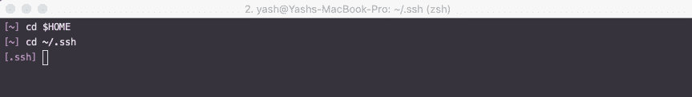](https://res.cloudinary.com/practicaldev/image/fetch/s--SAz2H7yH--/c_limit%2Cf_auto%2Cfl_progressive%2Cq_auto%2Cw_880/https://thepracticaldev.s3.amazonaws.com/i/3yw6m5dc2r8c4wc17yq0.jpg)

<figcaption>Make sure you’re in your root / home directory, then navigate to the .ssh folder</figcaption>

</figure>

<figure>

在这个文件夹中，您可能会看到几个文件，或者根本看不到。对我来说，这就是下面的样子。这是什么鬼话？
[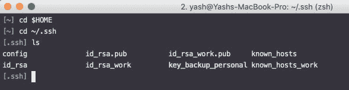T3】](https://res.cloudinary.com/practicaldev/image/fetch/s--yLXwbZGq--/c_limit%2Cf_auto%2Cfl_progressive%2Cq_auto%2Cw_880/https://thepracticaldev.s3.amazonaws.com/i/vy4k86df3q5k6sxiak7x.jpg)

<figcaption>Usually, you might find a known_hosts file here already. You might also have an id_rsa and an `id_rsa.pub file here.</figcaption>

</figure>

为了解释这些是什么，我们需要先谈谈[键](https://www.ssh.com/ssh/key/)。有几种类型:

*   **授权钥匙**和**身份钥匙**为*用户*钥匙。授权钥匙是*公共*钥匙，类似于锁。（🔒)身份钥匙是*私人*钥匙，类似于打开那把锁的钥匙。（🔑)
*   **主机密钥**用于主机认证，即您尝试连接的实体。它们是*公共*钥匙。（🔒)
*   `known_hosts`文件是 OpenSSH 存储或记忆以前连接过的主机的地方。它只记得主机密钥。
*   **会话**密钥加密连接中的数据。它们会更改每个会话，并使用主机密钥来生成或使用共同的共享密钥。

我们将在后面的文章中讨论密钥交换是如何工作的。

我们主要关心**身份密钥**和**主机密钥**。默认情况下，在没有选项的情况下生成的身份密钥看起来像是`id_<algorithm it was made with>`，通常位于这个`.ssh`文件夹中。 **RSA** 是最常用的算法，也是得到最广泛支持的算法，所以你会看到看起来像`id_rsa`的密钥。RSA 恰好也是默认算法。([如果您想了解其他算法](https://security.stackexchange.com/questions/23383/ssh-key-type-rsa-dsa-ecdsa-are-there-easy-answers-for-which-to-choose-when)的更多信息，请点击此处)

但是，在创建私钥时，可以指定任何文件名和任何位置。您还可以使用 SSH 客户端的`-i`选项提供一个指向其他地方的键的自定义路径。例如，`ssh -i /home/me/somepath/my-awesome-key ec2-user@awshost.amazon.com`在以`ec2-user`的身份向`awshost.amazon.com`打开安全外壳时，会使用来自文件`my-awesome-key`的私有密钥进行认证。

## 💻设置

是时候生成一个密钥了！要做到这一点，我们需要使用 ssh-keygen 命令用某种算法生成一个密钥。下面是我们将要运行的内容:

```
ssh-keygen -t rsa -f personal_key -b 2048 
```

Enter fullscreen mode Exit fullscreen mode

`-t`指定生成密钥的算法。`-f`为键指定一个自定义名称，如果是路径的形式，则指定一个替代位置。`-b`指定密钥的长度是多少位。默认情况下，ssh-keygen 将使用 2048 位长度的 RSA 算法。因此，我们真正需要做的就是指定一个自定义名称！

⚠️确保现有的`id_rsa`和`id_rsa`密钥对不存在。如果是这样，keygen 会询问您是否要覆盖。这将永久删除您可能在其他地方使用旧密钥！备份它，用不同的名称制作一个密钥，或者如果您确定，覆盖它。

<figure>

[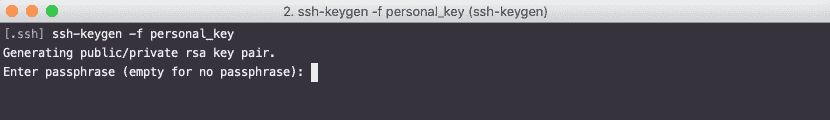](https://res.cloudinary.com/practicaldev/image/fetch/s--uUcq8Jtt--/c_limit%2Cf_auto%2Cfl_progressive%2Cq_auto%2Cw_880/https://thepracticaldev.s3.amazonaws.com/i/rcq6vrvmudmthz4cnhm6.jpg)

<figcaption>Run the command in the same folder you are in to generate a key in that location. A passphrase is a good idea!</figcaption>

</figure>

<figure>

确保您输入了简单的密码(🔐)你可以把它放在别的地方。
[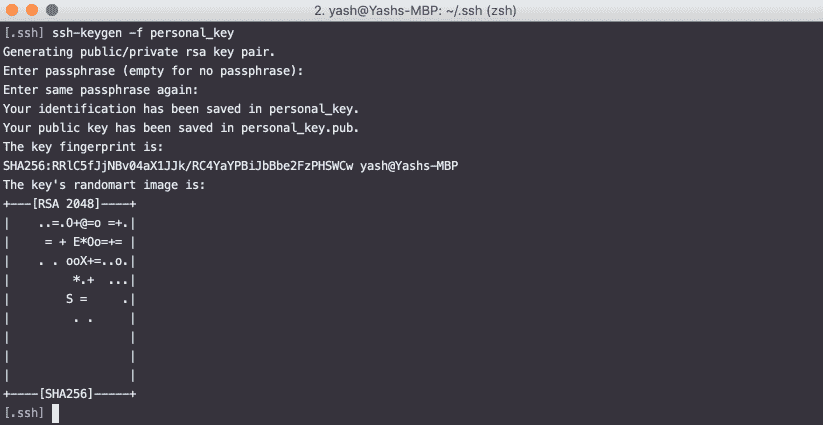T3】](https://res.cloudinary.com/practicaldev/image/fetch/s--ZkurJcvr--/c_limit%2Cf_auto%2Cfl_progressive%2Cq_auto%2Cw_880/https://thepracticaldev.s3.amazonaws.com/i/0q058r1mywf171ragai3.jpg)

<figcaption>If successful, you’ll see something like this.</figcaption>

</figure>

这将生成两个文件:`personal_key`和`personal_key.pub`。第一个是您的私钥(🔑)，第二个是你的公钥(🔒).

<figure>

现在，对您的工作帐户重复相同的过程。通过这种方式，您可以制作任意多的钥匙。但是对于这篇文章，我们再做一个。
[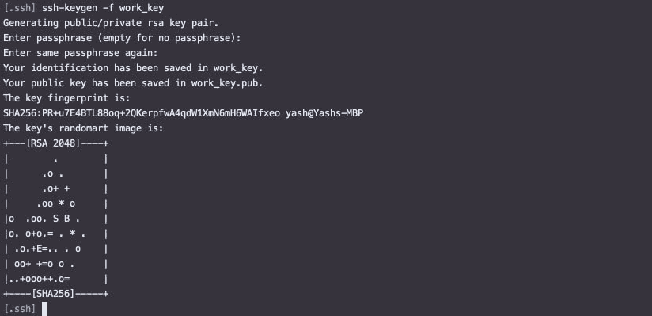T3】](https://res.cloudinary.com/practicaldev/image/fetch/s--GpGpHtsR--/c_limit%2Cf_auto%2Cfl_progressive%2Cq_auto%2Cw_880/https://thepracticaldev.s3.amazonaws.com/i/319a3lj4116j4la4xupm.jpg)

<figcaption>A new work_key with a different passphrase.</figcaption>

</figure>

是时候为您的每个配置文件创建两个 hosts 文件了。您不必创建两个，但是保持配置文件完全分离是很好的。运行以下命令来生成这两个文件:

```
touch known_hosts
touch known_hosts_work 
```

Enter fullscreen mode Exit fullscreen mode

❗️ **注**:如果你这里已经有一个`known_hosts`文件，就没有必要再做一个。如果您想重命名它，您可以这样做—只需确保在下面的步骤中使用该名称。

## 🛠用一个配置文件把这些点连接起来

最后，让我们把它们放在一个[配置文件](https://www.ssh.com/ssh/config/)中。有两个，一个本地的，一个全球的。如前所述，我们专注于本地。使用以下命令创建一个配置文件:

```
touch config 
```

Enter fullscreen mode Exit fullscreen mode

<figure>

这是你最终的配置文件的样子:
[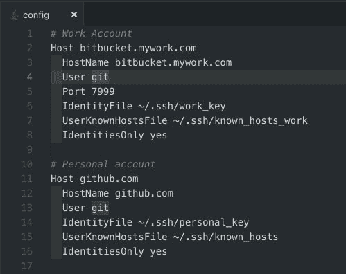](https://res.cloudinary.com/practicaldev/image/fetch/s--GRNMrSCB--/c_limit%2Cf_auto%2Cfl_progressive%2Cq_auto%2Cw_880/https://thepracticaldev.s3.amazonaws.com/i/y2s1d99u8bs5bih8v1rv.jpg)

<figcaption>Your key names here might be different based on what you used.</figcaption>

</figure>

配置文件由主机组织。每个主机定义都有一组[连接选项](https://linux.die.net/man/5/ssh_config):

*   可以在行首使用`#`进行注释。这些是给你看的。
*   `HostName`行上的 URL 是您的存储库所在的确切的基本 URL。这是你的目的地。比如你在 github 上有个人账号，有了个人项目，网址就会是`github.com`。在我的例子中，我有我的工作版本控制主机 URL，以及我在`github.com`的个人帐户。
*   `Host`是一个模式匹配器，用于区分这些配置集。保持它与`HostName`相同，这样它就可以正确匹配连接中的主机，而无需额外的规范。如果你想使用`personal_key`作为所有其他 URL 的后备，使用星号`*`作为主机。`Host *`配置集通常在配置文件的底部，所以如果前面的主机模式都不匹配，它会测试每个配置集，直到到达这个配置集。
*   对于大多数基于 git 的系统来说，`User`就是`git`。根据您连接的内容，它会有所不同。例如，`ec2-user`如果你在`ec2-user@some_server.amazonaws.com`连接到亚马逊 AWS EC2 实例。
*   `IdentityFile`询问我们制作的身份密钥的位置。在此输入各自的路径。
*   `UserKnownHostsFile`指定一个确切的位置来存储您在使用该配置文件时连接到的所有主机。在此提供各自的路径。
*   `IdentitiesOnly`指定只有这些提供的密钥必须用于连接到主机，即使另一个服务，如 *ssh-agent* 提供了一个密钥供使用。
*   `Port`指定通过 SSH 连接时使用的端口号。

## 清理

在进入最后一步之前，让我们做一些清理工作。我们需要使密钥只对您可读，这样其他人就不能修改或篡改您的私钥。

<figure>

运行`ls -l`检查该文件夹中所有东西的文件权限:
[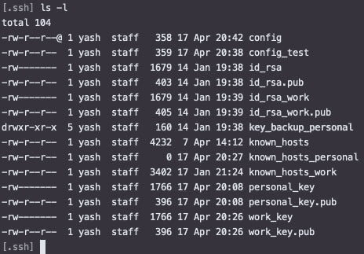](https://res.cloudinary.com/practicaldev/image/fetch/s--bCEnzQ4_--/c_limit%2Cf_auto%2Cfl_progressive%2Cq_auto%2Cw_880/https://thepracticaldev.s3.amazonaws.com/i/h9iu416p6jqr45unu354.jpg)

<figcaption>Running `ls -l` will show you the permissions on each file you’ve made</figcaption>

</figure>

<figure>

您希望这里的每个文件对您来说都是可读/可写的，而对其他人来说都是可读的——这意味着每个文件在最左边的一列都有这个:`-rw-r--r--`。让我来说明权限是如何工作的:
[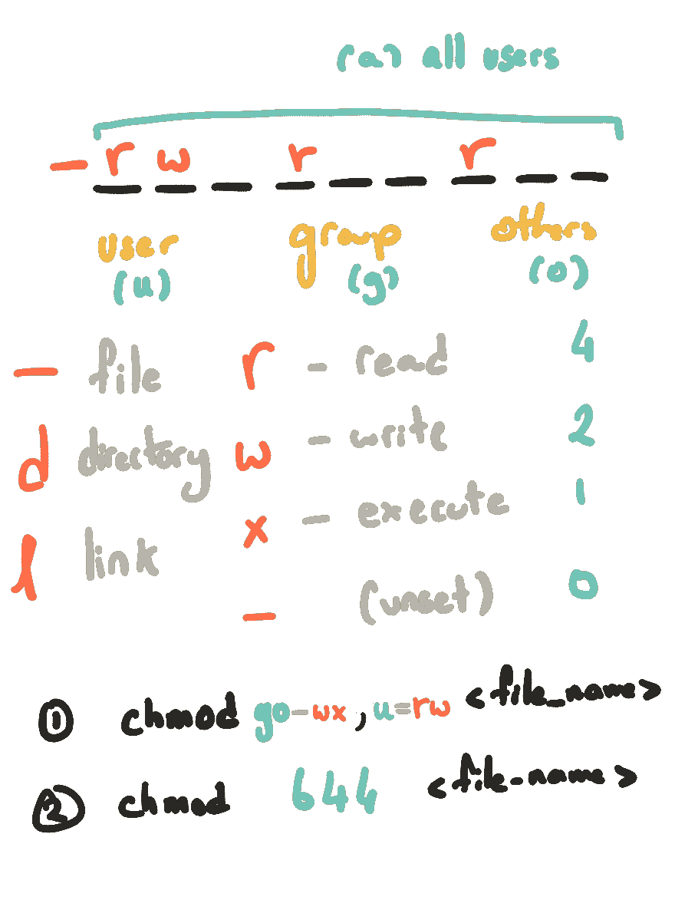](https://res.cloudinary.com/practicaldev/image/fetch/s--BvTconR3--/c_limit%2Cf_auto%2Cfl_progressive%2Cq_auto%2Cw_880/https://thepracticaldev.s3.amazonaws.com/i/sriplvgxhk396hynw3ck.png)

<figcaption>There’s 2 ways to set permissions: with letters or with numbers</figcaption>

</figure>

正如你在上面的图片中看到的，有两种方法来设置权限。您的终端中的以下任一命令都可以工作。

```
chmod go-wx, u=rw personal_key 
```

Enter fullscreen mode Exit fullscreen mode

或者

```
chmod 644 personal_key 
```

Enter fullscreen mode Exit fullscreen mode

### 带字母

`go-wx`删除组和其他人的写和执行权限。`u=rw`设置用户(您)只有读写权限。
`+`增加跟随的权限。`—`删除后续权限。`=`设置权限如下。

您可以用逗号`,`分隔任意多组。

### 用数字表示

为你设置(4+2)读写权限，为其他人设置(4)读取权限。这应该只在公钥上进行。
`600`为你设置(4+2)读写权限，其他人没有权限。这应该在所有的密钥上完成。

无论您使用哪种方法，都要确保所有的公钥对您显示`rw`，对其他人显示`r`，而私钥对您显示`rw`，对其他人什么都不显示。

## ✅准备好了所有的系统

快到了！

最后一步是将密钥添加到 ssh-agent，这样您就不必输入密码并指定每次 ssh 到主机时要使用的密钥。代理本质上就像你的私人助理；算是管家吧。引用 github.com 的话:

> 当您使用 SSH URL`git clone`、`git fetch`、`git pull`或`git push`访问远程存储库时，系统会提示您输入密码，并且您必须提供您的 [SSH 密钥密码](https://help.github.com/en/articles/working-with-ssh-key-passphrases/)。

ssh-agent 可以为您输入密码，为什么每次都要输入密码呢？

让我们使用下面的命令将我们的密钥添加到代理中:

```
ssh-add -K personal_key
ssh-add -K work_key 
```

Enter fullscreen mode Exit fullscreen mode

<figure>

添加您的密钥时，✋you 可能会被要求输入您的**密码**。✋the 选项可能不适合你。这是一个仅适用于 Mac 的命令，用于将密钥密码添加到您的操作系统钥匙串中。如果您忘记了密码，您可以[通过钥匙串访问](https://apple.stackexchange.com/questions/265131/recover-ssh-private-key-passphrase-from-keychain)来访问它。如果您在使用该选项时遇到问题，请查看本文末尾的*故障排除*部分。
[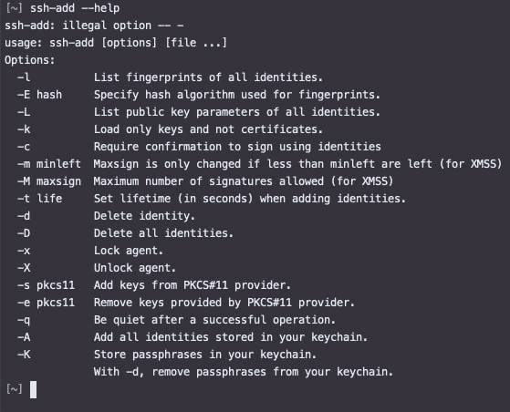](https://res.cloudinary.com/practicaldev/image/fetch/s--9t7GvMNf--/c_limit%2Cf_auto%2Cfl_progressive%2Cq_auto%2Cw_880/https://thepracticaldev.s3.amazonaws.com/i/ncbkm6n8cl05ksxc3sj0.jpg)

<figcaption>Macs have a -K and -A option which can be used to manage your passphrases through the OS’ Keychain.</figcaption>

</figure>

<figure>

[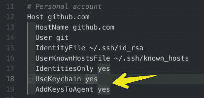](https://res.cloudinary.com/practicaldev/image/fetch/s--PMAsQTmw--/c_limit%2Cf_auto%2Cfl_progressive%2Cq_auto%2Cw_880/https://thepracticaldev.s3.amazonaws.com/i/84s1li7by2mpovcwcsbt.jpg)

<figcaption>With the latest macOS (Sierra or above), there are 2 new configuration options which are very useful.</figcaption>

</figure>

要*列出*您刚刚添加的按键:

```
ssh-add -l 
```

Enter fullscreen mode Exit fullscreen mode

要*仅从代理中删除*所有密钥，请使用:

```
ssh-add -D 
```

Enter fullscreen mode Exit fullscreen mode

⚠️注意，你的密钥在代理上，所以不需要密码。确保没有其他人可以访问您的计算机！

## 🔗测试您的连接

现在是时候将您的密钥添加到您的帐户中了。使用以下内容复制您各自的密钥:

```
pbcopy < personal_key.pub
cat personal_key.pub | pbcopy # alternative command! 
```

Enter fullscreen mode Exit fullscreen mode

⚠️注意到。使用了 pub 密钥。这是大众(🔒)您希望提供给 git 服务的身份密钥。不要使用您的私有(🔑)关键！(没有`.pub`扩展名的其他文件)

现在将它粘贴到适当的帐户中，在那里可以添加 SSH 密钥。对于 github，您可以通过您的个人设置来访问:

<figure>

[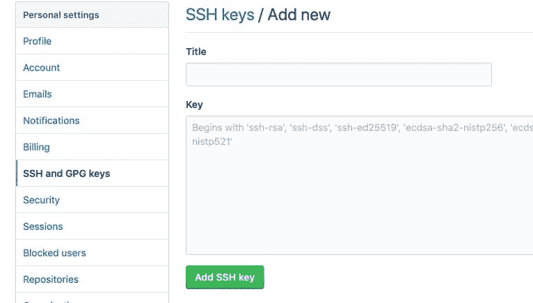](https://res.cloudinary.com/practicaldev/image/fetch/s--zd8jKjoi--/c_limit%2Cf_auto%2Cfl_progressive%2Cq_auto%2Cw_880/https://thepracticaldev.s3.amazonaws.com/i/mu4p4kvsq4yll3zhx22h.jpg)

<figcaption>For Github, this is where you’d add your shiny new key. NOTE: paste it exactly as it appears in the key file!</figcaption>

</figure>

假设您想在本地克隆您的回购协议。这就是网址的样子:
[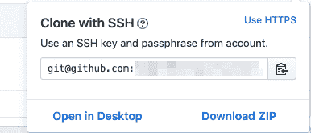](https://res.cloudinary.com/practicaldev/image/fetch/s--uHU33y6c--/c_limit%2Cf_auto%2Cfl_progressive%2Cq_auto%2Cw_880/https://thepracticaldev.s3.amazonaws.com/i/gyu39iu7wujetez6tdvi.jpg)

Github 说`git@github.com:some_cool_project`是你用`git clone git@github.com:some_cool_project`命令克隆这个项目时要用的。现在，如果你在配置文件中使用不同的`User`和`Host`，而不是`git@github.com`，你将替换克隆命令的那些部分。例如，假设您用`another_user`表示`User`，用`personal.github.com`表示`Host`，那么您应该写:

```
git clone another_user@personal.github.com:some_cool_project 
```

Enter fullscreen mode Exit fullscreen mode

⚠️你的 git 用户名和电子邮件必须在本地为每个项目配置[，否则你将最终使用你为 git 设置的全局用户名和电子邮件提交工作和个人账户！](https://medium.com/r/?url=https%3A%2F%2Fhelp.github.com%2Fen%2Farticles%2Fsetting-your-commit-email-address-in-git)

💡我将在以后的文章中深入研究 git 配置。敬请期待！

* * *

你们都完了！每次使用 SSH 连接时，不需要手动指定想要使用的密钥。配置和代理将根据您连接的主机自动确定要使用的密钥。

希望今天这篇文章对你有所帮助。如果你觉得这能帮助别人，或者如果你有一个纠正或建议，我很乐意听到你的意见。如果你想在其他操作系统上复制这篇文章，我也很乐意收到你的来信。干杯！

* * *

#### 故障排除链接

[https://medium.com/r/?URL = https % 3A % 2F % 2f help . github . com % 2f en % 2f articles % 2f error-ssh-add-illicial-option-k](https://medium.com/r/?url=https%3A%2F%2Fhelp.github.com%2Fen%2Farticles%2Ferror-ssh-add-illegal-option----k)

#### 进一步探索

[https://medium.com/r/?URL = http % 3A % 2F % 2 fwww . snail book . com % 2 ffaq % 2 fab out-agent . auto . html](https://medium.com/r/?url=http%3A%2F%2Fwww.snailbook.com%2Ffaq%2Fabout-agent.auto.html)
了解 ssh-agent 和 SSH-add-[http://blog . joncairns . com/2013/12/understanding-SSH-agent-and-SSH-add/](http://blog.joncairns.com/2013/12/understanding-ssh-agent-and-ssh-add/)
SSH 密钥类型(了解现在正在使用的更好的 ed25519 密钥算法)- [https://chealion .](https://chealion.ca/2016/06/20/ssh-key-types-and-cryptography-the-short-notes/)