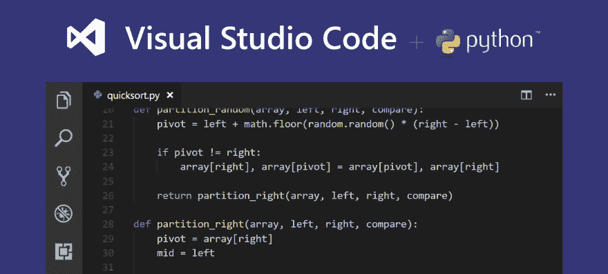
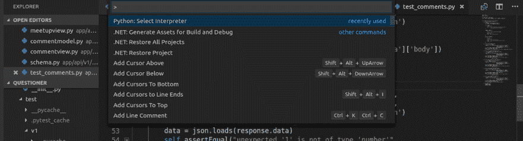
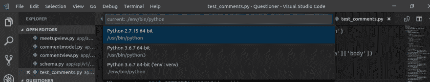
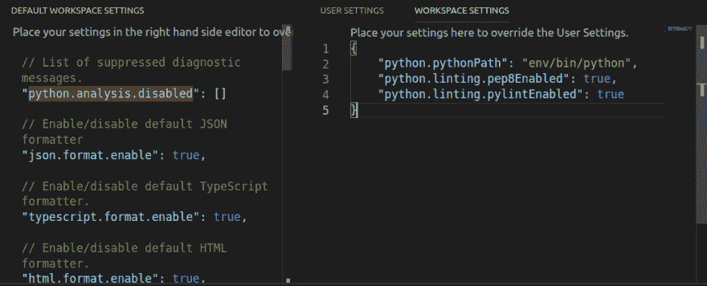

# 在 VS 代码上设置 PEP8 和 Pylint

> 原文：<https://dev.to/j0nimost/setting-up-pep8-and-pylint-on-vs-code-34h>

[](https://res.cloudinary.com/practicaldev/image/fetch/s--lMHiCFbr--/c_limit%2Cf_auto%2Cfl_progressive%2Cq_auto%2Cw_880/https://thepracticaldev.s3.amazonaws.com/i/0koywzb3onfpt4s82mu9.png)

格式化 Python 代码以通过可维护性测试可能很难；尤其是当你没有得到帮助的时候。厌倦冗余是人的天性，我们很容易想快速完成工作，然后继续前进。然而，这影响了我们的工作产出和工作质量。当谈到代码质量时，维护标准是最重要的，没有比遵循一些已经设定的标准更好的方法了。

[PEP8](https://www.python.org/dev/peps/pep-0008/) 定义 Python 编码标准；从变量声明到类的格式化。它拥有一切，这允许你很好地格式化你的 python 代码。要安装这个包，确保你在你的项目文件夹中并且`virtualenv`被启用，如果没有，在你的文件夹目录中运行下面几行

```
$ virtualenv env

$ source env/bin/activate 
```

Enter fullscreen mode Exit fullscreen mode

然后安装 PEP8

```
$ pip install pep8 
```

Enter fullscreen mode Exit fullscreen mode

现在让我们检查一下 [Pylint](https://www.pylint.org/) ，这个工具检查我们是否遵循了 PEP8 标准，并在我们没有遵循的地方返回错误。此外，由于语法错误，该工具还进行错误检查。要安装 pylint，请运行以下代码；

```
$ pip install pylint 
```

Enter fullscreen mode Exit fullscreen mode

既然我们现在有了两个需要的工具，我们现在可以打开 vs 代码

```
$ code . 
```

Enter fullscreen mode Exit fullscreen mode

一旦我们打开我们的 vs 代码编辑器；我们可以选择我们喜欢的翻译，只需按下
`Ctrl + Shift + P`。
[](https://res.cloudinary.com/practicaldev/image/fetch/s--_1V_nfGK--/c_limit%2Cf_auto%2Cfl_progressive%2Cq_auto%2Cw_880/https://thepracticaldev.s3.amazonaws.com/i/bn0ikkd1cbge8svwmqf2.png) 
你应该会看到类似上面的结果。接下来我们选择我们的 Python 解释器
[](https://res.cloudinary.com/practicaldev/image/fetch/s--Uq0O1dqV--/c_limit%2Cf_auto%2Cfl_progressive%2Cq_auto%2Cw_880/https://thepracticaldev.s3.amazonaws.com/i/6mij69f5plvsxkbjpqc4.png) 
只需选择启用了 virtualenv 的 python3/2。这将确保 Vs 代码获得我们在 virtual env 中安装的工具。

接下来，我们终于在 Vs 代码上激活了林挺。
遵循以下步骤
`File > Preferences > Settings > Workspace Settings > Python Configuration`
点击`Edit in settings.json`

[](https://res.cloudinary.com/practicaldev/image/fetch/s--VdDrL6D0--/c_limit%2Cf_auto%2Cfl_progressive%2Cq_auto%2Cw_880/https://thepracticaldev.s3.amazonaws.com/i/touhurjhryba8n9hsuvb.png) 
你的工作空间应该与上面的林挺设置相匹配。编辑 json 后，保存设置并开始编码。现在每次你访问 virtaulenv 中的 Vs 代码时，它总是会激活林挺。