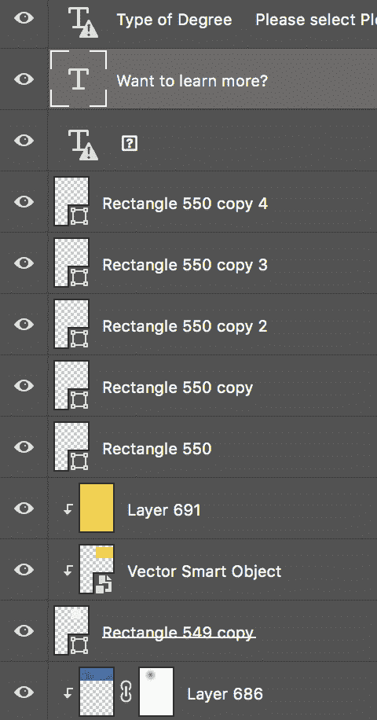
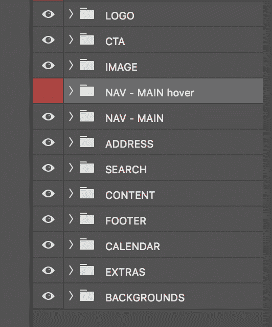
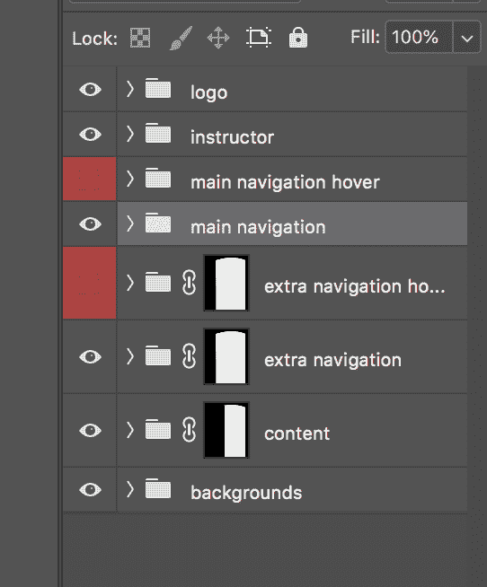
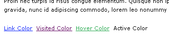

# 为开发成功设置 Photoshop 文件

> 原文：<https://dev.to/epicosity/setting-up-photoshop-files-for-dev-success-4k8g>

尽管转向了“在浏览器中设计”和像 Figma 和 Adobe XD 这样的设计工具，仍然有相当多的人在那里提供 Photoshop PSDs 来定期转换成功能网页。我的前端开发职业生涯的很大一部分是围绕着“分割”Photoshop 文件和编写 HTML 和 CSS 来匹配的。虽然每个设计师都倾向于以他们自己的方式组织他们的文件，但我有一些让开发者更容易使用 Photoshop 文件的技巧。

*   **命名图层:**适当命名的图层和文件夹可以很容易地看到它们上面有什么。你多久会收到一次贴有明确标签的 PSD？

 

<figcaption>矩形 550 复制和图层 686——很有帮助的名字，不是吗？</figcaption>

不是很有帮助是吗？哪个长方形？这是什么层？谁知道呢。

*   使用文件夹:将标题、英雄、正文、页脚等分组。这会让事情有条不紊，也更容易在未来找到你要找的元素。

*   **确保图层/文件夹可以打开和关闭**隐藏网页文本并显示下面的背景或图像:网页安全文本通常需要隐藏在 PSD 上，以显示其下面的背景。如果你的层被适当地标记和分组，开发者应该能够容易地关闭那些层，并且知道哪些层需要被隐藏。

*   **指示悬停状态(如果有的话)和链接状态:**如果设计的一部分包括图形或按钮，当用户悬停在它们上面时，它们会发生变化，则包括这些图形悬停状态的层。在设计的样本内容中指明文本链接样式，甚至是标题列表、项目符号列表和其他需要样式化的内容相关项目，也是很有帮助的。

*   **不要展平图层**:绝对不要展平图层，尤其是如果你不确定你的开发者可能需要隐藏/显示哪些图层来获得他们可能需要的图形/信息。

我知道这只是一些小技巧，但是这些小事情真的可以在开发方面的时间和精力上产生影响。

有没有 Photoshop 文件的开发小技巧，很想听听！

* * *