# 设置 SQL Server 并使用 Swagger 连接 Visual Studio

> 原文：<https://dev.to/azure/setting-up-sql-server-and-connecting-visual-studio-with-swagger-5fei>

*我们选择了由[迈克尔·克伦普](https://twitter.com/mbcrump)创造的我们最喜欢的技巧和诀窍，并在整个四月在 Azure 上提供新的技术内容！错过一天(或更多)？[赶上系列](https://dev.to/t/azureapril)。*

**没有天蓝色？** [抢免费订阅](https://azure.microsoft.com/en-us/free?&WT.mc_id=azureapril_devto-blog-cxa)。

* * *

如果你还没有机会深入了解 Azure DevOps，我想你错过了。它非常强大，拥有真正令人愉快的用户体验。(当我开始使用它时，我非常怀疑。)

这个例子不一定涵盖您正在使用的确切堆栈。但它确实提供了一个端到端的例子，说明如何将 Azure 生态系统中的不同产品串联在一起，并使您的软件交付更加连续。

来自 [Azure Tips and Tricks](https://www.michaelcrump.net/azure-tips-and-tricks-complete-list/) 的 Crystal Tenn 和 Michael Crump 合作开发了一个 Azure 应用服务网站，该网站与 API 项目和 Azure SQL 后端进行通信。

该应用是一个基本的待办应用程序——我们称之为 TODO——由 Visual Studio、VSTS(现为 [Azure DevOps](https://azure.microsoft.com/en-us/services/devops/?WT.mc_id=azureapril_devto-blog-cxa) )、C#、Angular 和 SQL 创建。

欢迎您跟随教程，或者简单地阅读，更好地了解如何将相同的模式应用到您的应用程序中。

# 流程🗒️

应用程序的流程如下所述。在 Visual Studio 中，您将从 TODO 应用程序的工作版本开始。您将把代码推送到 Azure DevOps，并创建一个 [CI/CD](https://azure.microsoft.com/en-us/resources/videos/build-2017-build-a-ci-cd-pipeline-from-microsoft-azure-portal/?WT.mc_id=azureapril_devto-blog-cxa) (持续集成/持续交付)流程，以便部署到 Azure。

在 Azure 中，您将创建 3 个资源:

*   Azure Web 应用程序
*   Azure API 应用程序
*   Azure SQL Server

# 先决条件📇

请下载下面列出的所需软件。该教程可以免费完成，但需要一个 Azure 帐户。你需要对编码和软件安装有一个基本的了解。

> Azure 账户会要求你输入信用卡号码，但不会向你收取任何费用，也不会“变成付费版本”，它只会在你的试用期结束时过期。

## 获得免费 Azure 账户

你每月可以获得 200 美元的信用额度，这是一个试用账户的免费信用额度，不花你一分钱。

## 下载 Visual Studio 2017

注意，说明将使用 Visual Studio 2017。你可以在这里免费获得 Visual Studio 2017 社区[。](https://www.visualstudio.com/vs/community/)

## Snag SQL Server Express

你可以在这里抢到速成版[。](https://www.microsoft.com/en-us/sql-server/sql-server-editions-express)

## 别忘了 SQL Server Management Studio

你可以在这里找到你需要的东西。

# 在本地设置 SQL Server💾

本地设置将从设置数据库开始。然后您将在 Visual Studio 中打开该解决方案。您需要将 API 项目连接到您的 SQL Server。然后将您的前端 Angular 项目连接到 API 项目。

我们将使用现有的应用程序。在此下载一份副本[并解压到硬盘上的一个文件夹中。](https://github.com/catenn/ToDoList/archive/master.zip)

我们开始吧！

#### 第一步

打开 SQL Server Management Studio (SSMS ),单击“服务器名称”下拉列表，然后选择“浏览更多”。

[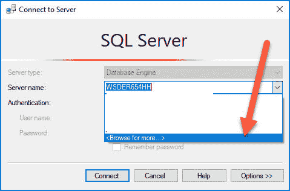](https://res.cloudinary.com/practicaldev/image/fetch/s--UzVxpFfH--/c_limit%2Cf_auto%2Cfl_progressive%2Cq_auto%2Cw_880/https://d33wubrfki0l68.cloudfront.net/b98c5589a4032812c892f9f07a819be07d51e2c0/39c50/files/e2e-browseformore.jpg)

#### 第二步

选择实例的服务器名称。这个名字很可能采用格式`ComputerName\ServerName`。

[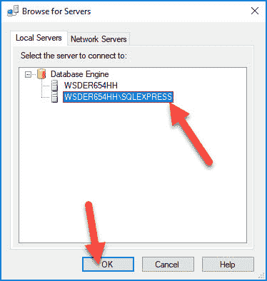](https://res.cloudinary.com/practicaldev/image/fetch/s--y3y4YMBa--/c_limit%2Cf_auto%2Cfl_progressive%2Cq_auto%2Cw_880/https://d33wubrfki0l68.cloudfront.net/fb096fdd977203d8d6432817a77d90933246a9e8/916b3/files/e2e-servers.jpg)

#### 第三步

选择 Windows 身份验证。将您的`ComputerName\ServerName`保存在记事本中，我们稍后会再次用到它。点击连接。

[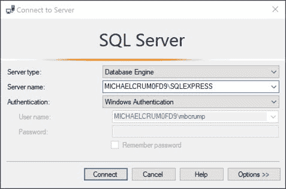](https://res.cloudinary.com/practicaldev/image/fetch/s--KZhK_0rk--/c_limit%2Cf_auto%2Cfl_progressive%2Cq_auto%2Cw_880/https://d33wubrfki0l68.cloudfront.net/d0d794f4faa12c19d0533128da6e515c37237e0b/74a69/files/e2e-sqllogin.jpg)

#### 第四步

双击`ToDoList.sln`打开我们之前下载的文件夹。它应该会在 Visual Studio 2017 中打开。

#### 第五步

右键单击`ToDoListDb`项目并选择`Publish`。

[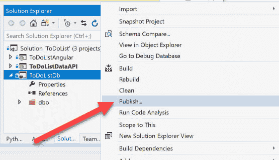](https://res.cloudinary.com/practicaldev/image/fetch/s--vB3pUV8v--/c_limit%2Cf_auto%2Cfl_progressive%2Cq_auto%2Cw_880/https://d33wubrfki0l68.cloudfront.net/2dc1cc0fe4ca7f68ceeb08a1dda487f91b1dc74a/6ab3c/files/e2e-slnexplorerpublish.jpg)

#### 第六步

在模态上，点击`Edit`。

[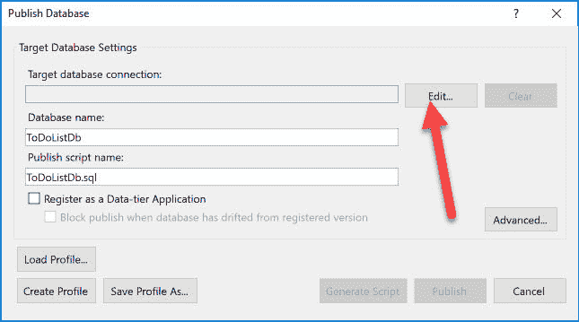](https://res.cloudinary.com/practicaldev/image/fetch/s--8UjGX9Rc--/c_limit%2Cf_auto%2Cfl_progressive%2Cq_auto%2Cw_880/https://d33wubrfki0l68.cloudfront.net/deeea21bddf9918c965147efe462d72fad0f0a7a/b0130/files/e2e-editdbconnection.jpg)

#### 第七步

对于服务器名称，取您为`ComputerName\ServerName`保存的记事本值并在此输入。确保数据库名称是`ToDoListDb`，但是应该为您填写。点击`OK`。

[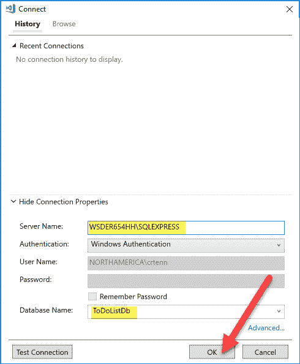](https://res.cloudinary.com/practicaldev/image/fetch/s--zQdptqsN--/c_limit%2Cf_auto%2Cfl_progressive%2Cq_auto%2Cw_880/https://d33wubrfki0l68.cloudfront.net/1d12cfafe811d7064b247b8566a661ec4dc06ae5/18a88/files/e2e-connection.jpg)

#### 第八步

不要编辑该模式的任何其他值，只需点击发布。注意:测试连接不起作用。

[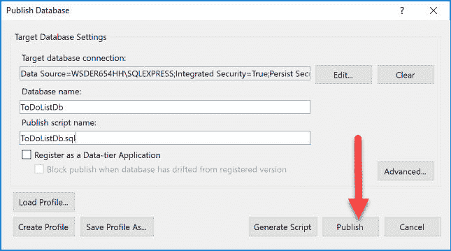](https://res.cloudinary.com/practicaldev/image/fetch/s--8QjilEh2--/c_limit%2Cf_auto%2Cfl_progressive%2Cq_auto%2Cw_880/https://d33wubrfki0l68.cloudfront.net/25a3b50304a88e74b37e00ba5d959874d5d1a198/b6463/files/e2e-publishdb.jpg)

#### 第九步

您将看到发布开始。

[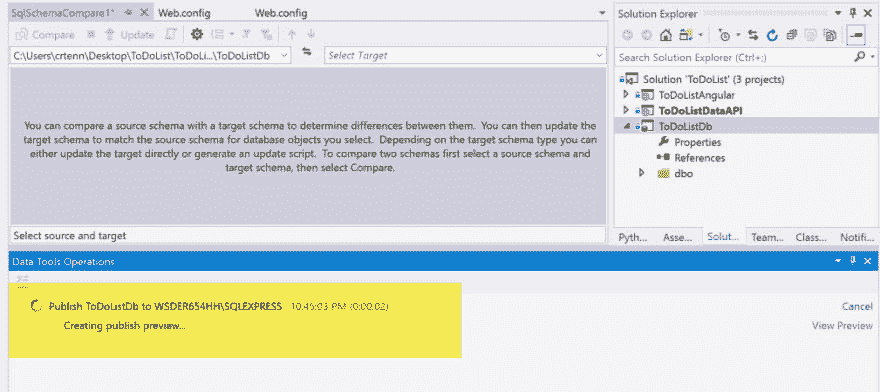](https://res.cloudinary.com/practicaldev/image/fetch/s--6Ya6QClJ--/c_limit%2Cf_auto%2Cfl_progressive%2Cq_auto%2Cw_880/https://d33wubrfki0l68.cloudfront.net/615541fd5d0a2c317fa24a9a716121ae855bc46b/7c8d8/files/e2e-publish1.jpg)

#### 第十步

当您看到以下内容时，就完成了:

[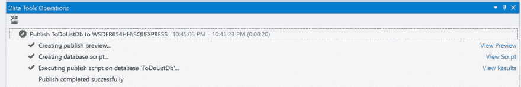](https://res.cloudinary.com/practicaldev/image/fetch/s--8BzaeTZ---/c_limit%2Cf_auto%2Cfl_progressive%2Cq_auto%2Cw_880/https://d33wubrfki0l68.cloudfront.net/fbb6071c45485767722e3a6ce0ad4e263834c881/56bb6/files/e2e-publish2.jpg)

#### 第 11 步

返回 SQL Server Management Studio 并单击刷新。

#### 第 12 步

您的 SQL 数据库现在应该看起来像这样。

[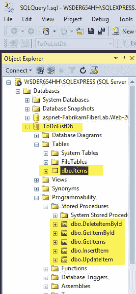](https://res.cloudinary.com/practicaldev/image/fetch/s--GWtfeWK0--/c_limit%2Cf_auto%2Cfl_progressive%2Cq_auto%2Cw_880/https://d33wubrfki0l68.cloudfront.net/e2cc63a8cd23564ee13d1f494702ff0237f60206/f93b9/files/e2e-sqlverify.jpg)

# 连接 Visual Studio 和 SQL 数据库💽

现在，我们需要将所有部分连接起来，以确保正确收集和存储数据。

#### 第一步

在 Visual Studio 中双击`ToDoList.sln`打开项目，如果它还没有从第 1 部分打开。

#### 第二步

打开`ToDoListDataAPI`项目的`Web.config`文件。确保你在正确的项目中。

[](https://res.cloudinary.com/practicaldev/image/fetch/s--rZZIKxmu--/c_limit%2Cf_auto%2Cfl_progressive%2Cq_auto%2Cw_880/https://d33wubrfki0l68.cloudfront.net/45ac3dd48a97171a7f70a6f113dbc0c4c2f6a939/aadd1/files/e2e-webconfig.jpg)

#### 第三步

编辑突出显示的`ComputerName\ServerName`，并将其更改为您保存在记事本中的计算机& SQL server 名称。

[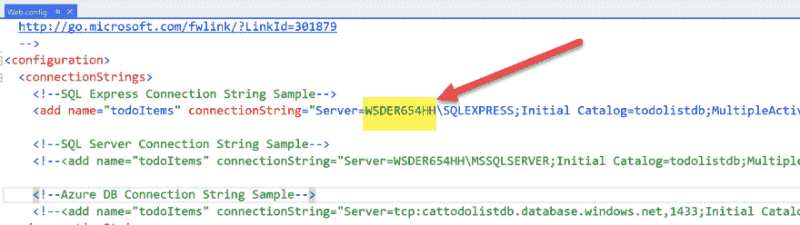](https://res.cloudinary.com/practicaldev/image/fetch/s--32OhcrCu--/c_limit%2Cf_auto%2Cfl_progressive%2Cq_auto%2Cw_880/https://d33wubrfki0l68.cloudfront.net/6c86153c787d5e6955874439a9b361d31b669b5b/f4c35/files/e2e-webconfig2.jpg)

我的看起来像:

> 根据您独特的资源命名和凭证，您的输入和输出会略有不同。

```
<add name="todoItems" connectionString="Server=MICHAELCRUM0FD9\SQLEXPRESS;Initial Catalog=todolistdb;MultipleActiveResultSets=False;Integrated Security=True" providerName="System.Data.EntityClient" /> 
```

#### 第四步

保存文件，通过右击项目并选择该选项，将`ToDoListDataAPI`项目设置为`Set as Startup project`。

[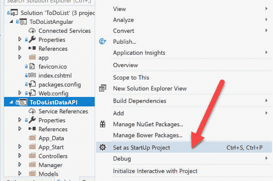](https://res.cloudinary.com/practicaldev/image/fetch/s--zFl6A_d5--/c_limit%2Cf_auto%2Cfl_progressive%2Cq_auto%2Cw_880/https://d33wubrfki0l68.cloudfront.net/0a45ed541dd5cdbc41f5d2e3e42546cd3fe0ae4a/35d77/files/e2e-setstartup.jpg)

点击`F5`或在任何浏览器中运行。

> 如果你得到了`The Web server is configured to not list the contents of this directory`，那么就直接进行第 6 步。

#### 第五步

如果 URL 中没有`/swagger`,请添加到 URL 中。如果一切正常，页面应该是这样的:

[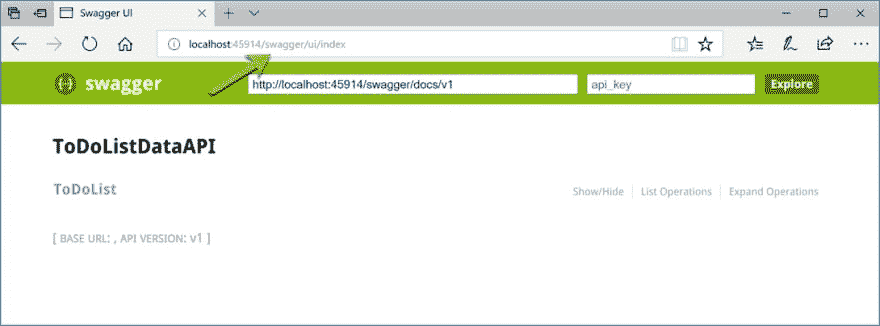](https://res.cloudinary.com/practicaldev/image/fetch/s--RYNQALkF--/c_limit%2Cf_auto%2Cfl_progressive%2Cq_auto%2Cw_880/https://d33wubrfki0l68.cloudfront.net/395c07a9a883b997d218696efd2a5bd068355fac/1cc83/files/e2e-swagger.jpg)

#### 第六步

点击`Show/Hide`获取应用程序可用 API 的完整列表。

[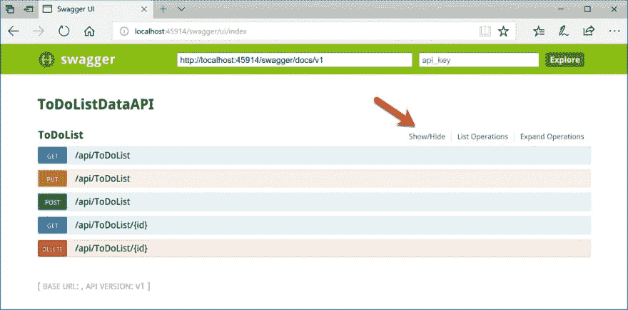](https://res.cloudinary.com/practicaldev/image/fetch/s--ntLIyZhY--/c_limit%2Cf_auto%2Cfl_progressive%2Cq_auto%2Cw_880/https://d33wubrfki0l68.cloudfront.net/f5b969a082421f8fbe43d6604255a6d82788ad23/0ddda/files/e2e-showhide.jpg)

#### 第七步

点击`GET`(列表中的第一个)将其展开。点击`Try it out!`。

如果你得到一个 200 的响应代码，那就成功了！还要注意浏览器中的 URL 端口号。

[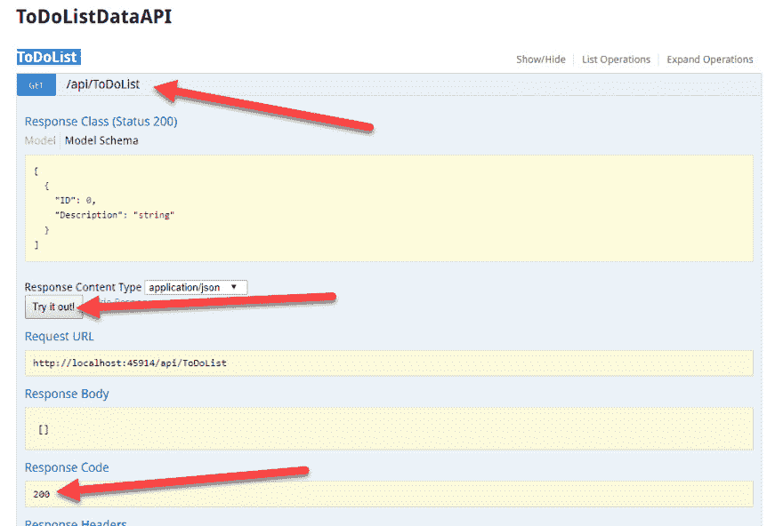](https://res.cloudinary.com/practicaldev/image/fetch/s--mpWV86A2--/c_limit%2Cf_auto%2Cfl_progressive%2Cq_auto%2Cw_880/https://d33wubrfki0l68.cloudfront.net/94e496dbeb2e3f2fc1a1af0220a59d6f094195ec/854cc/files/e2e-get.jpg)

#### 第八步

切换回 Visual Studio，并转到`ToDoListAngular`项目中的`Web.config`。

[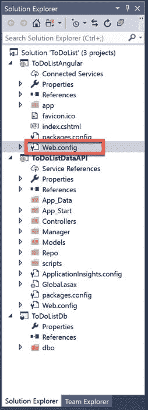](https://res.cloudinary.com/practicaldev/image/fetch/s--okOhXKDp--/c_limit%2Cf_auto%2Cfl_progressive%2Cq_auto%2Cw_880/https://d33wubrfki0l68.cloudfront.net/7307c003165b079d48c3c9cc901ab29461957a9d/0e39b/files/e2e-angularprojwebconfig.jpg)

#### 第九步

确保端口号与上一步中的端口匹配。

[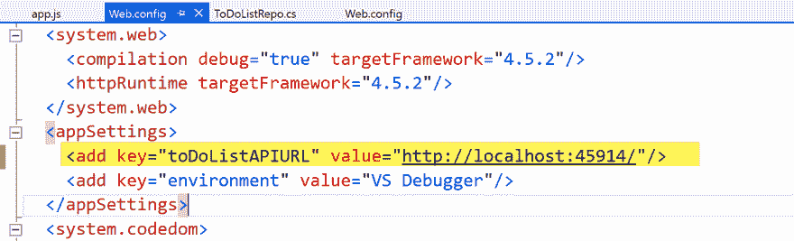](https://res.cloudinary.com/practicaldev/image/fetch/s--3m7ipn-U--/c_limit%2Cf_auto%2Cfl_progressive%2Cq_auto%2Cw_880/https://d33wubrfki0l68.cloudfront.net/9ace3a7d42f583a5129e0bcac678bbfe9763f7fe/536d5/files/e2e-angularwebconfig.jpg)

#### 第十步

将`ToDoListAngular`项目设置为启动项目。

[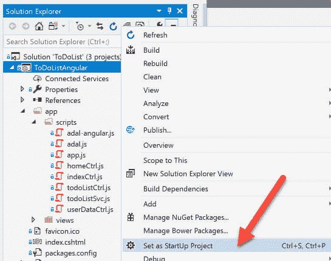](https://res.cloudinary.com/practicaldev/image/fetch/s--YRDKeKI2--/c_limit%2Cf_auto%2Cfl_progressive%2Cq_auto%2Cw_880/https://d33wubrfki0l68.cloudfront.net/88457697eb456ccc70986b1de688f098f25a1c00/f0b93/files/e2e-angularstart.jpg)

#### 第 11 步

点击`F5`或运行。您应该会看到 Angular 应用程序在您的 web 浏览器中运行。

单击待办事项菜单并添加一个条目。尝试编辑并删除它。您可以在代码中放置断点，以了解它是如何执行 CRUD 操作的。您也可以检查 SQL 数据库来查看条目。

[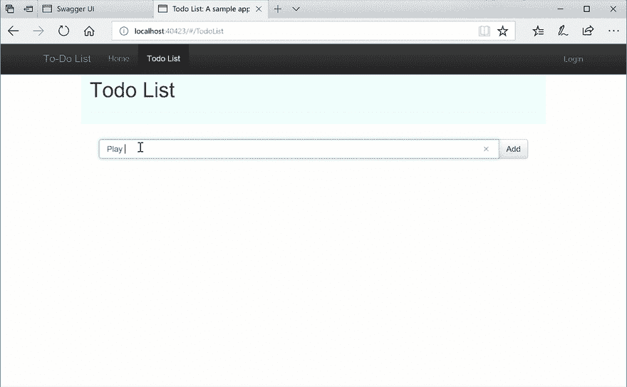](https://res.cloudinary.com/practicaldev/image/fetch/s--vj0ytASB--/c_limit%2Cf_auto%2Cfl_progressive%2Cq_66%2Cw_880/https://d33wubrfki0l68.cloudfront.net/8d557e314f3f9a955c3eb490ac676b4542801020/26323/files/e2e-todolist.gif)

恭喜你。我们现在已经在本地完成了 SQL 数据库和 web 前端/后端设置。接下来，我们将深入了解 Swagger 和使用 Azure App Service 进行部署。

# 本地设置+使用 Swagger 工作📔

什么是 Swagger UI？是 HTML、Javascript 和 CSS 资产的集合，可以从 Swagger 兼容的 API 动态生成漂亮的文档。

Swagger 的好处在于，您可以使用 VS 模板创建一个现有的 Web API 应用程序，并通过 Nuget 添加 Swagger。

[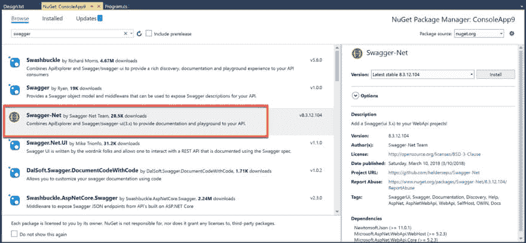](https://res.cloudinary.com/practicaldev/image/fetch/s--zqRfsgm8--/c_limit%2Cf_auto%2Cfl_progressive%2Cq_auto%2Cw_880/https://d33wubrfki0l68.cloudfront.net/f559236656d0f46f0ad938e575e5652bfdb48b09/2eba0/files/e2e-swagger1.jpg)

然后，如果你启动一个项目，你只需添加`/swagger`就可以看到 UI。在下面的例子中，我们已经添加了它，并在应用程序中识别它的地方提供了评论。这使得测试 API 变得非常简单，并且它是实时工作的，这意味着如果您运行一个`POST`，那么您可以立即检查您的数据库中的新记录。

点击了解更多关于 Swagger [的信息。](https://github.com/swagger-api/swagger-ui)

我们走吧！

# 招摇过市📖

#### 第一步

如果还没有从前面的部分打开项目，双击`ToDoList.sln`在 Visual Studio 中打开项目。导航到`ToDoListDataAPI`项目。

#### 第二步

右键单击项目并选择该选项，然后运行应用程序，将`ToDoListDataAPI`项目设置为启动项目。

#### 第三步

将`/swagger`添加到您的 URL 的末尾，如果它不在那里，您应该会看到这样的页面:

[](https://res.cloudinary.com/practicaldev/image/fetch/s--RYNQALkF--/c_limit%2Cf_auto%2Cfl_progressive%2Cq_auto%2Cw_880/https://d33wubrfki0l68.cloudfront.net/395c07a9a883b997d218696efd2a5bd068355fac/1cc83/files/e2e-swagger.jpg)

#### 第四步

点击`Show/Hide`按钮。

#### 第五步

运行 GET，这是页面`/api/ToDoList`上的第一个 API，您应该看到:

[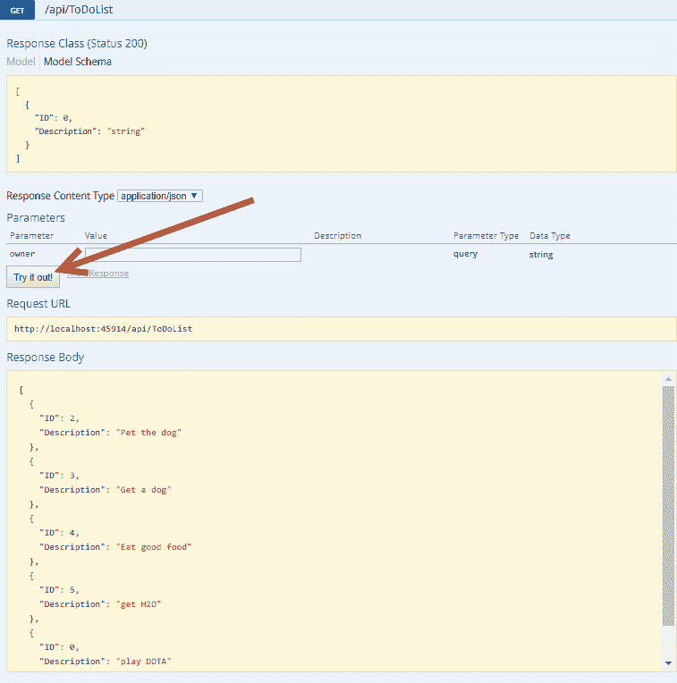](https://res.cloudinary.com/practicaldev/image/fetch/s--sqt5kTxm--/c_limit%2Cf_auto%2Cfl_progressive%2Cq_auto%2Cw_880/https://d33wubrfki0l68.cloudfront.net/9950fb0ac77f15f7a484e890b2997f580bcc6928/30318/files/e2e-02.png)

#### 第六步

运行一个`POST`，点击截图显示的地方，用一个随机数和你想要的任何描述填写一个`ID`，然后点击`Try it out!`。

#### 第七步

再次运行`GET`，您应该会看到您的附加值:

[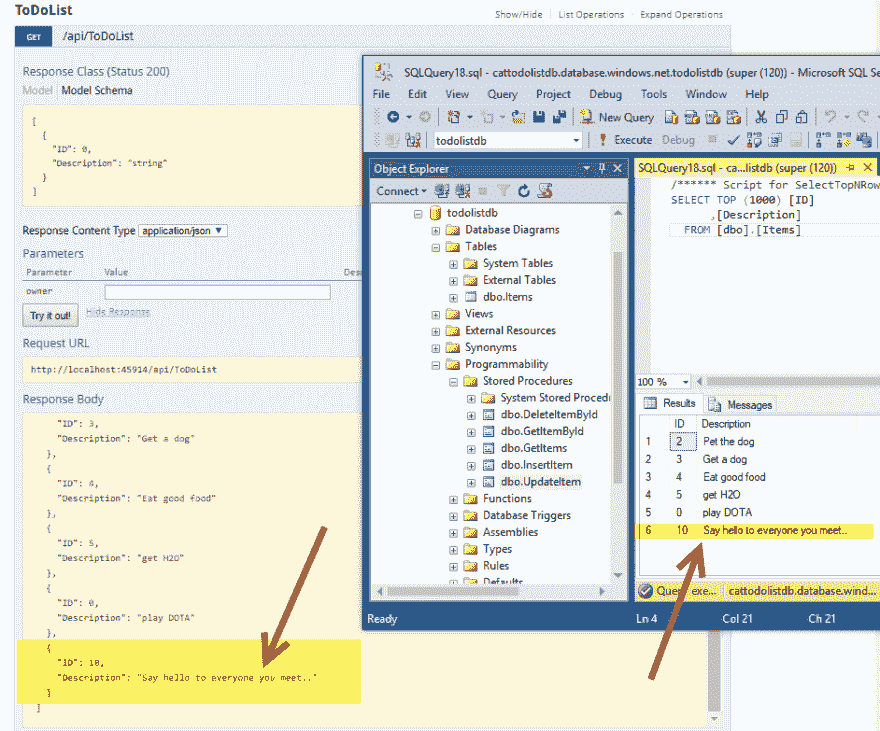](https://res.cloudinary.com/practicaldev/image/fetch/s--XkGS5ZoU--/c_limit%2Cf_auto%2Cfl_progressive%2Cq_auto%2Cw_880/https://d33wubrfki0l68.cloudfront.net/a0f0980d08dcc1b36945df10232cc416fe814ca2/89313/files/e2e-04.png)

#### 第八步

运行一个`PUT`，再次点击以获取屏幕截图中显示的格式，并修改现有记录的描述。

[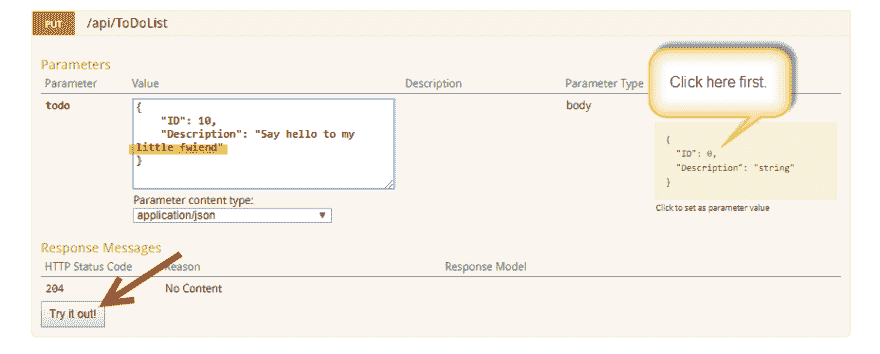](https://res.cloudinary.com/practicaldev/image/fetch/s--8CnIQmQt--/c_limit%2Cf_auto%2Cfl_progressive%2Cq_auto%2Cw_880/https://d33wubrfki0l68.cloudfront.net/5eec0b1d2639f87c737471c06075f17946d75542/e798b/files/e2e-05.png)

#### 第九步

尝试通过`ID`运行一个`GET`，例如使用 1:

[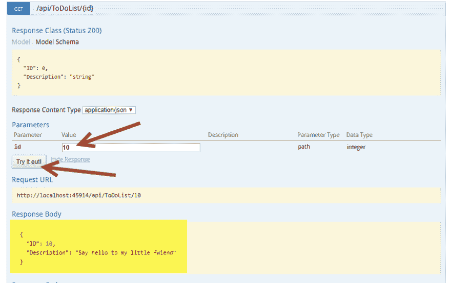](https://res.cloudinary.com/practicaldev/image/fetch/s--hE8qj1m3--/c_limit%2Cf_auto%2Cfl_progressive%2Cq_auto%2Cw_880/https://d33wubrfki0l68.cloudfront.net/ec399e5a777dcaf951169798a2fda1f13ef1f472/e4976/files/e2e-06.png)

#### 第十步

切换回 SQL Server Management Studio(如果需要，可以登录)并在`ToDoListDb` db 上选择`Select Top 1000 Rows`来查看数据。

[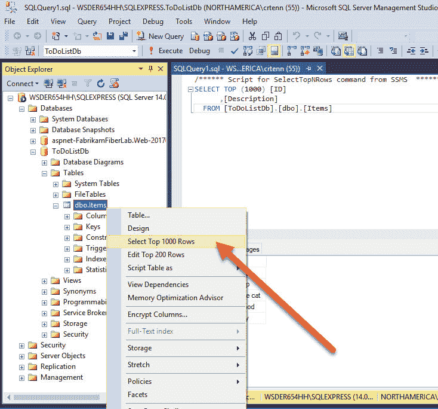](https://res.cloudinary.com/practicaldev/image/fetch/s--19VeFKuy--/c_limit%2Cf_auto%2Cfl_progressive%2Cq_auto%2Cw_880/https://d33wubrfki0l68.cloudfront.net/36d64483e06b0fda9a1ce95bd1cf4afcc38cb259/65efe/files/e2e-sqlselect.jpg)

#### 第 11 步

您的 SQL Server Management Studio 表现在应该如下所示:

[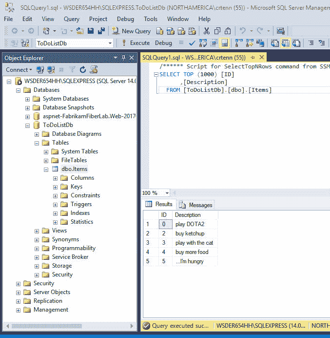](https://res.cloudinary.com/practicaldev/image/fetch/s--U76bs2mQ--/c_limit%2Cf_auto%2Cfl_progressive%2Cq_auto%2Cw_880/https://d33wubrfki0l68.cloudfront.net/0c7465f1c22c93539ced2f50ad411ff84631f1a7/8785a/files/e2e-sqlserver.jpg)

接下来，我们需要部署 SQL 数据库。

> *准备好深入了解 Azure DevOps，看看我们如何从 VSTS 开发出这款产品了吗？*查看我们的 [Azure DevOps 快速入门和教程](https://docs.microsoft.com/en-us/azure/devops-project/?WT.mc_id=azureapril_devto-blog-cxa)！

# 将 SQL 数据库部署到 Azure SQL📬

#### 第一步

如果您还没有登录，请登录 portal.azure.com 的 Azure 门户网站。

#### 第二步

创建新的 SQL 数据库。点击`New`，选择`Databases`，选择 SQL 数据库，最后点击`Create`。

[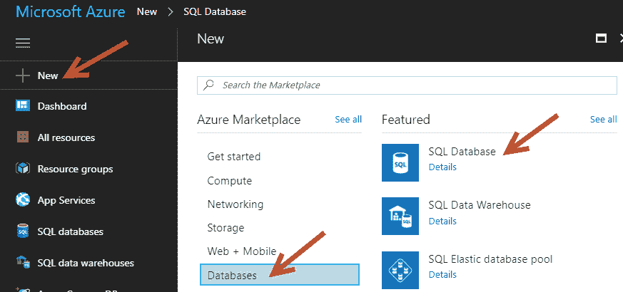](https://res.cloudinary.com/practicaldev/image/fetch/s--x03AfnIo--/c_limit%2Cf_auto%2Cfl_progressive%2Cq_auto%2Cw_880/https://d33wubrfki0l68.cloudfront.net/7a168790ffa384adb10652ec9b58e278967ea13d/dd7c6/files/e2e-01selectsqldbportal.png)

#### 第三步

点击`Server and Pricing Tier`获得一个滑出选项。在服务器幻灯片中，确保您创建了用户名和密码，并将其保存在安全的地方，因为您将需要它来使用 SQL Server Management Studio (SSMS)登录。在`Pricing Tier`中，换成`Basic`，这样每月只需花费大约 5 美元。您的屏幕将大致如下所示:

[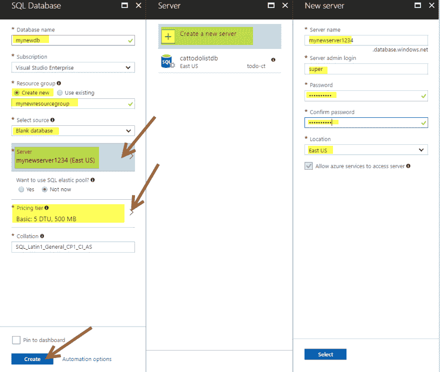](https://res.cloudinary.com/practicaldev/image/fetch/s--0bNeROjA--/c_limit%2Cf_auto%2Cfl_progressive%2Cq_auto%2Cw_880/https://d33wubrfki0l68.cloudfront.net/6f5c8c217a8b666e0e0f0ae05950650a98226cf5/3f137/files/e2e-02dboptions.png)

#### 第四步

点击左侧菜单上的`All Resources`。您应该会看到新的 SQL Server 和 SQL 数据库。点击`SQL Database`。

[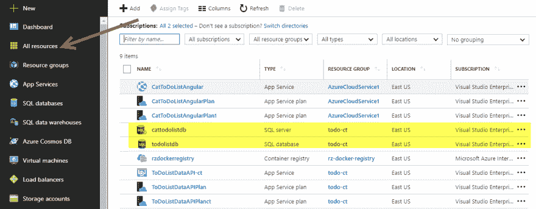](https://res.cloudinary.com/practicaldev/image/fetch/s--895iDys1--/c_limit%2Cf_auto%2Cfl_progressive%2Cq_auto%2Cw_880/https://d33wubrfki0l68.cloudfront.net/31c6d9364d1c4e6c93ec8352f42d88850cb5be61/bb781/files/e2e-03allresources.png)

#### 第五步

在`Overview`选项卡上。将服务器名复制到安全的地方。点击`Show Connection Strings`并将其复制到安全的地方。

[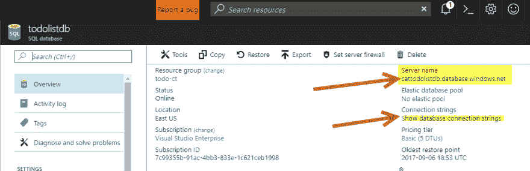](https://res.cloudinary.com/practicaldev/image/fetch/s--eXR5GOPV--/c_limit%2Cf_auto%2Cfl_progressive%2Cq_auto%2Cw_880/https://d33wubrfki0l68.cloudfront.net/c704003cb2695a22fc9f627c29a4c9d45379448a/556e2/files/e2e-05databaseoverview.png)

连接字符串将如下所示(将它保存在记事本中，用于稍后解决方案中的 web.config):

[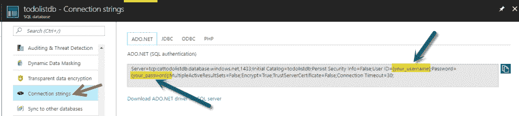](https://res.cloudinary.com/practicaldev/image/fetch/s--nSVrFoQK--/c_limit%2Cf_auto%2Cfl_progressive%2Cq_auto%2Cw_880/https://d33wubrfki0l68.cloudfront.net/93c9c5fcd3dac691adec7b23da50e8fc76da52cf/adb9f/files/e2e-06connectionstring.png)

#### 第六步

打开`SSMS`，输入如下所示的服务器名称、用户名和密码。

[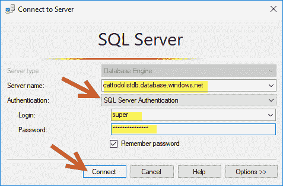](https://res.cloudinary.com/practicaldev/image/fetch/s--vSwZmi36--/c_limit%2Cf_auto%2Cfl_progressive%2Cq_auto%2Cw_880/https://d33wubrfki0l68.cloudfront.net/1e0c50cff6e66679ca8426aef8eda7040b39a785/b7fe9/files/e2e-07ssms.png)

> 如果您无法登录，请转到门户网站，通过单击您创建的 SQL Server 添加您的 IP 地址，然后转到防火墙。您也可以通过 SQL Server 工具设置防火墙提示。

[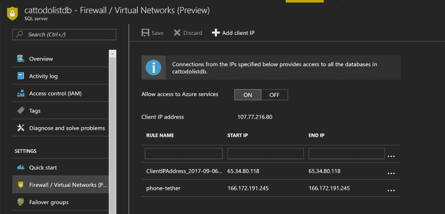](https://res.cloudinary.com/practicaldev/image/fetch/s--zau_a7pc--/c_limit%2Cf_auto%2Cfl_progressive%2Cq_auto%2Cw_880/https://d33wubrfki0l68.cloudfront.net/26b8be43f27d1673a42f186fcdf0e9ee99c4a43c/58a0e/files/e2e-10.png)

#### 第七步

回到，重复步骤 6-13，除了使用我们之前创建的 Azure SQL Server 名称，而不是您的本地数据库。

#### 第八步

将数据库保存到 Azure 后，进入您的 API 项目的连接字符串，该字符串可以在 web.config 中找到，如下所示。

#### 第九步

在`web.config`中，更改您的连接字符串，使其指向您的 Azure SQL Server 连接字符串(您应该早些保存到记事本中)。确保将 Azure SQL Server 的用户名和密码添加到连接字符串中。

# 前端角度+后端 API 项目🖥️

在我们开始之前，我假设你在 Azure DevOps 上使用的电子邮件地址与你在 Azure 上使用的相同。

#### 第一步

如果解决方案文件尚未打开，请在 Visual Studio 中打开它。使用您用来注册 Azure 帐户的同一电子邮件地址登录 Visual Studio。

#### 第二步

右键单击 API 项目并选择`Publish`。

[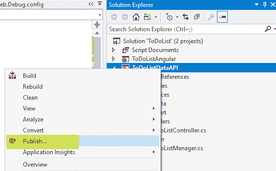](https://res.cloudinary.com/practicaldev/image/fetch/s--MRxyYAPo--/c_limit%2Cf_auto%2Cfl_progressive%2Cq_auto%2Cw_880/https://d33wubrfki0l68.cloudfront.net/de148864c62e2efeeb19710ff85ba55bfd7fd586/aa970/files/e2e-08.png)

#### 第三步

选择应用服务。

[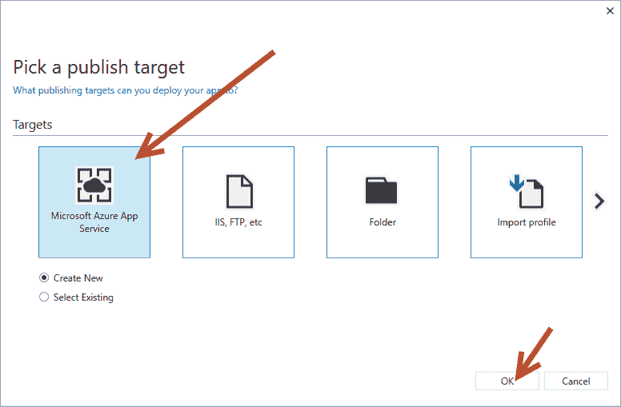](https://res.cloudinary.com/practicaldev/image/fetch/s--8jnsIB57--/c_limit%2Cf_auto%2Cfl_progressive%2Cq_auto%2Cw_880/https://d33wubrfki0l68.cloudfront.net/9f52baf23e03f0823ce825cad4795ce15972da19/f0761/files/e2e-09.png)

#### 第四步

填写所有设置:添加一个名称，选择订阅，创建一个新的资源组。对于应用服务计划:选择一个名称，离你最近的位置，并且免费。然后在主模态上点击`Create`。

[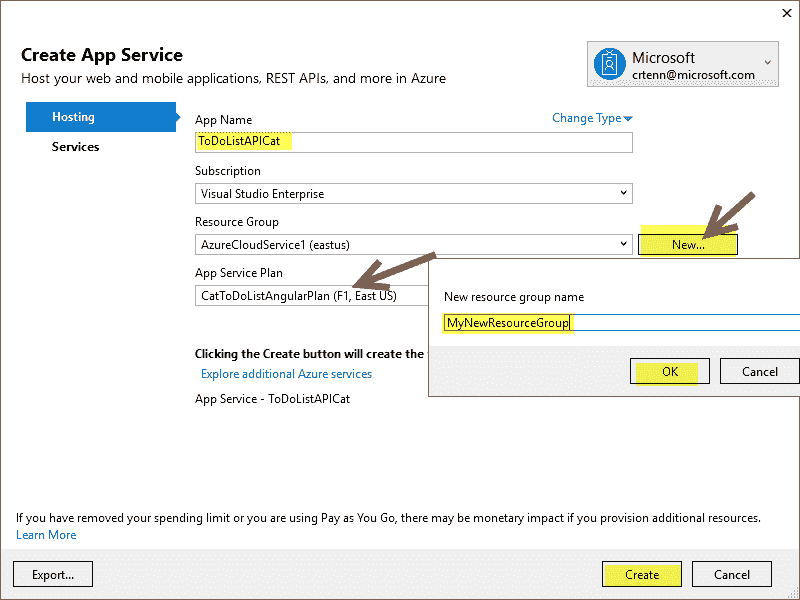](https://res.cloudinary.com/practicaldev/image/fetch/s--ZvIqhyfg--/c_limit%2Cf_auto%2Cfl_progressive%2Cq_auto%2Cw_880/https://d33wubrfki0l68.cloudfront.net/16389ea3dcfdd8df5e605d2e6d2243a3e2ff080c/6da4a/files/e2e-10-1.png)

如果你在进行`ToDoListAPI`项目，确保你选择了 API。

[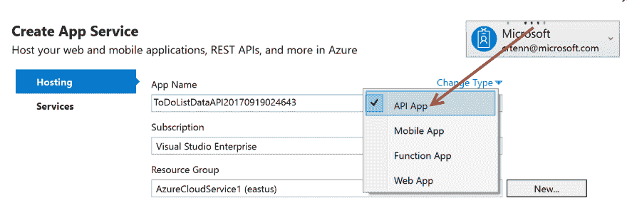](https://res.cloudinary.com/practicaldev/image/fetch/s--vSFSe-8A--/c_limit%2Cf_auto%2Cfl_progressive%2Cq_auto%2Cw_880/https://d33wubrfki0l68.cloudfront.net/38a7a42a1dc3ccfbd5704c6612d0ac3b8a4fb470/61ca9/files/e2e-18.png)

如果你在进行`ToDoListAngular`项目，确保你选择了 Web App。

[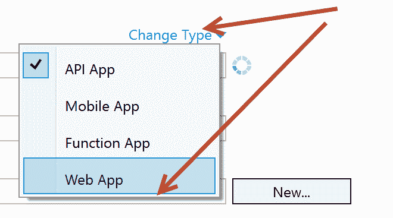](https://res.cloudinary.com/practicaldev/image/fetch/s--yh5G_geL--/c_limit%2Cf_auto%2Cfl_progressive%2Cq_auto%2Cw_880/https://d33wubrfki0l68.cloudfront.net/41c44153d8554b29d90419f6d84d0c7553a49262/2e08d/files/e2e-19.png)

#### 第五步

在给它几分钟发布时间后，确保它显示在 Azure 门户中。单击 API 项目以转到概述(红色箭头)。

[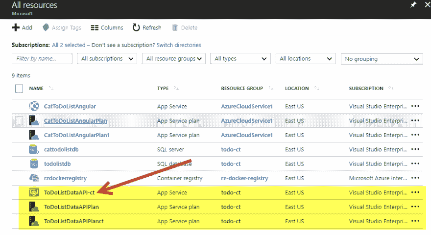](https://res.cloudinary.com/practicaldev/image/fetch/s--FY2UnyOL--/c_limit%2Cf_auto%2Cfl_progressive%2Cq_auto%2Cw_880/https://d33wubrfki0l68.cloudfront.net/64e00b15a2a0f2c30d48b7c6e00dcfd2283b3957/90295/files/e2e-12.png)

#### 第六步

复制截图中突出显示的 API 应用服务的 URL。

[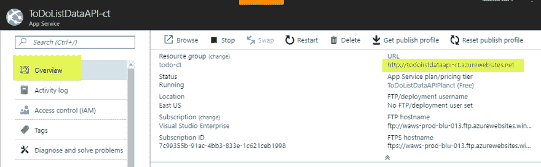](https://res.cloudinary.com/practicaldev/image/fetch/s--rFrIFUJu--/c_limit%2Cf_auto%2Cfl_progressive%2Cq_auto%2Cw_880/https://d33wubrfki0l68.cloudfront.net/71a84d3cb4fc20c4e1d7de369357e345419c9215/01456/files/e2e-13.png)

#### 第七步

让我们将前端连接到 API 项目。打开`ToDoListAngular`解决方案。转到你的前端`ToDoListAngular`项目的`web.config`文件。粘贴上一步中的 URL。

[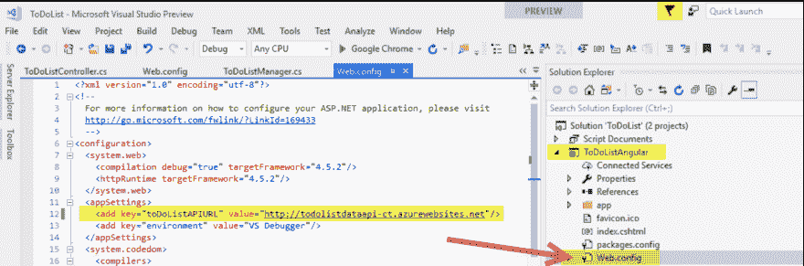](https://res.cloudinary.com/practicaldev/image/fetch/s--yHlD813i--/c_limit%2Cf_auto%2Cfl_progressive%2Cq_auto%2Cw_880/https://d33wubrfki0l68.cloudfront.net/d76c04f0e134e31818bff0ff33434ea2e9595ce0/3f251/files/e2e-14.png)

#### 第八步

让我们对前端项目的 Azure 做同样的发布。

> 重复步骤 2-5，但在前端`ToDoListAngular`项目上进行。确保在**步骤 4** 中，你为 Angular Web 项目选择了正确的选项`Web App`。

#### 第九步

发布完成后，验证它是否在 Azure 门户中。点击`App Service`(截图中的红色箭头)。

[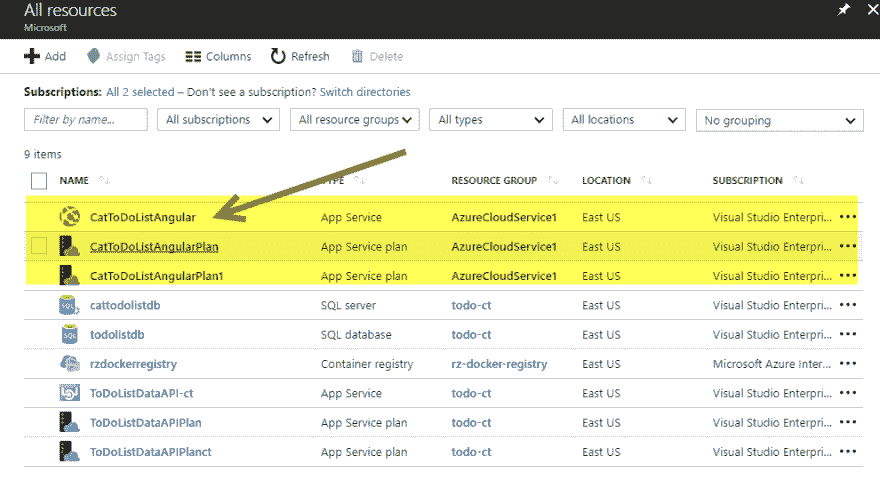](https://res.cloudinary.com/practicaldev/image/fetch/s--T88_7VMr--/c_limit%2Cf_auto%2Cfl_progressive%2Cq_auto%2Cw_880/https://d33wubrfki0l68.cloudfront.net/fe2d43e525d2b68e6ae4c06f797d6bb0263d1ca0/c78b5/files/e2e-15.png)

#### 第十步

在概述页面上，复制 URL。

[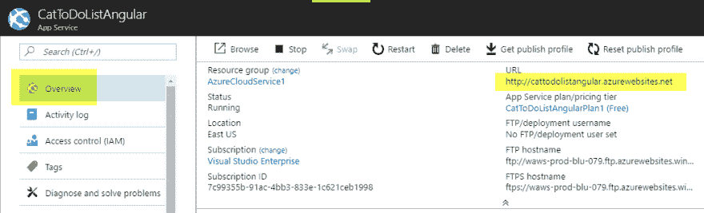](https://res.cloudinary.com/practicaldev/image/fetch/s--bPl9lsLk--/c_limit%2Cf_auto%2Cfl_progressive%2Cq_auto%2Cw_880/https://d33wubrfki0l68.cloudfront.net/f1b446eec928cbd00bf50dd519cae57cb2a3be00/b29ec/files/e2e-16.png)

#### 第 11 步

将 URL 粘贴到您的浏览器中，然后单击待办事项选项卡查看待办事项列表。你现在应该有一个工作的 Azure 应用服务 Web 前端与连接到 Azure SQL 的 Azure 应用服务 API 对话。

[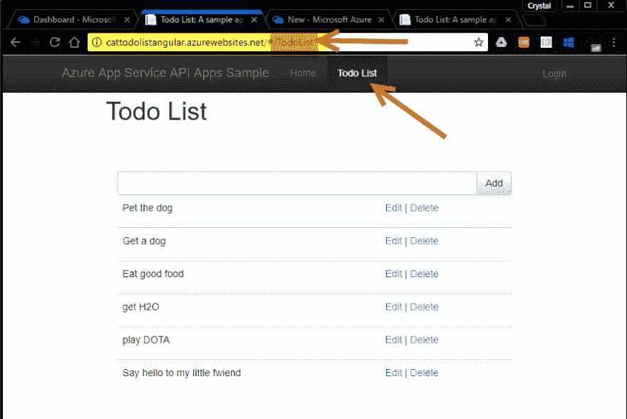](https://res.cloudinary.com/practicaldev/image/fetch/s--5QpDV3cp--/c_limit%2Cf_auto%2Cfl_progressive%2Cq_auto%2Cw_880/https://d33wubrfki0l68.cloudfront.net/ed38903a82e608cdf16ac15e484da351b6f919b9/59fdc/files/e2e-17.png)

太好了，现在你已经用 Azure 把你的项目迁移到云中了！

*准备好深入了解 Azure DevOps，看看我们如何从 VSTS 开发出这款产品了吗？*查看我们的 [Azure DevOps 快速入门和教程](https://docs.microsoft.com/en-us/azure/devops-project/?WT.mc_id=azureapril_devto-blog-cxa)！

* * *

我们将在 4 月份每天发布文章，所以请继续关注或提前查看更多提示和技巧[现在](http://azuredev.tips)。