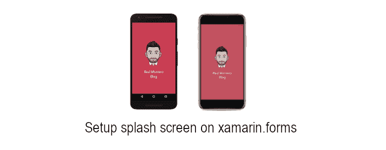
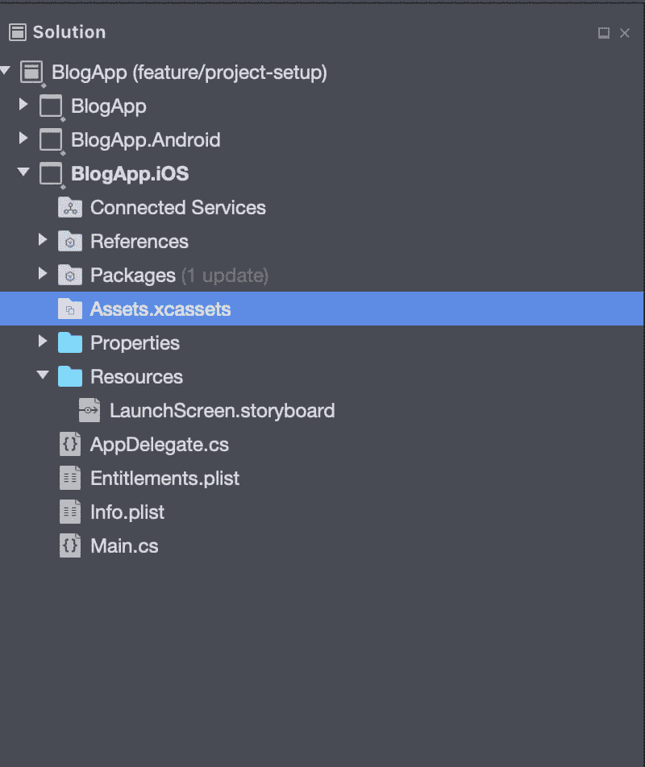
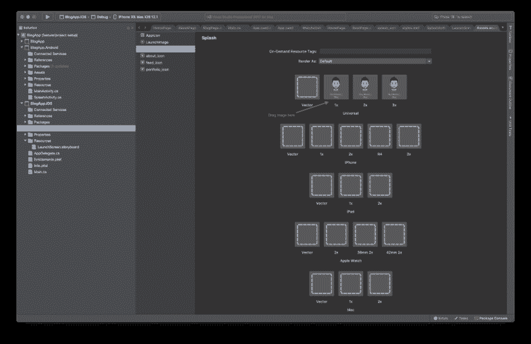
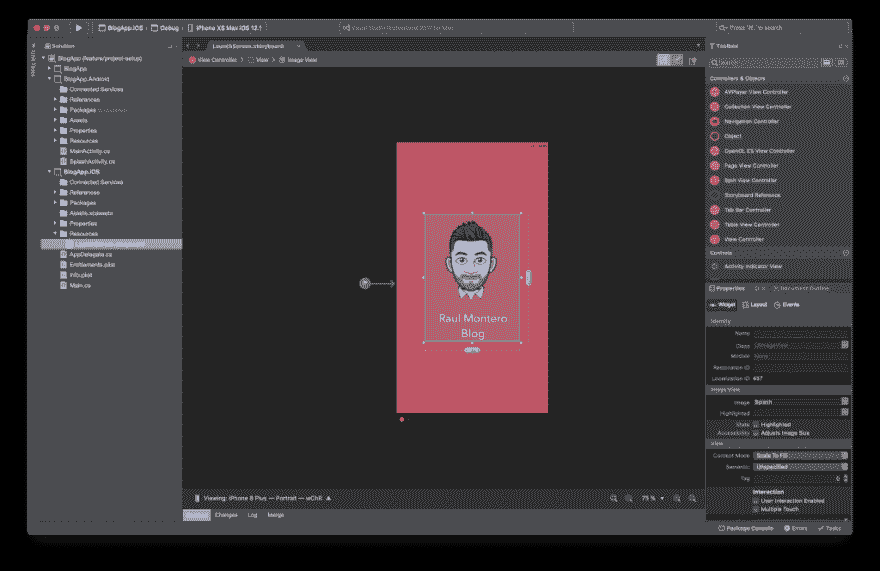

# 在 Xamarin 上设置闪屏。形式

> 原文：<https://dev.to/raulmonteroc/setup-a-splash-screen-on-xamarin-forms-4ena>

[](https://res.cloudinary.com/practicaldev/image/fetch/s--nsPMB74Y--/c_limit%2Cf_auto%2Cfl_progressive%2Cq_auto%2Cw_880/https://raulmonteroc.com/wp-content/uploads/2019/02/Splash-Screen-banner.png)

闪屏就是我们所说的那些出现在应用程序开始时的屏幕，它只在应用程序加载时才会出现。

这是一般移动开发中常见的设计模式，允许用户在触摸应用程序的图标后立即接收反馈，从一开始就向他们显示一些东西，而不是盯着黑屏直到应用程序完成加载。

最重要的是，添加闪屏很简单，所以你不用花太多力气就能获得更好的用户体验。我们开始吧！

## 创建闪屏

在我们开始之前，我们需要明白的是**没有跨平台的方式来添加闪屏**。这是因为 Xamarin。表单库在 MainActivity/AppDelegate 完成加载之后加载**，到那时就太晚了，我们需要在**这些类加载之前和期间显示**，毕竟，这就是闪屏的意义。**

记住这一点，剩下的就是在每个平台上创建闪屏文件和配置。在我们的例子中，闪屏由一个标志和一个背景色组成。

### 安卓

我们首先需要的是标志图像。Android 定义了如何添加图像，并确保它在每个平台上都看起来不错，你可以在这里阅读相关内容

之后，我们要创建闪屏文件，它加载图像并设置我们需要的背景。为此，我们将定义一个 XML drawable，代码如下:

```
<?xml version="1.0" encoding="utf-8"?>
<layer-list xmlns:android="http://schemas.android.com/apk/res/android"/>
    <item android:drawable="@color/splash\_background" />
    <item android:gravity="center"/> 
        <bitmap android:src="@drawable/splash" />
    </item>
</layer-list> 
```

这里，我们定义了一个[层列表](https://developer.android.com/guide/topics/resources/drawable-resource#LayerList)，它本质上允许我们同时拥有背景颜色和图像背景，第一个<项目>定义背景颜色，第二个项目定义位于屏幕中心的图像标志。

准备好之后，我们定义一个新的样式将这个 drawable 设置为背景，并通过移除任何动作/状态栏来确保它占据设备上所有可用的屏幕，代码如下:

```
<style name="Splash" parent="Theme.AppCompat.Light.NoActionBar"/>
    <item name="android:windowBackground"/>@drawable/splash/_screen/</item/>
    <item name="android:windowNoTitle"/>true</item>
    <item name="android:windowFullscreen"/>true</item> 
</style> 
```

最后，我们创建一个名为 SplashActivity 的新活动，将它配置为 MainLauncher(确保从 MainActivity.cs 中删除它),并使它使用我们定义的新样式。然后，我们从 OnCreate()方法启动 MainActivity，这样，一旦它准备好，它就加载启动应用程序其余部分的屏幕。

```
[Activity(Label = "SplashActivity", Theme = "@style/Splash", MainLauncher = true)] 
public class SplashActivity : Activity 
{ 
    protected override void OnCreate(Bundle savedInstanceState) 
    { 
        base.OnCreate(savedInstanceState); 
        StartActivity(typeof(MainActivity)); 
        Finish(); 
    } 
} 
```

一些附加说明:

1.  调用 Finish 是为了确保在应用程序运行时活动不会停留在内存中，因为我们再也不会需要它了。
2.  我们创建了一个新的活动，而不是使用 MainActivity，因为我们定义的 drawable 成为了活动的背景，因此我们最终会覆盖每个 Xamarin.forms 页面上的 background 属性。
3.  我们使用 XML drawable 而不是标准布局，因为这种方法更快。

#### iOS

与 Android 一样，在 iOS 上，我们需要根据苹果标准包含徽标图像，以确保它在所有支持的分辨率下都很好看，你可以在这里找到指南。

有了所有的图片，是时候将它们添加到我们的项目中了。为此，我们将它们添加到一个名为 **Assets.xcassets 的特殊文件夹中。**我们可以在解决方案资源管理器窗口内的 iOS 项目部分找到它。

[](https://res.cloudinary.com/practicaldev/image/fetch/s--Dag7D9hM--/c_limit%2Cf_auto%2Cfl_progressive%2Cq_auto%2Cw_880/https://raulmonteroc.com/wp-content/uploads/2019/02/Assets.png)

双击它，一个新的标签窗口将出现。在这里，我们会发现一个侧边栏，其中有图像的名称标识符(在左侧)和占位符，用于将我们的图像放在右侧。

接下来要做的是，右键单击侧边栏，选择**新图像集**，并给它命名(我用*飞溅*)。之后，剩下的就是添加图像。拖动&根据苹果公司定义的分辨率，将图像文件放入第一行占位符框中。

<figure>[](https://res.cloudinary.com/practicaldev/image/fetch/s--H49zdGke--/c_limit%2Cf_auto%2Cfl_progressive%2Cq_auto%2Cw_880/https://raulmonteroc.com/wp-content/uploads/2019/02/Splash-iOS-1024x664.png) 

<figcaption>
</figcaption>

</figure>

最后，剩下的是更新 **LaunchScreen.storyboard** 以包含我们的新图像，定义其约束以确保其始终居中，并设置背景颜色，所有这些都来自 Visual Studio iOS designer，不需要任何代码。

[](https://res.cloudinary.com/practicaldev/image/fetch/s--4qvI5oKN--/c_limit%2Cf_auto%2Cfl_progressive%2Cq_auto%2Cw_880/https://raulmonteroc.com/wp-content/uploads/2019/02/Splash-storyboard-1024x664.png)

如果你没有很多使用 iOS 设计器的经验，看看微软的指南吧，它一步一步地解释了这个问题。