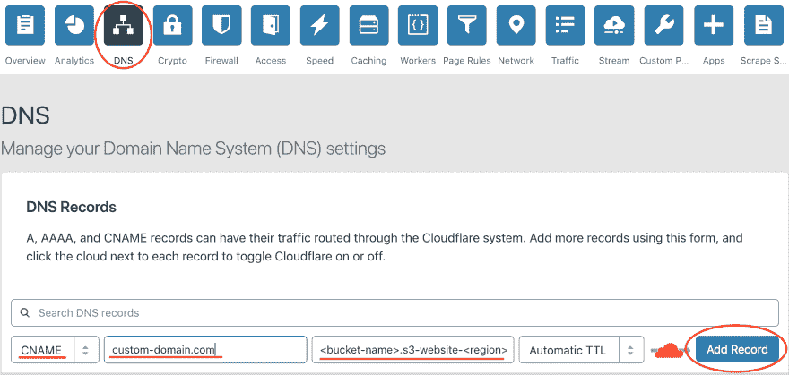
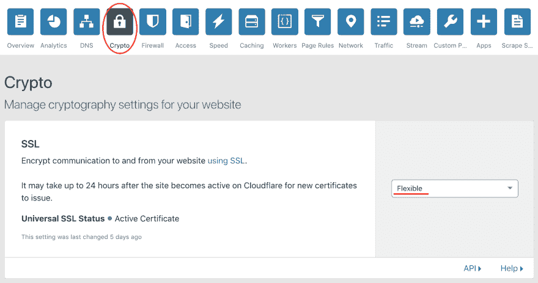
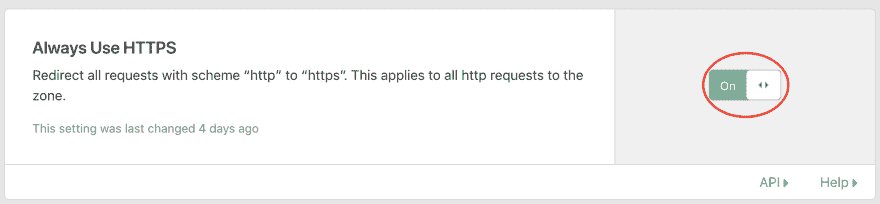

# 使用 Cloudflare CDN 为 S3 静态网站设置自定义域

> 原文：<https://dev.to/wmccoubrey/setup-custom-domain-for-s3-static-website-with-cloudflare-cdn-2o8a>

# 概述

这篇文章简要描述了我在为 S3 上的一个静态网站设置自定义域名和 CDN 时学到的一些东西。

# TLDR

存储桶名称需要与自定义域匹配。例如，要设置自定义域`wilsonmccoubrey.com`，存储桶名称必须为`wilsonmccoubrey.com`

# 假设

本快速指南假设您已经:

*   一个静态网站在 S3 的一个桶内成功运行，可通过桶 url 访问，例如`http://<bucket name>.s3-website-<region>1.amazonaws.com/`
*   cloudflare 中的域设置和名称服务器设置

# 步骤

## 正确设置桶名

当设置您的 bucket 时，您的 *bucket 名称必须与您想要提供站点服务的自定义域*相匹配。例如，要设置自定义域`wilsonmccoubrey.com`，存储段名称必须是`wilsonmccoubrey.com`。我最初犯了这个错误，并在设置我的域后在浏览器中收到了“NoSuchBucketException”。

## 添加 CNAME 记录到 Cloudflare

## 启用 SSL(可选，但推荐)

[T6】](https://res.cloudinary.com/practicaldev/image/fetch/s--h5UQLmiM--/c_limit%2Cf_auto%2Cfl_progressive%2Cq_auto%2Cw_880/https://thepracticaldev.s3.amazonaws.com/i/ugce9rht5vrxx0roab92.png)