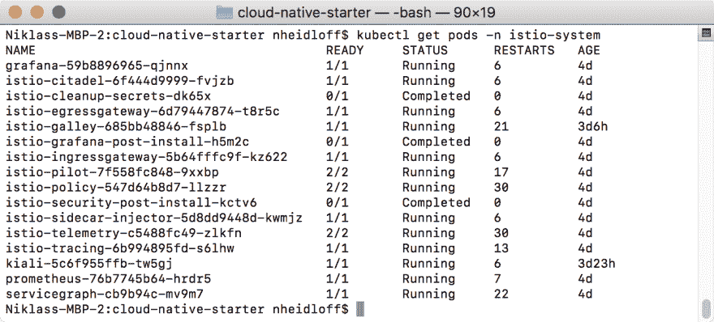
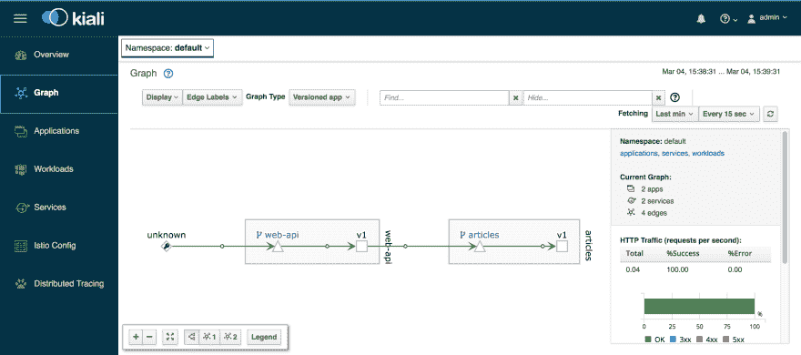

# 设置本地 Kubernetes 和 Istio 开发环境

> 原文：<https://dev.to/nheidloff/setup-of-a-local-kubernetes-and-istio-dev-environment-1c67>

作为开发人员，我喜欢尽可能多地在本地进行开发，因为开发和调试代码通常更容易、更快。为了构建云原生应用和微服务，让本地 [Kubernetes](https://kubernetes.io/) 集群和 [Istio](https://istio.io/) 在本地运行非常方便。本文描述了如何安装这些组件和一些额外的工具，如 [Kiali](https://www.kiali.io/) 。

**Minikube**

为了在本地运行 Kubernetes 集群，有不同的选择。一个是使用集成在 Docker 桌面中的 Kubernetes 功能。我选择的替代方案是 [Minikube](https://kubernetes.io/docs/setup/minikube/) ，它在您的开发机器上的一个 VM 内运行一个单节点 Kubernetes 集群。

按照说明安装 [kubectl](https://kubernetes.io/docs/tasks/tools/install-kubectl/) 和 [Minikube](https://kubernetes.io/docs/tasks/tools/install-minikube/) 。作为虚拟机管理程序，我使用的是在 Mac、Linux 和 Windows 上受支持的 VirtualBox。

当运行 Istio 和您自己的应用程序时，您需要比默认情况下更多的内存和 CPU。以下是我的设置:

```
$ minikube config set cpus 4
$ minikube config set memory 8192
$ minikube config set disk-size 50g
$ minikube addons enable ingress
$ minikube start 
```

首次启动时,“minikube start”可能需要几分钟时间。耐心点。

有时“minikube start”对我不起作用。在这种情况下，我停止我的 VPN，调用“minikube delete#，删除”。minikube '目录，重新启动我的机器，并再次启动它。

之后，您可以通过以下命令获得 Minikube IP 地址并打开 Kubernetes 仪表板:

```
$ minikube ip
$ minikube dashboard 
```

Minikube 自带 Docker 守护进程，这样你就不用使用 Docker 桌面了。你只需要“docker”命令行界面并指向 Minikube:

```
$ eval $(minikube docker-env) 
```

要停止集群，请运行以下命令:

```
$ minikube stop 
```

**Istio**

要下载 Istio，运行以下命令:

```
$ curl -L [https://git.io/getLatestIstio](https://git.io/getLatestIstio) | sh - 
```

按照终端中的说明设置路径。

要安装 Istio，运行以下命令:

```
$ cd istio-1.0.6
$ kubectl apply -f install/kubernetes/helm/istio/templates/crds.yaml
$ kubectl apply -f install/kubernetes/istio-demo.yaml 
```

在继续之前，请确保所有 pod 都在运行或已完成。首次启动 pod 时，这可能需要几分钟时间。耐心点。

```
$ kubectl get pod -n istio-system 
```

这张截图显示了所有正在运行或已完成的 Istio pods(暂时忽略 Kiali pods)。

[](https://thepracticaldev.s3.amazonaws.com/i/51wgpd5c9hptl66csg63.png)

最后一步启用自动边车注射:

```
$ kubectl label namespace default istio-injection=enabled 
```

设置 Minikube 和 Istio 后，您可以使用以下工具:

*【立方控制板】*

```
$ minikube dashboard 
```

*耶格仪表板*

```
$ kubectl port-forward -n istio-system $(kubectl get pod -n istio-system -l app=jaeger -o jsonpath='{.items[0].metadata.name}') 16686:16686 
```

打开 Jaeger 的网址: [http://localhost:16686](http://localhost:16686)

*Grafana 控制板*

```
$ kubectl -n istio-system port-forward $(kubectl -n istio-system get pod -l app=grafana -o jsonpath='{.items[0].metadata.name}') 3000:3000 & 
```

打开 Grafana 的 URL:[http://localhost:3000/dashboard/db/istio-mesh-dashboard](http://localhost:3000/dashboard/db/istio-mesh-dashboard)

*普罗米修斯仪表盘*

```
$ kubectl -n istio-system port-forward $(kubectl -n istio-system get pod -l app=prometheus -o jsonpath='{.items[0].metadata.name}') 9090:9090 & 
```

打开普罗米修斯的网址: [http://localhost:9090](http://localhost:9090)

基亚利

运行以下命令来安装 Kiali:

```
$ bash <(curl -L [http://git.io/getLatestKialiKubernetes](http://git.io/getLatestKialiKubernetes)) 
```

注意:由于某种原因，这个脚本不适合我。我不得不更换一条[线](https://github.com/kiali/kiali/blob/master/deploy/kubernetes/deploy-kiali-to-kubernetes.sh#L172) :

```
get_downloader
github_api_url="[https://api.github.com/repos/kiali/kiali/releases/latest](https://api.github.com/repos/kiali/kiali/releases/latest)"
kiali_version_we_want="v0.15.0" 
```

要启动 Kiali，您需要 IP 地址和节点端口:

```
$ minikube ip
$ kubectl get svc -n istio-system kiali --output 'jsonpath={.spec.ports[*].nodePort}' 
```

打开 Kiali 的 URL:https://[minikube-IP]:[Kiali-nodeport]/Kiali

**样本应用**

我正在开发一个简单的[示例应用程序](https://github.com/nheidloff/cloud-native-starter)，它展示了一些 Istio 和[微配置文件](https://microprofile.io/)的功能来构建云原生应用程序。我很快会在博客上写更多关于这个的内容。

现在，您可以从这个项目中安装两个示例微服务。确保 Minikube 运行并且你已经安装了所有必要的[先决条件](https://github.com/nheidloff/cloud-native-starter/blob/master/scripts/check-prerequisites.sh#L13-L21) :

```
$ git clone [https://github.com/nheidloff/cloud-native-starter.git](https://github.com/nheidloff/cloud-native-starter.git)
$ scripts/check-prerequisites.sh
$ scripts/deploy-articles-java-jee.sh
$ scripts/deploy-web-api-java-jee.sh 
```

以下截图显示了 BFF(后端对前端)“web-api”微服务调用另一个“articles”web 服务:

[](https://thepracticaldev.s3.amazonaws.com/i/xwrlrfdiiruavlwwjnp7.png)

这篇文章中的大部分信息我都是从 Harald Uebele 那里得到的。谢谢哈拉尔德。我只是添加了一些我必须做得不同的细节。