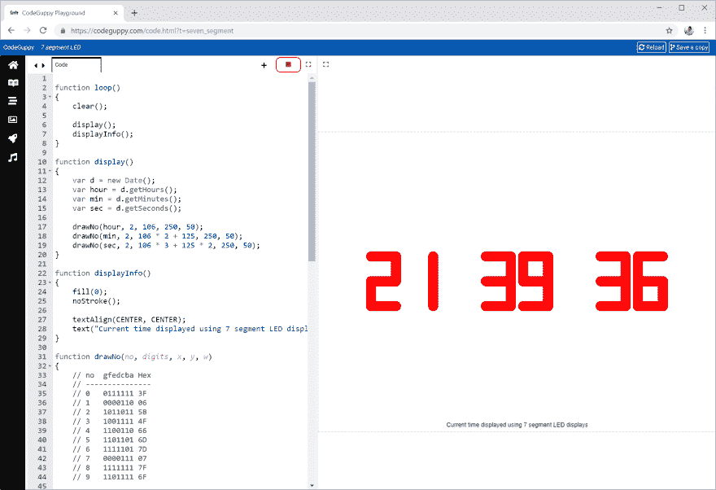

# 七段显示器

> 原文：<https://dev.to/codeguppy/seven-segment-display-168p>

# [T1】简介](#intro)

了解如何创建经典的七段显示屏，以时尚的方式显示当前时间。

# 需要什么？

要运行本文中的代码，您不需要在本地计算机上安装任何东西。

只需从[codeguppy.com/code.html](https://codeguppy.com/code.html)打开在线 JavaScript playground，在集成编辑器中复制并粘贴以下代码。

准备就绪后，按“播放”按钮运行代码。

[](https://res.cloudinary.com/practicaldev/image/fetch/s--rqQSO6Sf--/c_limit%2Cf_auto%2Cfl_progressive%2Cq_auto%2Cw_880/https://thepracticaldev.s3.amazonaws.com/i/wavh1kopp0rvq4u6ee8s.png)

# 源代码

```
function loop()
{
    clear();

    display();
    displayInfo();
}

function display()
{
    var d = new Date();
    var hour = d.getHours();
    var min = d.getMinutes();
    var sec = d.getSeconds();

    drawNo(hour, 2, 106, 250, 50);
    drawNo(min, 2, 106 * 2 + 125, 250, 50);
    drawNo(sec, 2, 106 * 3 + 125 * 2, 250, 50);
}

function displayInfo()
{
    fill(0);
    noStroke();

    textAlign(CENTER, CENTER);
    text("Current time displayed using 7 segment LED displays", width / 2, height - 10);
}

function drawNo(no, digits, x, y, w)
{
    // no  gfedcba Hex
    // ---------------
    // 0   0111111 3F
    // 1   0000110 06
    // 2   1011011 5B
    // 3   1001111 4F
    // 4   1100110 66
    // 5   1101101 6D
    // 6   1111101 7D
    // 7   0000111 07
    // 8   1111111 7F
    // 9   1101111 6F

    var numbers = [0x3F, 0x06, 0x5B, 0x4F, 0x66, 0x6D, 0x7D, 0x07, 0x7F, 0x6F];

    var txt = no.toString();
    txt = padNumber(txt, digits);

    for(var i = 0; i < txt.length; i++)
    {
        var chr = txt[i];
        no = int(chr);

        drawBinNo(numbers[no], x + i * (w + w / 2), y, w);    
    }
}

function drawBinNo(no, x, y, w)
{
    var bin = no.toString(2);
    bin = padNumber(bin, 8);

    push();
    strokeWeight(20);
    stroke("Red");

    drawHorizontal(x, y, w, bin[7]);         // a
    drawVertical(x + w, y, w, bin[6]);       // b
    drawVertical(x + w, y + w, w, bin[5]);   // c
    drawHorizontal(x, y + 2 * w, w, bin[4]); // d
    drawVertical(x, y + w, w, bin[3]);       // e
    drawVertical(x, y, w, bin[2]);           // f
    drawHorizontal(x, y + w, w, bin[1]);     // g
    pop();
}

function drawVertical(x, y, w, state)
{
    if (state === '1')
        line(x, y, x, y + w);
}

function drawHorizontal(x, y, w, state)
{
    if (state === '1')
        line(x, y, x + w, y);
}

// Pad a string with zeros on the left until reaches the specified length
function padNumber(txt, len)
{
    while(txt.length < len)
        txt = "0" + txt;

    return txt;
} 
```

# 反馈

如果你喜欢这篇文章，请在 Twitter 上关注 [@codeguppy](https://twitter.com/codeguppy) 和/或访问 codeguppy.com[获得更多教程和项目。](https://codeguppy.com)

另外，如果你想用详细的说明来扩展这篇文章，解释如何一步一步地构建程序，请在评论中留下反馈。