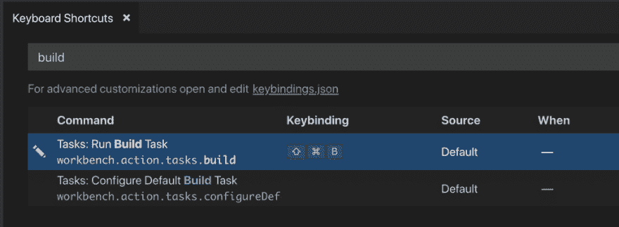
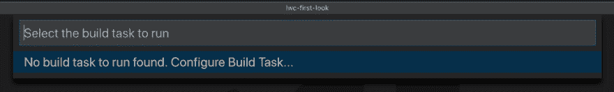
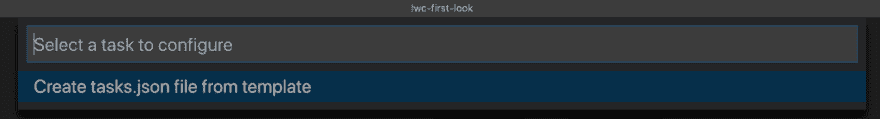
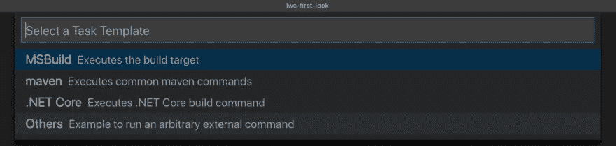
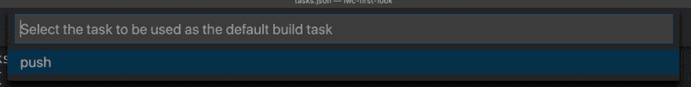

# SFDX VSCode 构建命令

> 原文：<https://dev.to/brettmn/sfdx-vscode-build-command-13o5>

[https://www.youtube.com/embed/UdymIsDFinA](https://www.youtube.com/embed/UdymIsDFinA)

你好，我是布雷特和 WIPDeveloper.com。准备好我们的 scratch org 后，我们现在可以创建一个 Lighting Web 组件，并将其推送到 scratch org 以查看它的运行情况。

## 命令调色板疲劳

Visual Studio 代码中 SFDX 的所有命令都是通过命令面板完成的。当推至默认组织时，您可能会习惯于进行更改，打开命令面板并按 enter 键。如果这是你使用的最后一个命令，这将改变你的默认组织，但是如果你最近使用了命令面板的不同选项，事情的流程将会中断，因为`SFDX: Push Source to Default Scratch Org`不会是最近使用列表中的第一个选项。

如果我们将`sfdx force:source:push` CLI 命令绑定到 Visual Studio 代码内置的“Build”命令，我们可以减少这些步骤，防止自己意外使用错误的命令。

## Visual Studio 代码的构建命令

Visual Studio 代码允许我们使用 Mac 上的`cmd+shift+b`或 Windows 上的`ctrl+shift+b`来执行“构建”命令。

<figure>[](https://res.cloudinary.com/practicaldev/image/fetch/s--iz21g-xd--/c_limit%2Cf_auto%2Cfl_progressive%2Cq_auto%2Cw_880/https://i1.wp.com/wipdeveloper.com/wp-content/uploads/2019/01/Screen-Shot-2019-01-08-at-4.16.09-PM.png%3Ffit%3D1024%252C375%26ssl%3D1)

<figcaption>Visual Studio 键盘快捷键菜单中的代码构建命令。</figcaption>

</figure>

这个构建命令必须被配置，当你第一次按下它时，它会询问给它分配什么任务。

如果当前项目中没有任何任务，它会提示您从模板中创建一个。

<figure>[](https://res.cloudinary.com/practicaldev/image/fetch/s--YG5CzPJ4--/c_limit%2Cf_auto%2Cfl_progressive%2Cq_auto%2Cw_880/https://i2.wp.com/wipdeveloper.com/wp-content/uploads/2019/01/Screen-Shot-2019-01-08-at-4.24.14-PM.png%3Ffit%3D1024%252C153%26ssl%3D1) 

<figcaption>VS 代码要求您配置一个构建任务。
</figcaption>

</figure>

<figure>[](https://res.cloudinary.com/practicaldev/image/fetch/s--mpzNbF_m--/c_limit%2Cf_auto%2Cfl_progressive%2Cq_auto%2Cw_880/https://i1.wp.com/wipdeveloper.com/wp-content/uploads/2019/01/Screen-Shot-2019-01-08-at-4.24.24-PM.png%3Ffit%3D1024%252C138%26ssl%3D1) 

<figcaption>VS 代码提供从一个模板创建一个`task.json`。</figcaption>

</figure>

<figure>[](https://res.cloudinary.com/practicaldev/image/fetch/s--WdAXKI98--/c_limit%2Cf_auto%2Cfl_progressive%2Cq_auto%2Cw_880/https://i0.wp.com/wipdeveloper.com/wp-content/uploads/2019/01/Screen-Shot-2019-01-08-at-4.24.34-PM.png%3Ffit%3D1024%252C243%26ssl%3D1) 

<figcaption>VS 代码模板选项，我们将使用**其他**</figcaption>

</figure>

#### 其他人`task.json`模板

```
{
    // See https://go.microsoft.com/fwlink/?LinkId=733558
    // for the documentation about the tasks.json format
    "version": "2.0.0",
    "tasks": [
        {
            "label": "echo",
            "type": "shell",
            "command": "echo Hello"
        }
    ]
} 
```

让我们将标签重命名为`push`，并将命令改为`sfdx force:source:push`

#### 更新`task.json`

```
{
    // See https://go.microsoft.com/fwlink/?LinkId=733558
    // for the documentation about the tasks.json format
    "version": "2.0.0",
    "tasks": [
        {
            "label": "push",
            "type": "shell",
            "command": "sfdx force:source:push"
        }
    ]
} 
```

现在，如果我们尝试 build 命令，我们可以选择将`push`配置为要运行的任务。

<figure>[](https://res.cloudinary.com/practicaldev/image/fetch/s--5qpqcHiM--/c_limit%2Cf_auto%2Cfl_progressive%2Cq_auto%2Cw_880/https://i1.wp.com/wipdeveloper.com/wp-content/uploads/2019/01/Screen-Shot-2019-01-08-at-4.35.00-PM.png%3Ffit%3D1024%252C130%26ssl%3D1) 

<figcaption>选择`push`将其设置为“构建”</figcaption>

</figure>

时运行的任务

一旦它被配置为构建命令 VS 代码，就将其设置为构建组的一部分和默认操作。最终的`task.json`应该是这样的。

#### 决赛`task.json`

```
{
    // See https://go.microsoft.com/fwlink/?LinkId=733558
    // for the documentation about the tasks.json format
    "version": "2.0.0",
    "tasks": [
        {
            "label": "push",
            "type": "shell",
            "command": "sfdx force:source:push",
            "group": {
                "kind": "build",
                "isDefault": true
            }
        }
    ]
} 
```

这将允许我们在 Mac 上按下`cmd+shift+b`或在 Windows 上按下`ctrl+shift+b`将我们的更改保存到 Salesforce 并继续下一个任务，而无需导航命令面板。

## 现在就这样。

记得报名参加 **[每周一次的单口相声！你可以得到我们关于 WIPDeveloper.com 的任何最新信息。](https://wipdeveloper.com/newsletter/)**

post [SFDX VSCode 构建命令](https://wipdeveloper.com/sfdx-vscode-build-command/)首先出现在【WIPDeveloper.com】的[上](https://wipdeveloper.com)。