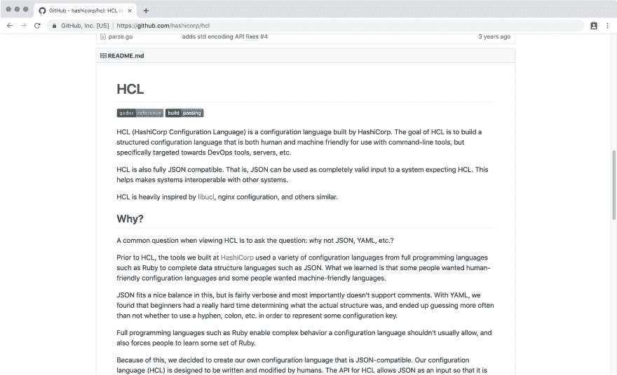
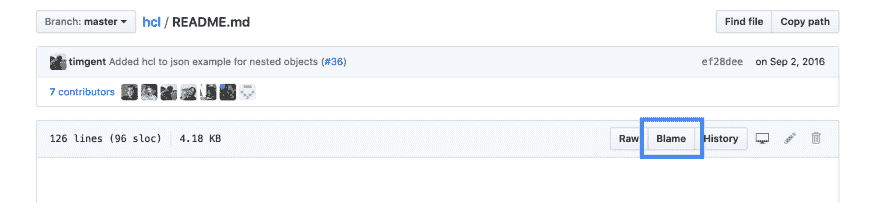
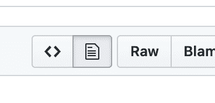

# 与 GitHub 共享 Markdown 文件中的特定行

> 原文：<https://dev.to/chaseadamsio/share-specific-lines-in-a-markdown-file-with-github-4ff0>

过去，当我需要从 GitHub 共享 Markdown 文件中的特定行时，我通常会共享 Markdown 文件的链接或最接近我想要共享的头的片段的链接，并说“查找 X”。

在这个简短的 GitHub protip 中，我将分享我发现的黑客技术，它允许您共享 Markdown 文件中的特定行。

我使用 Hashicorps HCL repo 作为例子，但是这些概念适用于 GitHub 上的任何 Markdown 文件。我们将分享关于如何用 HCL 写评论的具体内容。

## 与 GitHub UI 共享一行

首先打开一个 GitHub 项目，找到`README.md` <sup id="fnref1">[1](#fn1)</sup> 。(如果您手头没有，请随意跟随 hashicorp/HCL 回购中的[。](https://github.com/hashicorp/hcl)

你可以看到`README.md`被渲染成 Markdown 而不是 source。在文件查看器中，找到并点击`README.md`。这将我们带到的景色是*也被*渲染成降价:

[](https://res.cloudinary.com/practicaldev/image/fetch/s--stLIzVcP--/c_limit%2Cf_auto%2Cfl_progressive%2Cq_auto%2Cw_880/https://chaseonsoftware.com/img/gh-md-readme-view.png)

对于我们的例子，我们想要共享的 Markdown 文件的部分是“单行注释以#或//”开始，正如你所看到的，从这个视图中没有办法做到这一点。

**为了选择特定的行，我们将使用责备视图。**点击内容视图右上角的**责备**按钮:

[](https://res.cloudinary.com/practicaldev/image/fetch/s--L2UbBs_8--/c_limit%2Cf_auto%2Cfl_progressive%2Cq_auto%2Cw_880/https://chaseonsoftware.com/img/gh-md-blame.png)

我们看到的新视图有 Markdown 文件的源，以及行号！现在我们可以寻找“单行注释以#或//”开始，并在左侧单击行号(截至本文撰写时为 54)。

您应该注意到 URL 的位置已经改变，在它的末尾包含了一个片段:

```
https://github.com/hashicorp/hcl/blame/master/README.md#L54 
```

Enter fullscreen mode Exit fullscreen mode

当您共享此链接时，它会将收件人带到此页面的此行号处，并对您引用的行进行突出显示。

## 与 GitHub UI 共享多行

如果你想分享*所有关于评论的行*,而不仅仅是单行评论，你也可以这么做！单击要开始的行号(同样是第 54 行)，按住 shift 键单击要结束的行(在本例中是第 58 行)。

这将添加一个如下所示的 URL 片段:

```
https://github.com/hashicorp/hcl/blame/master/README.md#L54-L58 
```

Enter fullscreen mode Exit fullscreen mode

现在，当收件人按照这个链接，它会带他们到文件，转到第 54 行，并突出显示第 54-58 行。

## 结论

这是目前我所知道的与 GitHub 共享 Markdown 文件中特定行的最佳方式。希望他们会听我的话，并推出我在下面分享的改变，这样这篇文章就可以结束了！

## 对于 GitHub，如果你在听的话...

你已经用 GitHub 动作搞定了这个 UI，所以如果你正在寻找小的容易的胜利，考虑为渲染的 blob 和源 blob 应用切换器:

[](https://res.cloudinary.com/practicaldev/image/fetch/s--c7BjzL9U--/c_limit%2Cf_auto%2Cfl_progressive%2Cq_auto%2Cw_880/https://chaseonsoftware.com/img/gh-md-better-buttons.png)

* * *

1.  这适用于所有的降价文件，但这是最丰富/一致的一个。 [↩](#fnref1)