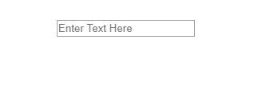

# 在 Vue.js 中的组件之间共享数据

> 原文：<https://dev.to/alexmourer/sharing-data-between-components-invuejs-48me>

在本教程中，我们将探索在一个组件中生成数据，并在 [Vue.js](https://vuejs.org/) 中将它传递给另一个组件。

**TL；这里是一个工作代码沙箱的例子

[](https://res.cloudinary.com/practicaldev/image/fetch/s--kDFN9M84--/c_limit%2Cf_auto%2Cfl_progressive%2Cq_66%2Cw_880/https://thepracticaldev.s3.amazonaws.com/i/2n8ll0586j6qtn0wdp8v.gif)**

#### 我们为什么需要这样做？

如果您已经开发了一个大规模的 Vue 应用程序，那么在某个时候，您可能希望在一个组件中生成数据，然后在一个单独的组件中对其进行处理。在本教程中，我们将从一个组件传递用户输入的文本，并在另一个组件中将它显示为列表。我们不会使用 Vue.js 之外的任何依赖项。

#### 我们如何做到这一点？

首先，我们需要启动并运行 Vue.js。这里的涵盖了这个[，或者你可以建立一个](https://vuejs.org/v2/guide/) [CodeSandbox](https://codesandbox.io) 。

如果您使用 Vue CLI 或 CodeSandbox 来设置您的应用程序，您可能已经有了项目的初始结构。如果你没有，我们需要一个地方来展示我们未来的组件。

```
// App.vue file
<template>
  <div id="app">
  </div>
</template>
<script>
  export default {
    name: "App"
  }
</script> 
```

以上代码是本教程的良好起点。在提供的 [CodeSandbox 示例](https://codesandbox.io/s/l4yj6jxpqz)，**中，这个文件被命名为`App.vue`** 。这里显示的代码将作为显示我们将要构建的组件的基础。

接下来，我们将开始构建我们的组件。

在列出的[示例](https://codesandbox.io/s/l4yj6jxpqz)中，在名为`components`的文件夹中创建了两个组件。

[](https://res.cloudinary.com/practicaldev/image/fetch/s--5ceoK4iW--/c_limit%2Cf_auto%2Cfl_progressive%2Cq_auto%2Cw_880/https://thepracticaldev.s3.amazonaws.com/i/d4qvos4gv2jrrtqasse6.JPG)

我们要看的第一个文件是 **UsrMsg.vue** 。

```
// UsrMsg.vue file
<template>
  <div>
    <input
      placeholder="Enter Text Here"
      v-model="tempMessage"
      @keyup.enter="submit"
    />
  </div>
</template>

<script>
export default {
  name: "UsrMsg",
  data() {
    return {
      tempMessage: ""
    };
  },
  methods: {
    submit: function() {
      this.$emit("inputData", this.tempMessage);
      this.tempMessage = "";
    }
  }
};
</script> 
```

在这个文件中，您将看到一个`input`元素。`input`元素通过使用 Vue 的`v-model`更新数据字段`tempMessage`。

```
<input
    placeholder="Enter Text Here"
    v-model="tempMessage"
    @keyup.enter="submit"
/> 
```

点击`enter`后，方法`submit`被调用。在这个方法中，我们使用`$emit` *(emit:“发送光束”)*使`tempMessage`对父组件可用。`$emit`将一个字符串作为第一个参数，在本例中是`inputData`。它还可以接受第二个参数，这个参数通常是一段数据。在我们的例子中，我们传递的是`tempMessage`的值。这也可以是整数、变量、数组或对象。你还会注意到我们在`$emit`之后设置了`tempMessage = ""`。这将清空输入字段以接受下一个值。

```
submit: function() {
    this.$emit("inputData", this.tempMessage);
    this.tempMessage = "";
} 
```

让我们将`UsrMsg`组件添加到我们的`App.vue`文件中。

```
// App.vue file
<template>
  <div id="app">
    <UsrMsg @inputData="updateMessage" />
  </div>
</template>

<script>
import UsrMsg from "./components/UsrMsg";

export default {
  name: "App",
  components: {
    UsrMsg
  },
  data: function() {
    return {
      childData: ""
    };
  },
  methods: {
    updateMessage(variable) {
      this.childData= variable;
    }
  }
};
</script> 
```

首先，我们希望使我们从组件发出的数据可用。我们通过在我们发出的数据周围添加一个监听器来做到这一点。我们选择了`inputData`作为组件中的数据名称，因此它将成为我们的侦听器。第二部分执行一个叫做`updateMessage`的方法。

```
<UsrMsg @inputData="updateMessage" /> 
```

每当组件内部的数据发生变化时，就会执行`updateMessage`方法。在这个方法中，我们通过数据字段`childData`使组件数据可用。现在可以将它作为道具传递给另一个组件了。

```
updateMessage(variable) {
    this.childData= variable;
} 
```

现在，让我们构建我们将向其传递数据的组件。

我们首先创建一个名为 **Results.vue** 的文件。

```
// Results.vue file
<template>
  <div>
    <li v-for="(message, index) in messageList" :item="message" :key="index">
      {{ message }}
    </li>
  </div>
</template>

<script>
export default {
  name: "Results",
  props: {
    msg: {
      type: String
    }
  },
  data: function() {
    return {
      messageList: []
    };
  },
  watch: {
    msg: function() {
      this.messageList.push(this.msg);
    }
  }
};
</script> 
```

在这个例子中，我们基于名为`messageList`的数组创建一个列表。不需要将数据推送到数组中，但对于演示来说，这更令人兴奋。😜

```
<li v-for="(message, index) in messageList" :item="message" :key="index">
    {{ message }}
</li> 
```

`messageList`数组正在关闭数据属性`msg`。

```
props: {
    msg: {
      type: String
    }
} 
```

当数据通过数据属性`msg`传递到这个组件时，它被推送到`messageList`数组。我们使用`watch`属性在`msg`属性中添加新数据。

```
watch: {
    msg: function() {
      this.messageList.push(this.msg);
    }
} 
```

当新的项目被添加到`messageList`数组时，我们的`<li>`元素将会更新。

现在，我们可以将结果组件添加到我们的`App.vue`文件中。

```
<template>
  <div id="app">
    <UsrMsg @inputData="updateMessage" /> <Results :msg="childData" />
  </div>
</template>

<script>
import UsrMsg from "./components/UsrMsg";
import Results from "./components/Results";

export default {
  name: "App",
  components: {
    UsrMsg,
    Results
  },
  data: function() {
    return {
      childData: ""
    };
  },
  methods: {
    updateMessage(variable) {
      this.childData = variable;
    }
  }
};
</script> 
```

我们添加组件`Results`，并通过道具`msg`传入`childData`。

```
<Results :msg="childData" /> 
```

我们现在可以在`UsrMsg`组件中生成数据，并将其传递给`Results`组件。

[https://codesandbox.io/embed/l4yj6jxpqz](https://codesandbox.io/embed/l4yj6jxpqz)