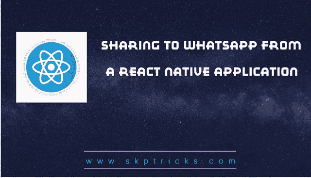

# 从 React 原生应用程序共享到 WhatsApp

> 原文：<https://dev.to/skptricks/sharing-to-whatsapp-from-a-react-native-application-1hpp>

* * *

## 来源:[从 React 原生应用分享到 WhatsApp】](https://www.skptricks.com/2019/02/sharing-to-whatsapp-from-react-native.html)

本教程解释了如何在 react 本地应用程序中向 whatsapp 应用程序共享特定消息。在 whataspp 应用程序中共享内容非常容易和简单。你只需要从 react-native 包中导入链接类。

从 react 原生应用程序共享到 WhatsApp

按照以下步骤在 whatsapp 应用程序中共享文本内容:

1.  从 react-native 包中导入链接类。
    从“react-native”导入{ Linking }；

2.  调用下面的函数，以便在 whatsapp 应用程序中共享内容。
    shareToWhatsApp =(text)=>{
    linking . openurl(`whatsapp://send?text=${text}`)；
    }

