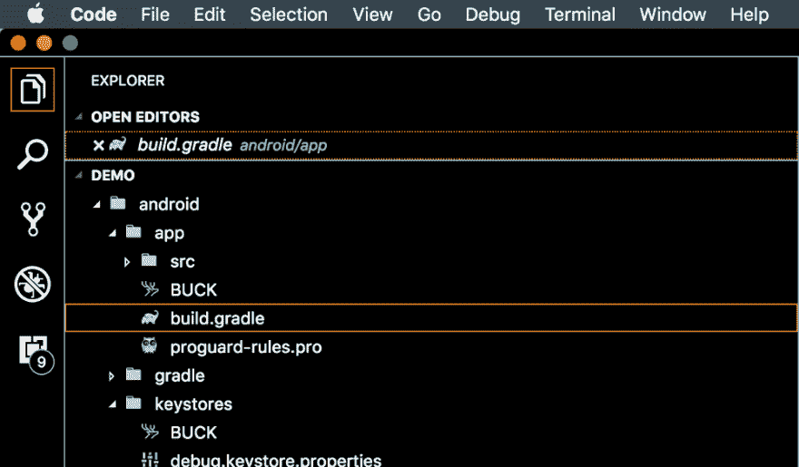

# 大幅缩小 React 本机应用程序的规模！

> 原文：<https://dev.to/rishikc/shrink-your-react-native-application-size-dramatically-3ekj>

所以你做了一个看起来很酷很棒的 [React Native](https://facebook.github.io/react-native/) 应用程序，现在你准备好构建它，并可能发布到商店——

但是考虑到它的构建规模，担心用户是否愿意安装它？或者，也许你只是想保持它的重量轻，不要占用太多不必要的内存，当它可以装进一个更小的尺寸？

或者你只是我们中的一员，对建筑尺寸有偏见？别担心，我们掩护你！😄 ✔️

* * *

在本文中，我们将讨论以下两件事:

*   压缩 react 本机应用程序的大小——通过压缩在构建应用程序时生成的 java 字节码，并要求它尝试压缩与应用程序捆绑在一起的所有资源。

*   将我们的应用捆绑包拆分成多个`apk`以删除运行它的设备不需要的不必要的代码——因为许多代码与设备特定的通用 apk 捆绑在一起——这意味着我们不需要在将要安装它的设备中有许多代码。

* * *

我们开始吧！✊

首先，如果您在项目中使用 [create-react-native-app](https://github.com/react-community/create-react-native-app) ，您将需要退出您的原生应用程序(如果您在阅读本文之前已经构建了您的应用程序，您可能已经这样做了)。这一点很重要，因为在弹出之前你不能访问配置，因为构建文件夹是我们必须进行更改的地方。如果你还没有，你可以简单地这样做:

```
npm run eject 
```

Enter fullscreen mode Exit fullscreen mode

**注意:**弹出一个 react 原生应用是一个永久动作！(除非你正在使用版本控制系统来跟踪你的应用程序的以前版本，如果你需要，你可以从那里恢复你的应用程序的“未被拒绝”的版本)。[了解更多关于弹出的信息。](https://github.com/react-community/create-react-native-app/blob/master/EJECTING.md)

好了，现在我们都准备好了！让我们开始并尽快完成。别担心，只需几分钟，你的应用程序大小就会大幅缩小！

现在，从您的项目根目录导航到`android / app`文件夹，在那里您可以找到您的`build.gradle`文件。

[](https://res.cloudinary.com/practicaldev/image/fetch/s--xXwEe2A7--/c_limit%2Cf_auto%2Cfl_progressive%2Cq_auto%2Cw_880/https://thepracticaldev.s3.amazonaws.com/i/9yej9fe34wys9wndfywm.png)

在这里，您会发现您的默认构建配置已经设置好了，找到如下所示的代码行:

```
def enableProguardInReleaseBuilds = false
def enableSeparateBuildPerCPUArchitecture = false 
```

Enter fullscreen mode Exit fullscreen mode

并将它们的值更改为`true`，如下所示:

```
def enableProguardInReleaseBuilds = true
def enableSeparateBuildPerCPUArchitecture = true 
```

Enter fullscreen mode Exit fullscreen mode

所以你可能想知道它是做什么的。嗯，如果你向下滚动一点，你会看到`enableProguardInReleaseBuilds`和`enableSeparateBuildPerCPUArchitecture`写在更多的地方，就像这里:

[](https://res.cloudinary.com/practicaldev/image/fetch/s--KaIPQRyX--/c_limit%2Cf_auto%2Cfl_progressive%2Cq_auto%2Cw_880/https://thepracticaldev.s3.amazonaws.com/i/ansujrc3fonpiby7wgrg.png)

如你所见，这些变量被用来启用或禁用两个构建配置—

*   一个用于生成单独的。不同设备架构的 apk，

```
...
splits {
    abi {
      reset()
      enable enableSeparateBuildPerCPUArchitecture
... 
```

Enter fullscreen mode Exit fullscreen mode

不要担心必须处理不同的。每个架构的 apk——Google 负责将它分发给用户！根据架构来分离构建会从您的文件中删除不必要的代码，这些代码在运行它的设备上是不需要的。

*   另一个用于压缩编译时生成的 Java 字节码，

```
...
buildTypes {
    release {
        minifyEnabled enableProguardInReleaseBuilds
... 
```

Enter fullscreen mode Exit fullscreen mode

唷，这太简单了！但是等等，我们还没完呢！我们需要做一件小事。

现在让我们在`minifyEnabled`配置的正下方添加这一行:

```
...
buildTypes {
    release {
        minifyEnabled enableProguardInReleaseBuilds
        shrinkResources true; /* <-- Add this line */
... 
```

Enter fullscreen mode Exit fullscreen mode

我们完事了。现在再次构建您的应用程序并检查`output`目录。你会发现你的应用有两个不同的`.apks`，默认情况下在配置中指定，即`armebi`和`x86`架构。

哦，顺便说一句，如果你需要一个支持所有设备架构的通用`.apk`——只需将`universalApk`设置为 true，它将在你下次运行 build 时生成一个通用`.apk`！

仅此而已！现在，您已经设置了您的构建配置，以缩减您的代码和资源，并为不同的架构创建单独的`.apk`——从而从最终的构建中删除不必要的代码。

感谢阅读！您还可以查看更多关于如何减少应用程序构建规模的参考资料。😄

你喜欢这篇文章吗？还是我错过了什么？你有什么可以添加到这篇文章中的东西——可以使它变得更好吗？

你可以通过 [Twitter](http://twitter.com/rishiikc) 和我联系。

黑客快乐！干杯！

* * *