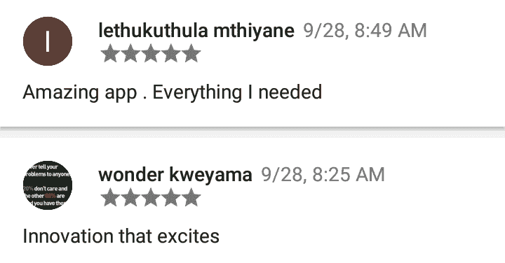
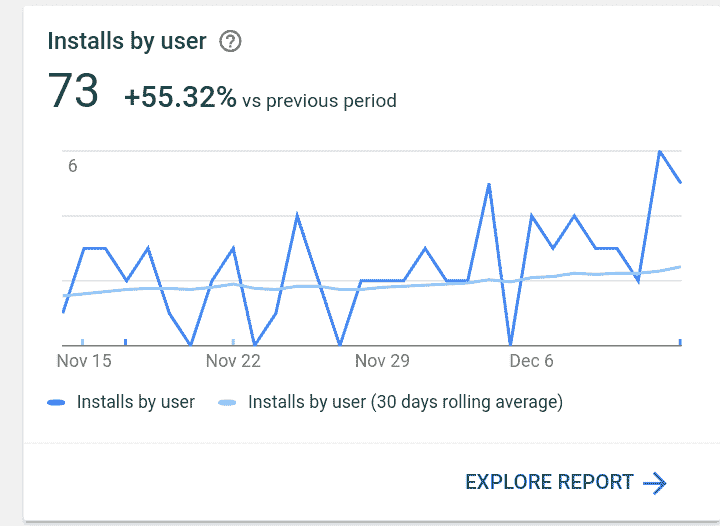
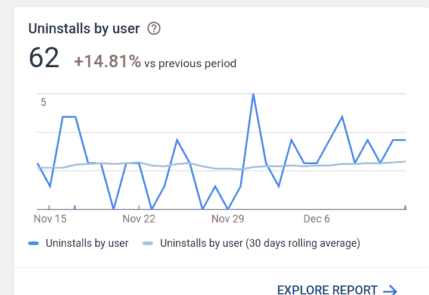
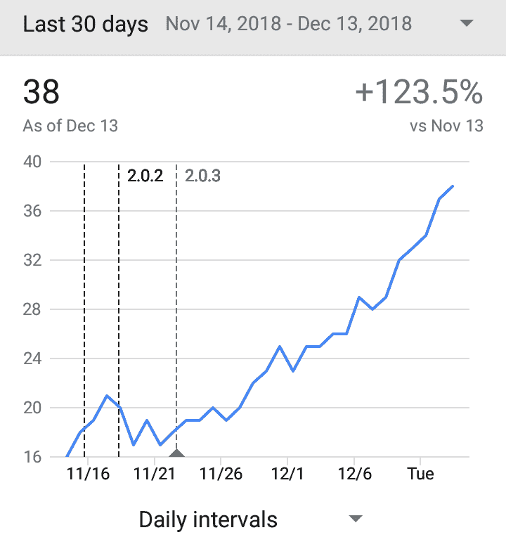

# 辅助项目成功🎉

> 原文：<https://dev.to/sduduzog/side-project-success--2i3k>

啊，副业，副业...我们编码，编码，但该死的事情从来没有完成😌。当你即将完成时，一个伟大的功能想法出现了，更糟糕的是一个全新的项目想法！

我相信我们都经历过，范围爬行栖息地就在我们的 git 存储库中。当这种情况发生时，我们会慢慢地放弃这些项目，因为人们对它们的兴趣减少了。像其他人一样，我也有几个这样的问题，我有一个 2 年的项目，我甚至还没有接近完成。首先用 AngularJS 建造😣，然后棱角分明🙆，现在 Vuejs😌直到今天我还在努力。

## 好了，这是我写这篇文章的原因。

几个月前，我开发了一个安卓应用。为什么？因为我没有任何东西来展示我的 android 技能，而且我的 Google play 商店控制台很孤独，所以我已经两年没有花钱买它了。

我也需要足够轻的东西来完成。我不能让另一个未完成的项目困扰着我。于是我做了一个[发射器](https://play.google.com/store/apps/details?id=com.sduduzog.slimlauncher)。我实际使用的东西，它的灵感来自 [LessPhone](https://play.google.com/store/apps/details?id=me.aswinmohan.nophone)

开发几天后，我发布了测试版，一周后，全面投入生产😤
[T3】](https://res.cloudinary.com/practicaldev/image/fetch/s--B7Zd1i_E--/c_limit%2Cf_auto%2Cfl_progressive%2Cq_auto%2Cw_880/https://i.imgflip.com/1ocrfs.jpg)

我站在课桌上大声喊出我在校园里的应用，强调 5 星评价。我需要它在搜索列表和建议中脱颖而出。我甚至给了自己一个很好的平均分。这不管用。我下载了大约 20-25 次，安装了大约 10 次。没有我预期的那么令人印象深刻。

 
*来自朋友的评论*

我收到了朋友们的 7 条评论，其中一条是满分 4 分🙆我想这个人对我有些怨恨。这一点都不好，我必须改进 UX，至少让人们不卸载我的应用程序。

我把我的注意力大大转移到使它变得更好上，我甚至自己也在使用它，如果我能忍受它，那么下载它的其他用户也能忍受。

然而它的完成并不完全。[仓库](https://github.com/sduduzog/slim-launcher)看起来很孤独。我不擅长表达自己，这从我枯燥的自述中可以看出来。现在它也在第二版✌️

本周发生了一些令人惊奇的事情。下载量和一些评论的短暂飙升，都是 5 颗星。最棒的是，它们完全是有机的。

平均安装率正在上升

我只需要对抗卸载的趋势。

我想再努力一点，我会更好。越来越多的人发现它很有用。

当然这不算多。虽然还有工作要做，即登陆页面，测试，自述徽章 CI 集成，但这是一个完整的项目！一个我可以在我的投资组合中展示的工作实体。所以少量的下载是最好的选择。

我不记得促使我开始这个项目的帖子，但我在 dev.to 上找到了它，实际上是在加入几天后。

我还要感谢 [@subbramanil](https://dev.to/subbramanil) 的 PRs。我在几周内学到了很多东西。我还没有进一步阐述我所做的贡献。

## [Subbu Lakshmanan](/subbramanil) <button name="button" type="button" data-info="{&quot;className&quot;:&quot;User&quot;,&quot;style&quot;:&quot;full&quot;,&quot;id&quot;:18587,&quot;name&quot;:&quot;Subbu Lakshmanan&quot;}" class="crayons-btn follow-action-button whitespace-nowrap  " aria-label="Follow user: Subbu Lakshmanan" aria-pressed="false">跟随</button>

[Enthusiastic programmer, working as Android developer building custom Android Images (AOSP) and apps.](/subbramanil)

德夫·托是一块宝石💎🔥我很自豪能成为其中的一员。