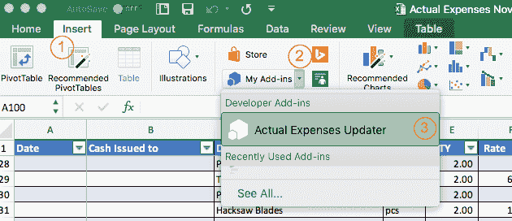
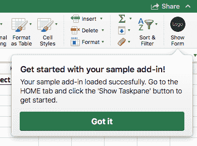
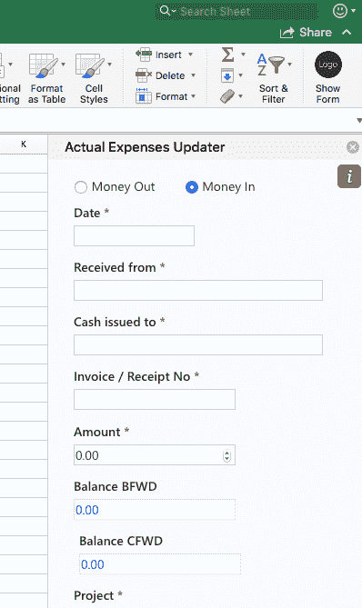

# MacOS Sierra 上的侧向加载 Excel 加载项

> 原文：<https://dev.to/kagundajm/sideload-excel-add-in-on-macos-sierra-4ckn>

### 简介

在[之前的一篇文章](https://dev.to/kagundajm/office-add-in-using-vscode-and-mkcert-private-trusted-ca-fo4)中，我们看到了生成 Excel 插件并使用 [mkcert](https://github.com/FiloSottile/mkcert) 创建浏览器信任的私有证书颁发机构(CA)的过程。在本帖中，我们将继续开发 office 插件的旅程，查看在 Excel 主机中侧向加载插件的步骤。

### 先决条件

用于 iPad 和 Mac 的附加模块[操作指南](https://docs.microsoft.com/en-gb/office/dev/add-ins/testing/sideload-an-office-add-in-on-ipad-and-mac#prerequisites-for-office-for-mac)规定了以下先决条件:

*   运行 OS X v 10.10“Yosemite”或更高版本并安装了 Office for Mac 的 Mac。

*   Excel for Mac 版本 15.19 (160206)。

*   清单。要测试的外接程序的 xml 文件。

在本帖中，我们将利用以下内容:

*   运行 macOS High Sierra v10.13.3 的 Mac

*   Excel for Mac 版本 16.16.5 (181209)

*   我们在[上一篇文章](https://dev.to/kagundajm/office-add-in-using-vscode-and-mkcert-private-trusted-ca-fo4)中创建的 Excel 插件的 Manifest.xml

### 侧向加载 Excel 插件的步骤

*   打开终端窗口，通过运行以下命令，验证您的计算机上是否存在`wef`文件夹。`cd /Users/${USER}/Library/Containers/com.microsoft.Excel/Data/Documents/wef`

*   如果显示**没有这样的文件或目录**消息，则从终端运行以下命令创建文件夹，并导航到新创建的文件夹`mkdir /Users/${USER}/Library/Containers/com.microsoft.Excel/Data/Documents/wef`和`cd /Users/${USER}/Library/Containers/com.microsoft.Excel/Data/Documents/wef`

*   将 Excel 插件的`manifest.xml`文件复制到`wef`文件夹。如果您遵循了[上一篇关于生成 office 插件](https://dev.to/kagundajm/office-add-in-using-vscode-and-mkcert-private-trusted-ca-fo4)的帖子，那么您的复制命令将类似于下面的:`cp ~/office-js/expense-updater/manifest.xml .`

如果您正在测试多个 Excel 加载项，请在复制时重命名加载项`manifest.xml`文件，以避免覆盖另一个加载项的清单文件。`cp ~/office-js/expense-updater/manifest.xml ./expense-updater.xml`

*   将目录切换到 Excel 插件的根目录，并启动插件服务器`cd ~/office-js/expense-updater && npm start`

*   如果 Excel 应用程序已经在运行，请将其关闭。确保你完全退出应用程序。

*   打开您的 Excel 工作簿

*   从菜单中选择**插入**

*   点击**我的插件**旁边的下拉箭头，选择您的 Excel 插件。

*   现在将加载您的 Excel 加载项，并显示一个标注

*   点击**get it**按钮处理标注。

*   单击您的 Excel 加载项按钮，加载加载项。

### 资源

*   [在 iPad 和 Mac 上加载 Office 插件进行测试](https://docs.microsoft.com/en-us/office/dev/add-ins/testing/sideload-an-office-add-in-on-ipad-and-mac)