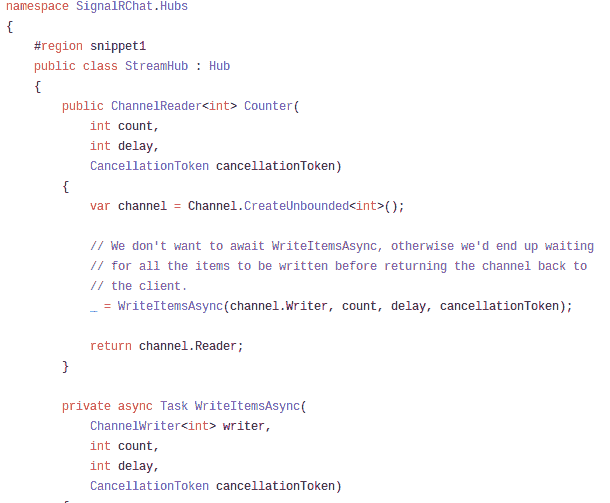
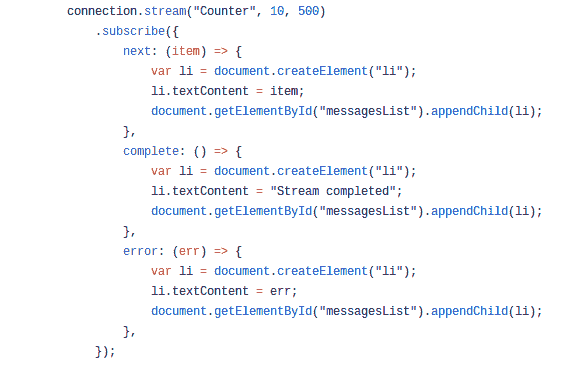

# SignalR 核心 python 客户端(III): Streamming

> 原文：<https://dev.to/mandrewcito/signalr-core-python-client-iii-streamming-3lkj>

周日的宿醉，所以我在我的 singalrcore 库中添加了一个新功能，像往常一样，它与[微软示例](https://docs.microsoft.com/es-es/aspnet/core/signalr/streaming?view=aspnetcore-2.2)一起工作，我将尽可能使语法最接近 javascript。

## 设置

关于[微软的例子](https://github.com/aspnet/Docs/blob/master/aspnetcore/signalr/streaming/sample/Hubs/StreamHub.cs)服务器上的流函数有一个取消令牌，这个例子是在函数上没有这个参数的情况下完成的，所以如果你想使用下面的代码，只需删除计数器函数上的这个参数。
T3T5】

## 微小的例子

### 启动并打开连接

```
hub_connection = HubConnection(server_url)
hub_connection.build()
hub_connection.start() 
```

Enter fullscreen mode Exit fullscreen mode

### 开流

```
hub_connection.stream(
    "Counter",
    [10, 500],
    lambda x: print("next callback: ", x),
    lambda x: print("complete  callback", x),
    lambda x: print("error  callback", x)) 
```

Enter fullscreen mode Exit fullscreen mode

流函数有五个参数，后三个是与[JavaScript 脚本对象](https://github.com/aspnet/Docs/blob/master/aspnetcore/signalr/streaming/sample/wwwroot/ts/stream.ts)
[](https://res.cloudinary.com/practicaldev/image/fetch/s--ZFGe86tX--/c_limit%2Cf_auto%2Cfl_progressive%2Cq_auto%2Cw_880/https://thepracticaldev.s3.amazonaws.com/i/2vdrjcuozfuehsjbzhvs.png) 匹配的回调函数

[完整示例](https://github.com/mandrewcito/signalrcore/blob/master/test/stream.py)

## 待办事宜

*   信息包
*   Auth(现在仅通过 querystring negotiate 工作)

## 链接

[Github](https://github.com/mandrewcito/signalrcore)
[Pypi](https://pypi.org/project/signalrcore/)

我试图用最简单的方法建立这个库，所以如果你认为有更好的方法，请留下评论。我会尽快编辑 github 库贡献部分，所以任何贡献都是受欢迎的。

感谢您的阅读，并在:D 下面写下您的任何想法