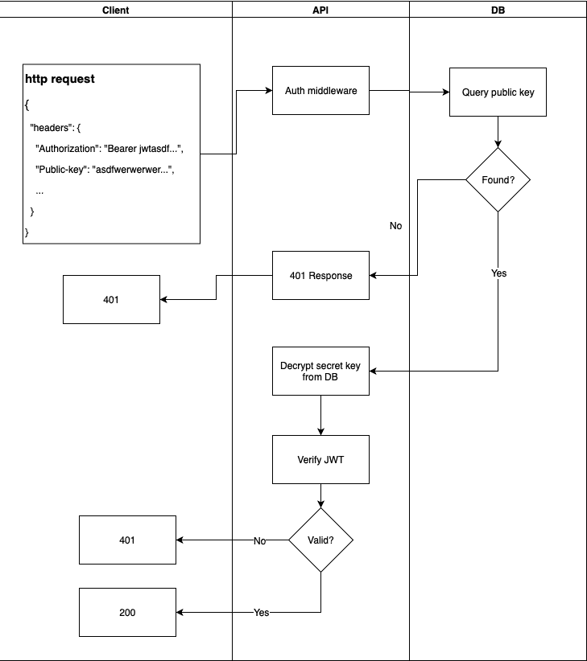

# Golang 的简单 JWT 认证(第 1 部分)

> 原文：<https://dev.to/omnisyle/simple-jwt-authentication-for-golang-part-1-3kfo>

说到 API，我们需要对用户访问他们的信息进行认证。由于 JWT 的无状态特性，它被广泛用于 API 认证。在本系列教程中，我将与您分享我在实现 JWT 身份验证时学到的东西。

本教程有三个部分

*   第 1 部分—公钥/私钥的生成和存储
*   第 2 部分— [构建 CLI 以创建/检索应用程序对象](https://dev.to/omnisyle/simple-jwt-authentication-with-golang-part-2-263)
*   第 3 部分— [构建 JWT 认证中间件](https://dev.to/omnisyle/simple-jwt-authentication-with-golang-part-3-1ja3)

<figure>[](https://res.cloudinary.com/practicaldev/image/fetch/s--hTI5voV5--/c_limit%2Cf_auto%2Cfl_progressive%2Cq_auto%2Cw_880/https://cdn-images-1.medium.com/max/1024/1%2ADNxfiTZFOcrj694IM3W7Yg.png)

<figcaption>[https://jwt . io](https://jwt.io)</figcaption>

</figure>

对于本教程，我们将使用以下工具:

*   Golang 1.11 Darwin
*   Postgres
*   jwt.io 推荐的 JWT 图书馆:[github.com/dgrijalva/jwt-go](http://github.com/dgrijalva/jwt-go)
*   Golang 内置加密包
*   显影剂(非常重要:使用前请加入一些咖啡燃料)

假设:

*   你懂 AES 加密(刚够用，不用看研究论文)

**免责声明:这里所有的代码都不是 100%我的。这是来自多个来源的汇编，例如开源项目、go 文档等。**

我将在本教程的最后包括我使用的资源。现在，让我们开始吧。

### ⚙️的过程

为了使用我们的 API 进行身份验证，每个请求必须在其头部包含一个公钥和一个 JWT 令牌。JWT 令牌是“授权”报头中的无记名令牌。验证请求的过程如下:

1.  当我们的 API 收到请求时，我们检查它的公钥头。
2.  我们使用公钥来检查试图访问我们的 API 的应用程序是否在我们的数据库中注册。
3.  如果我们使用它的公钥找到应用程序，我们将使用它的私钥(也存储在我们的数据库中)来验证它的 JWT 签名。
4.  否则，我们向客户端返回状态 401。

整个过程可以这样形象化

<figure>[](https://res.cloudinary.com/practicaldev/image/fetch/s--0Bwzc5_R--/c_limit%2Cf_auto%2Cfl_progressive%2Cq_auto%2Cw_880/https://cdn-images-1.medium.com/max/729/1%2ANYoZL5SU8X93H4pCMWcRHg.png)

<figcaption>【JWT】我们的 API 认证流程</figcaption>

</figure>

### 🗝这对关键夫妇

对于任何想要使用我们的 API 的应用程序，我们需要给他们一个秘密和公共密钥进行认证。为此，我们将生成两个随机的 16 字节密钥，并将其存储在我们的数据库中。为了保护密钥，在将密钥写入数据库之前，我们将使用 AES 加密来加密密钥。

为什么要加密？密钥是一个应用程序的密码，它需要得到保护。然而，与密码不同，我们将需要原始值来验证 JWT 签名。因此，加密是在我们的数据库中存储密钥的更好的解决方案。

我们需要使用 AES 加密的两个部分。首先，我们需要一个主密钥。我们将使用相同的秘密来加密所有的秘密密钥。其次，对于每个秘密密钥，我们将包含一个 salt(在本例中为 iv ),以改变最终的加密密钥。最终的数据结构看起来会像这样:

```
// App is a generated public/secret key pair
type App struct {
  Id int  
  Name string
  EncryptedSecretKey string
  PublicKey string
  CreatedAt time.Time
  UpdatedAt time.Time
} 
```

Enter fullscreen mode Exit fullscreen mode

现在，我们只需要编写一个 SQL 命令来创建一个包含这些列的应用程序表